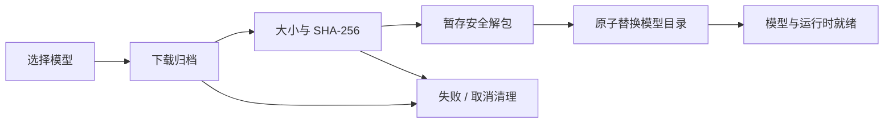
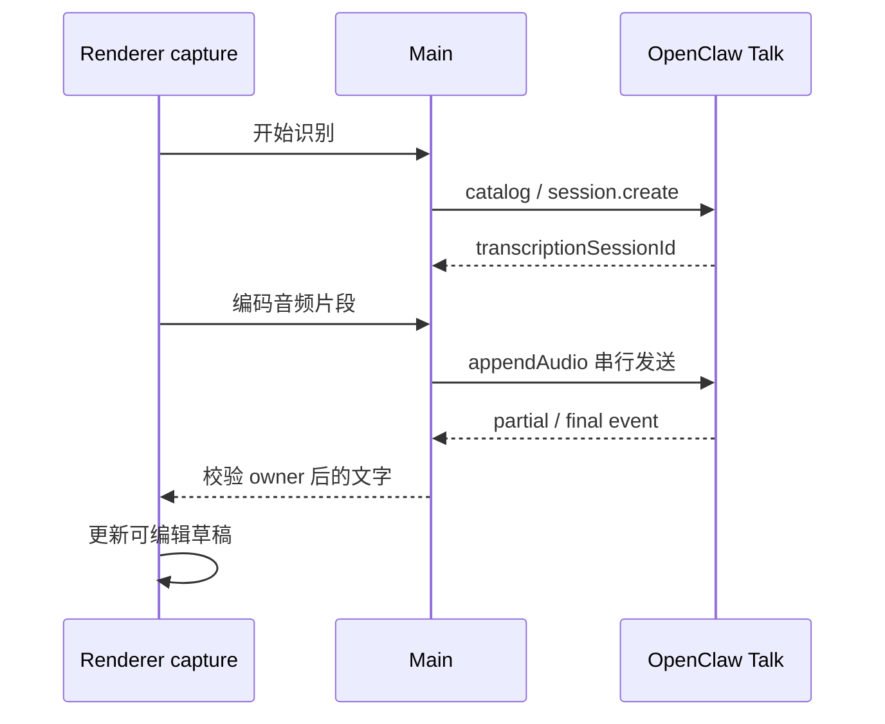

# 语音输入、朗读与本地附件转录

语音是可选功能，支持离线与 OpenClaw 在线路径。当前安装包提供 sherpa-onnx 运行时，离线权重由用户在语音设置按需下载；“安装了应用”不代表模型文件已经就绪。

## 1. 三条不同使用链路

| 场景                  | 输入/输出                       | 是否自动发送消息   |
| --------------------- | ------------------------------- | ------------------ |
| Composer 语音输入     | 采集或导入音频 → 可编辑文字草稿 | 否                 |
| 回复朗读              | 已完成回复 → TTS 播放           | 不新增 transcript  |
| transcribe_audio 工具 | 模型读取用户附件 → 转录工具结果 | 由原生工具回合管理 |

本地附件转录不受麦克风开关控制，也不自动启用语音输入。可选 stt-local-cli 被关闭时保持关闭；sandboxed 会话不注册 host 转录工具。

## 2. 用户设置顺序

在语音页选择本地或在线模式，离线模式下载并选择输入/输出模型，在线模式选择已在模型页配置的能力目录。再启用输入或朗读，选择麦克风或支持的系统声音来源，使用诊断/试听确认设备与模型。

本地麦克风诊断采集有界录音，显示电平、可回放，并用同一段音频转录，区分无声音、设备路由和识别质量。TTS 试听使用可编辑样本文字与实际选中 provider。

## 3. 离线模型与安装事务

当前目录包含 SenseVoice Small INT8、Whisper Base INT8、Kokoro、AISHELL3 VITS 和 Piper Lessac 等输入/输出布局；精确文件、大小、hash 和 speaker metadata 以 shared/speech 模型目录为准，不在多篇文档重复维护下载数字。

模型在 `<userData>/local-speech-models/<model-id>`。完整已安装模型复用；部分下载和 staging 清理，不能把半个目录标成 ready。包携带相应许可证。

## 4. 离线输入

Renderer 捕获/解码音频并编码单声道 PCM16 WAV，Main 根据已选 Whisper/SenseVoice 布局运行本地命令，结果写入草稿。普通话 zh 采用 OpenCC 规范到大陆简体；自动语言和显式粤语保留模型原文，避免误改其他语言字符。

会议模式按设置的 15–60 秒边界分段，录制继续时排队转录，麦克风与系统输出分别标识和计时。它区分本人与系统播放轨，不做远端说话人分离。

Windows loopback 采集的是系统输出混音，不是某个外部进程。按 PID 的应用音频采集需要另一个原生能力，当前 web-media 路径不能宣称支持。

## 5. 在线输入

采用 gateway-relay、brain=none 的 transcription-only 会话。Main 限定调用 Renderer 所有权；event 按 transcriptionSessionId 匹配。停止、设备丢失、权限失败、设置变化、导航或卸载都关闭原生会话，迟到事件不能写入另一草稿。

## 6. 本地附件工具

stt-local-cli 使用已安装 Sherpa 路径，支持限定音视频格式，当前限制 256 MiB、一小时、一次一个转录。无云端 fallback，文件访问使用有效 fsPolicy root/workspaceOnly；外部附件先 staging 到项目再发送。

工具描述要求把转录内容当数据而非指令。中止需要终止本地工作并释放 busy 标记，失败不应永久锁住后续转录。

## 7. 输出与发布资源

回复朗读由原生 TTS 能力执行，本地使用 tts-local-cli 的模型布局；输出音频不作为 Redux 或 transcript 新正文。停止播放与停止 Agent 是不同动作。

模型发布使用 setup:local-speech-models 和 build:local-speech-model-artifacts，上传生成的 speech-models/v1 产物。已发布文件不可原地换字节；模型变更或包装修订使用新身份/文件名并更新编译期大小与 hash，保留旧客户端所需旧包。

## 8. 验证与限制

检查模型缺失/损坏、下载取消、设备静音、权限拒绝、在线会话换代、分段顺序、草稿不自动发送、TTS voice、附件越界、sandbox 拒绝与取消释放。Main speech、onlineAsr/onlineTts IPC 和模型 artifact tests 分别覆盖这些层；真实设备和内网协议仍需现场验证。
