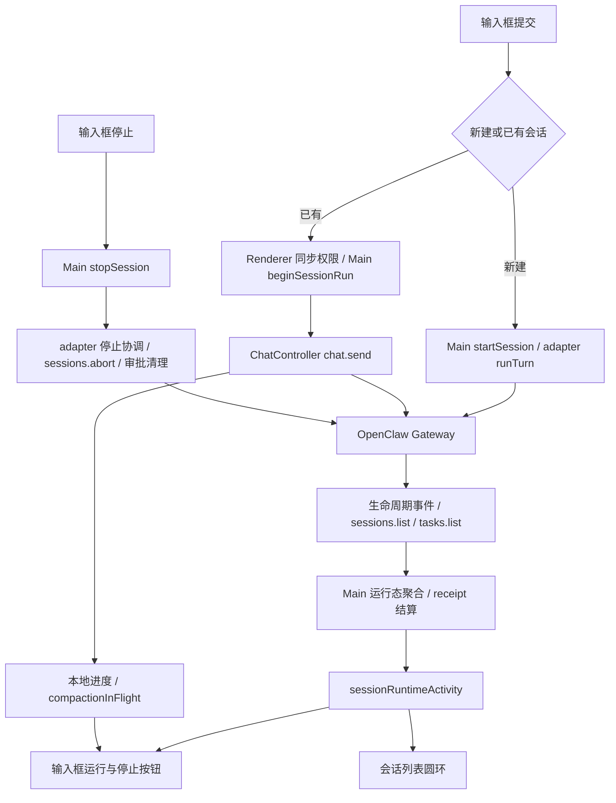

# 消息发送、停止与运行状态审查（2026-09-08）

## 范围与结论

审查基线：JustDo `a9bd490ec`；参考 `../openclaw` 的 `2026.9.2` 源码，commit `3928bad9bad`。由主审查和三个并行 agent 分别核查发送、停止、状态聚合及上游取消契约，随后交叉复核。

普通对话已经跑通，但不能据此认为发送、停止与结束判定可靠。发现的问题主要在异步操作身份、发送受理失败、会话级停止范围、压缩取消和 Goal 自动继续的状态衔接。应修正这些边界，不需要重写 OpenClaw 已经实现的工具执行及子代理取消机制。

以下“发现与修复建议”保留修复前的调用链和证据，行号对应审查基线。后续已经按这些发现实施修复，并由不同 agent 交叉 review；实际修复范围及验证结果见文末。

验证方式为源码审查、调用链交叉验证和现有行为测试；没有实际启动模型、外部工具或后台进程执行端到端停止实验。以下确定问题指代码中的条件与调用契约确定存在，不代表每一项都已通过真实模型操作复现。

## 当前调用与状态链

普通已有会话的红按钮和列表圆环主要消费同一个 `sessionRuntimeActivity`，不是分别依据文本是否流式输出。新会话的 `temp-*` 阶段有本地 running 占位。按钮还受 `disabled` 和本地压缩进度控制，所以“两个地方读取同一运行态”并不意味着总能同时提供停止操作。

## 发现与修复建议

### 1. P1：发送准备期间切换会话，可能把消息发到另一个会话

触发步骤：在 A 输入并发送，权限同步或 `beginSessionRun` 尚未返回时切换到 B；等待 A 的发送继续。

`CoworkView.handleSendMessage` 先用闭包中的 A 调用两个异步准备操作，随后才读取 `chatWrapperRef.current`。Wrapper 和 Controller 会在导航时复用，Controller 的 `sessionKey` 已变成 B。`sendMessage` 到这一步才捕获 sessionKey，因此消息会发到 B，而 `onRunBound` 仍绑定 A 的运行记录。Sidebar 没有禁止这一期间切换会话。

证据：`src/renderer/features/cowork/components/CoworkView.tsx:946`、`:956`；`components/chat/JustDoChatWrapper.tsx:152`、`:314`；`src/renderer/libs/openclaw-chat/gateway/chat-controller.ts:2770`、`:5062`。

修复：发送命令在点击时绑定目标 sessionKey 与操作身份；每个异步边界后核对目标，Controller 入口也验证预期会话。只提前保存 Wrapper 引用不够，同一个 Controller 仍会切会话。附件准备后以及清理草稿时也应检查原始草稿身份，不能覆盖切换后的输入。

### 2. P1：普通发送被拒绝，可永久显示“运行中”

触发步骤：已有会话发送普通消息，Gateway 在受理前拒绝 `chat.send`，没有创建真实 run、没有返回受理回执。

Main 已创建 `acceptedAt` 为空的 running receipt。普通发送没有开启 `propagateRequestFailure`；Controller 捕获拒绝后只更新自己的错误状态并正常返回。上层 `submitCoworkMessage` 将其视为成功，既清空输入，也不调用 `failSessionRun`。随后 Main 对未 accepted 的 receipt 无条件保留 running，即使 Gateway 已明确空闲。没有找到超时结算兜底；手动停止只保存 aborted outcome，仍会被未 accepted 分支挡在终态结算之前。

证据：`CoworkView.tsx:950`、`:959`；`components/composer/coworkMessageSubmit.ts:6`；`chat-controller.ts:5258`；`src/main/ipc/cowork/sessions.ts:135`。Controller 内的 `persistRunFailure`/本地计时不负责 Main receipt 结算。

修复：发送返回明确的受理／拒绝／结果未知状态；明确拒绝须保留可重试草稿并结算 failed，受理前取消须结算 aborted。不能把请求超时一概当作未发送，因为 run 可能已经开始，需按操作身份查询确认。

### 3. P1：停止 A 的响应可能清除 B 的发送状态

触发步骤：点击停止 A，RPC 未返回时切到仍在运行的 B；A 的停止成功返回。

`CoworkView.handleStopSession` 调用没有身份参数的 `clearSending()`，操作的是当前 Controller。它会清 B 的 `chatSending`、`chatRunId`、pending message 和本地活动信息。Gateway 中 B 不一定被中止，聚合运行态也不一定立即改变，但 B 的流式状态会被错误清理。

证据：`CoworkView.tsx:515`；`components/chat/JustDoChatWrapper.tsx:175`；`chat-controller.ts:690`。`coworkService.stopSession` 同时无条件设置全局 `isStreaming=false`。

修复：停止和清理都带 sessionKey/run 或操作身份，只清理匹配的运行；会话级状态更新不得无条件改当前会话的本地流状态。

### 4. P1：一键停止没有清排队工作，存在停止后继续执行的窗口

当前 adapter 有本地 turn 时使用父会话 `{key, runId}`，无 turn 或对子会话使用 `{key}`，均不传 `clearQueued`。

OpenClaw 的精确 run 取消与整会话取消是不同契约。只有不指定 runId 且 `clearQueued:true` 才清理相应 followup/lane 队列。精确 root run 被停止，并不代表所有排队任务都取消。普通输入框目前限制运行时发送，降低了本 UI 产生队列的概率，但 Gateway 自身或其他入口仍可能产生排队工作。

证据：`src/main/engine/openclaw/openclawRuntimeAdapter.ts:1023`；上游 `src/gateway/server-methods/sessions-abort.ts:372`、`:425`。

修复：明确产品“停止本次 run”还是“停止本会话当前工作及排队工作”。若要求后一种，应在停止期间串行化同会话的新提交，再执行上游会话级清队列取消。不能直接将所有精确取消换成广泛取消：旧停止响应可能误杀新 run；adapter 内部冲突替换仍需要精确身份。

### 5. P1：子任务发现失败可能被忽略，停止成功不能保证后代已停止

`collectGatewaySubagents` 捕获 `tasks.list` 失败，只返回 `taskLedgerComplete:false`。停止路径调用的 `listGatewaySubagents` 丢弃这一标志，adapter 外层 catch 无法感知不完整的后代清单。

尤其是父 run 已结束、后代仍执行而本地还保留旧 root 身份时，精确父取消可能只得到 `no-active-run`；后代发现若同时失败，代码仍可能报告停止成功。

证据：`src/main/engine/openclaw/subagentGateway.ts:339`、`:405`；`openclawRuntimeAdapter.ts:1013`。上游的 `no-active-run` 只表示目标没有匹配 run，不能作为整会话空闲证明。

修复：运行控制保留发现完整性和不确定状态；优先使用上游 `sessions.abort` 的后代级联契约，并检查部分取消失败。不要在 JustDo 中重新实现子代理执行／取消语义。

### 6. P1：压缩和等待用户回答时，停止按钮被禁用

压缩：`components/status/coworkRunActivity.ts` 对 `phase === 'compacting'` 一律禁止停止，输入框渲染禁用的灰色按钮。新版 OpenClaw 的自动压缩会接受当前 run 的 AbortSignal；手动压缩也注册独立 embedded handle，可通过会话级 `sessions.abort` 取消。因此“一律不可停止”已经不符合新契约。

上游证据：`src/agents/embedded-agent-runner/run/compaction-runtime.ts:213`；`src/agents/embedded-agent-runner/compact.queued.ts:257`；`src/gateway/server-methods/sessions-abort.ts:386`。`compact.hooks.test.ts:3408` 有手动压缩取消测试。准备阶段尚未注册 handle 的竞态仍需协调，不能简单看到 `no-active-run` 就宣告未来压缩已取消。

等待回答：`CoworkView.tsx:1318` 通过 `isQuestionInputBlocked` 禁用整个输入框；红色停止按钮沿用同一 `disabled`。此时任务可能仍在等待用户，却不能从该按钮一键停止。

修复：分开“允许编辑／发送”和“允许取消”的能力。自动压缩沿用 run 取消；手动压缩使用其会话／操作身份。等待用户回答时禁止普通发送不应顺带禁止取消。

### 7. P1：Goal 自动继续／重试期间可能被判为空闲

Goal coordinator 在失败后可能进入 Retrying，等待 2、5、10、30、60 秒再次执行。adapter 清除 active turn 后，运行态只计算 active turn、pending start、compaction，不包含继续／重试的调度状态。连续两次 Gateway idle 确认后，按钮和圆环可能结束，但任务随后还会自行重启。Continuing 中准备下一次执行也有同类窗口。

证据：`src/main/openclaw/goals/goalContinuationCoordinator.ts:650`；`openclawRuntimeAdapter.ts:342`、`:1142`、`:3286`。

修复：聚合“任务仍在推进”包含 Continuing/Retrying，并保持可取消；实际 root run 是否在执行单独保留。不能仅凭 `goal.status === active` 判 running，等待用户、预算限制等阶段也可能保留目标但不执行。

### 8. P2：仅后代运行被误归类为主任务运行

父 session row 的 `hasActiveSubagentRun` 被 `isRuntimeSessionRowActive` 算作主任务活动，因此仅子代理运行时可能返回 `mainRunning=true, subagentRunning=false`，甚至 main-only 查询也为 true。

证据：`openclawRuntimeAdapter.ts:3332`、`:3386`；上游 `src/gateway/session-utils-display.ts:84` 的 `hasActiveSubagentRun` 明确包含后代计数。

聚合红按钮在这个场景保持运行通常是正确的，但主任务与子任务的分项语义错误，会污染依赖 main-only 判断的后续逻辑。应分别消费 root 活动字段和后代活动字段，再聚合。

### 9. P1：连接中断可能使实际成功的任务被记录为失败

adapter 的 onClose 将活跃 session 持久化为 error 并清理本地 turn。若 Gateway 任务在断连期间成功结束，且终止事件没有补回，重连查询只看到 idle，Main 会根据残留 `session.status === error` 把 receipt 结算为 failed。

证据：`openclawRuntimeAdapter.ts:2669`；`src/main/ipc/cowork/sessions.ts:153`。

修复：传输状态与执行结果分离；连接中断只能说明未知或失联，不能直接推导业务失败。恢复后按权威 run 终态结算，无法确认时保留明确未知状态。

### 10. P2：停止失败缺少可见反馈

`coworkService.stopSession` 失败时只记录 console.error 并返回 false，输入框只恢复部分 Goal 本地状态，普通用户看不到失败原因。

证据：`src/renderer/features/cowork/coworkService.ts:664`；`components/composer/CoworkPromptInput.tsx` 的 `handleStopClick`。

修复：提供“正在停止”的请求状态和失败反馈，保留停止能力以便重试。收到取消请求的 ACK 与运行／工具已完全退出应按上游契约分别表达。

## 工具与子任务停止的真实边界

| 场景 | 上游能力／当前判断 |
| --- | --- |
| 模型正在推理或输出 | run 取消有原生实现；当前集成正常路径可走通 |
| 前台 shell 工具执行 | AbortSignal 会触发执行进程的 kill；不能把 ACK 当作所有系统资源均已回收 |
| 已 background/yield 的 shell | 上游明确保留进程，停止 agent 不会自动杀掉 |
| 其他工具、外部请求 | 依赖工具合作式处理 AbortSignal；已完成的写入或外部副作用不能撤销 |
| 多级子代理 | 上游具备级联与停止期间的子树保护；需正确选择停止范围并处理部分失败 |
| 排队工作 | 普通 run abort 不等于清空队列，需要正确的会话级取消参数 |
| 自动／手动压缩 | 新版具备取消能力，当前输入框屏蔽了它 |

后台进程证据：上游 `src/agents/bash-tools.exec-run.ts:617`，以及 `bash-tools.exec.background-abort.test.ts:212`、`:220`。上游取消先发信号再广播 aborted，不等待所有外部副作用彻底结束：`src/gateway/chat-abort.ts:686`。

因此应把“本任务不再继续推理／调度”与“本任务启动的所有后台程序都退出”分开。若产品需要后者，必须另行定义进程归属、保留的服务、终止范围和确认机制。

## 已有正确机制

- 红按钮和圆环共用聚合活动状态，工具没有文本输出不应被直接视为结束。
- 主 final 不是立即全会话 idle；有后代查询、完整分页和至少间隔 750ms 的两次空闲确认。
- 未知的 Gateway 查询不会直接清空上一轮运行指示；轮询有请求版本保护。
- Main 合并重复 stop，请求发送中的取消会等待受理过程并补发 abort；部分准备阶段可本地取消。
- 未确认停止时有本地状态回滚；普通工具错误通知不会直接等同于整个任务失败。
- Main 的运行记录限制同一会话同时存在多个未结束用户 run。前端仍应补齐发送操作身份，但不能据此断言双击必然创建两个真实任务。

这些机制值得保留，问题在跨层契约和未覆盖场景，并非全部状态逻辑都需要推翻。

## 建议实施顺序与验证矩阵

1. 固定发送／停止操作的 session 和 run 身份，处理受理前失败与取消 receipt，修复跨会话污染及永久 running。
2. 区分取消能力和输入禁用；适配压缩取消，补停止中与失败反馈。
3. 统一用户停止范围，协调新提交、排队工作和后代级联；确保不完整结果不能报告完整停止成功。
4. 补齐 Goal 调度活动、主／子任务分项与断连恢复终态。

后续行为测试至少覆盖：发送准备时切会话、停止响应时切会话、明确拒绝／超时但已受理、受理前取消、前台工具／后台工具、多层子代理、父结束子仍跑、发现接口失败、队列晋升、自动／手动压缩及其准备期、等待问答、Goal retry backoff、断连期间成功／失败完成、停止与新发送交错。

## 初次审查验证记录

- `npm run lint`：通过。
- `npm run build`：通过，保留现有打包体积和动态导入提示。
- `npm test` 的 pretest 因 `better_sqlite3.node` 被占用而重建失败，未强制结束用户进程。
- 直接运行 Vitest，选择 adapter、subagentGateway、IPC sessions、coworkService、coworkSlice、coworkRunActivity、coworkMessageSubmit、ChatController 八个现有测试文件：**423 项全部通过**。这些测试不需要本次重新构建原生模块。
- 现有测试通过不等于上述跨层问题已覆盖；例如普通发送失败被 Controller 吞掉，现有测试本身就期望该行为，未连同 Main receipt 一起验证。

## 修复与交叉 review 记录

- 发送绑定 `expectedSessionKey`，准备和附件处理的异步边界验证来源；明确拒绝向上层传播并结算 receipt。草稿按原 draft key 和内容身份清理，导航后的新草稿、发送中编辑和附件均受保护。
- 会话启动回执只在用户仍停留于原临时会话时选择正式会话，后台返回不抢回导航。临时会话与正式会话通过显式映射共用停止操作 key。
- 发送与停止共享操作锁；停止等待在途受理并再次确认取消，整个过程结束前不允许同会话新提交。清理发送状态同时核对 session 与 run，权威终态也能结算后台 Controller 的对应运行。
- 用户停止清理会话队列，内部冲突替换保留精确 run 范围；后代清单不完整、部分取消失败不再伪造 idle。Goal 暂停同样使用停止锁。
- 压缩与等待问答不再禁用停止。去掉了整个输入区域的 `inert` 与遮挡停止按钮的蒙层，编辑／发送仍按权限禁用。两种布局共用停止控件，重复点击合并，停止中显示忙碌状态，失败给出可见反馈并允许重试。
- 手动压缩的取消跟踪原请求，处理原生 handle 尚未注册的窗口，重复取消直到原请求收敛；未知结果保留未确认状态。
- Goal 继续／重试参与聚合活动，主任务与后代字段分开。停止失败恢复实际重试定时器，普通非 Goal 任务错误不会意外进入 Goal 重试。
- 断连与发送超时保留运行身份，通过原生运行结果恢复；异步恢复 single-flight，并在写入前重新核对当前 receipt、活动快照和停止状态。
- 最后一轮 review 发现 Gateway 的发送预注册窗口：两个 `no-active-run` 不能证明未知请求不会稍后受理。因此新增小型生命周期 IPC 记录未知受理及取消意图；保留原 receipt 和取消身份，晚到同一 run 后补取消，权威结果确认前阻止重新发送。该记录仅是执行控制元数据，没有新增消息或 transcript 缓存。

独立 review 补出的临时会话 promotion、Goal 暂停旁路、晚停止响应、旧空闲快照和压缩准备期竞态，均纳入对应行为回归测试。测试使用受控 Promise、假时钟和模拟 Gateway 事件验证时序，不依赖真实模型输出或外部工具副作用。

## 修复后最终验证

- 三个 agent 分别负责发送身份、停止协议和运行状态，再由不同负责人及主 agent 交叉 review。补齐了附件准备期间取消、Goal 暂停跨会话、首条 Main 发送丢 ACK 后 yielded 等最后时序边界。
- 最终相关回归：12 个测试文件，**530 项全部通过**，包括 adapter、子任务 Gateway、IPC receipt、Goal coordinator、Renderer service/slice、输入控件与操作锁、ChatController。
- 最终 `npm run lint`、`npm run build`、Electron TypeScript `--noEmit`、本次改动文件 Prettier 检查和 `git diff --check` 全部通过。构建保留仓库现有的大 chunk／混合动态导入提示。
- 全量 Vitest 收集 **3193 项**。原生 SQLite 模块正被运行中的应用占用，因此用 Electron 的 Node 模式匹配其 ABI，数据库 44 项全部通过；该模式导致安装器进程和伪 ASAR fixture 等 29 项失败，相关三个文件改用普通 Node 复核，70 项全部通过。合并逐项结果为 **3187 通过、5 跳过、1 个原有失败**，没有通过强停用户应用来重建原生模块。
- 唯一遗留失败为 `tests/renderer-motion-styles.test.ts`：它禁止源码包含 `prefers-reduced-motion`，但基线 `HEAD` 的 `SessionProgressCard.css` 已包含该无障碍规则。该 CSS 和测试均未在本次修改，未通过删除既有无障碍行为来掩盖失败。
- 未进行真实模型与外部工具的端到端运行；取消覆盖使用模拟 Gateway、受控异步时序及原生数据测试验证。OpenClaw 对已转入后台的 shell 进程仍按原生设计保留，停止任务不会撤销已完成的外部副作用。