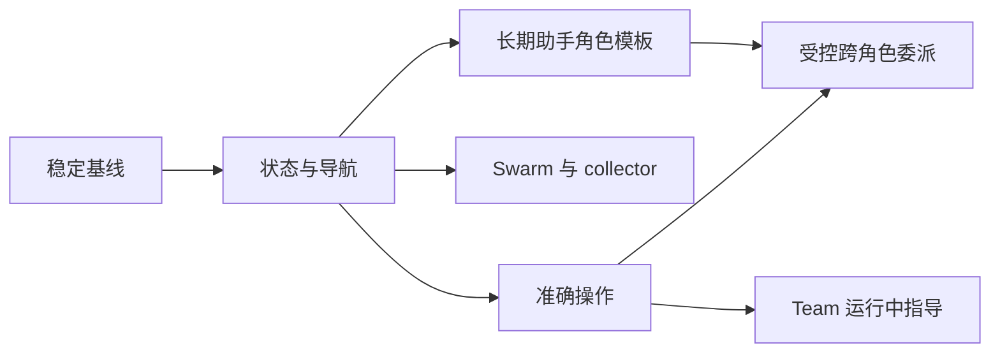

# SubAgent 与 Multi-Agent Team 适配计划

状态：首轮适配已实现并进入演示验收，实际步骤和已验证结果见 [多 Agent 演示与验收](multi-agent-demo.md)。

本轮已交付：执行/投递状态分离、按 taskId 控制、下级任务导航与分页、Swarm 设置、可编辑助手模板，以及真实 Team 暴露的跨插件实例授权修复。原生普通/嵌套/collector 子任务、精确取消和平级双向通信已进行真实模型验证。根状态轮询仍为既有完整扫描；Swarm 独立分组视图、M4 的跨角色委派与 peer steer 等高级能力仍未接入。各阶段所有压力和故障组合尚未逐一完成，不将本轮演示通过等同于整份计划验收完成。

基于 [2026-09-27 全链路审核](multi-agent-audit-2026-09-27.md) 与本地 OpenClaw v2026.9.6。审核阶段已完成的修复作为候选基线；879 项定向测试通过不等于真实 Gateway 验收完成。

## 目标与产品边界

用户应能看清任务由谁执行、为何等待、结果是否返回，并能对准确的任务采取操作；长期助手的创建、复用和任务内平级交流应有完整的状态与恢复流程。

| 能力             | 产品定位                             | 执行与持久化权威                              |
| ---------------- | ------------------------------------ | --------------------------------------------- |
| SubAgent         | 父任务委派的工作，可嵌套、汇报、取消 | OpenClaw task ledger 和原生执行器             |
| ACP 子任务       | 委派给外部 harness 的工作            | 原生 ACP runtime 与 task ledger               |
| Multi-Agent Team | 同一任务内长期助手之间的平级协作     | 产品 room/round/delivery 元数据；原生会话正文 |
| 长期助手档案     | 可复用的职责、模型和角色文件         | 产品档案映射及原生 agents.files               |

两种执行方式保留独立入口与状态模型。Team 成员产生的 SubAgent 在该成员详情中展示，并保留回到房间的导航。主输入框继续归属 main。

不增加产品 transcript 缓存、额外任务调度器或模型等待循环。原生事件驱动刷新，断线恢复时读取原生快照；正文和结果按需读取。新增文案提供中英文，所有主进程操作经过显式 preload/IPC 合约。

## 交付顺序

| 阶段                   | 主要产出                                                    | 完成后的用户收益                     | 依赖                |
| ---------------------- | ----------------------------------------------------------- | ------------------------------------ | ------------------- |
| M0：稳定基线           | 两条链路的真实 Gateway 验收与确定性竞态测试                 | 新功能有可靠的运行基础               | 审核修复            |
| M1：状态与导航         | 子任务树、进度与等待原因、交付状态、历史分页；Team 状态表达 | 看得见执行层级和异常原因             | M0                  |
| M2：准确操作           | 单任务取消、完成回报重试/忽略、Team 停止恢复完善            | 能处理异常而不误伤其它任务           | M1                  |
| M3：批量工作与角色复用 | Swarm 设置、collector 结果展示；长期助手角色模板            | 批量任务可控，建角色更方便           | M1；操作复用 M2     |
| M4：高级协作           | 受控跨角色 SubAgent 委派；Team steer                        | 复用专家角色、指导正在运行的平级成员 | M0–M3及专项准入条件 |

建议首批交付 M0–M2。M3 中 SubAgent 批量工作与 Team 角色模板可独立推进。M4 每项单独验收，不将整个阶段绑成一次大型重构。

## M0：稳定基线与真实协议验证

### SubAgent

- 验证普通委派、isolated/fork、完成回报、sessions_yield、agents_wait、collect、两层嵌套与 ACP。
- 验证父任务停止、单个运行超时、活跃后代取消、替代运行及 Gateway 重启后的恢复。
- 核对实际模型选择与 AGENTS.md 加载。说明全局子任务模型可能覆盖目标助手模型，隐藏 SubAgent 不完整继承 SOUL/IDENTITY/USER。

### Multi-Agent Team

- 验证助手手动创建与模型创建、角色文件读写、成员准备、双向及多成员通信。
- 用可控阻塞点测试“发放 scoped grant 后立即停止”“已接收但回执前断线”“创建/删除途中重启”。
- 检查停止后迟到消息、目标 session reset、预算耗尽、重复 toolCall、未知投递和分步删除重试。
- 扩展开关两态分别验证：历史可读、peer admission、原生 SubAgent/ACP 独立通信。

使用隔离 state/config/workspace；可重复的协议和故障注入测试先行，再进行少量真实模型场景。若发现协议缺陷，在所属层修复。只有公开 SDK 无法表达且证据充分时，才评估最小原生集成补丁，并遵守当前 pristine runtime 重建规则。

**验收：**记录每个场景的版本、操作、预期及结果；停止、恢复、回执身份和删除流程无未解释失败。无法运行的场景标为未验收，不用 mock 通过代替。

## M1：状态与导航

### S1：子任务详情与原生状态

沿 `wire → subagentGateway → shared/IPC → Renderer` 透传经过校验的 `execution`、`deliveryStatus`、`parentTaskId`，展示已有的进度摘要、终态摘要、错误、工具活动，必要时展示 diffStat。

界面分别表达：

- 执行：排队、运行、等待子任务/外部事件/消息/审批/用户输入、已结束、暂未知。
- 结果回报：待交付、已交付、父会话已排队、交付失败、父会话缺失、已忽略、不适用。

保留原生 ledger 终态，不以“等待”改写任务成败。执行成功但交付失败显示两个事实。字段缺失时降级到现有状态，不根据 transcript 文本猜测。

**验收：**等待审批不显示为持续计算；执行完成但交付失败不显示为已全部完成；统计不可用时任务正文、状态仍可读；乱序事件不把终态回退为旧运行。

### S2：嵌套树与历史分页

- 查询真实后代，以 taskId 为任务身份，用 `parentTaskId` 与原生所有权信息构建层级；不从 sessionKey 字符串推导父子关系。
- 按需展开孙级任务，支持父任务导航、异常后代提示和准确历史打开；孤立记录显示明确归属未知。
- 原生分页、去重、循环保护及有界查询并发；不在每次渲染时全量扫描全部历史。
- 将当前静默截断完成任务的行为改为“最近50条＋加载更多”。

**验收：**三层委派可追踪；同 session 的不同运行不互相覆盖；超过50个完成任务仍可访问；部分分支读取失败不清空已加载树。

### T1：Team 状态表达

- 协作图继续表示真实发送关系；节点的执行状态来自原生会话，边的状态来自投递回执。
- 明确区分“消息已接收”“成员正在工作”“消息接收状态未知”，不从一次 accepted 推断任务完成。
- 成员详情保留原生历史、子任务入口及失败重试；停止中、删除待重试和部分统计不可用有可理解提示。

**验收：**成员运行失败不改写历史已接收事实；未知投递不会被自动重发；成员 SubAgent 导航不会改变主会话收件人。

## M2：准确控制与恢复

### S3：单任务操作

- 对仍可取消的任务接入 `tasks.cancel`，以 taskId 定位；Main 重新读取并确认它属于当前展示的任务树，原生决定具体执行和级联取消。
- 接入 `tasks.retry`，界面命名为“重新投递结果”；处理每项 `ok/reason/duplicateRisk`，不把它当作重新执行任务。
- 接入 `tasks.dismiss`，明确其作用是忽略待交付结果，不删除 transcript。
- 操作后以返回值和事件刷新；请求期间防重复提交，超时显示状态待核实，先读取原生状态再允许再次操作。

控制状态在 Main 复核，不能仅依赖前端按钮是否可点击。保留 parent/child/run 的原生权限边界；不以 session 可读权限推导任务控制权。

**验收：**取消一个子任务不停止无关兄弟；对替代运行不误取消旧目标；重复操作、已结束任务、部分失败返回均可恢复；重新投递结果不产生新的模型执行。

### T2：Team 停止与删除恢复

以 M0 的竞态结果决定是否补发放许可撤销或停止确认机制。保留先冻结轮次再停止成员的流程，明确部分成员未停止时的产品状态与重试。分步删除沿用 tombstone；原生已删成员不重复删除，长期助手及项目文件不随 room 删除。

**验收：**停止确认有原生证据；停止后旧轮次不能自行重开；部分失败删除可重试；恢复不复制正文、不重放未知消息。

## M3：批量工作和角色复用

### S4：Swarm 设置

在现有运行时设置中增加独立的“批量子任务”区域，接入上游 `tools.swarm`：enabled、maxConcurrent、maxChildrenPerGroup、maxTotalPerGroup；必要时再开放 waitTimeoutSecondsMax。

沿用本地锁定版的原生默认语义：Swarm 已默认启用，组内并发8、活动上限50、累计上限200。首次接入不悄悄改变用户现有执行行为；显式设置覆盖须可见、可保存、可恢复。说明组限制与现有全局 SubAgent lane 并发叠加关系。旧设置补默认值，保留其它未知原生配置，不覆盖 per-agent 覆盖项而不告知。

**验收：**完整与最小配置、登录退出、重启、已有用户设置均一致；独立测试全局并发、组内并发、活动数量及累计数量，禁止只测试生成JSON。

### S5：Collector 结果

利用原生 `collect/outputSchema/groupId/agents_wait`，按原生可验证分组信息呈现一组任务的进度、部分成功、失败和结构化结果。实施前确认 SDK 可公开读取的组字段；若只有单任务摘要，则先交付逐任务结果与状态，不按标题猜测组。

结构化数据按 schema 显示表格或字段，非结构化结果按原生文本显示；大结果按需读取并限制渲染量。用法指引解释子任务无需 peer 消息就能回报父任务，不要求模型循环轮询等结果。结果留在 OpenClaw，产品不新增正文存储。

**验收：**部分失败、结果不符合 schema、超时、重复等待、重启后查询均有真实状态；已收集结果不会被再次计入或误当作新任务。

### T3：长期助手角色模板

在设置 → 助手中提供研究、写作、审查等角色模板；提炼上游模板的职责范围、输入要求、交付物和升级规则。

模板创建走现有产品档案与原生文件流程。用户在保存前可编辑，不覆盖已有角色文件；批量创建需逐角色记录成功/未完成结果并可恢复。平级 Team 模板描述允许的成员交流；SubAgent 专家模板描述向父任务回报，避免把协调者中心式指令注入平级协作角色。

**验收：**中文名称、重复名称、缺失模型、部分创建失败、手动重试、软删除后重新创建均正确；不会改变用户默认 agent/systemAgent，也不直接调用 `agents team create` 改写整套配置。

## M4：有前置条件的高级能力

### S6：长期角色作为原生委派目标

作为独立可选能力接入，明确“临时委派给角色”与“邀请平级成员”的区别。目标列表同时考虑受管 native 助手与启用的 ACP 目标，按调用者与嵌套层级计算。

建立唯一的目标策略入口，覆盖手动创建、模型创建、编辑、禁用、软删除、创建失败、回滚、热加载及启动恢复。不可仅在配置生成时计算名单；发起执行时仍要依靠可信当前状态和原生权限校验。禁用/删除后的新委派应立即拒绝；既有运行、历史读取和全局权限不作隐含变更。配置未生效时不得报告目标已可用。

**准入：**上述生命周期测试全部完成；原生与 ACP 嵌套无回归；UI 说明 AGENTS.md 及模型优先级；不扩大所有会话可见性。

### T4：平级成员运行中指导（steer）

先扩展元数据契约，分别保存消息 receipt 身份、接收的执行 owner runId、发送模式以及指导/后续任务关系。正文仍按原生 receipt 读取。需要 schema 变更时为产品 SQLite 提供兼容及迁移测试。

验证后开放“指导正在运行的成员”：严格绑定目标 incarnation 与当前运行。目标空闲时明确提示或提供显式 followup 操作，不能默默启动另一轮。回信仍能找到正确 round，预算、停止、删除和 scoped grant 约束继续有效。

**准入：**公开 SDK/原生返回值足以证明消息与运行的关联；在并发指令、目标换运行、停止和重启场景下身份不混淆。证据不足时保留当前明确拒绝行为，不伪造 owner runId。

## 暂不排入首轮的功能

- **Team notify：**当前 exact-incarnation scoped grant 不允许把通知延伸到授权生命周期之外，且通知只在进程内排队、不启动执行。先解决原生授权与通知存续语义，再决定产品入口；不得扩大为全局可见来绕过。
- **visible/worktree/project 会话：**需要完整的产品侧边栏、项目归属、用户输入、恢复、删除和工作目录生命周期，另立方案后实施。
- **原生整队直接导入：**`agents team create` 会创建角色并可能改变 systemAgent，先交付可审阅角色模板；整队导入须有身份冲突、档案映射和部分失败恢复设计。
- **自动重跑失败任务：**与重新投递完成结果不同，可能重复修改文件或执行外部操作，暂不把通用“重试”按钮做成重跑。

## 代码落点与交付要求

| 领域               | 主要模块                                                                               | 文档同步                                            |
| ------------------ | -------------------------------------------------------------------------------------- | --------------------------------------------------- |
| 原生任务协议与状态 | main/engine/openclaw/subagentGateway、wire、runtimeSessionStatus                       | 05-agent-engine、15-chat-rendering                  |
| 子任务 IPC         | shared/cowork/subagentDetails、main/ipc/cowork/subtasks、preload、electron.d.ts        | 03-process-model                                    |
| 子任务 UI          | cowork/components/subagents 与统计组件                                                 | 15-chat-rendering                                   |
| Swarm 设置         | shared/agents/agentRuntimeSettings、config builders/sync、settings/runtime、双语词典 | 05-agent-engine                                     |
| Team 生命周期      | agent-team、runtime-services、collaboration coordinator/store/shared                   | 04-cowork-system、07-plugin-system、10-data-storage |
| Team UI 与助手模板 | cowork/components/chat、features/agents、nativeAssistantCreation、agents IPC           | assistants-and-collaboration                        |

每阶段按后端合约、最小桥接、UI、行为回归和真实 Gateway 场景交付；新状态具有缺失字段降级。完成阶段后跑对应测试、lint、构建，并记录真实验收结果。对未验证场景写明限制，不重复把上一阶段的测试数量当成本阶段证据。

本文件保留阶段顺序与完整验收标准；实施进度以开头的状态说明和演示验收记录为准。
