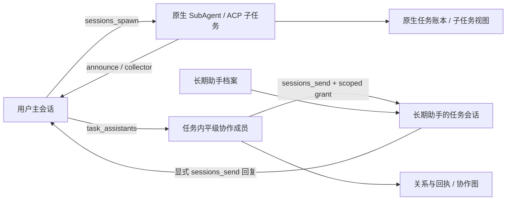

# SubAgent 与 Multi-Agent Team 全链路审核

后续实施顺序与验收标准见 [SubAgent 与 Multi-Agent Team 适配计划](multi-agent-adaptation-plan.md)。

## 审核基线与证据范围

- JustDo 基线：`071349c90` 加当前工作区改动。
- 上游：本地 `../openclaw`，package version `2026.9.6`，HEAD `eb377ac59e6c9fd6c7705028034812becf00271b`。
- 审核方式：三个独立审查任务分别覆盖 SubAgent 原生协议与执行、Team 后端与插件、两者的 Renderer；主审复核配置生命周期、交叉结论和改动。
- 证据来自源码、协议与测试，不把已有测试名称当作本次真实运行的结果。未启动真实模型进行完整 Gateway 端到端验收。

## 两种功能的所有权

| 概念                    | 身份和生命周期                                     | 执行/消息权威                                                             | 产品展示                       |
| ----------------------- | -------------------------------------------------- | ------------------------------------------------------------------------- | ------------------------------ |
| SubAgent                | 一次原生委派及其 child session；可嵌套、重试、取消 | OpenClaw task ledger、sessions_spawn、announce/yield/collect              | 子任务列表与只读历史详情       |
| ACP 子任务              | 外部 harness 运行，有独立 ACP session              | OpenClaw ACP runtime 与 task ledger                                       | 子任务列表中的 ACP 类型        |
| 长期助手档案            | 跨任务复用的 agentId、模型及角色文件               | 产品档案映射；原生 agents/files 管理角色文本                              | 设置 → 助手                    |
| Multi-Agent Team        | 某个主任务内的平级成员、room、round、delivery      | 产品约束成员和预算；原生 sessions_send 执行与保存正文                     | 平级协作图、双向交流与成员历史 |
| 上游 agents team create | coordinator/specialists 的角色预设与委派配置       | 原生 CLI 创建 agents，写 allowAgents/delegationMode，可能设置 systemAgent | 不是产品协作 room 的直接替代   |

## 确认的问题及处理

### A. 上一轮自动跨角色委派名单存在生命周期缺陷：已撤回

**严重度 P1：软删除后目标仍可能被原生委派。** 上一轮新增名单仅在配置生成时取启用、未删除的助手，但 `src/main/ipc/cowork/agents.ts` 的 Delete 分支只写软删除；`src/main/openclaw/config/nativeAssistantCreation.ts` 完成后只通知界面，未重新投影 main 的名单。因此删除后旧名单继续有效，模型新建助手后又不能立即通过该名单发现。配置生成单元测试无法覆盖这种漂移。

**严重度 P2：遗漏嵌套 ACP 目标。** 上游 `src/agents/subagents/spawn/acp-spawn.ts` 在 SubAgent envelope 中使用通用 spawn admission；`src/agents/spawn-plan.ts` 检查 allowAgents。上一轮 main 名单不含外部 ACP id，开启多层嵌套后可能拒绝子任务向 codex 等目标委派。普通 main 的 ACP 启动不受这一分支影响，不能泛称 ACP 全部损坏。

处理：撤回自动名单投影、对应测试与“已完整接入”的文档声明。后续须明确 native/ACP 目标集合，并覆盖创建、修改、禁用、软删除、失败回滚、热加载和正在运行的调用。保留原生目标权限机制，不新增隐藏的全局 allow-all。

### B. 平级 Team 接受了无法正确建模的新发送模式：已修复

**严重度 P2。** 新版 `sessions_send` 支持 `followup/steer/notify/resume`，现有 Team 将返回 runId 作为接收执行身份关联回信。上游 `sessions-send-tool.delivery.ts` 的 steer 返回消息 receipt id，同时沿用原活跃执行；当前 `collaboration.ts` 的回信关联不能正确表达这种双重身份。notify 在 exact-session scoped grant 下被上游明确拒绝；resume 属于原生任务恢复，也不能当作普通 peer 投递。

处理：`openclaw-extensions/agent-team/index.ts` 在 bind/admission 和预算消耗之前，仅允许省略 mode 或 followup；其它模式返回明确错误。SubAgent/ACP 子会话先行退出 peer hook，仍使用完整原生模式能力。回归覆盖 peer 拒绝、followup 正常投递和两种 child 的模式放行。

核对中曾怀疑 hook 丢弃 mode，后经上游 `agent-tools.before-tool-call.approval.ts` 的参数合并逻辑证伪，未将其写成缺陷。

### C. ACP 子会话被误当成平级成员：已修复

**严重度 P2。** 原来两个协作 hook 只识别 `subagent:`，对 `acp:` 也要求平级成员 admission；禁用 Team 时还会直接阻止父会话的 ACP 子任务消息。

处理：两个 hook 均使用公开 SDK 的 `isSubagentSessionKey/isAcpSessionKey` 识别原生会话。此处仅避免错误归类；可见性、调用方所有权、跨 agent 与 sandbox 约束仍由 OpenClaw 判断。没有给 child 键类型授予 scoped access。

### D. 子任务详情无法从端点发现失败或 Gateway 重启中恢复：已修复

**严重度 P2。** `SubagentMessageDrawer` 原来只在 sessionKey 变化时调用一次 connectToGateway，没有初始发现重试，也不响应 engine 阶段变化。初始 getPort 失败或重启后端口/token 变化时，用户需要关闭再打开详情。

处理：加入有界重试、engine readiness 后重新发现端点、连接中的串行恢复、关闭后的订阅和定时器清理；传输建立后的普通断线重连仍由 ChatController 负责。

### E. ACP 历史错误等待 SubAgent bootstrap 格式：已修复

**严重度 P2。** 原 Drawer 对所有 runtime 都要求 SubAgent 初始历史；chat-controller-session 的对应判定寻找 Subagent Context/Task 标记，而上游 ACP 初始任务直接写普通 user message。即使已有 ACP 历史，也可能遍历额外分页并耗尽初始重试。

处理：ACP 使用已有的 `expectInitialUserMessage` 判定，普通 SubAgent 保留原本的初始历史协议。

### F. Usage 读取失败连带阻断任务详情：已修复

**严重度 P2。** `loadCoworkSubagentDetails` 已获取并验证 taskId/sessionKey 后，若 usage 失败仍返回整体 failure；两个详情组件仅在 success 时合并 subagent，因此任务正文和详细状态也被丢弃。列表状态另有独立刷新，不应夸大为所有状态都停止更新。

处理：让任务元数据与统计有独立的可用状态；usage 不可用时仍返回已验证任务，界面仅提示统计不可用。无 taskId 的纯统计请求保持原错误语义。回归覆盖 usage loader 缺失、空结果、抛错和 session 归属不匹配；身份验证在读取统计之前完成。

### G. Team 正文和单条回执失败后缺少原地重试：已修复

**严重度 P2。** `CollaborationGraph` 的正文读取和 `CollaborationMemberHistory` 的精确回执读取在一次失败后依赖选中项变化才重试；Gateway 恢复后，同一选中项仍停留在不可用状态。普通成员历史已有独立重连机制，问题只在上述正文查询路径。

处理：加入复用现有双语文案的手动重试入口；图只补取缺失正文并保留成功缓存，加载中禁用重复请求；回执在原位置重读，不建立普通成员历史连接。没有增加无限轮询，旧请求在选择变化后仍不能覆盖新结果。

## SubAgent 全链路核对

| 范围                | 核对结论                                                                                    | 主要代码证据                                                      |
| ------------------- | ------------------------------------------------------------------------------------------- | ----------------------------------------------------------------- |
| Spawn、模型、上下文 | 执行由原生 sessions_spawn 管理；fork/isolated/模型优先级不能由产品重新推断                  | 上游 subagent-spawn-child-plan、model-selection-config、workspace |
| Ledger 与分页       | tasks.list/get 的参数、cursor、六种状态匹配；blocked 作为 completed 的 terminalOutcome 投影 | subagentGateway、wire/v2026_9_8；上游 task-summary/query          |
| ACP 去重            | 按 sessionKey 和 runId 处理 backing task，保留不同运行身份                                  | subagentGateway                                                   |
| Collect/Swarm       | collect 仍是 subagent ledger，不会整类被列表过滤；全局 subagent lane 限制依然生效           | 上游 swarm-config、subagent-spawn-launch-request                  |
| 事件与缓存          | task 事件使缓存失效；代际及 runId 校验避免旧请求回填；终态与替代运行有处理                  | runtimeSessionStatus、subagentGateway 及相关测试                  |
| 等待与完成回报      | sessions_yield/agents_wait/required-child join 由原生拥有，产品未另造执行器                 | 上游 subagents/registry；本地 runtime adapter                     |
| 停止                | 完整停止用 sessions.abort(key, clearQueued)；超时停止限定 runId；原生处理级联后代           | runtime lifecycle 与上游 sessions.abort                           |
| 恢复                | 产品恢复读取原生状态，不能从 UI 历史猜测重新执行                                            | runtimeSessionStatus、运行身份与恢复测试                          |
| 详情和统计          | 本次修复连接、ACP 初始历史和 usage 耦合问题                                                 | SubagentMessageDrawer、subtasks IPC                               |

模型语义必须明确：隐藏 SubAgent 默认只注入 AGENTS.md；SOUL/IDENTITY/USER 并非完整继承。模型优先级是目标 subagents.model → 全局子任务模型 → 目标 agent.model；同 agent 还可继承父运行当前模型，跨 agent 不继承父运行模型。不能无条件承诺“使用长期助手的全部人格与档案模型”。

## Multi-Agent Team 全链路核对

| 范围           | 核对结论                                                                            | 主要代码证据                                                    |
| -------------- | ----------------------------------------------------------------------------------- | --------------------------------------------------------------- |
| 档案与角色文件 | agents.create/update/files 参数仍匹配；创建后等待原生可见、核对文件内容的流程合理   | nativeAssistantCreation、agents IPC；上游 server-methods/agents |
| 软删除         | 保留原生 owner 可保护历史；原生 agents.delete 即使 deleteFiles:false 仍清理会话索引 | coworkStore、agents IPC；上游 agents 删除流程                   |
| 配置所有权     | 应保留用户扩展开关；不能把原生默认 all 可见性当作 room 授权                         | config builders/sync、extensions                                |
| 成员准备       | task_assistants 只准备；来源、anchor、启用状态、成员上限有 Main 校验                | collaboration coordinator/store                                 |
| 发送与回执     | 来源 run/toolCall 取可信 hook；精确目标 incarnation；accepted 不等于业务完成        | agent-team、collaboration coordinator                           |
| 路由与预算     | 同 room 路由、12 成员/16 消息预算、重复调用哈希约束存在                             | shared/cowork/collaboration、collaborationStore                 |
| 历史读取       | receipt 定位原生 transcript 并复核 provenance；无产品正文缓存                       | runtime-services/collaboration-history                          |
| 停止与恢复     | 停止轮次、冻结 admission、未知状态不自动重放；晚 dispatch 竞态仍需真实验证          | coordinator.stop、store recovery                                |
| 删除           | 删除 tombstone、全员 idle 检查、逐成员原生删除与进度记录支持失败重试                | coordinator.delete、collaborationStore                          |
| 界面           | 图按真实投递关系，成员历史为只读；不改变主输入框收件人                              | CollaborationPanel、MemberHistory、navigation                   |

## 已核实但尚未接入的增强

| 优先级 | 功能                     | 为什么值得接入                                                           | 约束                                                    |
| ------ | ------------------------ | ------------------------------------------------------------------------ | ------------------------------------------------------- |
| P2     | 嵌套子任务树             | main 当前主要读取直属任务，孙级没有直接导航；已有 BFS 只用于其它查询场景 | 透传 parentTaskId，按原生身份构树，控制分页成本         |
| P2     | 执行与交付状态分开       | 上游有 execution/deliveryStatus；执行完成不代表结果已送回                | 不能把 delivery 失败改写成执行失败                      |
| P2     | 进度、终态摘要、错误详情 | 已投影的 progressSummary/terminalSummary/error 尚未充分显示              | 展示原生字段，不重新推断状态                            |
| P2     | 单子任务取消             | 用户可保留父任务而取消某个子任务                                         | 使用原生 tasks.cancel/准确运行身份，显示级联影响        |
| P2     | 完成回报重试/忽略        | 上游 tasks.retry/tasks.dismiss 可以处理交付失败                          | retry 是重试交付，不是重新执行任务，必须明确标注        |
| P2     | 历史子任务分页           | 当前 finished 展示截断为50条，缺少明确提示与加载更多                     | 保留分页与原生task身份，不新增历史缓存                  |
| P2     | Swarm 独立设置           | 上游默认 enabled=true；组内并发/活动上限/累计上限分别为8/50/200          | 与现有普通直属数量不同；全局 lane 并发仍有效            |
| P2     | Collector 结构化结果     | collect/outputSchema/groupId + agents_wait 可批量汇总                    | 结果由原生存储，UI不要新增持久正文副本                  |
| P3     | Team peer steer/notify   | 支持运行中指导和轻量通知                                                 | 先区分消息 receipt 与执行 owner runId；通知不等于启动   |
| P3     | 原生角色预设导入         | 可复用 coordinator/researcher/writer/reviewer 的职责契约                 | 不能直接执行 CLI 改 systemAgent；须映射产品档案与软删除 |
| P3     | visible/worktree/project | 支持用户可继续交互的独立工作会话                                         | 先定义产品侧边栏、恢复、停止、删除与项目归属            |

现有运行时设置文案已说明批量任务采用独立数量限制。因此 Swarm 设置缺失是增强项，不是“现有数量限制全部失效”。上游 collect 仍经过全局 SubAgent lane，不能把组内默认8误称绕过全局并发设置。

## 验证与仍需真实 Gateway 验收的范围

最终定向回归：**50 个测试文件、879 个测试全部通过**，覆盖 cowork IPC、协作与会话 store、配置同步、OpenClaw adapter、助手设置、SubAgent 展示、Team 图/历史/详情、总 Token 统计、ChatController 与扩展协议。`npm run build`、`npm run lint` 和 `git diff --check` 通过。测试脚本已恢复并验证 Electron ABI 146。构建仍报告 bundle 体积及 Monaco 动静态导入提示，无构建错误。

修复后另由独立审查 Agent 对全部代码差异复核，覆盖可选统计的调用方、连接串行化和清理、ACP 初始历史边界、peer mode admission 顺序、回执重试缓存与过期请求；未发现新增确定性缺陷。

以下需要隔离配置、真实 Gateway 和模型运行，当前不标记为通过，也不凭静态推断标记为故障：

1. fork 实际上下文、目标角色/模型继承、嵌套 collector、私有 parent completion。
2. 运行中停止、重启后完成回报、替代运行与迟到 task event 的交错。
3. Team 多成员并发回复、发送已接受但回执前断线、未知投递的恢复。
4. 已获 scoped grant 与用户 Stop 同时发生的晚 dispatch：Main 不直接撤销该 grant，但原生 abortSignal 可能阻止执行，须 barrier 测试证明。
5. native session reset、逐成员删除失败后的重试，以及创建热加载期间的取消。

审核结论限于本次代码基线：两种功能核心所有权应继续分开，发现的接口与展示问题可局部修复，尚无证据支持整体推翻重写。新增功能需按上表补足产品生命周期，不能以原生工具已经存在代替产品已完成接入。
