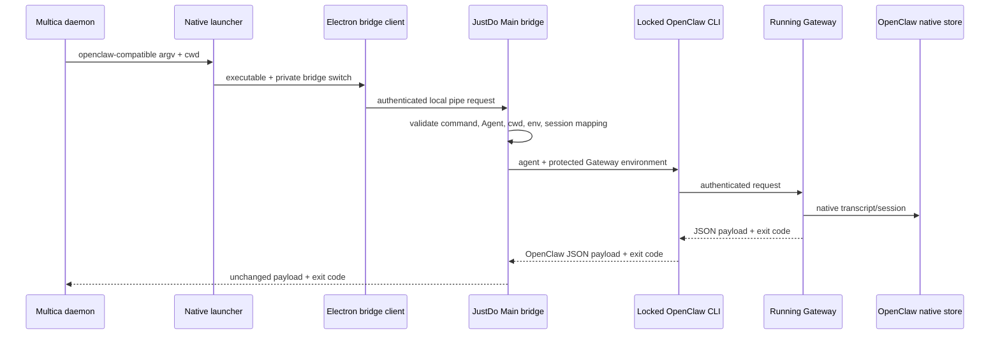

# Multica 集成

JustDo 向 Multica v0.4.43 提供一个本机 OpenClaw 兼容入口。Multica 仍按自己的
OpenClaw backend 启动任务。发现命令由 JustDo Main 回答；实际 `agent` 命令经认证的本机桥接
进入 Main，再由锁定的 OpenClaw CLI 连接已运行的 Gateway。任务因此使用应用中已配置的
Agent、模型、技能和工具，同时保留 Multica 提供的工作目录和任务级身份。

## 启用与配置

在“设置 → 集成 → 应用接入”中启用 Multica。JustDo 会显示需要复制到 Multica Agent
配置中的四项：

- 协议族：`openclaw`；
- 显示名称：当前 `productName`；
- 命令：本机兼容启动器的绝对路径；
- 描述：本机 Agent runtime 说明。

Multica 可继续以自己的默认方式调用兼容入口；桥接会移除请求中的 `--local`，避免一次性 CLI
与已运行 Gateway 共用 state 目录时发生冲突。custom args 仅支持桥接白名单中的会话、Agent、
prompt、timeout、thinking、verbose 和回复路由参数。
未知参数会显式拒绝，避免新旧 CLI 参数误配后静默执行错误语义。

启用开关控制 Main 是否接受任务。禁用后，即使 Windows 安装目录中的原生启动器仍存在，
请求也会 fail closed。刷新状态会重新探测 Multica CLI，并在可重建的平台上修复缺失启动器。

## 执行流程

Windows launcher is a small native executable built from
`scripts/multica/multica-agent-launcher.cs`; it prevents Electron console/runtime behavior from corrupting
stdout. macOS/Linux use an owned user-local shell launcher. Packaging builds the Windows launcher
next to the packaged executable; development can generate one with `npm run multica:dev-agent`.

## 会话与数据所有权

每个 Multica session id 映射到一个正常 Cowork session。首次请求保存 Multica id、Cowork
session id、Agent、cwd 和状态；后续请求必须继续使用同一 cwd 和 Agent。Multica 会话在列表中
带来源标记，打开后可查看 OpenClaw native transcript，但输入区只读，避免 Multica 和用户同时向同一
session 提交任务。

`cowork_external_sessions` 只保存映射、原生 session key 和状态，不保存消息。OpenClaw native
SQLite 仍是唯一 transcript 权威，JustDo 不创建外部消息缓存。删除 Cowork session 会通过
外键级联删除映射，并留下仅含外部 key 的 tombstone，防止相同 Multica session 被静默复活。

## 安全边界

- bridge 只监听当前用户的 named pipe/Unix socket，不开放 TCP 端口；
- 每次应用进程生成随机 token，写入用户数据目录下权限受限的 `multica/bridge.json`；
- 每个连接只接收一个 newline-delimited JSON 请求，大小上限 16 MiB；
- 命令和参数使用白名单，prompt 是唯一允许换行的 argv 值；
- cwd 必须是存在的绝对目录，Agent 必须已启用；实际任务还必须携带
  `mat_` task token、任务身份和存在的隔离 OpenClaw wrapper config；
- 任务环境不能覆盖 `JUSTDO_*`、Electron/Node bootstrap、OpenClaw state/config 或 Gateway 凭据；
  CLI 始终连接当前应用所属的 Gateway；
- 同一 Multica session 同时最多运行一个任务；客户端断开会 best-effort 停止对应 Cowork session；
- token、prompt 和完整命令不写日志。

## 兼容范围与排障

当前契约覆盖 Multica v0.4.43-v0.4.44 与 OpenClaw v2026.9.2，支持 Multica 的 `--version`、
`config validate --json`、`config file`、旧 `config get agents.list --json` fallback、
`agents list --json` 和一次性 `agent` 调用。Agent 列表来自 JustDo 当前启用的 Agent，而非直接
读取 OpenClaw 配置。

排障先检查设置卡片中的 bridge、launcher、Multica 探测和活动任务状态，再查看当天 Main log。
“JustDo 未运行”通常由启动器找不到 `bridge.json` 或 named pipe 引起；“integration disabled”
表示需要启用开关；恢复请求变更 cwd/Agent 会被明确拒绝。完整执行事件仍按 OpenClaw 日志排障，
bridge 日志不复制 prompt 或 transcript。

`MULTICA_WORKSPACES_ROOT` 不是任务执行的必填项：Multica v0.4.44 的自定义运行时调用可能不导出
该变量。兼容入口以已单独校验的绝对 `cwd` 作为任务工作区；task token、任务配置目录、
任务身份和 wrapper config 仍然必须存在，缺失时继续 fail closed。
