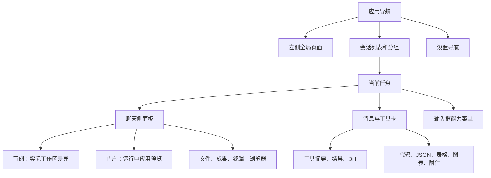

# OpenClaw Control UI 功能对照与 JustDo 实施任务书

状态：分包实施中的产品与工程方案；T03 已在 `feat/session-review` 实现，验证范围和限制见第 15 节；其他任务仍按各自实施记录判断。

核对日期：2026-09-27。JustDo 基线提交 `71a0b6950`，应用版本 `v2026.8.27`；锁定 OpenClaw `v2026.9.6`。参考源码为相邻目录 `../openclaw`，提交 `eb377ac59e6`。执行时若基线变化，先复核对应任务包的“当前实现”，保留之后已经交付的能力。

本文依据本地源码、注册入口、协议 schema 和文档进行静态核对，没有启动 Control UI 做逐屏截图，也没有对本文新增流程完成真实 Gateway 或模型验收。已确认的接口会列出实际名称；尚未逐字段核对的接口必须经过任务包内的契约核对，不能据名称猜参数。

## 1. 交给执行会话时怎么使用

这是一份分批实施清单。执行会话应以指定任务包为范围，把交互、权限、失败恢复和测试一起完成。不要一次把所有候选入口加进侧边栏，也不要只提交静态页面或占位按钮。

建议首先执行以下四项，能直接解决“看不懂 Agent 做了什么、改了哪些文件、如何查看运行效果”的问题：

1. **T02 工具调用渲染**：按操作类型展示工具、目的、状态、嵌套关系和完整输出。
2. **T03 审阅**：在当前任务中查看实际 Git 工作区变更。
3. **T04 门户**：列出并打开 Agent 创建的开发服务预览。
4. **T05 富文本交互**：补齐 JSON、表格、代码块、Mermaid 的阅读操作。

T01 导航按需提供上述入口；T06 文件与成果联动紧随其后。后台任务、活动、会话管理和设置能力分后续批次。优先级表示交付顺序，不表示低优先级功能永远不做。

### 1.1 可直接复制给执行会话的指令

```text
请读取 AGENTS.md 和 docs/features/openclaw-control-ui-adoption-plan.md。
本次执行任务包：T03（审阅）；其他包只处理它明确列出的必要依赖。

先复核当前实现是否已变化，对照 ../openclaw 的相关 UI、Gateway handler 和 schema。
按任务包完成实际 UI、必要 shared/Main/preload 接口、失败恢复、双语文案与领域测试。
原生协议已有的能力优先复用，不创建第二份 transcript、任务调度器或 Git 差异权威。
完成该包列出的验收用例，记录通过证据、未验证的平台/真实环境限制。
更新相关架构文档和本文实施记录；不要把其他候选包顺带实现。
```

替换任务包 ID 即可交给其他执行会话。若要开始首批，使用 `T02 → T03 → T04 → T05 → T06`；共享消息类型、面板状态和 App 导航的改动应串行落地，避免互相覆盖。

### 1.2 判定词与规模

- **已有**：源码中有实际注册与消费入口，但不代表本轮重新完成端到端验证。
- **部分已有**：存在基础能力，本文说明需要增加的差异。
- **未发现完整入口**：在本次核对范围内没有找到从入口到服务的完整产品链路；不等于原生不支持。
- **条件项**：需要新的产品范围、运行环境或独立权限设计，不能按普通按钮开发处理。
- **S / M / L**：分别表示局部交互、跨层功能、涉及复杂运行时或多类资源的相对规模；不是工期承诺。

## 2. 先把不同入口分清楚

用户看到的“侧边栏功能”至少包含四层。只数左侧固定按钮会漏掉审阅、文件、桌面、门户面板和消息内操作。



以下容易混淆的对象必须在产品和代码中区分：

| 对象      | 用户要回答的问题                       | 数据来源                         | 不能等同于                        |
| --------- | -------------------------------------- | -------------------------------- | --------------------------------- |
| Workboard | 计划做什么、任务排在哪个阶段           | 原生 Workboard 插件              | 原生后台 task ledger              |
| 后台任务  | 哪些工作正在运行、排队、结束或需要处理 | 原生 `tasks.*` 及其关联会话      | 手工待办卡片                      |
| 审阅      | 当前 checkout 实际改了什么             | 原生 `sessions.diff`             | 工具入参中的 edit 片段、Plan 审批 |
| 门户      | Agent 启动的应用如何打开、是否可访问   | 原生 `portal.*`                  | 普通浏览器收藏、互联网应用商店    |
| Dashboard | 如何长期保留一个任务的报表和交互组件   | 原生会话 Dashboard / widget 能力 | Workboard 或普通统计页            |

“审阅”另有 provider review（供应商中止后的检查与继续）和 Skill Workshop 提案审阅等含义。本文 T03 明确指 **Review 工作区差异面板**；其他审阅流程分别列项。

## 3. 完整入口对照

### 3.1 左侧全局导航及导航中的子入口

上游 `ui/src/app-navigation.ts` 的可固定页面集合有 12 项；默认数组为 Agents、Dashboards、Systems、Automations、Plugins。实际可见项还受用户固定偏好、身份模式、权限和插件注册影响。Workboard 是插件贡献入口；Worktrees 是 Sessions 的子页；Skills 和 Skill Workshop 归 Plugins。

| 上游入口                        | 实际用途                                 | JustDo 当前状态                                     | 建议落点与具体工作                                                     | 包      |
| ------------------------------- | ---------------------------------------- | --------------------------------------------------- | ---------------------------------------------------------------------- | ------- |
| Agents home                     | 助手 roster、活动状态、最近工作          | 设置已有助手档案及任务协作；没有独立总览页          | “更多 → 助手”，复用档案；显示当前工作并跳转任务。保持普通消息属于 main | T10     |
| Dashboards                      | 浏览会话所属的报表、widget 面板          | 有 Canvas 消息呈现基础；未发现完整 Dashboard 工作区 | 先做受支持的消息 widget，再评估画廊和持久面板                          | T15     |
| Usage                           | 会话 token、估算成本、供应商额度等       | 设置已有日期与模型/供应商/助手聚合                  | “更多 → 用量”复用同页；增加会话钻取和额度，不重复统计服务              | T12     |
| Automations / Cron              | 周期任务、状态、运行历史                 | 已有定时任务、结果、部分高级字段展示                | 保留主入口，补跨任务运行历史、失败与投递解释                           | T13     |
| Tasks                           | 原生后台任务、结果、取消                 | 已有当前任务子任务视图与详情                        | 新增跨会话后台任务页；复用详情，不把所有 subagent 塞进聊天列表         | T07     |
| Sessions                        | 全局会话筛选、归档、批量管理             | 已有列表、搜索、分组、固定、未读、导出和分叉        | “更多 → 会话”，增加管理页及可恢复归档                                  | T09     |
| Worktrees（子页）               | 编码工作区隔离与生命周期                 | 未发现对应完整管理入口                              | 作为开发工作流单独评估，不能只增一个文件夹选项                         | T16     |
| Systems                         | Gateway、worker、设备和桌面工作区        | 当前主流是本地运行；已有浏览器和本地运行设置        | 第一阶段做运行诊断；多机器管理后续单独交付                             | T11/T16 |
| Activity                        | 按时间回顾工作、实时活动和 run inspector | 有单会话流式过程；没有完整全局活动页                | “更多 → 活动”；先最近活动及运行列表，后原生 recap 和审计               | T07/T11 |
| Meetings                        | 已采集会议的摘要、说话人和时间戳转录     | 有语音输入/输出和音频附件转录；不是会议库           | 需要会议采集产品链路，暂不作为首批侧栏按钮                             | T16     |
| Plugins                         | 插件目录、详情和管理                     | 已有 skills/MCP/hooks/extensions/marketplace 聚合   | 保留现有入口，增强配置、工具详情和能力展示                             | T14     |
| Skills / Skill Workshop（子页） | 技能状态、配置、学习提案审阅             | 已有技能管理和原生提案审阅                          | 补可发现性和状态说明，不重新创建提案库                                 | T14     |
| Apps                            | 上游多端客户端、浏览器扩展等安装链接     | 产品已有自己的更新与浏览器设置                      | 归帮助/集成页面，不照搬上游客户端下载目录                              | T16     |
| Portals                         | Agent 开发服务的代理预览与管理           | 有内置浏览器；未发现 `portal.list/close` 产品消费链 | “更多 → 门户”全局目录 + 当前任务门户 Tab                               | **T04** |
| Workboard（插件）               | 持久任务看板、启动和流转                 | 已有四栏、编辑、执行、详情等                        | 继续现有领域，补导航联动，保持插件开关                                 | T01/T07 |
| 插件贡献页面                    | 插件自定义管理/交互页面                  | 有插件管理，不等于可运行任意上游 UI                 | 需要专门 host/capability 设计，不能直接加载插件脚本进 Renderer         | T15     |
| Home / Ask OpenClaw             | 主会话 dock、系统设置与修复聊天          | 已有首页工作区；不等于系统维护 agent                | Home 只借鉴跨页可达性；系统修复从诊断包独立演进                        | T11/T16 |
| 在线人员、Agent/环境切换        | 多用户、多个助手/环境的上下文导航        | 单用户本地产品，普通会话属于 main                   | 只消费已有助手/任务信息；不引入多用户身份体系                          | T10/T16 |

### 3.2 聊天侧面板、标题栏和输入区

| 上游入口                        | JustDo 当前状态                                            | 需要做什么                                                            | 包      |
| ------------------------------- | ---------------------------------------------------------- | --------------------------------------------------------------------- | ------- |
| **Review / 审阅**               | 有工具级 edit Diff、Plan 审批；没有实际 checkout Diff 面板 | 增加文件变更列表、范围切换、真实 Diff、文件跳转                       | **T03** |
| **Portal / 门户**               | 没有完整原生门户消费链                                     | 打开精确 portal ID，显示准备/不可达/关闭，保留独立认证边界            | **T04** |
| Files                           | 已有项目目录树、搜索、文件预览与编辑保护                   | 补“已修改/本次读取/成果”视图和来自审阅的定位                          | T06     |
| Terminal                        | 已有 xterm、本地终端生命周期                               | 先保持现有实现；Agent 共享 PTY 和原生 CLI 恢复是另一个能力包          | T16     |
| Browser                         | 已有四种模式、内置真实网页、标注与录制                     | 保留现有模式和互斥策略；门户共享承载设施前单独审查认证与资源归属      | T04/T06 |
| Tasks                           | 已有子任务列表、嵌套详情、取消和交付恢复                   | 增加统一面板入口与全局任务页回链                                      | T07     |
| Side chat                       | 已有 `/btw` 临时侧聊、独立输入和渲染                       | 补选文提问、原位重试；明确临时性，不能声称已实现上游完整 session rail | T05/T06 |
| Dashboard                       | Canvas 单项呈现不能覆盖此能力                              | 分阶段支持 widget 与会话面板                                          | T15     |
| Desktop                         | 未发现完整原生远程桌面查看器                               | 需设备、授权、连接/断开和隐藏生命周期；条件项                         | T16     |
| Discussion                      | 上游有能力相关的会话讨论面板                               | 与 JustDo 平级协作图并非相同业务；无明确需求先不接                    | T16     |
| GitHub reader                   | 常规链接/浏览器可打开；没有专门原生读者面板                | 首先支持明确 GitHub 链接的只读预览；不要顺带添加提交/合并             | T06/T16 |
| 左/右/下停靠、展开、主辅交换    | 已有按会话保留的 Tab、宽度和面板状态                       | 首批增加审阅/门户可用入口；布局增强单独交付                           | T01     |
| 多会话分屏                      | 未发现完整多 composer 分屏                                 | 成本较高，须防会话/草稿/审批串线；放后续                              | T16     |
| Skill/MCP/Web Search 能力菜单   | 有建会话 Skill 选择、全局插件配置                          | 补原生会话覆盖值、继承来源、连接器工具权限和清除覆盖                  | T08     |
| 模型、thinking、fast 等会话选项 | 已有模型选择及运行设置                                     | 逐项核对原生能力元数据，再补有真实支持的控件                          | T08/T12 |
| Suggested tasks                 | 有工具名映射，未发现完整建议任务卡工作流                   | 可编辑建议、在新会话启动、消失/重试；worktree 选项后置                | T06     |
| 消息选文评论                    | 已有网页标注，不能等同于聊天消息评论                       | 引用具体消息与选区，加入草稿，发送前可编辑/删除                       | T05     |

### 3.3 设置导航也纳入覆盖，不把所有设置升为主页面

以下是上游设置导航组的逐项归宿。表中“核对”表示需要执行会话读具体 schema/handler，而非本轮已经完整验证每个子开关。

| 上游设置                               | JustDo 处理建议                                                                                    |
| -------------------------------------- | -------------------------------------------------------------------------------------------------- |
| Ask OpenClaw / custodian               | T11 先提供诊断和明确恢复动作；自然语言修改受管配置另做专门适配                                     |
| Profile                                | 保留应用身份与助手档案边界；上游多用户 profile/Git 署名不直接复制                                  |
| Appearance                             | 已有主题等设置；补消息宽度、代码换行等阅读偏好，T05                                                |
| Notifications                          | 复用桌面通知和已有任务结果入口；不引入浏览器 Web Push 订阅                                         |
| Device / Device permissions            | 归系统权限或浏览器权限；原生手机/桌面节点需要 T16                                                  |
| Connection                             | 归本地运行诊断和受管 Gateway 配置；任意远程 Gateway 登录后置                                       |
| Channels                               | 已有 IM Bot 设置；补状态、探测、登录/失效解释时核对现有渠道链路，T14                               |
| Communications                         | 核对渠道共享默认与路由；不展示未支持的原生通信拓扑                                                 |
| Talk                                   | 现有 ASR/TTS 保留；真正双向实时语音和视频单独做 T16                                                |
| Devices / Cloud workers                | T16 多机器工作流，不因上游有页面即启用                                                             |
| Agents                                 | 现有管理复用，补能力摘要和总览跳转，T10                                                            |
| Model providers                        | 认证、可用模型、回退链和额度，T12                                                                  |
| Search                                 | Web Search 供应商配置与会话开关分开，T08/T14                                                       |
| Plugin settings / Skill settings / MCP | 现有插件中心承接，T14；会话覆盖由 T08 承接                                                         |
| Memory                                 | 已有文档、搜索、dream/dreaming 文件；补导入和原生状态，T14                                         |
| Automation                             | 现有定时任务与运行参数承接，T13                                                                    |
| Security                               | 保持权限模式、文件授权、沙盒与 Gateway 原生策略一致；T08/T11                                       |
| Secrets                                | 先有配置字段的安全录入/保留语义；团队级 secret store 是条件项，T14/T16                             |
| Approvals                              | 保留即时审批；增加只读历史和来源跳转，T11                                                          |
| Infrastructure / Labs                  | 将明确支持的 Code Mode、Tool Search、循环检测等逐项核对后进入运行参数；不做无差别 schema 表单，T14 |
| Advanced                               | 只开放产品不受管且能安全回读的窄配置；任意 JSON5 编辑暂不交付                                      |
| Debug / Logs                           | 运行诊断、脱敏日志与错误详情，T11；普通用户不需要任意 RPC 控制台                                   |
| Updates / About                        | 继续应用自己的升级链路；不能用原生 `update.run` 改写捆绑 runtime                                   |

## 4. 目标导航与信息组织

### T01：导航和聊天面板入口（P1，M；其他首批包可只实现必要部分）

**用户场景**：用户知道要看“修改”或“运行结果”，但找不到入口；功能增加后会话列表被挤压。

**当前基础**：`app/shell/Sidebar.tsx`、`app/App.tsx`；聊天侧面板已有 `NewDisplayTabMenu`、`CoworkDisplayPanel`、`useSessionDisplayState`，并有未保存文件导航保护。

**具体交付**：

1. 侧边栏保留新对话、定时任务、Workboard（按插件能力）、插件；增加“更多”菜单。已完成的后台任务页可加入默认固定项，未完成的不显示占位项。
2. “更多”容纳助手、活动、会话、用量、记忆、门户、运行状态。设置/帮助留底部。记忆保留原快捷入口，两个入口打开同一页面。
3. 建立纯展示注册表：稳定 ID、i18n key、图标、可用条件、导航 action、是否允许固定。它不注册新的权限，也不直接持有 Gateway client。
4. 用户可固定/取消固定、重排、恢复默认；不允许固定项重复。隐藏暂不可用项时保留偏好，能力恢复后恢复位置。
5. 聊天侧面板“+”增加审阅、门户、后台任务；已存在的文件、终端、浏览器和侧聊保持各自入口。审阅固定为每会话一个；门户按精确 ID 复用。
6. 第一阶段只沿用现有左右结构。第二阶段独立增加底部停靠、展开和主辅交换；不把多会话分屏作为这些按钮的隐式依赖。
7. 所有导航经过现有文件未保存保护；切页不清主聊天草稿、不重复启动任务、不抢焦点。

**验收**：重启后固定项顺序正确；插件临时关闭/开启不丢偏好；审阅和门户打开不会出现重复 Tab；未保存文件编辑能阻止离开；中文输入法、键盘上下键、Enter、Escape 可操作菜单；全部入口的 active 状态与页面一致。

## 5. 消息与工具呈现

已交付基础呈现之后的专项增强，见 [工具与消息专项渲染计划](openclaw-tool-rendering-plan.md) 和 [逐工具契约目录](openclaw-tool-contract-catalog.md)。两份文档按锁定源码定位参数/结果定义，并区分当前实现、后续任务和动态插件边界。

### 5.1 现状和目标效果

JustDo 不是从零实现消息展示。当前具有原生流/历史归并、Thinking/Tool/Content 顺序、过程折叠、工具原始输入输出、部分 edit 的统一/并排 Diff、Markdown/公式、代码复制、Mermaid、附件、Canvas、minimap 和滚动锚点。

核心差异在 `active-turn-timeline.ts`：过程摘要主要按 thinking/tool 总数计数；普通工具摘要是压平后的输入（最多约 160 字符），详情通常是输入/结果的 `<pre>`。`edit-tool-diff.ts` 识别 edit/edit_file/multiedit 及 old/new 文本，不覆盖所有 write/apply_patch 形态。现有 `ToolItem` 未包含上游完整的 purpose/activity/parentToolCallId 展示契约。

目标不是给每个工具做一张巨大卡片。默认应能看到类似：

```text
正在检查构建失败原因
  执行命令   npm run build                  运行中

完成后折叠为：
  3 次命令 · 5 次读取 · 2 次编辑             1 次失败
    检查构建        已失败 · 退出码 1
      命令 / 输出 / 原始详情 / 复制 / 查看完整输出
    修复类型声明    已完成
      src/example.ts   +8 -3   [查看编辑片段] [在审阅中打开]
```

以上是拟议中文文案与交互示意，不是本轮实际截图。计数表示操作次数；不能把两次读同一个文件说成两个文件，也不能把“提出编辑”说成“成功修改”。

### 5.2 消息呈现覆盖清单

这一层与页面导航独立；即使不新增任何左侧入口，也应逐步补齐。

| 能力                               | 当前证据与差异                                   | 具体决策                                                                                   |
| ---------------------------------- | ------------------------------------------------ | ------------------------------------------------------------------------------------------ |
| Thinking/Tool/Content 的原生段顺序 | 已有 reducer、history reconciliation 和 timeline | 保留；任何新工具呈现不得重排正文和工具前后顺序                                             |
| 连续工具折叠                       | 已有 thinking/tool 数量摘要                      | T02 增加操作类型和 outcome；不重写整套流状态机                                             |
| 工具目的说明                       | 当前普通摘要主要来自输入压平                     | T02 消费原生说明，无说明回退；不新增模型调用                                               |
| 嵌套调用/Code Mode                 | 当前 ToolItem 未携完整父子展示契约               | T02 贯通字段与身份，wrapper/子操作分层                                                     |
| 命令、输出与退出码                 | 已可看原始输入/结果                              | T02 增加类型化呈现和结果状态，不隐藏非零退出码                                             |
| 工具级 Diff                        | 已支持部分 edit 形态、Monaco 统一/并排           | T02 扩解析；与 T03 实际 Git Diff 区分                                                      |
| 完整输出/原始详情/下载             | 有历史大消息恢复基础，非完整工具输出阅读器       | T02 按 identity 补取与标明完整性                                                           |
| Progress、Plan、Goal               | 已有原生进度与产品交互                           | 保持独立卡片，不吞入普通工具折叠；回归其清空/恢复语义                                      |
| 子任务嵌入和历史                   | 已有子任务详情、嵌套、交付恢复                   | 复用 T02 展示；历史必须绑定实际任务/run，不打开后来同名任务的结果                          |
| 失败消息/错误横幅                  | 已有终态与失败消息路径                           | T11 补完整错误复制/详情；有答案后晚到的失败仍可解释                                        |
| Provider review hold               | 未发现完整产品处理链                             | T11-E 单独接原生停止与确认继续，不能作为普通工具失败重试                                   |
| 代码块                             | 已高亮、复制、流式稳定边界                       | T05-A 增展开、换行、下载与状态保持                                                         |
| JSON 树                            | 未发现完整树/原文双视图                          | T05-C，严格保留原始文本                                                                    |
| 表格                               | 已横向滚动                                       | T05-B 复制 TSV、扩大视图                                                                   |
| Mermaid                            | 已渲染及源码切换                                 | T05-D 扩大、复制、异常和复杂度保护                                                         |
| 数学公式                           | 已有 KaTeX/Markdown 配套                         | 保留并加入流式与长公式回归；不更换渲染库                                                   |
| 图片、视频、音频、文档附件         | normalization 已区分媒体类型；已有附件与图片呈现 | T06 按类型核对实际 viewer、加载、失败/重试、原图与历史恢复；不能只看类型定义即声称完整播放 |
| HTML/SVG/artifact                  | 有隔离 Canvas 和文件预览基础                     | T06 先完善源/预览；`show_widget` 持久能力单独 T15                                          |
| 来源与引用                         | 常规链接已有；未发现完整来源卡阅读链             | T06 后续消费原生检索来源，摘要重用已检索内容；不对每个链接自动重复抓取                     |
| 文件/会话/GitHub 链接              | 文件预览与普通链接已有                           | T05/T06 补明确身份的导航与只读预览，保留原 Markdown 复制                                   |
| 选文评论、引用回复、侧聊           | 网页标注和临时侧聊已有，不能等同消息评论         | T05 选文加入草稿及侧聊；回复目标需绑定原生 entry                                           |
| 建议任务卡                         | 工具标题映射不代表产品工作流                     | T06 补受控启动与失败恢复                                                                   |
| ClawHub 能力推荐卡                 | 插件市场有自己的 provider 与安装身份             | T14 加只读推荐到详情的路由；安装继续产品审查，不直接搬上游立即接受能力的动作               |
| Emoji shortcode、人类 @mention     | 本轮未逐条核对现有处理                           | 低优先级；emoji 可后做纯输入体验，@mention 依赖多用户身份，不能随意猜收件人                |
| 自动滚动/历史分页/minimap          | 已有完整相关领域与测试                           | 保留；新增图/表/卡片晚加载须维持锚点                                                       |
| 消息宽度、字体、主题               | 已有应用主题和气泡样式                           | T05 可增加受限偏好，保持窄窗口和大字号可读；不接受任意 CSS 注入                            |

T02/T05 的共享展示应覆盖主聊天、Side Chat、子任务详情及协作成员历史的实际共用路径。各视图仍保留自己的只读与临时性规则，不能因为复用组件而出现“只读历史可发送/可改权限”。执行时用同一组合成消息在这些已有消费者上检查，避免只修主聊天。

### T02：工具调用的语义化呈现（P0，L）

**上游参考**：`ui/src/lib/chat/tool-call-grouping.ts`、`ui/src/pages/chat/components/chat-tool-cards.ts`、`chat-tool-output.ts`、`chat-tool-outcome-summary.ts`；实际 operation 分类还依赖上游 `src/agents/agent-activity-presentation.js` 对应源码契约。

**JustDo 改动位置**：`libs/openclaw-chat/model/`、`pipeline/`、`components/active-turn-timeline.ts`、`components/justdo-chat.styles.ts`。如归一化阶段丢失原生字段，核对 shared `agentEvent.ts`、wire adapter 和历史 adapter；不要在渲染层猜回丢失的语义。

**T02-A：身份与展示模型**

- 核对原生实时事件和持久历史中 purpose/title、activity、parentToolCallId、exitCode、outcome、截断及 result message identity 的真实字段位置。
- 建立兼容当前事件的可选展示投影；旧历史没有字段时保留可用信息，回退到工具名/有界参数摘要。不得修改或补造 transcript。
- `(runId, toolCallId)` 用于识别同次调用；不同 run、相同命令属于不同调用。start/update/result 不各算一次。
- 嵌套只根据同 run 的明确 parent identity；父缺失、重复 ID、循环、歧义时保持平级。按包装调用是否贡献独立 operation 的原生语义计数，避免 wrapper 与子操作重复。
- 结果状态与展示说明分开。没有权威结果时不能因最后一个事件到达而标记成功；必要时用展示级“结果未知”，不随意改变原生执行状态枚举。

**T02-B：折叠与展开**

| 类型                       | 折叠态                                        | 展开态                                                                         |
| -------------------------- | --------------------------------------------- | ------------------------------------------------------------------------------ |
| exec/bash/process/terminal | 原生目的说明；无目的则一行命令；运行/结束状态 | 命令语法高亮、cwd（仅返回且可展示时）、输出、退出码、原始详情                  |
| read/搜索文件              | 路径/查询与操作名                             | 实际参数、结果、文件打开；未知路径不变成系统动作                               |
| edit                       | 路径、编辑片段增删数、调用结果                | 保留现有 Monaco Diff；明确它是调用片段                                         |
| write/apply_patch          | 有原生结构则展示路径及 patch 摘要             | 增加原生支持形态解析；无可靠 before/after 时展示内容/patch，不伪造完整文件历史 |
| web_search/web_fetch       | 搜索词或来源域名                              | 返回的来源列表与检索片段；保留原始结果入口                                     |
| browser                    | 动作与目标页面                                | 原生结果、可用截图/Tab 跳转；不用推断的成功状态                                |
| MCP/插件工具               | 提供方、工具名、声明的说明（若有）            | 通用结构化参数与结果；不运行工具返回的任意 UI 代码                             |
| code mode/批量包装         | 目的或执行类型、子操作计数、子失败数          | 子调用树；wrapper 原始源码/响应放“工具输入/原始详情”                           |
| subagent                   | 复用已有子任务标题和运行/等待状态             | 打开原生任务详情，保持现有嵌套和结果交付操作                                   |

- 每组折叠摘要显示操作类型计数和失败/受阻/跳过等已知结果；内部子调用失败不能被 wrapper 成功遮盖。
- 运行时标题使用最新活动调用或已声明目的；不额外请求模型生成标题。
- 展开状态绑定稳定工具/分组 identity，实时转历史、补取输出、追加正文时保持；普通段落不能被错误吞进工具组。
- 一次失败工具不代表会话失败；错误详情放在展开区，但折叠区仍显示失败标记。

**T02-C：大输出与保真**

- 默认只渲染有界预览，大输出有“查看完整输出”；复用现有 history detail 路径，按结果 entry 与 toolCall identity 校验补取。
- 输入/输出分别可复制；支持下载已取得的完整文本。格式化 JSON/命令 envelope 是额外展示视图，复制原始视图保留实际返回文本及末尾换行。
- 若上游已截断且无法补取，明确“仅部分输出”；不能下载预览却标成完整。
- 切换会话或关闭详情后，迟到补取不得更新其他会话。复制失败不能留成功图标。
- 不把未授权的内部字段放进“原始详情”；它只展示已授权的工具结果，不扩权读取内部日志。

**验收**：同一工具收 20 次更新只计一次；两次同文命令计两次；同 run 嵌套和缺父/循环各有 fixture；子调用退出码 1、wrapper 成功仍显示失败；历史重载与实时显示分类一致；展开工具后继续流式输出不折叠；超长结果补取失败可重试且不串会话；现有 Plan、progress card、子任务、停止、重连与时序测试保持通过。

### T05：富文本和消息内操作（P1，M，分四次交付）

**当前文件**：`components/markdown.ts`、`justdo-chat.ts`、`mermaidRenderer.ts`、`message-render.ts`。上游有拆分的 `markdown-json.ts`、`markdown-tables.ts`、`markdown-code-blocks.ts`、`markdown-mermaid.ts` 可参考，不能直接 import 上游 app context。

| 子项          | 当前基础                      | 本次具体新增                                          | 必须验证                                                                                       |
| ------------- | ----------------------------- | ----------------------------------------------------- | ---------------------------------------------------------------------------------------------- |
| T05-A 代码块  | 已有高亮与复制                | 长代码展开/收起、换行切换、下载；流式结束保持用户选择 | 复制保留前导空白/末尾换行；未闭合 fence 无抖动；大代码有界 DOM                                 |
| T05-B 表格    | 已横向滚动                    | 复制为 TSV、扩大阅读视图；弹层中的链接沿用原动作      | 单元格 tab/newline 转义策略明确；复制失败反馈；链接激活关闭扩大视图                            |
| T05-C JSON    | 有代码高亮，无完整树/原文切换 | 对完整 JSON object/array 提供树与原文；树节点按需展开 | 重复 key、大整数、转义不被复制改写；流式残缺/超大 JSON 保留原文；不用 parse/stringify 冒充原文 |
| T05-D Mermaid | 已有图/源码切换               | 添加原文复制、扩大/缩放与清晰失败提示，核对主题和隔离 | 未闭合 fence 保持源码；无效/复杂图不拖死 UI；不允脚本、外部图片或点击回调突破现有边界          |

消息选文作为后一小批：选中助手正文出现“加入输入框”“在侧聊中提问”；引用记录源 entry、选中文字和用户评论，作为可删除草稿附件。点击按钮只编辑草稿，不自动发送；引用不作为系统指令。发送后能看原引用；主会话 reset/fork 后不错误定位旧 entry。网页标注继续使用原有链路。

链接后续增强：显式会话链接跳转已获准会话，显式 GitHub issue/PR URL 可展示只读预览，文件链接保留完整路径用于打开/复制。先做明确链接；不从一段“PR #123”文字猜仓库或账号。

## 6. 两个优先补齐的工作区能力

### T03：审阅实际工作区修改（P0，M；首版只读）

**用户场景**：Agent 修改了多个文件，用户在回复后想检查最终结果；工具卡只能看到某次 edit 的入参，无法覆盖命令生成的文件、多轮累积修改或已有提交。

**入口**：侧面板启动入口及“+ → 审阅”。无 Git 仓库时可打开有说明的空态；只有原生明确不支持该方法时隐藏或禁用能力并解释。工具 edit 卡可“在审阅中打开此文件”。

**第一版页面**：

1. 顶部：仓库/分支、比较基准、刷新、统一/并排、自动换行。
2. 文件列表：相对路径、A/M/D/R 状态、增删行数；支持筛选路径和逐文件展开。
3. Diff：行号、语法高亮、hunk 分段、未修改行占位；空差异、二进制、未跟踪和超大/截断文件各有明确呈现。
4. 底部范围：全部变更、未提交、某次提交。提交列表有上限时说明只显示返回范围，不伪造完整 Git 历史。
5. 文件操作：复制路径、在现有 Files 中显示、打开预览；本地授权路径可在系统编辑器打开，远程路径不传给本机 shell。
6. 默认按用户打开/点击刷新加载。运行结束时可标记“有更新”，不在用户选择文本或读旧 hunk 时频繁替换内容。

**已确认协议**：

```ts
// packages/gateway-protocol/src/schema/sessions.ts
// 名称及取值是已核对的原生协议，不是建议新增 RPC。
type SessionDiffRequest = {
  sessionKey: string;
  agentId?: string;
  scope?: 'all' | 'uncommitted' | 'commit';
  commit?: string; // 当且仅当 scope 为 commit
};
// 通过现有受控 Gateway 请求封装调用：
// client.request('sessions.diff', request)
```

**最终语义（2026-09-27，按用户确认）**：直接采用 OpenClaw 原生会话基线，不扩展 `sessions.diff` 协议。`all`/`uncommitted` 按原生保存的文件指纹过滤会话开始前已有且未再变化的文件；再次变化的文件展示相对 Git 基准的完整 patch，不逐行减去旧修改。`commit` 不使用会话过滤。基线缺失或无效时保持原生行为，不由产品补建。用户不需要主动提交，已初始化但没有提交的仓库也可比较；非 Git 目录显示不可用。

结果包含 `files`、`additions/deletions`、可选 `root/branch/baseRef/commits/mergeBase/aheadCount`、`truncated`；文件含 path/oldPath/status/binary/untracked/patch。`unavailableReason` 已包括 `unknown_session`、`not_git`、`unknown_commit`、`workspace_stopped`。上游注册为 `operator.read`。

**实现边界**：

- Shared 增加领域参数/结果，Main 解析产品 session 到原生 identity 并校验归属，再调用 Gateway；Renderer 不传任意 Git 路径执行命令。
- 原生服务计算 Diff。产品不逐一拼接 edit 入参，也不在 Main 再维护 Git 快照数据库。
- 文件预览继续通过现有工作区授权与版本校验；真实 filesystem 路径只能在 Main 验证后使用。
- 建议组件放 `cowork/components/review/`；沿用现有面板状态，保持 `CoworkView.tsx` 仅做组合。
- 查询 identity 包含 session、范围、commit 和 generation；旧请求不得覆盖新范围。
- 首版不做 stage、discard、commit、自动修复、推送、PR 发布。可显示只读结果，无需这些写操作就能完整验收。
- **归属说明**：`sessions.diff` 是按原生会话基线过滤的当前 checkout 差异。共享目录里人工修改、其他会话或外部工具的修改仍可能出现，UI 不能宣称“全部由本次 Agent 产生”。会话前已有且未再变化的文件按原生规则隐藏。

**验收用例**：

| 场景                                   | 预期                                          |
| -------------------------------------- | --------------------------------------------- |
| edit、shell、用户手工分别改三个文件    | 会话基线后发生的变更可见；工具卡只表明各自操作            |
| 新增、删除、重命名、未跟踪、二进制文件 | 正确状态与可用操作；无 patch 时不给空白成功页 |
| 有原始脏文件的工作区                   | 基线中未再变化的文件隐藏；再次变化的文件显示完整 Git Diff        |
| 切“全部/未提交/提交”时请求乱序         | 最终展示当前选中范围                          |
| 无 Git、未知 commit、停止的远程工作区  | 分别显示原因，重试不改变工作区                |
| 改文件后刷新                           | 统计与 Diff 一致；未保存预览草稿仍受保护      |
| 大 patch、超长行、中文/空格路径        | 有界显示、正确复制和文件定位                  |

相关文档更新：`15-chat-rendering`；新增 IPC/文件动作时同步 `03-process-model` 或对应文件操作设计。

### T04：门户与应用预览（P1，L；优先本地、已创建门户）

**用户场景**：Agent 启动一个网页/报表服务后，用户希望在任务旁预览，刷新后还能找到它，关闭预览时知道到底关了什么。

**本轮修正**：门户不是低价值“外部网址列表”。上游为 Gateway 主机或 worker 上的开发服务提供 HTTP/WebSocket 代理及认证；这是编码与交互成果工作流的重要组成部分。

**第一版范围**：管理和打开 Gateway 已经创建的门户；门户由已有原生 `portal` tool 建立。不要为了预览在 JustDo 再启动代理服务、扫描本机所有端口或自动运行仓库脚本。

**两个入口**：

- “更多 → 门户”：本连接可见的门户目录，含名称、描述、地址、安全可展示的端口、创建时间和访问状态。
- 当前任务侧面板“门户”：打开用户选择的精确 portal；重复打开复用 Tab。可以通过已验证的原生事件/工具结果提出“打开预览”动作。

**具体交互**：

1. 列表有加载、为空、读取失败、失联和已有快照过期状态；失败保留旧快照并标明失效。
2. 点击门户后先显示“正在连接”；代理已存在而服务尚未启动时显示“服务尚未就绪”，提供重试，不能写成“门户创建失败”。
3. 预览有刷新、在外部浏览器打开、复制普通地址、关闭预览 Tab。无法嵌入时保留外部打开操作及原因。
4. 门户目录中的“关闭门户”是另一个明确动作：回收代理及连接。文案须说明它不保证停止开发服务器；关闭 Tab 只隐藏视图。
5. Gateway 重启或 `portal.changed` 通知门户被关闭时，视图标记失效。不得自动重新开放监听或重新执行开发命令。
6. 页面在后台时不持续高频探测，恢复可见后刷新；切换任务不让背景 portal 抢占当前面板。

**已确认协议与特别限制**：

| 方法/事件        | 已核对内容                                                                     |
| ---------------- | ------------------------------------------------------------------------------ |
| `portal.list`    | 参数可有 `environmentId`；返回 `portals[]`                                     |
| `portal.open`    | port、可选 title/description/path/environmentId；首版由原生 tool 拥有创建      |
| `portal.close`   | id、可选 environmentId；返回 closed                                            |
| `portal.changed` | portals 快照，需按当前连接更新                                                 |
| PortalSummary    | id/title/port/listenPort/publicUrl/createdAtMs 等；url/tokenQuery 可被权限裁剪 |

**关键事实**：当前 PortalSummary 没有通用的 `sessionKey` 或完整来源会话字段。`portal.list({})` 也不是“当前会话专属列表”。不能按端口、标题、时间邻近猜归属，更不能读取一次全局列表后全部归入当前任务。

第一版全局目录如实显示当前 Gateway 的可见门户；当前任务面板只保存“用户在此任务打开了哪个 portal”的 UI 关联。若要自动绑定原生创建者，执行会话先确认 tool result/event 是否有足够可信 identity，缺少时明确降级。`environmentId` 只是特定环境过滤入口，不能伪造为 session ownership。

**承载、凭据和权限**：

- Main 负责请求权限、连接 identity、受管预览资源和 URL 处理；Renderer 不获得 Gateway 全局凭据去拼任意地址。
- `publicUrl` 用于普通展示；带 token 的 `url/tokenQuery` 只进入必要的受限加载流程，不写日志、通知、默认剪贴板或持久偏好。外部打开如何完成一次授权须核对原生流程，不把 `publicUrl` 误称为无需认证可共享链接。
- 复用现有无 Node 的网页承载、安全导航与清理机制，但不能复用应用壳 origin/partition。评估现有 BrowserPanel 是否需要独立 preview profile；门户本身不自动成为 Agent 可控制的 browser target。
- 保留原生返回地址，不把 scheme/host/port 自作主张换成 Gateway 地址。普通连接成功不能证明 portal 可达。
- 沙盒会话原生不提供 portal tool；UI 不能借 Main 或人为加入工具绕过这个限制。门户查看权限和会话创建权限分别判断。
- worker/Tailscale/wildcard ingress 首版不承诺；这些情形有明确不可用提示，后续用真实环境验证后启用。

**源码定位**：上游 `docs/gateway/portals.md`、`packages/gateway-protocol/src/schema/portals.ts`、`src/gateway/server-methods/portals.ts`、`ui/src/pages/portals/`；产品新增 `features/portals/` 管目录服务，聊天展示组合归 `cowork/components/display/`，Main 放对应 IPC/runtime 域。

**验收**：隔离测试服务可加载 HTML、JS、CSS、图片及 WebSocket HMR；先建 portal 后启动服务可重试成功；关 Tab 后服务和 portal 仍在；关闭 portal 后访问失效而服务器仍可能运行；重启不复活；同时两任务打开相同 portal 不伪造创建归属；只读 summary 缺 token 时合理降级；token 不出现在日志/复制的普通地址；跨源跳转无 Electron 权限；错误端口、服务退出、认证失败与 iframe 限制分别能解释。

## 7. 文件、成果与可继续操作的消息

### T06：文件与成果联动（P1，M）

**当前基础**：`WorkspaceFilesPanel` 已有按目录加载与搜索，`FilePreviewDrawer` 有预览/编辑，消息中有附件、图片和 Canvas。不要新增第二套文件浏览器。

**交付内容**：

- 文件页提供“项目文件 / 修改 / 成果”视图；修改来自 T03 原生 Diff，成果来自原生附件/产物身份。新增“本次读取”之前需确认完整可信事件来源，不能假装能恢复未加载历史的全部读取。
- 从审阅、工具、消息附件进入时定位同一文件；复用已开的 Tab，保留未保存草稿。
- HTML/Markdown/图片/PDF/音视频按现有预览能力打开，明确“源代码”和“预览”。HTML 活动内容仍在隔离网页承载中；不把 HTML 字符串插入应用 DOM。
- 建立单任务成果区域：文件名、类型、可用状态、打开/定位/复制路径；入口可在最终回复附近或 Files 成果视图。先读现有原生产物，不用模型正文解析一个“成果数据库”。
- 建议任务卡使用原生 suggestion 身份，显示摘要、完整可编辑指令、目标目录；“在新会话开始”保持当前草稿，成功后提供跳转，失败保留草稿。只有可信原生数据可创建卡，不能仅凭工具名映射就宣称已支持。
- 选文侧聊复用现有临时 `/btw` 链路；不保证跨应用重启保留。上游 richer observer/session rail 作为独立增强，不能将 JustDo 当前实现描述成完全等价。

**验收**：同文件三个入口指向同一目标；删除文件显示不可用；外部附件正确先 staging；切换会话不串成果；未保存预览不会被刷新覆盖；建议任务重复点击只产生一次已确认 admission，未知结果先对账、不盲目再建会话。

## 8. 全局运行与会话管理

### T07：后台任务与活动中心（P1，L，拆成两个页面交付）

**T07-A 后台任务**：顶部提供运行中、等待、已结束、失败筛选；行包含任务名、原生类型、来源会话、助手、运行/交付状态、时间、可用动作。点击打开现有子任务详情或对应类型的只读 prompt/output；不要把所有类型强制映射成 subagent。

使用原生 task ledger；先核对 `tasks.*` 实际列表、分页、取消和事件契约，再写 shared 投影。所有动作绑定原生 task ID 和允许的产品来源。全局列表有部分不可映射来源时显示为只读并说明，不向任意 task 扩大现有精确取消能力。已有 `subtaskPresentation`、`SubtaskListPanel`、`SubagentMessageDrawer`、`SubtaskChildren`、`SubtaskControls` 优先复用。

Workboard 卡片可以跳到执行任务；后台任务可以回到源卡/会话，但没有可信关联就不画回链。业务卡片阶段、执行结果、完成通知的交付状态分别显示。用户取消 task 不应意外停止同会话其他运行。

**T07-B 活动**：先交付按时间排列的最近会话变化和当前运行列表，支持日期、会话标题和助手过滤。点条目进入原会话。默认不新增模型调用。

第二阶段消费上游已有 recap，明确“生成摘要”；显示更新时间和生成失败。实时工具流是当前客户端已接收事件的有界窗口，清空只清 UI；离线期间未收到的事件不能伪装成完整审计历史。原生 `audit.run.inspect` 单独由 T11 接入。

**验收**：超过一页任务完整分页；同时多个会话不串取消目标；已完成祖先的活动子任务仍可见；完成但待交付与执行失败可区分；旧查询不覆盖新筛选；断线显示未知/旧快照而非“全部空闲”；应用重开后任务来自原生 ledger，实时事件窗口不冒充持久历史。

### T09：会话中心与归档（P2，M）

**已有**：搜索、分组、固定、未读、改名、复制/分叉、导出、删除及协作任务限制。新增页面应复用这些操作。

**具体交付**：

- 管理页显示来源、助手、最近活动、运行状态和上下文/用量（有数据时）；支持按项目/助手/日期筛选，提供明确结果范围。
- 增加“归档/恢复”，普通列表默认隐藏归档项；支持 Active/Archived/All。归档保持原生历史，继续发送前明确恢复。
- 先核对原生 archive 字段、活动运行和原生保留/清理策略；定义产品索引与原生状态的一致性、重启回读及协作锚点处理。不要仅加本地隐藏字段并称为原生归档。
- 批量操作逐条记录成功/失败；部分失败可重试未成功项，不能整体报成功。
- 保留产品自己的分组/固定/未读所有权。上游 `sessions.groups.*` 不是本任务的迁移目标。
- 外部原生 CLI catalogs 和 Worktrees 不作为本页首版前提，见 T16。

**验收**：归档不删除历史；恢复保留 identity；活动任务归档行为有明确规则；取消批量删除不改任何项；协作任务仍遵守现有限制；分页、搜索与全部/归档过滤不漏掉可见旧会话；删除或 reset 后不会被旧查询重新带回列表。

### T10：助手总览（P2，M）

复用当前 `AgentManager` 和 `agentService`，新增 roster 展示：名称、职责、模型继承/覆盖、启用状态、当前已知任务、最近活动，以及“编辑档案”“查看相关任务”。

**硬约束**：当前产品规定普通用户对话属于 main。助手总览不增加“切换主输入收件人”“直接给非 main 新建普通对话”或手工 Handoff。上游 Agent 切换器的交互不能原样移植。若后续要改变此产品规则，必须单独设计，修改本文并更新助手架构。

活动来自原生/现有任务关联，展示范围和未知状态明确；不能每次打开全量扫 transcript。禁用与已删除助手仍遵守现有历史保留策略。复制预设不复制私人记忆或历史。文件编辑继续走 `agents.files` 和冲突保护。

**验收**：打开总览不会创建会话或启用 Team 扩展；普通新对话仍 main；禁用助手不能新邀入任务；已删除档案不复活；已保存元数据与未保存角色文件草稿不会互相覆盖；活动显示不将有限窗口误称完整统计。

## 9. 可运维性与已有页面增强

### T08：单会话能力和模型选项（P1，L）

在输入框增加“本会话能力”：Skill、MCP、Web Search；区分“继承”“会话开启”“会话关闭”，可逐项清除或清除全部覆盖。MCP 在已发现工具目录后可配置原生支持的工具拒绝项；尚未发现工具需显示原因。

执行前必须对照上游 `docs/web/control-ui/chat.md`、composer 能力控制源码和 `sessions.patch` schema 确认实际字段，本文不指定未核对的字段名。不能把当前建会话时的 `activeSkillIds` 直接解释成完整原生 enable/disable policy。

全局禁用不能被会话开启覆盖；工具定义/认证仍是全局配置，单会话覆盖只改变获准 enablement。读回应用后的有效值，并解释何时在下一个 run 生效；失败保留草稿与错误，不展示虚假成功。模型 effort/fast 等只按当前选中模型的原生能力显示，未知不猜。

**验收**：同一 MCP 在 A 关闭不影响 B；全局禁用项不可越权开启；已有运行不中途改变工具集合；reset/fork 对覆盖值有明确规则并跟随原生；配置变化时未保存草稿保留；断线及只读时不发写请求；工具目录空与未发现区别可见。

### T11：运行诊断、日志、审批记录（P1，M/L，先只读）

**T11-A 诊断页**：Gateway 连接/启动/版本、模型认证与可用状态、已知活动任务、CPU/内存/磁盘/延迟，最近错误和具体恢复入口。`system.info` 等已在上游 UI 消费，但执行时仍需验证打包 runtime 的方法公告和权限。无指标时显示不可用，不用 0 代替。

**T11-B 日志**：主日志、Gateway 日志和原生日志层级说明；按时间/模块筛选已允许读取的内容，导出前脱敏。先借用 Main 已有日志定位。按照 AGENTS.md 的日志采集规则说明压缩日志不等于全部事件，不能从缺行推断“未执行”。

**T11-C 审批历史**：上游 Approvals 页支持已解决请求历史；执行时核对该页真实查询契约，不假设存在 `approvals.history` 这个名字。显示类型、时间、决定、理由、来源会话和可用 resolver 信息。复用原生保存，历史按钮不再次批准或重跑。过期/缺失有独立状态。

**T11-D run inspector（后续）**：只有 Gateway 公告 `audit.run.inspect` 且有相应采集数据时启用。直接消费 safe-only projection；unknown、unsupported、expired 与 absent 不混淆。不开启采集不能声称有完整历史；不将 raw receipt、命令/凭据或 transcript 拉进诊断数据库。

**T11-E 供应商要求审阅后继续（单独子项）**：当原生会话返回 `providerReview` 时，显示“查看检查结果”，并按原生规则暂停普通发送、排队消息和实时语音。它与 T03 文件审阅、Exec 审批、Skill 提案都不同。当前源码有 `sessions.providerReview.continue`，请求绑定 sessionKey、可选 agentId、原生 sessionId、reviewId、idempotencyKey；投影含 id/runId、explanation、continuationMessage、canContinue。只在原生允许且说明与继续消息都可用时，用户才能确认继续。ACK 不能解除暂停，必须回读规范状态；恢复后原排队输入继续 held，由用户逐条检查再重试。旧 review、切会话、重连或新 findings 不能确认旧操作；不支持继续时保留停止状态。执行前需核对当前 runtime 的支持和主发送入口，不能只禁一个按钮而让快捷键或自动续跑绕过。

恢复动作按所有权实现：重试连接/探测、跳模型设置、打开日志。重启 Gateway 必须提示对活动工作的影响。Ask OpenClaw 自动修改受管配置暂不包含在只读诊断包。

**验收**：模型凭据失败和 Gateway 断线区分；同一查询刷新失败保留带过期标记的数据；换连接清旧诊断；隐藏页面暂停非必要轮询；导出不含 token/header/用户完整正文；审批历史不能产生执行副作用；无审计记录不显示“从未发生”；provider review 的过期确认被拒绝、ACK 后仍等待原生状态、恢复不自动释放旧队列。

### T12：模型状态和用量钻取（P2，M/L）

当前 `UsageStatsTab` 已有 7/14/30 天趋势及模型/供应商/助手维度，Main 已使用 `sessions.usage`。补充工作是：

1. 点击聚合项查看对应会话，展示输入、输出、cache read/write、记录覆盖范围和可用估算费用；未知价格显示未知。
2. 可导出当前过滤范围；数据 incomplete/stale 有标记。不要复制消息来自己计算原生已给出的统计。
3. 有供应商支持时调用 `usage.status` 展示其额度窗口/余额；和本地 token/估算费用明确分区，不拿估算抵账单。
4. 模型页展示认证、可用目录、最近发现错误与显式刷新。配置准备中不误判为掉线/登出。
5. 按原生契约支持 primary/fallback/utility 等设置；配置所有权先和现有 model store/ConfigSync 对齐。供应商保存与激活默认模型保持独立。

**验收**：缺价格不显示免费；过滤切换不展示上一条件总数；部分统计可见但不能标完整；同名 provider 不混凭据；失败刷新保留旧目录并标明，成功空目录不回填过时模型；空 profile 模型继续继承应用默认。

### T13：自动化增强（P2，M）

保留 `CronView` 和已有任务结果收件箱，增加“运行历史”独立视图：跨任务按时间查看执行/投递状态，筛选失败并回到任务。只读结果收件箱与原生 cron runs 不相互替代。

补任务详情中的最近失败解释、投递抑制原因、下次运行和原生 scheduler 状态；Clone 复制可编辑定义而不复制旧 execution grants。高级编辑项按实际原生支持补齐 model/fallback、stagger、delete-after-run、best effort；当前代码已展示/保留部分字段，先核对避免重复。

webhook 必须显式配置，默认内部结果，不因新增 UI 把通知发到外部渠道。用户改不同任务时，早先运行/保存的返回信息要标记原目标。

**验收**：保存不丢未编辑的原生高级字段及显式 false/空数组；跨任务切换不串历史；手动 run 重复点击单次 admission；投递被抑制不标成执行失败；分页失败可重试；UI 不创建另一个 scheduler。

### T14：插件、记忆与设置的精确补齐（P2，按子项 M）

| 子项                                 | 可执行范围                                                                                      | 验收重点                                                                                            |
| ------------------------------------ | ----------------------------------------------------------------------------------------------- | --------------------------------------------------------------------------------------------------- |
| 插件详情                             | 展示已安装包的 README、声明工具说明、MCP/Skill 归属、能力和支持的配置入口                       | metadata 失败不妨碍本地管理；声明信息不等同执行权限；保留 reviewToken 安装审查                      |
| 能力推荐卡                           | 解析原生受支持的推荐结构，显示名称/说明/安装状态并打开对应详情；安装继续当前产品流程            | 官方标识来自可信 catalog，不来自模型文案；已安装不等于已启用/配置；无产品市场映射时降级为说明与链接 |
| 插件配置                             | 只渲染已核对 schema 的字段、保留未编辑值和 SecretRef；保存后回读实际状态                        | 不把 redacted 占位符写回；不覆盖 ConfigSync 受管字段；父扩展托管项不变用户项                        |
| Memory 导入                          | `migrations.memory.plan/apply` 的检测、预览、冲突说明、执行与部分失败结果                       | 不复制凭据/技能；不覆盖未同意文件；导入重试不重复建数据                                             |
| Memory 状态                          | 已有 dream/dreaming 文件可读；补 `doctor.memory.status/dreamDiary` 所提供的结构化诊断和索引关系 | 不宣称现有 Dream 文件不存在；不把原生状态失败解释为无记忆                                           |
| Web Search/渠道                      | 在现有集成/IM 设置补供应商连接状态、登录或探测错误、会话开关链接                                | UI 选择与原生实际配置一致；敏感配置只经 Main                                                        |
| Code Mode/Tool Search/loop detection | 每个开关先核对当前运行参数是否已有，再接原生对应字段和生效时机                                  | 不重复已有 Swarm；不把开关等同所有模型均支持；下次运行生效说明准确                                  |

当前 Skill Workshop 已有原生提案和 revision-bound 决策，继续复用；不新建 proposal cache，也不以“学习”按钮直接运行第二套历史整理器。memory-wiki 为可选插件，单独能力探测后再添加导入 insights/wiki 子页。

## 10. 有价值但不能当普通页面移植的范围

### T15：Widget / Dashboard / 插件 UI（P2/P3，L）

当前 `renderAssistantCanvas` 能渲染受限 HTTP(S) iframe，Renderer Gateway client 的 connect capabilities 当前包含 `tool-events`，这不足以证明原生 `show_widget` 的完整内联与持久恢复链路已经可用。

**阶段 A：inline widget**。核对 `show_widget`、Canvas document、已认证加载与 history 协议；在确实有 viewer、隔离、尺寸、加载/失败/清理之后才公告 `inline-widgets`。支持 SVG/HTML 的受限交互，历史重开能恢复文档；外部 URL 与自包含 widget 有不同策略。

**阶段 B：Dashboard**。给会话提供报告/指标/表格/图表组件的固定、更新、移除和布局，Dashboard gallery 只索引原生已有板。内容和板的持久化由原生拥有，产品只保存视图偏好。必须核对 reset 保留板、删除板、归档会话、账号/连接变化等生命周期。

**阶段 C：插件 UI/MCP Apps/A2UI**。独立设计通信桥、权限与 capability 声明、CSP/iframe origin、卸载清理和版本契约。不能把 OpenClaw 整套 UI host 拷进 React 壳后开放任意主进程调用。插件声明入口不等于获得文件和凭据权限。

验收应包含有界 widget、脚本隔离、外部链接、原生认证、重开恢复、隐藏/关闭资源释放和恶意 postMessage。只有完成 A 才能讨论以已支持 widget 为前提的 B，不能仅加一个空 Dashboard 入口。

### T16：条件能力清单与启动条件

| 能力                              | 值得做的条件                                   | 需要完成的链路                                                  | 当前处理                                       |
| --------------------------------- | ---------------------------------------------- | --------------------------------------------------------------- | ---------------------------------------------- |
| Worktrees / 项目注册              | 开发任务需要多分支并行隔离                     | 项目注册、基线选择、创建、session 绑定、脏文件、停止/删除、回收 | 独立设计；不随 Sessions 管理页自动实现         |
| 原生 CLI catalogs                 | 明确把 Codex/Claude/OpenCode/Pi 工作集中到产品 | 发现授权、只读历史、来源机器、原生恢复命令、退出/删除语义       | 先只读发现，再恢复；不导入为 cowork transcript |
| Agent 操作已有 PTY                | 用户需要人工终端和 Agent 共同操作              | exact-session 所有权、输入审批、沙盒禁用、断线/关闭/进程退出    | 不让现有本地 PTY 无条件暴露给模型              |
| Desktop / Devices / Cloud workers | 多机器或手机端工作已进入产品范围               | 配对、能力、权限、连接、输入控制、隐藏释放、worker 清理         | 先运行诊断，后独立工程                         |
| Meetings                          | 会议记录成为明确工作流                         | 采集来源/授权、转录、说话人、实时状态、摘要、检索和删除         | 当前音频转录能力不构成会议库                   |
| Talk/视频通话                     | 需要持续低延迟语音交互                         | realtime provider、麦克风/摄像头授权、任务委托、打断、停止释放  | 保留当前 ASR/TTS；另立任务                     |
| 多会话分屏                        | 多任务同时人工操作有明显需求                   | 独立 composer、选中/快捷键、审批定位、滚动与资源上限            | 面板完善后再做                                 |
| 公共分享/多用户讨论/在线成员      | 产品明确支持协作账号与服务                     | 身份、可见性、发布撤销、脱敏和授权                              | 本地单用户版本不默认引入                       |
| GitHub 发布与 PR 操作             | 需要产品内发布代码                             | Git 身份、仓库归属、明确发布意图、精确版本、失败对账            | 首批只读链接与 Diff                            |
| Ask OpenClaw 自修复               | 已定义受管配置写入协议                         | 诊断上下文、提案、产品校验、写入、应用、回读和回滚              | 先只读诊断；禁止第二写入口争夺配置             |
| 任意 JSON5/RPC 控制台             | 开发者模式有明确维护需求                       | 字段 owner、并发 base hash、secret redaction、权限与恢复        | 不面向普通用户开放                             |
| 原生 Gateway 自更新               | 产品改为外部独立运行时模式                     | 升级锁、补丁重建、资源/ABI与回滚                                | 当前捆绑 runtime 禁用该路径                    |
| 主题装饰/PWA/上游客户端下载页     | 与桌面产品实际定位吻合                         | 自有品牌、偏好及分发                                            | 低优先级，不作为能力缺口追平                   |

## 11. 跨任务包的工程约束

### 11.1 数据和权限的所有权

| 内容                       | 原生负责                 | JustDo 负责                        |
| -------------------------- | ------------------------ | ---------------------------------- |
| 消息、工具调用、执行结果   | transcript 和实时协议    | 可重建 Renderer 投影与呈现         |
| Review                     | Git 差异与工作区归属     | 入口、范围选择、展示、文件打开授权 |
| Portal                     | 代理路由、认证、服务资源 | 目录、预览容器、状态与用户动作     |
| Task/Cron/Workboard        | 执行、调度和原生持久状态 | 导航、产品关联、结果收件箱/回执    |
| Agent files/Skill Workshop | 角色文本、提案、原生决策 | 产品档案、草稿、审阅 UI            |
| 分组、固定、未读、导航偏好 | 不因本计划改变既有归属   | 继续产品生命周期与存储             |
| 应用升级和捆绑 runtime     | 提供执行能力             | 锁版本、重建补丁、打包和升级       |

不得新增 `cowork_messages`、Main/Redux transcript cache、自建 task scheduler，或用模型正文猜 task/portal/文件归属。

### 11.2 接口实现路线

1. 查询现有 Gateway hello 公告与打包 runtime 实际方法/权限；源码同版本不等于所有可选能力已启用。
2. 复用当前 Renderer 的聊天直连用于实时消息；新受控文件/资源/管理操作通过明确 shared 合约、Main handler、preload 和 `electron.d.ts`。
3. Main 将产品 session ID 转为可信原生 key/instance，校验来源、权限和结果 identity；Renderer 不传任意原生对象作为授权凭据。
4. 领域模块负责数据读写与副作用，React/Lit 组件负责展示；不在 `CoworkView`、`main.ts`、`preload.ts` 继续堆大段业务。
5. 先用公开 API；只有证明缺失语义且公开扩展也不可表达，才按现有 runtime patch 规则讨论补丁。禁止修改相邻 OpenClaw 仓库来掩盖打包产物缺口。
6. 配置保存走唯一 owner；保留可选插件显式关闭、未知字段和未编辑敏感值。不能 UI 保存成功而运行时未应用仍显示“已生效”。

### 11.3 统一异步和资源规则

- 列表区分首次加载、刷新、为空、失败、断线、旧快照；修改查询范围后不展示上一范围数据。
- 每个请求绑定 connection/session/instance/generation/查询条件；切换后的旧响应丢弃。
- 同对象写操作 single-flight；写成功读回失败显示“已提交，状态待确认”，不能重复执行副作用。
- 隐藏面板停止非必要轮询；事件合并刷新；大文本按需加载并限制 DOM，保留 canonical 内容。
- 页面间导航保持草稿、未保存文件、工具展开和阅读位置；后台结果不抢当前面板。
- 所有新文案添加 zh/en；产品名通过现有 metadata；状态和 IPC 用领域常量。

## 12. 实施顺序、依赖和交付物

| 批次 | 任务包              | 实际交付物                                     | 依赖/完成门槛                      |
| ---- | ------------------- | ---------------------------------------------- | ---------------------------------- |
| 0    | 对应包契约核对      | 原生方法/字段/权限、当前产品能力、fixture 清单 | 每包开始时做；不要求先建设通用平台 |
| 1A   | T02                 | 可读、可展开、结果可靠的工具调用               | 保持既有 transcript 状态机         |
| 1B   | T03 + T01 必要入口  | 可用的只读审阅面板                             | 实际 `sessions.diff`，文件授权     |
| 1C   | T04 + T01 必要入口  | 门户目录和任务预览                             | portal 契约、隔离承载、HMR 实测    |
| 1D   | T05/T06             | 丰富阅读操作及文件/成果联动                    | 保持复制保真和未保存保护           |
| 2A   | T01 完整导航、T07   | 可固定页面、后台任务和活动                     | 原生 ledger、已有任务详情          |
| 2B   | T08/T11             | 会话能力、诊断、审批记录                       | 稀疏覆盖与原生安全投影             |
| 3    | T09/T10/T12/T13/T14 | 管理与配置深度                                 | 复用已有 owner，分子项交付         |
| 4    | T15/T16 选定项      | Widget、开发工作区或多端等                     | 对应能力链路完整后才出现入口       |

不要把首批变成全量重构：T03 可以先在现有面板菜单交付，不必等待可自定义导航；T02 不需要 Dashboard 或全局 Activity；T04 不需要云 worker 管理；T05 不需要任意插件 UI。

每包输出：代码、领域测试、必要文档、用户可操作的入口、失败状态、验证记录。UI 包还需同一组件的宽/窄窗口截图或可复核的真实界面记录；若只完成合成数据渲染，明确它不证明真实 Gateway 成功。

## 13. 验收数据与检查方式

### 13.1 共享 fixture 场景

测试数据使用合成内容，不拷贝用户真实 transcript 或原生日志。

| ID  | 数据/行为                                                     | 覆盖包  |
| --- | ------------------------------------------------------------- | ------- |
| F01 | 同 run 三次不同工具，20 次 progress 更新                      | T02     |
| F02 | 同文命令两次、实时和历史重复投影                              | T02     |
| F03 | wrapper 成功、子命令失败；缺父、循环和重复 ID                 | T02     |
| F04 | 2 MB 输出、被截断的历史、补取失败、快速切会话                 | T02/T05 |
| F05 | 修改/新增/删除/重命名/二进制/未跟踪/超大文件                  | T03/T06 |
| F06 | 中文空格路径、先有人工修改、非 Git、未知 commit               | T03     |
| F07 | portal 已创建而服务未启动，随后正常启动                       | T04     |
| F08 | portal 失效、关闭、Gateway 重启、两任务共享打开               | T04     |
| F09 | 门户页面 HTML/资产/WS 热更新与受限跳转                        | T04     |
| F10 | JSON 大整数/重复 key/非法尾部、含链接宽表格                   | T05     |
| F11 | 未闭合代码和 Mermaid、公式、图片晚加载                        | T05     |
| F12 | 完成但未投递任务、活动后代、分页失败、取消超时                | T07     |
| F13 | 全局关/会话开冲突、目录未发现、配置未生效                     | T08/T14 |
| F14 | 批量归档部分成功、协作锚点、删后旧请求返回                    | T09     |
| F15 | 模型认证错误、无价格、部分用量、无审计证据                    | T11/T12 |
| F16 | cron 运行成功但通知抑制、复制含 false/空数组的任务            | T13     |
| F17 | provider review 过期、ACK 后仍暂停、新 findings、恢复后旧队列 | T11-E   |

### 13.2 验证层次

1. **静态契约**：锁版本源码 schema/handler 和最终 runtime 能力一致，字段不是猜的。
2. **行为测试**：Vitest 覆盖 identity、权限、失效、乱序、部分成功和复制保真，不只 snapshot 标题文本。
3. **视觉/交互**：当前浅色/深色，约 1440×900 和 900×700 窗口，长中文/英文、键盘导航、滚动位置、展开状态。记录实际环境，不宣称只测一平台即跨平台通过。
4. **真实链路**：隔离配置的 Gateway 读写；审阅用临时 Git repo，门户用隔离本地开发服务，不修改用户项目来生成测试数据。
5. **必要模型验证**：工具 purpose/嵌套、真实 portal 创建、建议任务等依赖模型发起的流程需要单独记录；mock handler 通过不等于此项通过。

常规代码变更使用现有脚本，执行对应领域测试和适用的 lint/build/compile；涉及较大引擎/数据变更或推送前按 AGENTS.md 运行完整门禁。`npm test` 有 SQLite ABI 切换/恢复职责，避免自行混用 ABI。本文纯文档变更只需 `git diff --check` 和链接检查。

## 14. 证据索引

以下链接相对本文位置。OpenClaw 链接依赖用户给定的相邻源码目录；路径本身同时可供执行会话搜索。

### 14.1 OpenClaw

| 编号 | 入口                                                                                                         | 核对用途                                         |
| ---- | ------------------------------------------------------------------------------------------------------------ | ------------------------------------------------ |
| O01  | [app-navigation.ts](../../../openclaw/ui/src/app-navigation.ts)                                              | 主导航、设置组、默认固定项、插件/会话 hub        |
| O02  | [app-routes.ts](../../../openclaw/ui/src/app-routes.ts)                                                      | 实际页面注册                                     |
| O03  | [chat-pane-embedded-panels.ts](../../../openclaw/ui/src/pages/chat/chat-pane-embedded-panels.ts)             | Review/Portal/Desktop/Discussion 等面板入口      |
| O04  | [session-diff-panel.ts](../../../openclaw/ui/src/pages/chat/components/session-diff-panel.ts)                | 审阅呈现及范围                                   |
| O05  | [chat-session-workspace.ts](../../../openclaw/ui/src/pages/chat/components/chat-session-workspace.ts)        | sessions.diff 消费与能力判断                     |
| O06  | [sessions schema](../../../openclaw/packages/gateway-protocol/src/schema/sessions.ts)                        | Review 参数/结果及会话契约                       |
| O07  | [sessions-diff handler](../../../openclaw/src/gateway/server-methods/sessions-diff.ts)                       | 原生 Diff 所有权与约束                           |
| O08  | [Portals 文档](../../../openclaw/docs/gateway/portals.md)                                                    | 服务、代理、认证、关闭和远程拓扑                 |
| O09  | [Portals schema](../../../openclaw/packages/gateway-protocol/src/schema/portals.ts)                          | PortalSummary/方法/事件字段                      |
| O10  | [Portals handler](../../../openclaw/src/gateway/server-methods/portals.ts)                                   | list 范围、权限裁剪、环境处理                    |
| O11  | [Portals UI](../../../openclaw/ui/src/pages/portals/portals-page.ts)                                         | 可达性、预览/外部打开与关闭                      |
| O12  | [tool-call-grouping.ts](../../../openclaw/ui/src/lib/chat/tool-call-grouping.ts)                             | 嵌套身份与 operation 计数                        |
| O13  | [chat-tool-cards.ts](../../../openclaw/ui/src/pages/chat/components/chat-tool-cards.ts)                      | 类型化工具呈现                                   |
| O14  | [chat-tool-output.ts](../../../openclaw/ui/src/pages/chat/components/chat-tool-output.ts)                    | 完整输出补取、复制与下载                         |
| O15  | [Control UI chat](../../../openclaw/docs/web/control-ui/chat.md)                                             | 消息、表格、JSON、Mermaid、建议任务、review hold |
| O16  | [Control UI panels](../../../openclaw/docs/web/control-ui/panels.md)                                         | 终端、浏览器、Home、GitHub reader                |
| O17  | [Control UI settings](../../../openclaw/docs/web/control-ui/settings.md)                                     | Activity、Meetings、配置和插件                   |
| O18  | [feature-reference](../../../openclaw/docs/web/control-ui/feature-reference.md)                              | 功能与 RPC 总览                                  |
| O19  | [Session Dashboards](../../../openclaw/docs/web/dashboards.md)                                               | Dashboard 生命周期、报告、widget                 |
| O20  | [Background tasks](../../../openclaw/docs/automation/tasks.md)                                               | task ledger 与其他系统的关系                     |
| O21  | [sessions-and-sidebar](../../../openclaw/docs/web/control-ui/sessions-and-sidebar.md)                        | 导航、Systems、会话管理、CLI 目录                |
| O22  | [provider review schema](../../../openclaw/packages/gateway-protocol/src/schema/sessions-provider-review.ts) | 供应商审阅状态与继续请求                         |

### 14.2 JustDo

| 编号 | 入口                                                                                                      | 核对用途                                |
| ---- | --------------------------------------------------------------------------------------------------------- | --------------------------------------- |
| J01  | [Sidebar](../../src/renderer/app/shell/Sidebar.tsx)                                                       | 当前左侧导航                            |
| J02  | [App](../../src/renderer/app/App.tsx)                                                                     | 页面组合及导航保护                      |
| J03  | [NewDisplayTabButton](../../src/renderer/features/cowork/components/display/NewDisplayTabButton.tsx)     | 现有侧面板菜单                          |
| J04  | [useSessionDisplayState](../../src/renderer/features/cowork/components/display/useSessionDisplayState.ts) | 按会话面板状态与资源保留                |
| J05  | [active-turn-timeline](../../src/renderer/libs/openclaw-chat/components/active-turn-timeline.ts)          | 工具摘要、输入输出、Diff 呈现           |
| J06  | [chat-transcript-state](../../src/renderer/libs/openclaw-chat/model/chat-transcript-state.ts)             | 现有 ToolItem 与原生投影状态            |
| J07  | [edit-tool-diff](../../src/renderer/libs/openclaw-chat/model/edit-tool-diff.ts)                           | 当前 edit 片段解析范围                  |
| J08  | [markdown](../../src/renderer/libs/openclaw-chat/components/markdown.ts)                                  | 高亮、表格、代码复制、清洗              |
| J09  | [message-render](../../src/renderer/libs/openclaw-chat/components/message-render.ts)                      | 附件、Canvas、消息操作                  |
| J10  | [Gateway client](../../src/renderer/libs/openclaw-chat/gateway/client.ts)                                 | connect capabilities 与消息直连         |
| J11  | [WorkspaceFilesPanel](../../src/renderer/features/cowork/components/preview/WorkspaceFilesPanel.tsx)      | 当前文件树与搜索                        |
| J12  | [UsageStatsTab](../../src/renderer/features/settings/usage/UsageStatsTab.tsx)                             | 当前统计范围                            |
| J13  | [CronView](../../src/renderer/features/scheduled-tasks/components/CronView.tsx)                           | 当前自动化与已有高级字段                |
| J14  | [MemoryView](../../src/renderer/features/memory/MemoryView.tsx)                                           | 现有记忆文档及 dream/dreaming           |
| J15  | [助手与协作](assistants-and-collaboration.md)                                                             | main 会话规则、助手档案、Task/Team 区分 |
| J16  | [聊天渲染架构](../architecture/15-chat-rendering.md)                                                      | 事件、历史、展示和回归边界              |
| J17  | [前端能力所有权](../architecture/14-openclaw-frontend-boundary.md)                                        | API/Extension/patch 决策                |
| J18  | [Gateway 能力矩阵](../architecture/openclaw-gateway-capability-matrix.md)                                 | 升级与状态所有权                        |
| J19  | [浏览器设计](browser-settings-design.md)                                                                  | 预览承载、权限与控制归属                |
| J20  | [插件中心](plugin-hub-experience.md)                                                                      | 插件来源、配置与审查边界                |
| J21  | [Workboard](workboard.md)                                                                                 | 看板已有生命周期与操作                  |

## 15. 实施记录（由执行会话维护）

此处只记录实际实施及验证结果，不以“写完方案”“接口存在”标完成。

| 任务包/子项 | 实施提交 | 实际完成范围 | 验证证据 | 仍存在的限制 |
| ----------- | -------- | ------------ | -------- | ------------ |
| T03 + T01 必要入口 | `feat/session-review`（本变更） | 侧面板启动入口/+菜单/主聊天 edit 跳转；三种比较范围；文件过滤展开、统一/并排、行号、语法高亮、换行；复制、Files 定位、受限预览、Windows 编辑器选择；失败恢复及双语；原生会话基线过滤 | 相关 Vitest 回归；lint/build/两侧 TypeScript；pristine 契约；隔离 Windows Gateway + 临时 Git 仓库真实读取；组件宽窄/深浅色记录，详见下文 | 完整 npm test 的 SQLite ABI 切换被运行中进程锁住；未完成 Electron 全窗口端到端、macOS/Linux 或真实远程工作区验收；Windows 以外不提供现有系统编辑器选择器 |
| T02 | `feat/message-tool-presentation` | 可选展示字段贯通、操作/结果汇总、明确父子缩进、命令/cwd/退出码、patch 片段摘要、原始参数/分页输出、复制下载及完整结果重试 | 聊天及 composer 领域测试；见下方验证记录 | 没有真实模型/Gateway 端到端验收；无原生身份的旧记录回退平级；浏览器/插件特殊结果仍保留通用原始详情 |
| T05-A/B/C/D、选文草稿 | 同上 | 代码展开/换行/下载，TSV/扩大表格，保真 JSON 树，Mermaid 复制/扩大/缩放/保护，主聊天选文进入可删除草稿或侧聊 | Windows Chrome 真实共享组件窄/宽界面检查及自动化测试 | 合成消息不证明真实 Gateway 成功；显式 GitHub/会话链接的后续专用 reader 不在本批实现 |


### T03 验证记录（2026-09-27）

基线 `36d25d77e`；worktree `E:/workspace/JustDo-session-review`，Node `24.21.0`，
Windows，锁定 OpenClaw `2026.9.6`。未改相邻 OpenClaw 源码或现有用户运行时。
审阅直接调用原生协议，不需要专属运行时补丁；基线采集、存储、过滤由 OpenClaw 拥有。

- 回归范围包括 Main 身份/路径验证、Renderer 请求乱序/切会话/隐藏、筛选和定位、共享 Tab 保留、Files、未保存预览保护、聊天 edit 入口与 pristine 契约。
- 最终验证：25 个 Vitest 文件、251 个用例通过；lint、生产构建、Electron TypeScript、脚本语法及 `git diff --check` 通过。真实 Gateway 和有/无提交的 baseline 验证均通过，证据为 `.tmp/review-evidence/native-review-v2.json`；验证使用隔离运行时的原生默认路径，不发送自定义过滤选项。
- 两轮三路 Agent 复审覆盖 Main 安全、面板/解析器和原生基线链路。已修复 Git 元数据链接绕过、硬链接打开绕过、同名后缀误定位、刷新重置筛选/滚动及已展开行数、过期预览回调、Files 抢焦点/重复定位失效、恰好达到显示行数上限时误报截断。另补文件解析后会话重置和子目录授权回归。
- 真实链路命令：`node scripts/test/verify-session-review.cjs <runtime目录> <可选证据JSON>`。生成隔离配置、随机认证、临时 Git 仓库，不使用用户模型或项目。WebSocket 实测 `sessions.create → chat.send` 自动采集基线，再修改文件并读取 Diff；使用仅指向本机的假模型端点，不请求外部模型。会话前未再变化的人工文件和已有提交文件被过滤，all/uncommitted 均保留之后的 7 个变化文件，指定提交返回 1 个文件。覆盖 A/M/D/R、二进制、未跟踪、截断、中文空格路径及不可用原因。
- 原生 baseline 验证使用真实 Git 实现与合成会话入口，覆盖有提交和从未提交的仓库：先记录基线，确认未再变化的文件隐藏，再修改已有文件和新建文件，确认两者可见、已有文件包含完整 Git 差异且基线未被修改。无提交仓库仍通过此合成入口验证；有提交仓库另外通过上述真实 chat.send 链路确认自动采集。
- UI 已检查 1440×900、900×700 内容区和 360px 最小侧面板的中英文路径、深浅主题、统一/并排、滚动和换行，证据位于 `.tmp/review-evidence/`。使用实际组件与合成 API，不等于完整 Electron 窗口端到端验收。
- 标准 `npm test` 此前在 Node SQLite ABI 准备时因运行中进程锁定文件遇到 `EBUSY/EPERM`，未进入全量测试；恢复检查确认 Electron ABI 146 正常。本次不切换共享依赖 ABI，相关用例直接用 Vitest 验证。
- macOS/Linux、真实远程工作区、完整 Electron 窗口端到端尚未实机验证。Windows 以外不提供现有系统编辑器选择器。
- 白屏回归：旧窗口 preload 缺少 `cowork.review` 时显示完全重启说明，桥接同步异常转为可重试错误，不让 effect 抛错卸载页面。新增 StrictMode 缺接口和同步异常恢复测试；本次 21 个相关测试文件、162 个用例通过，lint/build 通过。隔离隐藏 Electron 窗口在 sandbox/contextIsolation 开启时加载真实构建 preload，`load`/`file` IPC 往返通过（Main 使用测试 handler），证据 `.tmp/review-preload-out.log`。这不代替完整应用端到端验收。

### 第 5 节实施验证（2026-09-27）

- worktree：`E:/workspace/JustDo-message-tool-presentation`，分支 `feat/message-tool-presentation`，
  起点 `36d25d77e`。原工作区未修改；原方案文件此前未跟踪，复制到本 worktree 维护记录。
- 静态核对：本地锁版本参考的 `tool-call-grouping.ts`、`tool-cards.ts`、
  `chat-tool-output.ts`、`tool-display-exec.ts`、`agent-activity-presentation.ts` 和
  `logs-chat.ts`。复用现有历史详情 RPC，不增加 Gateway 方法或 runtime patch。
- 测试包含：20 次更新的调用去重、同文不同调用、循环/缺父/重复/跨 run 身份、wrapper
  成功与子操作失败、未知结果、结果匹配/原生截断、2 MB 输出有界 DOM、关闭后迟到响应、
  复制失败、JSON 大整数/重复键/残缺输入、TSV 转义、扩大表格的链接动作、引用草稿隔离。
  原生顺序、Plan/progress、停止/恢复及聊天现有领域测试一起运行。
- 自动检查：97 个测试文件、1266 项测试通过；`npm run lint`、`npm run build` 及 Electron TypeScript 检查通过。测试范围为聊天组件、composer 和 coworkSlice；未运行全量 `npm test`。worktree 复用原目录 node_modules，测试通过临时 Vite fs allow 配置允许该依赖目录。
- 可复核界面：运行 Vite 后访问
  `/libs/openclaw-chat/components/fixtures/message-presentation.html`。该 fixture 直接加载
  生产 `<justdo-chat>`，使用合成的失败命令、长输出、代码、JSON、表格、Mermaid。
  浏览器验证了工具展开/退出码、JSON 重复键/大整数、表格扩大/关闭、浅色/深色呈现；
  使用 900×700 与 1440×900 CSS viewport。部分截图调用超时，成功截图及浏览器 AX 记录
  已在执行会话中检查；fixture 可重复检查，不包含凭据和用户 transcript。
- 本批只实现第 5 节明确的 T02/T05 及选文草稿。表中指向 T06/T11/T14/T15/T16 的附件、
  provider review、推荐卡、widget、多用户等仍由对应任务包负责。
- 未执行真实模型工具调用、Gateway 跨会话补取故障注入，也未验证 macOS/Linux；这些不以
  单元测试或浏览器合成界面冒充通过。


### 第 5 节多 Agent 审查修复（2026-09-27）

三个独立 Agent 分别检查工具事件/历史、阅读器/生命周期、composer/侧聊；主 Agent 复核并统一验证。
修复离线补取完整输出卡住、原始斜杠命令混入引用、侧聊引用丢失换行缩进、目标恢复遗漏引用、
只读外部会话暴露引用发送入口、失败活动残留隐藏标记、手动取消显示完成、超长命令反引号扫描
参数栈溢出，以及 JSON 树接受非法空白。新增针对这些行为的回归，并验证会话身份切换后丢弃
迟到完整输出。审查与合成测试仍不替代真实 Gateway/模型和其他操作系统验收。

审查后验证：97 个测试文件、1284 项测试通过；`npm run lint`、`npm run build`、
全量 TypeScript 检查通过。目标恢复的总长度分支人工核对，成功/失败与并发草稿保留由
共享提交逻辑的测试覆盖，未声称完成 composer 真实目标交互端到端测试。
