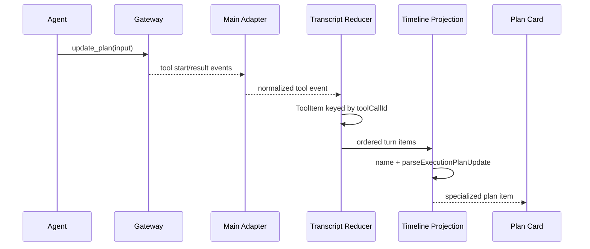

# OpenClaw Execution Plan UI 实现说明

> 文件名保留 `implementation-plan` 以兼容旧链接；计划展示能力已经实现。本文依据 `v2026.8.12` 说明当前契约、数据流、降级行为和维护要求。

## 1. 功能定位

OpenClaw 的 `update_plan` 工具用于在执行过程中声明和更新工作步骤。JustDo 不把它展示成普通 JSON 工具调用，而是投影成常显、有序、可读的进度卡。每次更新都保留为独立时间线项，因此用户既能看到当前计划，也能回看计划如何变化。

该 UI 是对结构化工具事件的显示增强，不是新的任务调度器：计划状态由 Agent 通过 `update_plan` 提交，Renderer 不自行推断或写回步骤完成状态。

## 2. 共享数据契约

契约位于 `src/shared/openclaw/executionPlan.ts`：

```ts
type ExecutionPlanStepStatus = 'pending' | 'in_progress' | 'completed';

interface ExecutionPlanStep {
  step: string;
  status: ExecutionPlanStepStatus;
}

interface ExecutionPlanUpdate {
  explanation?: string;
  plan: ExecutionPlanStep[];
}
```

`parseExecutionPlanUpdate(candidate)` 是 Main/Renderer 均可安全使用的纯解析边界。有效输入必须满足：

- candidate 是非数组对象；
- `plan` 是非空数组；
- 每项是对象，`step` 是 trim 后非空字符串；
- status 只能是三个明确值；
- 整个计划最多一个 `in_progress`；
- `explanation` 缺省或为字符串；空白 explanation 会被省略。

任一字段不合法时整体返回 `null`，不做部分接受，避免卡片显示一个与 Agent 原始输入不同的“修复后计划”。

## 3. 端到端数据流



Main 仍把它作为正常 OpenClaw 工具事件处理；专用显示发生在 Renderer 投影层。这样 Gateway 协议、权限、日志和终态处理不需要为 UI 卡片增加旁路。

## 4. 实时投影

`model/project-turn-items.ts` 检查工具名（不区分大小写）是否为 `update_plan`，并再次用共享 parser 验证 input。合法调用保持为独立 timeline item；多个更新不会互相覆盖。

`components/active-turn-timeline.ts` 负责卡片：

- 标题与区域 `aria-label` 使用 i18n；
- 显示已完成步骤数；
- explanation 存在时显示说明；
- 步骤按输入顺序显示；
- pending、in progress、completed 使用不同视觉与本地化文本；
- 计划卡不藏在普通工具 disclosure 中。

卡片不依赖工具 result 才出现。只要合法输入已到达，就能在执行中立即显示；之后工具完成只改变过程状态，不重新解释计划内容。

## 5. 历史恢复

`model/project-history-timeline.ts` 对历史中的每个工具调用执行同样的名称判断与 parser。每个有效 `update_plan` 都恢复为独立项，保证重启应用或切换会话后仍能看到计划演进，而不只是最后一次计划。

历史恢复依赖 OpenClaw 返回工具输入。如果 SQLite fallback 只包含扁平消息文本，可能无法重建完整计划卡；这属于降级来源的信息边界，不应通过猜测自然语言列表来伪造计划。

## 6. 非法输入与兼容性

专用 parser 返回 `null` 时，调用必须继续作为普通 Tool item 显示。这样：

- 用户仍能检查原始输入和错误；
- Gateway 新增字段不会自动破坏已知字段，只要现有约束仍满足；
- 新 status 在 JustDo 明确支持前不会被错误映射；
- 多个 `in_progress` 不会形成自相矛盾的进度卡。

不要在组件内建立第二套宽松 parser。契约升级应先修改 `src/shared/openclaw/executionPlan.ts` 及其测试，再同步确认实时与历史投影。

## 7. 状态与视觉语义

| 状态          | 含义     | UI 要求                              |
| ------------- | -------- | ------------------------------------ |
| `pending`     | 尚未开始 | 不使用完成样式，保持可读文本         |
| `in_progress` | 当前步骤 | 整个计划最多一个，突出但不能只靠颜色 |
| `completed`   | 已完成   | 计入完成数，提供状态标签             |

步骤状态不等同于 Tool item 自身状态。一个 `update_plan` 工具调用可以已经 completed，而其中仍有 pending 步骤；前者表示提交计划的调用结束，后者表示 Agent 声明的工作进度。

## 8. 国际化与无障碍

现有卡片使用 `coworkExecutionPlanTitle`、完成计数和三个状态标签等 i18n 键。新增文案必须同时加入 `zh` 和 `en`。计划区域应有稳定的 accessible name，每个步骤必须能通过文本识别状态，不能只依靠对勾、圆点或颜色。

计划始终可见，因此不要求用户展开调试详情才能理解进度。普通工具输入输出仍可折叠，两种信息层级不应混用。

## 9. 测试覆盖

共享 parser 测试位于 `src/shared/openclaw/executionPlan.test.ts`，应覆盖：

- 合法 explanation 与三个状态；
- trim 后的步骤和 explanation；
- 非对象、空数组、非法 status、空 step；
- explanation 类型错误；
- 超过一个 `in_progress`；
- 输入对象不被意外修改。

Renderer 测试还应覆盖：

- 活动 timeline 中常显的有序计划卡；
- 每次合法更新独立保留；
- 历史恢复保留全部更新；
- malformed 输入回退普通工具；
- 完成计数、状态文本和 explanation；
- 与 thinking、content、其他工具的时间顺序。

相关测试位于 `active-turn-timeline.test.ts`、`project-turn-items.test.ts` 和 `project-history-timeline.test.ts`。

## 10. 维护约束

1. `update_plan` 仍是 OpenClaw 工具语义，JustDo 只负责展示。
2. 不从回答 Markdown、日志或工具 output 猜测计划。
3. 不在 Redux 新建 plan slice；计划属于具体 run 的 timeline。
4. 不只保存最后一次更新；审计需要完整演进顺序。
5. 特殊投影永远保留普通工具回退路径。
6. 契约变化必须同时验证实时和历史。

## 11. 后续可选增强

可在不改变协议的前提下增加步骤耗时、计划更新间差异提示或完成比例动画，但前提是数据来自已有事件且不会误导。交互式编辑、手工勾选或把计划提升为持久任务，都会改变产品语义，需要单独设计 IPC、持久化和权限，而不能塞进当前显示组件。

## 12. 代码证据地图

| 层                 | 入口                                                   | 责任                                        |
| ------------------ | ------------------------------------------------------ | ------------------------------------------- |
| Shared contract    | `src/shared/openclaw/executionPlan.ts`                 | payload 校验、状态归一、稳定结构            |
| Tool/event source  | OpenClaw adapter 与 tool stream                        | 识别结构化 plan update，不解析普通 Markdown |
| Live reducer       | chat `agent-event-reducer.ts`                          | 按 run/sequence 追加 plan 演进              |
| History projection | `project-history-timeline.ts`                          | 从持久 tool message 恢复 plan item          |
| Item pipeline      | `build-chat-items.ts`                                  | 特殊卡与通用 tool fallback                  |
| Tests              | `executionPlan.test.ts`、chat projection/reducer tests | 非法输入、实时/历史一致性                   |

## 13. Plan Identity 与版本演进

一条 plan update 属于具体 session/run/tool call；完整演进不能按“最后一个 plan”覆盖。相邻更新即使步骤文本相同，也可能代表状态变化。History 与 live 使用相同结构化 identity reconcile，终态后迟到旧 sequence 不得回滚 completed step。

## 14. 失败降级

| 失败                  | UI 行为                                                 |
| --------------------- | ------------------------------------------------------- |
| Payload 不是合法 plan | 显示普通 tool card，不让整个 transcript 失败            |
| 部分 step 字段非法    | 按 shared validator拒绝/归一整个契约，避免混合可信状态  |
| Live update 缺失      | history reload后恢复已有持久版本                        |
| History 特殊投影失败  | 保留原 tool summary/output                              |
| Run abort/error       | 冻结最后可信 plan并显示 run终态，不自动把剩余步骤标完成 |

## 15. UI 语义限制

完成比例只可由结构化 step status派生；不能按文本勾选符号或数组位置猜测。Plan 卡不是调度器，不发送隐式 command。折叠、展开、定位属于 UI state；用户手工改步骤将引入写权限、冲突与持久化语义，当前未实现。

## 16. 完成定义

实时和历史对同一 fixture产生等价 plan，非法 payload有通用回退，乱序/重复/terminal幂等，session切换不串线，状态文案有中英文与无障碍名称。任何 OpenClaw plan schema变化必须先更新 shared validator和补丁/capability证据，再改 UI。
