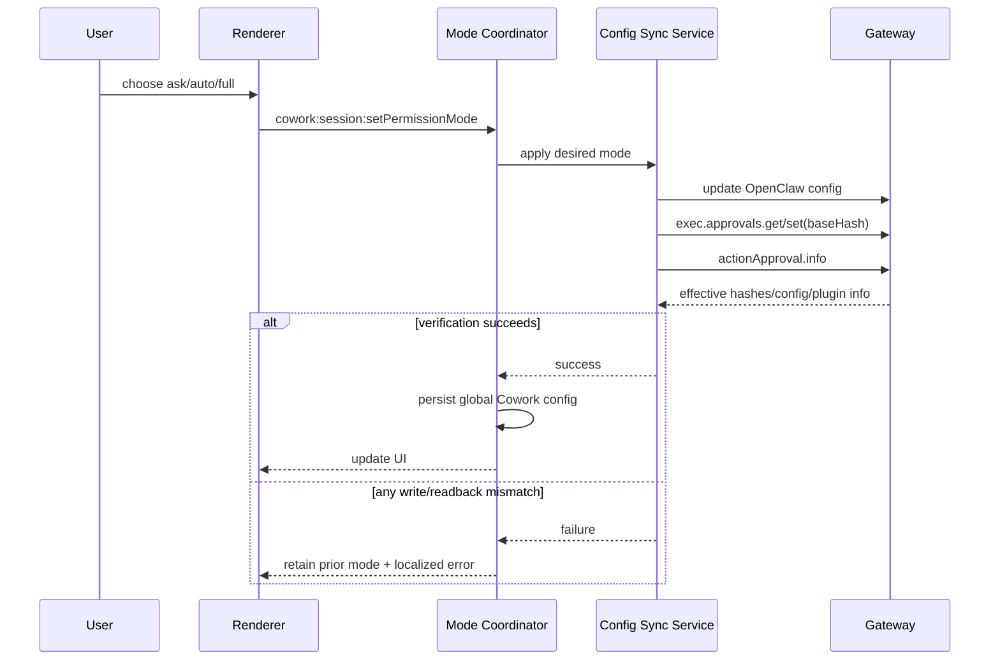
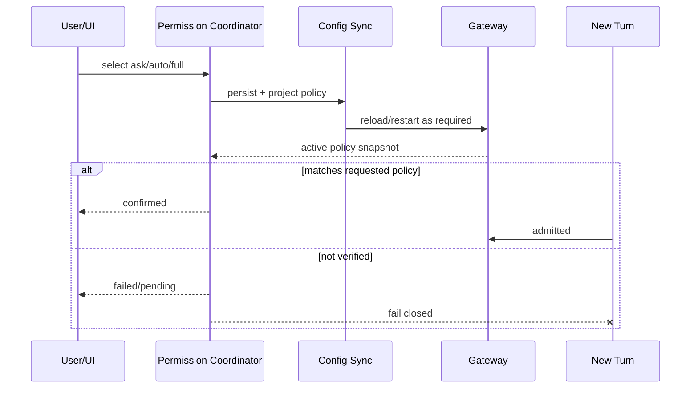

# OpenClaw 权限管理现状与整改基线

> 文件名保留 `remediation-plan` 以兼容旧链接。本文按 JustDo `v2026.8.12`、OpenClaw `v2026.7.1-2` 的代码重新核对，既记录已落地机制，也明确尚需真实运行时验收的部分。

## 1. 产品结论

普通 Cowork 对话使用三档应用级权限：

| 模式   | 主机命令                                     | 文件修改工具                                  | 用户体验               |
| ------ | -------------------------------------------- | --------------------------------------------- | ---------------------- |
| `ask`  | allowlist 命中可执行，其他请求人工批准       | `write`、`edit`、`apply_patch` 等请求人工批准 | 最保守                 |
| `auto` | OpenClaw reviewer 审核；不确定或失败时转人工 | 当前仍转人工批准                              | 自动处理明确低风险操作 |
| `full` | 无交互批准                                   | 无交互批准                                    | 高风险，UI 二次确认    |

`DEFAULT_PERMISSION_MODE` 是 `full`。该默认值是产品兼容选择，不代表安全推荐。用户切换模式后，值写入 Cowork 全局配置并热同步到 OpenClaw；所有普通会话使用最新有效策略。数据库中会话的 `permission_mode` 是兼容快照，不构成真正的 per-session runtime 隔离。

定时任务是不同信任域。AgentTurn cron 固定归属隐藏的 `justdo-scheduler` Agent，并使用 per-agent Full，以避免无人值守执行被交互审批永久阻塞。普通对话切换权限不能覆盖 scheduler Agent；反过来 scheduler 的 Full 也不能提升普通 Agent。

## 2. 为什么不是每会话权限

OpenClaw 的 exec approvals 和 trusted tool policy 是运行时策略，不是通过可伪造 session key 安全隔离的能力容器。如果 UI 把一个 session 标为 Full、另一个标为 Ask，但底层共享同一 Agent/Gateway 策略，显示就会产生虚假的安全承诺。

因此当前模型是：

- 用户从任一会话修改的是普通对话的全局模式；
- `SessionPermissionModeCoordinator` 负责串行化应用和回写，而非创建隔离 runtime；
- Renderer 会更新当前显示的模式，但安全事实来自 Gateway 回读；
- scheduler 通过明确的 per-agent 配置获得独立 Full 策略。

若未来要支持真正 per-session 权限，需要独立 Agent/运行时身份、不可伪造绑定和生命周期回收，不能只扩展 SQLite 字段。

## 3. 组件与职责

| 模块                                   | 责任                                                       |
| -------------------------------------- | ---------------------------------------------------------- |
| `src/shared/openclaw/approvals.ts`     | 三档常量、默认值、审批请求/响应契约                        |
| `openclawConfigSync.ts`                | 生成 OpenClaw config、普通 Agent 与 scheduler Agent 策略   |
| `openclawConfigSyncService.ts`         | 热同步、exec approvals 提交、runtime 回读验证、fail closed |
| `sessionPermissionModeCoordinator.ts`  | 串行权限切换、持久化和错误返回                             |
| `sessionExecApprovalGrants.ts`         | 会话执行审批 grant 的规范化和签名/匹配数据                 |
| `openclaw-extensions/action-approval/` | trusted file tool policy 与 approval transport             |
| `openclawRuntimeAdapter.ts`            | 接收 Gateway approval 请求和提交用户决定                   |
| `ExecApprovalModal.tsx`                | 展示 exec 动作详情并收集允许/拒绝                          |
| `PermissionModeSelector.tsx`           | 三档选择与 Full 二次确认                                   |

Renderer 不直接读写 OpenClaw 配置或 approvals 文件；所有操作经过最小 preload IPC。

## 4. 配置同步链路

同步不是“写文件后假定成功”。Restricted 模式要通过公开 `exec.approvals.get/set` 读取 `baseHash`、提交变更并核对响应/回读 hash、defaults 和 agent entries。`actionApproval.info` 用于确认扩展已加载、版本/模式和 Full Agent 匹配，是 readiness 的必要条件，但不应被文档或 UI 夸大为全部安全状态的密码学证明。

启动期间同步失败必须 fail closed：不能在期望 Ask/Auto 时让 Gateway 带旧 Full 策略继续启动。运行中的降权也必须串行完成，避免新 turn 在写入与验证窗口穿过旧权限。

## 5. Exec 权限映射

`resolvePermissionPolicy` 将产品模式映射到 OpenClaw exec approvals。核心方向是：

- Ask/Auto 限制文件工具在 workspace 范围内；Full 取消该 workspace-only 限制；
- Ask 使用 allowlist/人工审批；
- Auto 使用 reviewer，但 reviewer 不确定、不可用或失败时不可自动放行；
- Full 将 exec host 设置为 Gateway、关闭 ask，并允许完整执行。

映射细节必须以 `openclawConfigSync.ts` 与目标 OpenClaw schema 为准。不要在 Renderer 复制 security/ask/askFallback 枚举，因为上游字段升级会导致两套定义漂移。

## 6. 文件工具审批

真实文件工具不是 shell exec，不能只靠 exec approvals 覆盖。JustDo 的 action-approval 扩展通过 OpenClaw 公共 `registerTrustedToolPolicy` 注册 before-tool policy，并使用插件 approval transport 请求桌面用户决定。

当前行为：

- Ask：文件修改请求人工审批；
- Auto：文件修改暂时也降级为人工审批，不把不完整的自动 reviewer 当成允许；
- Full：trusted policy 直接允许；
- 只信任可验证的 JustDo ancestry，不能仅凭 tool 名或 session key；
- 用户交互审批不采用普通短超时，等待期间 run 被安全挂起。

补丁 `022`–`025` 为可信 JustDo 审批补齐持久 lifetime、run suspension、隐藏恢复和 stop/failure 收口。它们不改变 cron 或其他原生 channel 的上游超时语义。

## 7. 审批请求生命周期

审批请求包含 request id、session/run/tool 身份、动作摘要和安全展示字段。Renderer 只显示必要信息，不显示原始凭证、完整环境变量或可能含秘密的对象。

状态机要求：

1. Gateway 创建 approval record；
2. Main 验证来源与 session/run 绑定后广播；
3. Renderer 显示单一 modal；
4. 用户允许或拒绝，经 IPC 返回 Main；
5. Adapter 将决定提交 Gateway；
6. run 恢复、停止或失败时审批记录确定性收口；
7. 重复响应、窗口销毁和迟到响应不得重复执行工具。

不能把关闭窗口默认解释为允许。应用退出、run abort 或 Gateway generation 变化时应拒绝/取消并清理等待者。

## 8. Scheduler 隔离

AgentTurn 定时任务由 `justdo-scheduler` Agent 执行，配置中显式设置其 exec/fs 与 host approvals 为 Full。原因是任务可能在用户不看屏幕时运行，交互审批不可完成。

安全边界：

- scheduler Agent 隐藏于普通 Agent 选择；
- cron 归属同步会把托管任务迁移/校正到 scheduler；
- Ask/Auto 下普通 Agent 使用原生 cron add/update/remove/run 时仍需一次性人工审批；
- 任务类型转换和归属校正失败时，不应让错归属的启用任务继续无人值守执行；
- scheduler Full 是显式风险，任务创建 UI 和权限说明必须让用户理解。

三档权限并不覆盖 Browser、消息、MCP、Marketplace 或第三方插件的全部独立权限。相关能力必须继续遵守各自 OpenClaw policy 与 JustDo 产品确认流程。

## 9. 已落地的整改

- minimal config 后续同步会重新合并 exec、workspaceOnly、permission adapter 和插件 allow/deny 保护；
- 不再创建私有 `permission-policy.json`，也不直接篡改 `exec-approvals.json`；
- approvals 使用公开 Gateway API 与 `baseHash` 并做回读核验；
- sync/verify 失败统一 fail closed；
- action-approval 通过公共 trusted-tool-policy 与 transport 接入；
- Auto 文件修改保守回退人工 Ask；
- Full 在 UI 需要二次确认；
- UI 不展示 desired/effective snapshot 等内部实现噪声，只展示产品模式和可操作错误；
- scheduler Agent 与普通 Agent 的权限配置隔离；
- 启动与周期 cron 归属同步具备分页/校正路径；
- 交互审批的挂起、恢复、stop/failure 生命周期由版本补丁和测试约束。

## 10. 仍需持续验收的事项

代码测试不能替代打包 runtime 的真实行为。每次 OpenClaw/扩展升级至少执行：

- Ask 下真实 `write`、`edit`、`apply_patch`：允许、拒绝、长时间等待、停止；
- Auto 下 exec reviewer 允许/转人工/失败，不得 fail open；
- Full 下 shell 与文件工具不弹审批，切回 Ask 后立即生效；
- Gateway 重启时 pending approval 不重复执行；
- 多窗口/重复响应只能消费一次；
- scheduler AgentTurn 无 UI 也能执行，普通 Agent 不继承其 Full；
- Ask/Auto 下原生 cron 变更请求一次审批；
- 错归属启用任务在迁移失败时禁用或明确失败；
- packaged Windows/macOS/Linux runtime 能加载 action-approval 扩展与 022–025 补丁。

## 11. 威胁模型与非目标

本机制防止 Agent 在未获相应策略授权时执行高风险本地主机/文件操作，并防止 UI 模式与 Gateway 有效策略静默漂移。它不提供：

- OS 用户之间的强隔离；
- 对恶意本地管理员的防护；
- 第三方工具所有网络/数据行为的统一沙箱；
- 仅靠 session key 的安全身份；
- Full 模式下的风险消除。

Renderer 已被攻陷时，preload 最小 IPC 和 Main/Gateway 校验仍应阻止伪造 approval 直接执行，但当前 Electron 安全配置的其他边界详见 `../architecture/11-security-model.md`。

## 12. 变更规则

1. 新模式或策略字段先定义共享契约，再更新 config sync、回读验证、UI 和中英文 i18n。
2. 不直接编辑 OpenClaw 安装产物；上游缺口通过版本化、可移除 patch 处理。
3. 任何自动允许路径都必须证明来源、动作、run 和有效策略，失败默认拒绝/询问。
4. 不把 SQLite 快照当 runtime 权限真源。
5. 权限降级、Gateway restart 与 turn admission 必须有竞态测试。
6. 新工具必须明确归入 exec、trusted file policy 或独立权限域，不能因未识别而自动允许。

## 13. 验收结论

当前三档模式、公开 approvals 同步、trusted 文件审批和 scheduler 隔离已经在代码层形成完整架构。功能是否可发布仍依赖对应 OpenClaw 版本的 packaged-runtime smoke；尤其是真实文件工具审批与长等待恢复不能只凭 mock 测试宣布通过。未来若上游提供等价、可验证的持久审批生命周期，应优先删除 022–025 补丁并回归公共能力。

## 14. Admission 时间线

设置写入 SQLite、config 文件写成功、Gateway 进程 running 和 active policy匹配是四个不同阶段。UI success 与新 turn admission 只能依赖最后的验证结果。

## 15. Grant Scope 与清理

Session grant绑定 permission kind、Gateway session key/request identity和有限生命周期。Stop、terminal、delete、disconnect/restart与应用 shutdown都必须清理 pending/grant；重复 resolve幂等。Exec 与 plugin request分别验证，文件 action approval还需动作/路径 policy，不能用“本 session 已允许一次命令”批准任意插件或文件写入。

## 16. 失败矩阵

| 故障                      | 安全结果                                              |
| ------------------------- | ----------------------------------------------------- |
| Config write失败          | 保留旧有效policy，UI报错，新turn不得按新选择进入      |
| Gateway apply/reload失败  | 不宣告切换完成，active policy不匹配则阻断             |
| Approval UI消失/窗口关闭  | pending不自动allow；由取消/超时/shutdown收敛          |
| Duplicate/late resolve    | 按request终态幂等拒绝，不转移给新request              |
| Session owner不匹配       | 拒绝并脱敏记录，不使用全局fallback                    |
| Scheduler遇到交互approval | 受管policy应预防；无法安全执行则失败/禁用，不永久等待 |

## 17. 证据与测试地图

`src/main/openclaw/permissions/sessionPermissionModeCoordinator.ts` 验证模式切换与active policy；`sessionExecApprovalGrants.ts` 管session grant；shared approvals定义公开契约；Main approval IPC转发请求/resolve/snapshot；相关 `*.test.ts` 覆盖queue、失败、cleanup和owner。补丁022–025的具体分工以当前patch README/manifest为准。

## 18. 变更完成条件

新增工具必须登记风险域、默认模式行为、交互/无人值守策略、请求identity、超时/cleanup、日志脱敏和packaged runtime测试。只新增一个 approval modal或 config enum不算完成；必须证明真实Gateway执行在未批准时被阻止、批准后仅允许目标动作。
