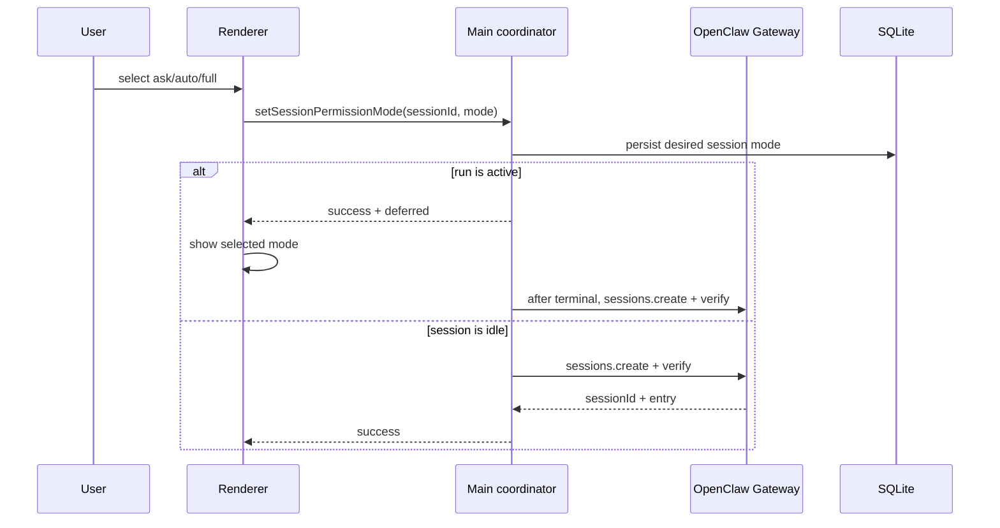

# OpenClaw 会话权限管理

> 文件名保留 `remediation-plan` 以兼容旧链接。本文按 JustDo `v2026.8.27` 和 OpenClaw `v2026.8.2` 维护。

## 1. 结论

OpenClaw v2026.8.2 已提供原生的会话级 `permissionMode` 和 `sessionRoot`。JustDo 的三档产品模式继续有效，但实现必须映射到这个原生模型，而不是修改全局 `tools.exec.mode`、修改 Agent workspace，或用自定义插件再次拦截文件工具。

| JustDo | OpenClaw session mode | 文件范围               | 命令审核                           |
| ------ | --------------------- | ---------------------- | ---------------------------------- |
| `ask`  | `guarded`             | 仅 `sessionRoot`       | allowlist 快速通过，其余由用户批准 |
| `auto` | `workspace`           | 仅 `sessionRoot`       | LLM 审核，无法决定时回退用户批准   |
| `full` | `full`                | 不限制到 `sessionRoot` | 不需要审批                         |

OpenClaw 还支持 `read-only`，但 JustDo 当前没有对应的第四档产品模式。不要把 `ask` 映射成 `read-only`，因为 Ask 仍允许任务目录内的文件修改。

`DEFAULT_PERMISSION_MODE` 仍是 `full`，只表示新会话的产品默认值，不是推荐安全级别。打开既有会话后，选择器显示并修改该会话自己的模式；关闭会话后，选择器修改新会话默认值。

## 2. 权威状态

权限状态分为三层，职责不可混用：

- OpenClaw session entry 中的 `permissionMode` 与规范化 `sessionRoot` 是当前 run 的执行时权威。
- `cowork_sessions.permission_mode` 和 `cwd` 是用户期望状态的耐久产品投影，用于恢复 UI、延迟切换并在每次 turn 前重新声明。
- `cowork_config.permission_mode` 只作为新会话默认值。

每次初始发送、继续发送和斜杠命令发送前，Main 都调用幂等的 `sessions.create({ key, cwd, permissionMode })`。v2026.8.2 会创建、采用或更新同 key 的 session entry。JustDo 必须回读并核对 `sessionId`、`entry.permissionMode` 和 `entry.sessionRoot`；任何字段缺失或不匹配都阻止发送。显式切换若发生在空闲期会立即执行同一同步；若当前 run 活跃，则先保存期望值并在终态后台应用。

既有本地会话不需要单独迁移。它们在下一次发送或模式切换时按当前 SQLite 投影写入原生 session entry。项目约束禁止为旧 JustDo runtime patch 形状增加原地兼容逻辑。

## 3. 数据流

同一会话的显式切换由 `SessionPermissionModeCoordinator` 串行化。SQLite 必须先保存用户选择，之后才允许修改 Gateway；因此数据库失败不会产生需要恢复的“旧原生模式”。活跃 run 不禁用选择器，也不改变该 run 已捕获的权限边界；coordinator 记录待应用会话，在 `complete/sessionStopped/error` 信号后再次确认 run 已不活跃，再读取最新 SQLite 值同步。即时同步失败同样保留期望值为 pending，不回滚旧值。

发送前 `OpenClawRuntimeAdapter.prepareSession` 再执行同一幂等写入与验证，因此 UI 之外的合法 Main 调用也不能绕过 session 权限准备。Renderer 不能提交初始会话的可信 `permissionMode`；Main 从持久化的新会话默认值创建 session。

## 4. 全局配置与 Host approvals

原生 session mode 是主路径，但无显式 session mode 的 OpenClaw 调用仍需要安全兜底。因此生成的全局配置包含：

- `tools.exec.mode: "ask"`；
- `tools.fs.workspaceOnly: true`；
- `tools.sessions.visibility` 来自“设置 → 配置”的会话访问范围，默认 `"tree"`；
- host approval defaults 为 `allowlist` / `on-miss` / `deny`。

exec、fs 与 host approval fallback 不随会话权限选择器切换。v2026.8.2 把 session tool 的隐式可见范围扩展为同一 Agent 的全部 session；JustDo 用显式设置覆盖该默认值，初始采用 `tree`，用户也可选择 `self/agent/all`。修改新会话默认权限只写 `cowork_config`，不会重载 Gateway；修改会话访问范围则通过 `agentRuntimeSettings:v1` 同步全局配置。这样多个会话可以同时使用不同执行权限，也不会因一个会话切换 Full 而短暂提升其他会话。

OpenClaw 对非 Full session mode 继续应用 host approval file 的限制；显式 `full` 是需要 `operator.admin` 的原生例外。JustDo Gateway client 具备该 scope。普通 session 仍通过 `exec.approval.*` 展示与解决人工审批，且“本会话允许相同命令”的 grant 只绑定对应 session 和命令身份。

权限审批等待时限保存在 `agentRuntimeSettings:v1.approvals.timeoutMinutes`，可选无限、10、20、30、60 分钟，默认 30 分钟。设置通过受管 Gateway 环境注入原生 exec 与 plugin approval request/wait，包括 CLI native tool、native hook relay 和计划任务变更审批；无限使用显式 no-expiry sentinel，Gateway 的分段 timer 只负责唤醒复检，不会自动拒绝。变更需要 Gateway 重启；Main 使用原生 `gateway.suspend.prepare` 作为 restart admission 屏障，活动任务未结束或屏障不可用时持续延迟，不会因等待过久强制中断任务，设置只影响后续创建的审批。

## 5. Scheduler

无人值守 `justdo-scheduler` Agent 仍是独立信任域：per-agent exec/fs 与 host approval entry 固定为 Full，避免定时任务永久等待桌面审批。普通会话的 session mode 不修改 scheduler；scheduler 的配置也不提升普通会话。

三档会话权限只约束 OpenClaw 管理的文件与 exec 工具。Browser、MCP、Marketplace、第三方插件和消息渠道仍遵守各自 policy。通用 `plugin.approval.*` transport 保留，但不能把第三方插件批准等同于 exec 批准。

## 6. 已删除的旧实现

以下实现与 v2026.8.2 原生模型冲突，已彻底移除：

- 把 UI 选择投影到全局 `tools.exec.mode` / `tools.fs.workspaceOnly`；
- 每个 turn 修改 Agent workspace 的 admission 逻辑；
- 将旧 session `permission_mode` 解释为无执行意义的兼容快照；
- 清空当前会话时强制把默认权限重置为 Full。

## 7. Fail-closed 规则

- `sessions.create` 失败、无 `sessionId`、mode 不匹配或 root 不匹配：不发送 turn。
- SQLite 保存失败：不修改 Gateway，也不更新 Renderer 选择。
- 空闲期原生同步失败：SQLite 保留用户期望值并标记待应用；发送前仍需严格同步成功，否则不发送 turn。
- 全局 fallback 或 scheduler 隔离的 active config 回读失败：config sync 按现有流程停止 Gateway。
- approval UI 关闭、run 停止、Gateway generation 改变或重复/迟到响应：不得解释为允许。
- 活跃 run 期间允许切换；当前 run 保持已有边界，新值在终态后台应用，并在下一 turn 前再次强制核对。

## 8. 测试与验收

自动测试至少覆盖：

- `ask -> guarded`、`auto -> workspace`、`full -> full` 的精确映射；
- session root/mode 回读验证及不匹配拒绝；
- 相同模式仍重放、同 session 切换串行、运行中延迟应用、同步失败不恢复旧值；
- 审批等待时限的默认值、枚举校验、原生环境注入和无限等待展示；
- turn 在 session 准备期间停止或被新 turn 取代时不误发；
- 新会话忽略 Renderer 伪造的 mode，并采用 Main 的默认值；
- 旧扩展目录与 config registration 清理；
- 全局 fallback 和 scheduler Full 的 active runtime 验证。

每次 OpenClaw 升级还应对真实 packaged runtime 做 smoke：

1. Ask 在任务目录内读写、命令 allowlist 与人工允许/拒绝。
2. Auto 的 LLM 允许、拒绝、转人工和 reviewer 失败路径。
3. Ask/Auto 对目录逃逸、symlink 逃逸和外部绝对路径的拒绝。
4. Full 的外部文件与命令，以及切回 Ask 后下一 turn 立即收紧。
5. 两个并存会话采用不同模式时互不影响。
6. Gateway 重启后既有会话在下一 turn 正确恢复 mode/root。
7. scheduler 无 UI 运行且普通会话不继承其 Full。

## 9. 变更规则

1. 新权限模式先核对 OpenClaw 的 session protocol 与 core mapping，再更新 shared 映射、Main、preload、Renderer、中英文 i18n 和测试。
2. 不在 Renderer 复制 `security` / `ask` 策略，也不以 session key 自行模拟授权。
3. 不为 OpenClaw 已有的 session 文件策略再增加 before-tool 插件。
4. 新工具必须明确属于 native session permission、exec approval、plugin approval 或独立权限域；未知能力不得默认允许。
5. Full 的 UI 二次确认必须保留；任何自动允许路径均需明确 owner、scope 和失败行为。
