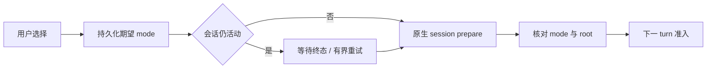

# 会话权限：保存、应用与执行准入

权限链路已使用 OpenClaw 原生 session permissionMode/sessionRoot。本文保留旧文件名，但按当前 coordinator 与发送流程说明，不再作为历史 remediation 待办。

## 1. 用户选择对应什么

| 产品模式 | 原生模式  | 范围                     |
| -------- | --------- | ------------------------ |
| ask      | guarded   | 原生受保护执行与审批     |
| auto     | workspace | 工作区策略及原生自动审查 |
| full     | full      | 当前会话的完整权限语义   |

三种模式都属于当前 session。默认值只影响新会话；不能因为一个会话选 full 就改全局 tools.exec.mode。全局仍保持 restricted fallback。

## 2. 保存和应用是两个时点

用户切换权限后先将期望值写入 cowork_sessions。会话空闲时立即准备原生 session 并回读核对；仍有运行时先记录 pending，终态后重试应用。UI 可以显示已保存但待应用，不能把它描述成旧 run 已立即换权限。

SessionPermissionModeCoordinator 按 session 串行，而非全局阻塞所有任务。失败保留待应用状态，不擅自恢复旧期望；prepareSessionForRun 必须严格成功才允许下一次发送。

## 3. 工作目录是权限的一部分

sessionRoot 来自产品任务 cwd，并规范化验证。变更项目路径、模型或恢复旧会话时仍需准备，不能只比较模式字符串。原生身份与 root 不匹配就拒绝发送，不能用修改助手角色 workspace 代替任务权限。

## 4. 与其他控制面的关系

计划模式限制当前规划工作流，automation-permission 控制定时任务变更，session visibility 控制跨会话访问，MXC 控制工具进程隔离。它们各自生效，不因 permissionMode 显示 full 就全部关闭。

原生 exec/plugin approval 有独立 pending、期限和 decision 集合。Main 验证响应属于有效请求；关弹窗、页面卸载、断线不表示允许。session grant 在原生终态/停止/删除语义中清理。

## 5. 拒绝和延迟如何反馈

| 情况             | 行为                         |
| ---------------- | ---------------------------- |
| 保存失败         | 返回失败，不显示已保存       |
| 旧 run 仍活动    | 待应用；发送准备不能绕过     |
| Gateway 无法核对 | 保留期望并拒绝新 turn        |
| 用户快速连续切换 | 串行收敛到最终持久期望       |
| 已删除会话的重试 | 清 pending/timer，不重建会话 |

## 6. 代码与测试

主入口是 `src/main/openclaw/permissions/sessionPermissionModeCoordinator.ts`，发送由 Cowork handler/Router 复用，合约位于 shared/openclaw。测试应覆盖活动期间变更、失败重试、快速切换、删除与新 turn 同步，而不是只断言生成的 JSON 有某字段。
