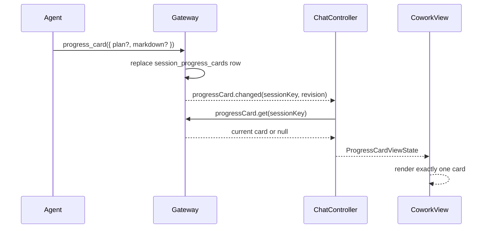

# OpenClaw Progress Card UI

JustDo 使用 OpenClaw v2026.8.2 的会话级 `progress_card` 作为复杂任务进度的唯一真实来源。卡片不属于消息 transcript，Renderer 不从 Tool input、历史消息或兼容期 plan stream 重建当前状态。

## 状态流

- Gateway Hello 必须声明 `progressCard.get` 后才读取。
- 切换会话、重连或 revision 变化时重新读取；延迟响应不能覆盖新会话。
- Renderer 仅保留最多 100 个会话的 LRU 内存缓存，OpenClaw 每个 Agent 的 SQLite 是持久化权威。
- revision 变化、断线或权威读取失败时立即移除旧卡，不把过期内容继续显示为实时进度。
- 完成后的自动隐藏和用户关闭都是 Renderer 本地显示状态，不调用 `progressCard.put`，因此仍可从标题栏重新查看 Gateway 保存的最近一张卡片。

## 显示

- 卡片绝对定位在消息区右上方，不参与 Flex 布局，不压缩消息区，也不占用输入框上方空间；窄窗口下使用消息区内可用宽度。
- 打开子任务、文件预览或 Subagent 抽屉不会改变进度卡的展开状态；折叠与隐藏始终由用户控制。
- 执行中默认显示并展开。用户手动隐藏后，普通 revision 更新不会反复打扰；上一张卡片完成后出现的新任务会重新显示。
- 进度刚完成时短暂显示完成结果，然后自动隐藏。恢复会话时，已经完成的卡片默认隐藏。
- 标题栏的进度按钮始终反映最近一张卡片的状态，用户可用它重新打开或隐藏悬浮卡。
- 步骤依据卡片更新时间所属的 run 显示运行、等待继续、暂停、失败或停止；run 正常结束但计划未全部完成时显示“等待继续”，不会推断为计划完成。只有 Gateway 卡片中的全部步骤明确完成后才显示“已完成”并自动隐藏。
- Markdown 使用单独启用的 `<progress value max>` 清洗策略；模型内容中的进度条只保留 `value` 与 `max`，无障碍名称由 Renderer 可信地注入。
- 消息时间线中的 `progress_card` 只显示一行更新回执，避免和唯一实时卡重复。

## 历史边界

OpenClaw v2026.8.2 的 Gateway 只提供每个会话最新的进度卡，没有 revision 历史查询接口。因此标题栏可恢复的是当前会话最近一张卡片，不从 Tool input 或 transcript 重建更早的卡片。若未来需要完整历史，应由 OpenClaw 提供权威的 `progressCard.list` 或等价接口。
