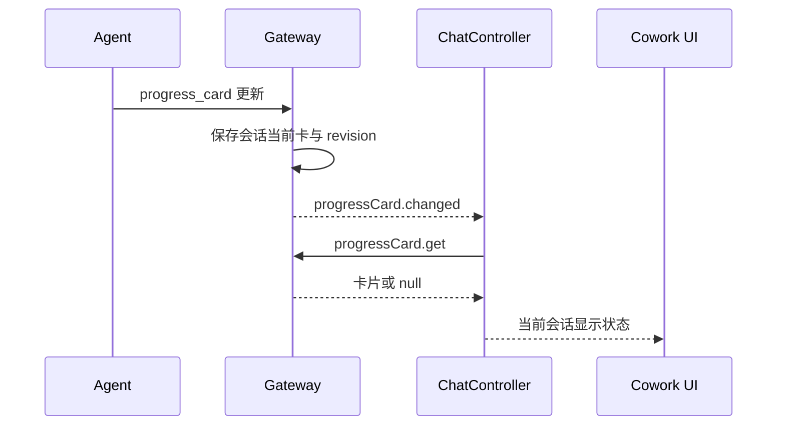

# 任务进度卡：原生状态与本地显示

进度卡使用 OpenClaw 会话级 progress_card。它不是一条消息，也不是 Renderer 从工具或历史推导出的计划；当前卡片的原生持久状态与用户是否展开它分别管理。

## 1. 更新流程

Gateway Hello 必须声明读取能力，才发起查询。切换会话、重连和 revision 更新触发读取；迟到响应要与当前 session/generation 匹配。

## 2. 过期状态如何处理

Renderer 只保留有界 LRU 内存投影，当前上限 100 个会话，持久权威仍在原生 Agent SQLite。revision 变化、断线或权威查询失败时移除旧实时卡，不能继续标为最新进度。

原生返回 null 表示当前无卡，不能从上一条 tool input 重建。完成隐藏与用户关闭是本地显示状态，不调用 put 删除原生内容；用户可通过会话入口重新查看最近卡片。

## 3. UI 行为

当前卡在消息区独立展示，不进入 transcript、搜索结果或导出消息。计划条目与 Markdown 来自原生卡片，按同一内容安全边界渲染；卡片不能遮挡主要输入或在后台任务更新时抢当前会话。

卡片完成不等于整个会话完成，运行状态仍看主运行、子任务与 Goal。用户关闭卡片也不暂停 Agent。

## 4. 与其他计划能力的区别

PresentPlan 是需要用户审核的交互并带持久计划 artifact；Goal 是原生目标及预算；progress_card 是执行中的状态说明。三者不能通过统一一个“计划 JSON”互相替代。

## 5. 维护与回归

代码位于 chat-controller-progress 及相关 UI/共享 progressCard 合约。验证无能力声明、null 卡、连续 revision、跨会话迟到响应、断线、失败读取、用户关闭和重新打开。不得新增 Main 消息缓存或扫描历史的兼容恢复逻辑。
