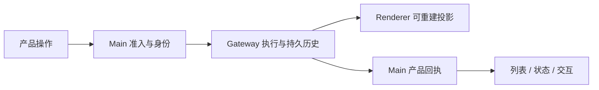

# 薄前端改造：现行状态与防回退约束

核心改造已落地，文件名保留旧链接。本文列出现在必须维持的产品行为，以及新增功能时最容易重新引入双重权威的地方。完整原则见[薄前端设计](../architecture/13-pure-frontend-design.md)。

## 1. 已形成的链路

用户操作经产品 admission 后交给原生 runtime。Renderer 直接消费原生聊天历史与实时事件，Main 保存产品会话、回执、权限和交互协调。SQLite 不再存 cowork_messages，Redux 不挂载 transcript slice。

## 2. 各领域的现状

| 领域      | 已采用路径                         | 不应恢复的旧做法             |
| --------- | ---------------------------------- | ---------------------------- |
| 聊天      | 原生 history + live reducer        | Main/Redux 消息副本          |
| Subagent  | tasks.list/get/event               | 自建 FIFO/join/announce 调度 |
| Goal      | 原生目标 + 产品 continuation phase | 折叠预算状态或本地认定完成   |
| Skill     | skills.status/update               | 扫目录认定资格               |
| Extension | 原生 inventory 与管理 API          | 从 plugins.entries 猜运行态  |
| 协作      | 原生 sessions_send + 产品成员准入  | 第二套正文投递引擎           |
| cron      | 原生调度 + 产品收件箱              | Renderer 定时器负责执行      |

## 3. 保留的产品逻辑不是回退

产品 run receipt、结果 readAt、成员关系、计划文件和执行快照都是有独立用户意义的数据。它们可以持久化，但必须有身份、更新、恢复和删除语义，不能顺手加入消息正文。

权限准备、配置同步、文件授权和桌面生命周期仍留 Main。薄前端不等于让 Renderer 绕过 Main 直接调用任意原生管理方法。

## 4. 失败时的处理

原生事实不可用时显示错误或未知，保留最后可信投影；不能生成成功状态。写请求超时不盲目重发。重连依靠查询和 generation 对账，停止依靠原生取消确认和 terminal fence。

## 5. 后续修改的验收

新增能力先查公开 Gateway/Plugin API，缺口才评估窄补丁。控制器拆文件保留入口状态所有权和实时访问器，不各建 current session。补丁只接受当前精确形态，从 pristine 重建，不为旧 revision 增加就地兼容。

验证会话切换、断线、重复事件、终态、部分删除及配置失败；真实模型验证与协议测试分别报告。不能以减少文件大小或 UI 正常显示替代所有权审查。
