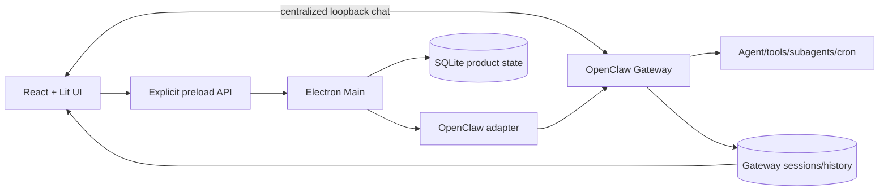

# OpenClaw Thin Frontend 架构状态

> 文件名保留历史上的 `refactor-plan`，但薄前端重构已完成。本文按 `v2026.8.12` 重新说明所有权边界、当前实现和防回退规则。

## 1. 核心定义

“Thin Frontend”不是指 Renderer 代码少，而是指 JustDo 不复制 OpenClaw 的执行语义。Gateway 决定 Agent 如何执行、工具如何调用、Subagent 如何调度、Cron 如何运行以及历史包含什么；JustDo 将这些能力包装成桌面产品，负责配置、权限交互、持久 UI 投影和操作系统生命周期。

## 2. 所有权矩阵

| 领域     | OpenClaw 所有                       | JustDo 所有                            |
| -------- | ----------------------------------- | -------------------------------------- |
| 对话执行 | run、event、tool、abort、history    | 输入体验、timeline 投影、窗口状态      |
| 模型     | Provider 调用与运行语义             | Provider 配置 UI、模型选择与校验       |
| Subagent | spawn、registry、调度、delivery     | 设置 UI、父子会话浏览和持久产品索引    |
| Skills   | 运行时解析与执行                    | 内置资源、导入/安装/启停 UX            |
| Cron     | schedule、run、session、delivery    | 任务编辑、SQLite 结果收件箱、通知      |
| 权限     | exec approvals、trusted tool policy | 三档产品模式、桌面审批交互、同步验证   |
| 持久化   | session transcript、run facts       | Cowork 元数据、UI cache、read receipts |
| 生命周期 | Gateway 协议                        | spawn/restart/stop、托盘、打包资源     |

SQLite 不是执行历史真源，也不再缓存聊天正文。它只保存 Cowork 会话索引、标题等产品元数据和 scheduled result receipt，不能用一条本地记录推断 Gateway run 一定发生或已经完成。

## 3. 进程边界

Renderer 是浏览器环境；Electron/OS/SQLite 能力只能通过 `window.electron`，不得导入 Node、Electron Main、文件系统或 SQLite。聊天是受控例外：Renderer 用 preload 提供的 port/token 通过集中式 client 直连 loopback Gateway。Preload 使用 `contextBridge` 暴露小型、显式 API；Main 仍负责 IPC 校验、数据库、系统 API、OpenClaw 生命周期和产品协议适配。

共享目录只能放纯 TypeScript 契约和工具函数，不能读取 `process.env` 或依赖 DOM/Electron。该约束使 Gateway 协议、IPC payload 和 Renderer 类型可以复用，而不会把权限带入浏览器。

## 4. Chat 的薄前端实现

聊天使用 `src/renderer/libs/openclaw-chat/` 的 Lit `<justdo-chat>`。Main 的 `openclawRuntimeAdapter.ts` 只归一化产品生命周期、Goal 和审批事件；Renderer 的 `GatewayClient`/`ChatController` 直接处理 loopback 聊天订阅与 history，reducer 构建可重建 transcript。两条消费路径必须保持 session/run identity 语义一致，但 Main 不复制消息内容。关键不变量：

- session/run/lifecycle/sequence 决定事件归属；
- Gateway 历史可在本地 cache 过期时重建显示；
- thinking、tool、content 和 terminal 是显示投影，不是新的执行状态机；
- SQLite 不参与聊天正文或流式状态恢复；
- Gateway restart 不要求重启 Renderer。

如果 Renderer 开始解析工具输出文本来判断 run 状态，或 Main 根据最后一条 SQLite 消息决定 Gateway 是否完成，就说明边界正在回退。

## 5. Adapter 应该做什么

Adapter 可以：

- 建立/维护 Gateway 连接；
- 调用公开 RPC；
- 将版本相关 payload 映射成稳定共享事件；
- 绑定本地 session id 与 Gateway session key；
- 处理断线、重连、终态和历史协调；
- 暴露运行时能力探测。

Adapter 不应该：

- 重新实现模型循环、工具选择或 cron 调度；
- 根据产品 UI 文本猜测 Gateway 状态；
- 持有与 SQLite 冲突的第二套业务数据库；
- 把所有 Main 功能不断堆入一个巨型类；
- 为单个组件泄漏 OpenClaw 内部、易变的原始对象。

复杂领域应委托给 `subagentGateway.ts`、history reconciler、config sync、scheduler service 等专门模块。

## 6. 配置与运行时生命周期

`openclawEngineManager.ts` 管理 bundled/host runtime、端口、进程 generation、重启和日志。`openclawConfigSync.ts` 生成 JustDo 托管配置，`openclawConfigSyncService.ts` 处理运行中同步和验证。

配置写入不能等同于运行时已经采用。权限等高风险配置需要 Gateway 回读；需要环境变量或进程级网络配置的变化必须创建新 generation。Renderer 只展示产品状态，不承担 spawn 或配置文件合并。

## 7. Skills、MCP 和 Marketplace

OpenClaw skill API 是技能元数据和运行状态的权威。`openclawSkillFiles.ts` 只负责用户导入技能文件的提取、复制和删除，不能成为技能 registry。

MCP、hooks、extensions 和 Marketplace 属于 JustDo 的插件产品面，但执行语义仍由 OpenClaw。当前 Marketplace service 默认 provider 列表为空；不能仅因存在 adapter 接口就宣称已经接入远程市场。

Runtime patch 位于 `scripts/patches/v2026.8.1/`，只补齐锁定上游仍缺失的九项产品能力。每个 patch 必须有版本锚点、幂等测试、职责说明和可删除条件；不得重做上游原生 task/history/approval/compaction，也不得塞入只属于 JustDo UI 的产品规则。

## 8. Scheduled Tasks

Gateway cron 是任务定义、调度、运行和外部 delivery 的权威。JustDo `CronJobService` 负责 API 映射和轮询；`ScheduledTaskResultSyncService` 将有限的 run 投影写入 SQLite，提供持久未读结果收件箱。

“in-app result”不是伪造的 OpenClaw delivery channel。删除本地 receipt 也不等于删除 cron run 事实。运行详情通过 Gateway session history 打开，不把 cron session 转成普通可编辑 Cowork 会话。

## 9. Subagent

Subagent 的 admission、并发、父子关系、运行和 completion delivery 均由 OpenClaw 与版本补丁负责。JustDo 设置页写入 `agents.defaults.subagents` 的受支持子集，UI 通过 Gateway 的结构化 `subagents` 工具/registry projection 读取状态。

不要建立本地 Subagent executor。SQLite `agents` 或 Cowork 消息只能服务产品显示，不能替代 native child registry。

## 10. 当前已完成状态

- Renderer 通过 preload 访问 Electron/OS 能力和 Gateway 连接信息；聊天 controller 受控直连 loopback Gateway；
- OpenClaw Gateway 是聊天、历史、技能运行、Subagent 和 cron 的执行权威；
- Chat 使用规范化 transcript 与 Gateway 历史协调；
- SQLite 职责限定为产品持久化、cache 和 receipts；
- runtime lifecycle/config/network/permissions 位于 Main；
- OpenClaw 缺口集中在版本化 patch 目录并有能力清单；
- scheduled results、计划卡和 thinking 都作为投影实现，没有伪造 Gateway 概念。

## 11. 维护风险信号

代码评审发现以下任一情况应停止并重新审查所有权：

- 新 Redux slice 长期复制 Gateway run 状态且没有 reconcile；
- SQLite 字段参与决定是否重试、完成或发送工具；
- Renderer 根据日志/工具输出字符串推断结构化结果；
- Preload 暴露通用 `invoke(channel, payload)` 或任意文件访问；
- Adapter 开始实现 Agent policy，而不是协议兼容；
- Runtime patch 引入 UI 业务规则或没有删除条件；
- 本地 synthetic channel/skill/subagent 与 OpenClaw 同名但语义不同；
- Gateway 历史无法重建 UI，必须依赖一次运行期内存才能显示。

## 12. 变更决策流程

新增执行能力时按顺序判断：

1. OpenClaw 是否已有公开 Gateway API 或配置；
2. 是否只需在 Adapter 规范化现有事件；
3. 是否属于 JustDo 产品投影/持久 read model；
4. 若上游确有缺口，能否提交上游；
5. 只有版本内无法等待时，才添加范围最小的 runtime patch。

架构变更应同步更新 `02-architecture.md`、`04-cowork-system.md`、`05-agent-engine.md` 或对应领域文档。

## 13. 回归验收

- 删除/破坏本地消息 cache 后，Gateway 历史仍能重建对话；
- Gateway 重启和重连后 Renderer 不需重启，迟到事件不串 run；
- cron 和 Subagent 状态来自 Gateway，SQLite 只提供 UI 投影；
- Renderer bundle 不包含 Node/Electron privileged imports；
- IPC payload 在 Main 校验，错误不会泄漏秘密；
- OpenClaw 升级后所有保留 patch 通过安装、幂等和能力测试；
- 新特殊 UI 投影失败时能回退到普通工具/消息显示。

薄前端的验收不是文件数量，而是事实只有一个执行权威、其他状态都能解释其来源并可被重新协调。

## 14. 当前残留与允许复杂度

Renderer 中保留复杂 chat reducer、history window、scroll controller、Markdown/Mermaid、搜索、modal和optimistic tail是有意设计；它们属于展示复杂度。需要持续警惕的是通用 `store`/network 能力面、组件内协议shape修补、以本地boolean替代Gateway runtime status，以及未明确失效的长期cache。

## 15. Query/Command/Event 恢复模型

| 类型             | 断线/刷新后的恢复                                      |
| ---------------- | ------------------------------------------------------ |
| Query            | 重新请求权威快照，拒绝旧 generation结果                |
| Command          | 依赖幂等键或查询确认，不能盲目自动重放有副作用动作     |
| Event            | 重新订阅后用query/history补缺口，按domain/sequence去重 |
| Optimistic UI    | 被command结果或权威query确认/回滚                      |
| Product metadata | 从SQLite读取，再与runtime事实组合                      |

## 16. 代码审查证据

- Renderer import graph不得包含 `electron`、`fs`、`path`、SQLite或child process。
- Preload只暴露语义方法，不暴露任意 channel；声明与实现同步。
- Gateway payload在Main/shared或集中式Renderer chat gateway层normalize，展示组件不读取未知内部字段。
- Redux只挂载六个现有slice；局部timeline不伪装成第二runtime store。
- cron、skill、history、subagent刷新后都能从其权威API重建。

## 17. 新功能落点示例

会话颜色/折叠属于产品UI；存SQLite或本地设置。新的tool lifecycle字段属于Gateway/adapter契约；UI只投影。全局文件搜索需要Main安全文件服务，不属于Renderer `fetch`。模型执行重试属于OpenClaw request loop，不能在React effect中重发整个turn。

## 18. 完成定义

历史文件名保留 `refactor-plan`，但当前薄前端迁移基线已落地。后续变更完成时需证明owner唯一、重连可重建、IPC最小、危险输入Main验证、special projection可回退，并在capability matrix标记任何新增patch。单纯减少Renderer代码行数不是目标。
