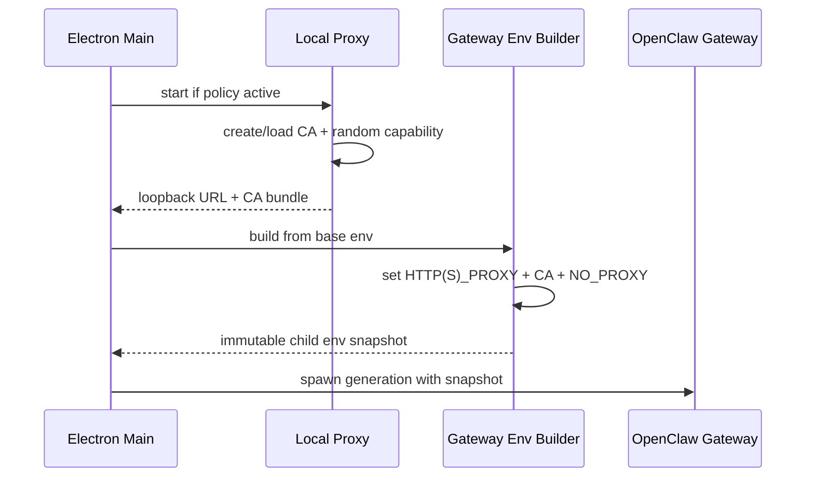

# Outbound Header Proxy 架构、实现与风险

> 本文按 `v2026.8.12` 当前代码重新审计。历史上的作用域隔离、CONNECT 选择性拦截、本地 capability、上游代理和关闭顺序问题已大体完成整改；PAC 多候选、SOCKS、任意客户端强制代理与完整热重载仍不是现有能力。

## 1. 功能目的

OpenClaw Gateway、其支持的 tool 子进程，以及显式 opt-in 的 OpenClaw one-shot CLI 访问指定
远端 URL 时，JustDo 可以注入一组共享校验 Header。当前 memory search/index CLI 会 opt-in，
使查询和重建索引产生的 embedding 请求与 Gateway 请求使用同一 URL policy。典型用途是让远端
服务识别来自本地 Agent 环境的授权请求。

真正的授权必须由远端服务验证 Header 并拒绝缺失/无效值。本地代理只是注入机制，不是防火墙，也不能约束主动忽略代理环境的网络程序。

明确不在数据面内：

- Electron Renderer 的普通网络请求；
- Electron Main 的更新、配置同步等请求；
- Gateway 进程树及显式 opt-in CLI 之外的其他程序；
- 不匹配 URL 白名单的请求 Header 注入。

Main 中少量确需相同 Header 的确定性调用，应在调用点基于白名单显式注入，不得通过全局 `fetch` monkey patch。

## 2. 安全不变量

1. 只有 Gateway generation 和显式 opt-in 的受管 CLI 获得本地 proxy URL、CA 和 capability。
2. 未认证的 loopback 客户端不能使用代理。
3. 未命中完整 URL 白名单时绝不注入业务 Header。
4. `Proxy-Authorization` 只用于本地/上游代理，不转发给目标服务。
5. Header 值、代理密码、capability 和 CA 私钥不进入日志。
6. Main/Renderer 的全局 `process.env` 和 Chromium 网络栈不被修改。
7. 并发请求使用独立 request context 与 headers。
8. 普通 loopback 保持 direct，不因 LiteLLM 或 Header Proxy 被整体劫持。

## 3. 当前组件

| 组件              | 代码                                                            | 职责                                             |
| ----------------- | --------------------------------------------------------------- | ------------------------------------------------ |
| 配置解析          | `src/main/core/outboundHeaderPolicyConfig.ts`、`systemProxy.ts` | 白名单、Header 名、系统/自定义代理与 bypass      |
| 本地代理          | `src/main/core/outboundHeaderProxy.ts`                          | 认证、CONNECT 判别、MITM/raw tunnel、注入        |
| OpenClaw 环境     | `src/main/core/gatewayNetworkEnvironment.ts`                    | 为 Gateway/opt-in CLI 生成 proxy/CA/NO_PROXY env |
| Runtime lifecycle | `openclawEngineManager.ts` / `main.ts`                          | 先起代理、再 spawn Gateway；退出时反序停止       |
| 用户值来源        | outbound header user-info 文件/cache                            | 只按允许的 headerNames 读取值                    |

`OutboundHeaderProxy` 使用 `http-mitm-proxy`，并针对库的连接错误和内部行为做有限适配。依赖私有 hook 是维护风险，升级库时必须跑真实 TLS 集成测试。

## 4. 启动与环境隔离

策略未启用或白名单为空时 `start()` 返回 null。启用时代理绑定 loopback 随机端口，在用户数据目录创建 CA，并为当前 generation 生成 32 字节随机 base64url capability。Gateway proxy URL 使用 Basic auth 携带 capability。

环境只传给 Gateway/后代和显式 opt-in CLI，不写回 Main `process.env`。当前 memory search/index
opt-in，memory status 保持普通继承环境。CA bundle 通过 Node、Python 等常见环境变量进入受支持
客户端；客户端是否遵循这些变量仍需能力矩阵验证。

## 5. 请求处理

### 5.1 HTTP

明文 HTTP 请求必须提供本地 Proxy-Authorization。代理验证后移除凭证、解析绝对 URL、选择上游路径，再按完整 URL 匹配白名单。只有匹配时才复制业务 Header 到该请求的 upstream headers。

### 5.2 HTTPS CONNECT

CONNECT 首先验证 capability 和 `host:port`。连接建立后读取首个 tunnel 数据包，区分 HTTP/TLS：

- origin 是拦截候选时交给 MITM 路径；
- 非候选 origin 使用 raw tunnel，不生成站点证书、不解密内容；
- 解密后的 request authority 必须与 CONNECT authority 和 forwarding target 一致；
- 最终仍按 scheme/host/port/path 的完整 URL 判断是否注入。

选择性 MITM 最细只能在 CONNECT 阶段按 origin 决定。某 origin 只要存在任一白名单 path，该 origin 的其他 path 也会经过本地 TLS 解密，但不会注入 Header。这是 HTTPS 协议边界，不能声称做到同 origin 的 path 级“不解密”。

### 5.3 Raw tunnel

非候选 HTTPS 保持端到端 TLS，只由本地代理转发 socket。它可能经过配置的上游 HTTP proxy，但本地看不到请求 path 或 header。CONNECT 解析失败、authority 不合法或 capability 失效时 fail closed。

## 6. URL 与 Header 策略

白名单是 base URL 集合，匹配必须规范化 scheme、hostname、port 和 path 边界，防止：

- `example.com.evil.test` 伪装 hostname；
- `/api2` 误匹配 `/api`；
- redirect 到不同 origin 后继续携带 Header；
- CONNECT host 与请求 Host 不一致；
- 用户 URL 凭证或 fragment 参与错误匹配。

Header 名只需满足 HTTP field-name 语法，不强制 `X-` 前缀。Header 值在注入前检查 CR/LF 等不安全字符。已有同名 header 采用大小写不敏感替换，不能同时存在两个大小写变体。

默认构造的代理会在请求时读取当前配置和用户值，使已有 interception origin 内的 path/value 变化可反映；但 `start()` 固化的候选 origin、CA、capability 和 Gateway env 不会自动扩展到全新 origin。生产级配置变更仍应受控重启 Gateway generation 与 proxy，不能把局部动态读取当完整热重载。

## 7. 本地 Capability

代理监听 loopback 仍不能假定只有 JustDo 可访问。同一用户的其他进程可以连接本地端口，因此每个 HTTP 请求或 CONNECT 必须携带随机 capability。

- 验证使用 constant-time 比较；
- 认证后从 headers 中消费 Proxy-Authorization；
- CONNECT 与解密后的请求通过 WeakMap 绑定 capability；
- rotation 会销毁已认证 tunnel，生成新 capability；
- stop 清空 capability、policy、headers 和 socket 集合。

Capability 是 generation scoped bearer secret。不能写日志、配置文件或 Renderer 状态。

## 8. 上游代理与 NO_PROXY

Gateway 到本地代理是第一跳；本地代理到目标或企业代理是第二跳。`buildGatewayEnvironment` 会：

- 保存父环境的 NO_PROXY 供第二跳判断；
- 从 Gateway 第一跳环境移除会与远端白名单冲突的 bypass，使匹配请求确实到达本地代理；
- 重新加入应用定义的普通 bypass/loopback；
- 对冲突记录脱敏告警，不泄漏认证。

固定上游 HTTP/HTTPS proxy 可用于普通请求和 CONNECT。PAC 的有序多候选、显式 DIRECT fallback、SOCKS 与复杂认证不能被单个 URL 完整表达，当前不应宣称支持。固定代理失败时也不能静默直连，除非配置语义明确允许。

## 9. 并发模型

原生产问题是多个并发请求只有部分携带 Header。当前实现针对主要共享状态风险采取：

- active policy/header snapshot 为只读；
- 每次请求独立计算 URL、upstream route 和 headers；
- 首次 TLS 证书初始化由补丁/测试约束并发行为；
- capability 不在普通 request completion 时旋转；
- 代理/环境生命周期与 Gateway generation 绑定。

排查类似问题应按三层证据：

1. 三个客户端请求是否都遵循 proxy env；
2. 代理是否看到三个 request id 且匹配同一规范化 URL；
3. echo server 是否收到三个 Header。

不能仅看最终服务端结果就认定是 Header 对象竞态。

## 10. 可观测性

允许记录：request id、origin、matched、注入 header 数、route 类型、耗时和错误类别。禁止记录完整 URL query（可能含 token）、Header 值、Proxy-Authorization、上游密码、capability 与 CA 私钥。

当前匹配日志包含随机 request id、origin 和 injectedHeaderCount。生产诊断还应关联 Gateway generation，但不能通过把 secret 写入 correlation id 达成。

## 11. 生命周期与关闭顺序

启动顺序必须是代理 ready → 构建 Gateway env → spawn Gateway。关闭顺序必须让依赖方先停止：

1. 停止接收新的 Agent 工作；
2. 停止 Gateway 及其 tool 子进程；
3. drain/cancel 剩余连接；
4. 关闭本地代理和认证 socket；
5. 清理内存中的 capability/header snapshot。

当前 `main.ts` 的受控退出先停止相关 runtime，再 `outboundHeaderProxy.stop()`。若未来允许 proxy restart，必须创建新的 Gateway generation；已运行子进程不会自动读取新环境变量。

## 12. 已实现与未实现

已实现：

- Gateway generation 与显式 opt-in CLI 的环境隔离；
- loopback capability；
- candidate origin 的选择性 MITM；
- 非候选 HTTPS raw tunnel；
- 完整 URL 匹配后注入；
- CONNECT/forward authority 校验；
- 上游 HTTP proxy 与 NO_PROXY 二跳处理；
- loopback 白名单排除；
- Header 安全值检查和日志脱敏；
- capability rotation/stop socket 清理；
- 并发、环境和策略单元测试。

未完整实现或不保证：

- 任意客户端强制遵循 proxy/CA env；
- PAC 多候选、SOCKS 和所有企业代理组合；
- 新 interception origin 无重启热加入；
- path 级 HTTPS 不解密；
- 把代理当网络访问控制/防火墙；
- 所有平台打包环境的 curl/Python/Node/MCP 客户端兼容。

## 13. 测试矩阵

- policy：URL 规范化、host/path 边界、默认端口、redirect、非法 header；
- auth：HTTP/CONNECT 缺 capability、错误/过期 capability、rotation；
- TLS：候选 MITM、非候选 raw tunnel、authority mismatch、CA trust；
- concurrency：同 origin 首次 3/100 并发、不同 origin、慢请求与 stop；
- upstream：direct、固定 HTTP/HTTPS proxy、NO_PROXY 冲突、代理失败；
- scope：Main fetch 与 Renderer 不被注入，Gateway 子进程及 memory search/index CLI 被注入；
- clients：Node fetch/https、curl、bundled Python、OpenClaw network tool；
- secrets：日志和错误不含 Header 值、密码、capability。

真实 HTTPS echo server 的打包 E2E 是最终验收，mock `http-mitm-proxy` 只能证明控制流。

## 14. 维护结论

当前实现已经把 Header 注入从全局 Electron 网络副作用收敛到 Gateway generation 和显式 opt-in
CLI，并对非候选 HTTPS 保持 raw tunnel。最重要的剩余工作不是继续增加隐式兼容，而是维护受支持
客户端/上游代理矩阵、为配置变化执行明确 generation restart，并在升级 `http-mitm-proxy` 时验证
私有 hook 与并发证书行为。

## 15. 请求判定矩阵

| 请求                | Host命中策略 | Capability有效 | 行为                              |
| ------------------- | ------------ | -------------- | --------------------------------- |
| HTTP absolute-form  | 是           | 是             | 转发并注入允许Header              |
| HTTPS CONNECT候选   | 是           | 是             | 进入受控MITM并在解密HTTP层注入    |
| HTTPS CONNECT非候选 | 否           | 任意           | raw tunnel，不解密、不注入        |
| Loopback Gateway    | 否/显式排除  | 任意           | 直连，避免代理递归                |
| 候选但capability错  | 是           | 否             | 拒绝/不注入，不能降级为无鉴权注入 |

Policy匹配必须基于规范化URL/host/port和明确规则；不能按字符串包含匹配。Header名称和值来自受管policy，禁止覆盖hop-by-hop/header安全保留项。

## 16. Generation 生命周期

代理配置在启动时读取，并为Gateway generation生成环境/capability。运行中改变策略不应让旧child继续持有新旧混合状态；Main通过显式Gateway restart形成新generation。关闭时先停止Gateway，再停止proxy，保证child不会向已关闭代理继续发请求。

## 17. 并发与证书风险

多个CONNECT可能并行触发证书生成/cache，必须按host稳定并避免重复写/竞态。升级 `http-mitm-proxy` 时检查依赖的私有hook、错误事件和socket cleanup。非候选raw tunnel路径是隐私/兼容关键：任何回归到全量MITM都会扩大证书信任和敏感流量暴露面。

## 18. 证据地图与完成条件

`src/main/core/outboundHeaderProxy.ts` 是数据面，`outboundHeaderPolicyConfig.ts` 读取策略，Main负责启动/停止与Gateway环境，相关tests覆盖HTTP/CONNECT/raw tunnel、NO_PROXY、capability、并发和日志脱敏。发布验收还需真实Node/curl/bundled Python/OpenClaw客户端经HTTPS echo验证；mock通过不能证明证书和packaged网络栈兼容。
