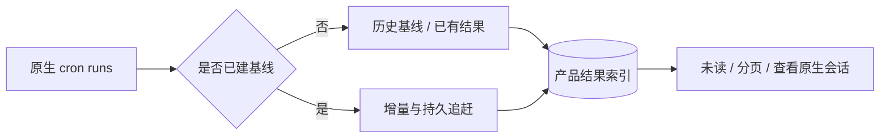

# 定时任务结果收件箱

结果收件箱已经实现。本文从用户结果和同步行为解释当前机制，数据结构与完整生命周期见[定时任务架构](../architecture/08-scheduled-tasks.md)。

## 1. 用户看到的结果

任务执行由 OpenClaw cron 负责，应用收件箱展示已观察到的运行、状态、摘要、未读与原生会话入口。它不是 delivery channel；任务没有外发到 IM 或 webhook，也可以在应用内查看。

暂停或删除 job 与删除某次结果是不同操作。失败运行也可产生需要查看的结果；读过结果不改变原生执行状态。

## 2. 第一次开启与日后更新

首次同步建立持久 baseline：读取最多 200 条全局历史，每任务保留最多 20 条作为已有记录，避免旧历史全部变未读。之后新观察结果按稳定 runId upsert，保留已有 readAt。

启动对账刷新最近窗口并按每任务 watermark 追赶离线期间运行。catch-up 位置持久化，分页失败不会把已读状态重置，也不会每次重启从头通知。

## 3. 打开详情

结果保存原生 session 定位信息，详情使用现有聊天历史。原生 artifact 缺失时显示不可用，不能把摘要扩写成完整对话或新建空 session 冒充原记录。

系统管理任务与普通任务的操作权限区分；外部或模型创建任务的 owner 保持原值，不因用户查看结果就被 main 接管。

## 4. 删除和重试

运行中结果不能直接删除。删除前阻止同 run 的并发同步写回，等待当前 reconcile，清理原生 artifact 后才删 receipt、写 tombstone。部分失败保留结果与清理进度供重试。

若首次删除完成但响应丢失，再次请求凭 tombstone 返回成功。内存 suppression 只防当前并发，跨重启防复活依赖持久删除标记。

## 5. 用户问题的定位

| 问题                 | 检查                                          |
| -------------------- | --------------------------------------------- |
| 任务运行过但没有结果 | 原生 run、baseline、job watermark 与 catch-up |
| 已读又变未读         | upsert 是否保留 readAt                        |
| 删除后再次出现       | 删除 barrier、cleanup 和 tombstone            |
| 详情为空/打不开      | 原生 session/artifact 是否仍存在              |
| 手动运行一直等       | 原生接收与完成是不同阶段                      |

## 6. 回归范围

覆盖首次历史不泛滥通知、超过一页的离线追赶、重启、重复 run、任务改名、原生记录缺失、删除失败及同步竞争。测试位置为 scheduledTaskResultSyncService、结果 Store 和 scheduledTask IPC；文档不沿用旧计划中的待实施状态。
