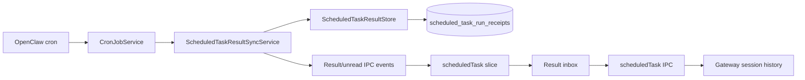

# Scheduled Task 应用内结果实现说明

> 文件名保留 `implementation-plan` 以兼容历史链接。功能已经实现；本文依据 JustDo `v2026.8.27` 与 OpenClaw `v2026.8.1` 说明当前数据模型、同步算法、读回执和删除边界。

## 1. 产品语义

每次定时任务运行都应在应用内可发现，无需配置 IM 或 webhook。应用内保留是 JustDo 的本地 read model，不是 OpenClaw delivery channel：

- OpenClaw delivery 仍为 `none`、`announce`、`webhook` 等外部语义；
- JustDo 无论外部投递是否配置或成功，都可以保存 run receipt；
- 执行状态与外部投递状态分别展示；
- 运行详情从 Gateway session history 打开，不复制成普通 Cowork 会话。

| 运行结果 | 外部投递    | 应用内结果                 |
| -------- | ----------- | -------------------------- |
| success  | 未配置      | 保存                       |
| success  | 成功        | 保存并记录 delivery status |
| success  | 失败        | 保存并显示投递警告         |
| error    | 未尝试/失败 | 保存执行错误               |
| skipped  | 未尝试      | 保存跳过状态               |

## 2. 架构

OpenClaw 是任务定义与 run 事实权威；SQLite 只保存可分页、可标记已读的结果投影。同步服务可以纠正本地字段，但保留用户 read receipt。

## 3. 共享类型

`src/shared/scheduledTask/types.ts` 定义：

- `ScheduledTaskRun`：run id、task id、session id/key、status、summary、起止时间、duration、error、deliveryStatus、deliveryError；
- `ScheduledTaskRunWithName`：附带当前任务名；
- `ScheduledTaskResult`：再附带 `observedAt` 和 `readAt`；
- `ScheduledTaskResultPage`：results、cursor 与全局 unreadCount；
- result upsert、unread count 等事件 payload。

日期跨 IPC 使用 ISO 字符串；SQLite 内部使用整数毫秒。状态枚举由 scheduled-task constants 统一定义，不在 UI 自造字符串。

## 4. SQLite Read Model

`scheduled_task_run_receipts` 以 `run_id` 为主键，保存：

- task/session 身份；
- task name 快照；
- execution 与 delivery 字段；
- started/finished/duration；
- summary/error；
- observed、updated 与 `read_at`。

索引支持全局时间倒序、按 task 时间倒序和未读查询。`ScheduledTaskResultStore` 提供 upsert、分页、未读计数、markRead、markAllRead 和 delete。

Upsert 的关键规则是 read receipt 单调：已读结果被后续 reconcile 更新 summary/status 时不能重新变未读。running 首次出现不计未读；从 running 转为 terminal 时仅产生一次新未读。task name 纠正也不能覆盖已有的更有意义名称为 id 占位符。

## 5. 初次基线

首次启用结果收件箱时不能把全部历史瞬间标成新通知。同步服务：

- 全局最多导入最近 200 个 run；
- 每个 task 最多 20 个；
- 作为 baseline 写入但不发 new-unread 事件；
- 记录每个任务已经完成到的边界；
- 完成后发布当前 unread count 和 refresh。

基线是有界投影，不宣称复制 Gateway 全部历史。更老详情仍应由 Gateway 的 cron/session API 获取。

## 6. 增量同步与补漏

`ScheduledTaskResultSyncService` 与 `CronJobService` 配合：

- 正常轮询观察 job 的 `lastRunAtMs`；
- 本地已经完成到该时间且无 catch-up 时跳过无效查询；
- 启动或强制 reconcile 全局读取最近 100 个 run，用于修复映射；
- 单次 Gateway page 大小 50；
- 对落后任务分页 catch-up，并持久化边界/offset；
- 失败时恢复本批次前的 catch-up 状态，下次继续；
- 按时间正序 upsert，确保 running→terminal 和未读判断正确。

同步使用 single-flight。删除与同步之间有 barrier；被删除 run 在 cleanup 期间加入 suppression map，避免并发 reconcile 立刻把它重新插回。

## 7. IPC 与 Renderer

共享 channel 包括任务状态/run update，以及 result upsert、results refreshed、unread count changed 等。Main handlers 提供：

- 分页列出结果，可按 task 或 unread 过滤；
- 标记单个已读；
- 标记全部或某 task 已读；
- 删除一个 terminal result；
- 获取 run 对应的 Gateway session history。

每个 handler 校验 run id、query limit/cursor 和 task id。写操作完成后重新计算全局未读并通知 Renderer。Redux `scheduledTask` slice 保存当前 UI 需要的任务、run 与未读状态，但 SQLite 才是跨重启 read receipt 的权威。

## 8. 打开运行详情

Run session modal 通过 Main 请求原始 OpenClaw history，并复用 canonical chat projection。它不是 Cowork session：

- 不出现在普通会话列表；
- 不允许把 cron run 当作可继续编辑的普通聊天；
- session key/id 解析失败时显示明确错误；
- Gateway 历史暂不可用时不能用 receipt summary 冒充完整 transcript。

receipt 的 summary 用于列表预览，详细工具、thinking 和回答仍以 Gateway session 为准。

## 9. 已读语义

- 只有 terminal 结果参与未读计数；
- 打开或用户显式操作后调用 markRead；
- `read_at` 只从 null 变为时间，不因普通同步回退；
- markAllRead 可限定 task；
- 应用重启后 unread count 从 SQLite 恢复；
- 首次 baseline 不制造历史未读风暴。

Renderer 内的 Cowork `unreadSessionIds` 与此无关，不能复用为定时任务持久回执。

## 10. 删除语义与清理

删除的是 JustDo 应用内结果投影及其本地清理目标，不是 OpenClaw cron run 的事实。running result 禁止删除。删除流程必须：

1. 等待现有 sync；
2. 读取并验证 terminal receipt；
3. 执行与 session/artifact 相关的安全 cleanup；
4. 删除 receipt；
5. 更新 unread count；
6. 在整个操作期间抑制同 run 的 reconcile 回填。

`scheduled_task_result_cleanup` 保存需要跨进程恢复的清理状态。启动时要处理上次进程留下的开放记录，避免把崩溃中断误认为成功完成。

## 11. 托盘与进程生命周期

生产窗口关闭通常只是隐藏到托盘，Main、Gateway、cron 和轮询继续运行，因此结果仍可同步。真正退出应用会停止 scheduler polling 和托管 Gateway；JustDo 不承诺进程完全退出后本地 Gateway 仍执行任务。

恢复应用时先建立/恢复结果同步，再发布未读状态。Gateway 暂不可用时保留 SQLite 结果，不清空 read model；连接恢复后 reconcile。

## 12. 错误与一致性

- `cron.list` 成功不代表 run history 已同步，两个错误分别记录；
- delivery failure 不覆盖 execution success；
- task 被重命名后新同步可更新名称，但历史 run id 不变；
- task 删除后已有 receipt 仍可显示，catch-up 状态会清理；
- session mapping 暂时缺失时 receipt 仍保留，详情入口可稍后重试；
- 重复 run update 通过 run id upsert 幂等；
- Gateway 更正 run 字段时更新投影但保留 `read_at`。

## 13. 测试矩阵

| 层          | 关键测试                                                        |
| ----------- | --------------------------------------------------------------- |
| Store       | schema/upsert、running→terminal、已读保持、分页、删除           |
| Sync        | baseline 200/每 task 20、100 reconcile、分页 catch-up、失败恢复 |
| Concurrency | single-flight、delete barrier、suppression、防回填              |
| IPC         | 参数校验、mark read/all、delete、未读事件、history              |
| Renderer    | 收件箱分页、过滤、badge、详情、错误与 i18n                      |
| Integration | 窗口隐藏、Gateway 重连、外部 delivery success/failure           |

主要实现与测试位于 `src/main/scheduler/`、`src/main/data/scheduledTaskResultStore*`、`src/main/ipc/scheduledTask/`、`src/shared/scheduledTask/` 和 Renderer scheduled-task feature。

## 14. 维护约束

1. 不新增 `inApp` delivery mode 或 synthetic channel。
2. 不把 receipt 当 cron 定义/执行权威。
3. execution 与 external delivery 状态始终分开。
4. 同步修正不得重置用户已读。
5. 删除本地投影不得声称删除 Gateway 历史。
6. 新字段需同时更新共享类型、SQLite 兼容逻辑、store、IPC、Redux 和 UI。
7. 变更同步算法时更新 `08-scheduled-tasks.md` 与 `10-data-storage.md`。

## 15. 验收结论

应用内结果已是一个持久、可分页、可补漏且与外部 delivery 解耦的 read model。其正确性依赖 run-id 幂等、baseline 不制造旧未读、reconcile 保留 read receipt，以及详情始终回到 Gateway 历史。任何把它改造成 OpenClaw channel 或第二套 cron 数据库的方案都会破坏当前边界。

## 16. Receipt Identity 与更新规则

Receipt以Gateway run identity去重，并保存task/session关联、终态摘要、观察时间、readAt与cleanup投影。重复同步允许补充更新摘要/状态，但不得清除已有readAt。排序与cursor必须稳定；相同时间戳需要tie-breaker，分页插入不能重复或跳项。

## 17. Startup Baseline 算法

首次启用/首次成功同步记录已存在run为baseline，避免把全部历史制造成新未读。以后应用离线期间产生的run通过durable continuation/catch-up补入。一次失败不能推进越过失败页；重启从持久边界继续，不依赖进程内“已初始化”boolean。

## 18. 删除补偿流程

清理失败保留receipt和durable cleanup记录供重试。删除本地row后再尝试远端清理会失去关联证据，因此禁止。清理session tree必须验证目标属于scheduled run，不能接受Renderer传来的任意session key。

## 19. 并发场景

- Poll upsert与用户mark read并发：readAt优先保留。
- Delete与新一轮reconcile并发：cleanup/删除状态阻止旧run立即复活。
- Mark-all与分页加载并发：以持久边界/时间定义，不只修改当前页数组。
- Event通知先于首次list：UI仍执行主动query，event只做invalidate/增量。

## 20. 证据与完成条件

`scheduledTaskResultSyncService.ts`、`scheduledTaskResultStore.ts`及同名tests是核心证据；IPC、Redux、ResultInbox和RunSessionModal证明产品接入。变更需测试空库、历史baseline、多页离线catch-up、重复upsert、read preservation、delete失败/重试和应用重启。
