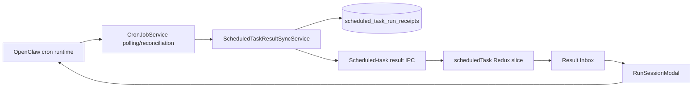

# Scheduled Task In-App Results Implementation Plan

Status: implemented

Baseline:

- JustDo: `v2026.8.10`
- OpenClaw Gateway: `v2026.6.11`
- Planning date: 2026-07-28

## Goal

Make every scheduled-task run discoverable inside the application without
requiring an external IM or webhook channel.

The product model is:

> A scheduled-task result is always retained in the application. External
> delivery is an optional additional notification mechanism.

The first implementation should add a durable scheduled-task result inbox with
unread state, result previews, and access to the existing Gateway-backed run
session. It must not implement a fake OpenClaw channel named `inApp`, and it
must not turn cron sessions into ordinary editable Cowork conversations.

## Current Behavior

The existing flow is:

```text
OpenClaw cron executes a job
  -> CronJobService polls cron.list every 60 seconds
  -> a changed lastRunAtMs triggers cron.runs for that job
  -> Main emits scheduledTask:runUpdate
  -> Renderer updates the in-memory scheduledTask Redux slice
  -> the user can open a task's run-history panel
  -> RunSessionModal reads the Gateway session directly
```

Important existing constraints:

- Closing the production window hides it to the tray. The Main process,
  Gateway, scheduler, and polling remain active.
- Explicitly quitting the application stops polling and stops the managed
  Gateway. No task is expected to execute after a true application exit.
- Gateway cron is authoritative for task definitions and execution.
- `ScheduledTaskRun` currently omits the `summary`, `deliveryStatus`, and
  `deliveryError` fields already returned by `cron.runs`.
- `RunSessionModal` renders a Gateway session directly and does not persist it
  as a Cowork session.
- Cron session-to-local-session bindings in
  `OpenClawChannelSessionSync` are memory-only.
- The existing Cowork `unreadSessionIds` array is renderer-only and is not a
  durable read receipt.
- The first cron polling pass establishes an in-memory baseline and deliberately
  does not emit run updates for previously completed runs.

## Product Decisions

### In-app storage is not a delivery channel

Keep OpenClaw delivery values (`none`, `announce`, `webhook`) dedicated to
external delivery. Do not send `channel: "inApp"` or register a synthetic
channel plugin.

Application retention is owned by JustDo Main and SQLite. It occurs regardless
of the task's external delivery configuration:

| Execution | External delivery | In-app result |
| --- | --- | --- |
| Success | Not configured | Saved |
| Success | Success | Saved |
| Success | Failure | Saved, with delivery warning |
| Failure | Not attempted | Saved, with execution error |
| Skipped | Not attempted | Saved, with skipped status |

Execution status and external delivery status must remain separate in the
domain model and UI.

### Use a dedicated result inbox

Add `任务` / `执行结果` tabs to the Scheduled Tasks view. Keep the task-management
tab as the default for the first release.

Do not insert cron sessions into the normal Cowork sidebar. Cron output is
read-only execution history, while Cowork sessions are interactive and have
different rename, delete, grouping, and Gateway-key lifecycle semantics.

The inbox should reuse the existing chat rendering path only when the user
opens the full result. The list itself should use the run summary as a preview.

### Durable unread semantics

A terminal run (`success`, `error`, or `skipped`) becomes unread when first
observed after the feature has been initialized. Opening a result marks that
result read. Provide a `全部已读` action.

Running entries are never unread. If a locally cached running entry later
becomes terminal, that transition creates the unread result.

The first application start after this feature is installed must not mark all
historical runs unread. The first synchronization imports a bounded recent
history as already read and records that initialization atomically. Runs first
observed after this baseline are unread.

## Scope

### Included

- Durable local result snapshots and read receipts.
- Online incremental synchronization using the existing Main polling loop.
- Startup/reconnect reconciliation for results missed by Renderer events.
- A paginated result inbox across tasks.
- Unread badge on the Scheduled Tasks sidebar entry.
- Result preview, execution status, external-delivery status, time, and
  duration.
- Opening the existing Gateway-backed run-session modal.
- Application toast for a newly observed terminal result while a renderer is
  available.
- Chinese and English UI strings.
- Schema, service, IPC, Redux, component, and architecture documentation tests.

### Excluded

- Running cron after a true application exit.
- OS service, daemon, login agent, or cloud scheduler support.
- Guaranteed catch-up execution of schedules missed while the machine or
  Gateway was offline.
- Native operating-system notifications. These can be added later using the
  same result-created event.
- External IM implementation.
- Persisting the complete Gateway transcript into `cowork_messages`.
- Replying to or continuing a cron result as a normal Cowork chat.
- Full-text result search and configurable retention policies.

## Proposed Architecture



Responsibilities:

| Component | Responsibility |
| --- | --- |
| OpenClaw Gateway | Task definitions, schedule execution, run logs, transcripts |
| `CronJobService` | Gateway RPC mapping and low-frequency change detection |
| Result sync service | Reconcile Gateway runs into durable local result snapshots |
| SQLite result store | Pagination, idempotent upsert, unread/read state |
| Scheduled-task IPC | Query results and mutate read state |
| Renderer | Present results, badge, toast, and full-session entry |

## Gateway Contract Verification

Implementation verification against bundled OpenClaw `v2026.6.11`:

- `cron.runs` entries have an optional native `runId`; JustDo uses it when
  present and otherwise uses `${jobId}:${runAtMs}`, with `${jobId}:${ts}` only
  for malformed legacy entries without `runAtMs`.
- The Gateway writes terminal `action: "finished"` projections and carries the
  execution start in `runAtMs`.
- `scope: "all"` is supported.
- Pagination is offset-based (`offset`, `nextOffset`, `hasMore`) with a maximum
  page size of 200.
- `summary`, `deliveryStatus`, and `deliveryError` are optional schema fields.
- Global run history survives independently of the current job list, so startup
  reconciliation can recover results for one-time or deleted jobs.

Before changing shared types, inspect the bundled OpenClaw `v2026.6.11`
`cron.runs` implementation or the live deferred schema and record the result in
the implementation PR.

Verify:

1. Whether a run entry has a native stable ID.
2. Whether `runAtMs` remains stable between running and terminal projections.
3. Whether `cron.runs` supports a global/all-jobs scope.
4. Whether pagination uses offset, cursor, or both.
5. Whether `summary`, `deliveryStatus`, and `deliveryError` are consistently
   present for terminal entries.
6. Whether one-time jobs remain in `cron.list` long enough for per-job
   reconciliation.

Preferred run identity:

1. Native Gateway run ID, if available and stable.
2. Otherwise `${jobId}:${runAtMs}`.
3. Use `${jobId}:${ts}` only as a compatibility fallback when `runAtMs` is
   absent.

Do not continue using completion timestamp alone if it causes one logical run
to receive different IDs while running and after completion.

If global run listing is supported, use it for startup/reconnect catch-up. If
not, use the per-task reconciliation algorithm defined below.

## Shared Domain Changes

Extend `src/shared/scheduledTask/types.ts`.

The Gateway-facing run model should retain all execution facts:

```ts
export interface ScheduledTaskRun {
  id: string;
  taskId: string;
  sessionId: string | null;
  sessionKey: string | null;
  status: TaskStatus;
  summary: string | null;
  startedAt: string;
  finishedAt: string | null;
  durationMs: number | null;
  error: string | null;
  deliveryStatus: string | null;
  deliveryError: string | null;
}
```

Add a separate application projection instead of putting read state on the
Gateway run:

```ts
export interface ScheduledTaskResult extends ScheduledTaskRun {
  taskName: string;
  observedAt: string;
  readAt: string | null;
}

export interface ScheduledTaskResultQuery {
  taskId?: string;
  unreadOnly?: boolean;
  limit?: number;
  cursor?: string;
}

export interface ScheduledTaskResultPage {
  results: ScheduledTaskResult[];
  nextCursor: string | null;
  unreadCount: number;
}
```

Use an opaque cursor derived by Main. Do not make Renderer depend on the SQL
pagination shape.

Update `mapGatewayRun()` so delivery-only failure handling does not discard the
delivery error:

- `status` represents agent/cron execution.
- `error` represents execution failure.
- `deliveryStatus` and `deliveryError` represent external delivery.
- A successful execution with failed delivery remains `status: "success"` and
  retains `deliveryError`.

Add mapping tests for absent/malformed timestamps and all combinations of
execution and delivery status.

## SQLite Design

Add a core table in `src/main/data/sqliteStore.ts`:

```sql
CREATE TABLE IF NOT EXISTS scheduled_task_run_receipts (
  run_id TEXT PRIMARY KEY,
  task_id TEXT NOT NULL,
  task_name TEXT NOT NULL,
  session_id TEXT,
  session_key TEXT,
  status TEXT NOT NULL,
  summary TEXT,
  error TEXT,
  delivery_status TEXT,
  delivery_error TEXT,
  started_at INTEGER NOT NULL,
  finished_at INTEGER,
  duration_ms INTEGER,
  observed_at INTEGER NOT NULL,
  read_at INTEGER,
  updated_at INTEGER NOT NULL
);

CREATE INDEX IF NOT EXISTS idx_scheduled_task_results_started
  ON scheduled_task_run_receipts(started_at DESC, run_id DESC);

CREATE INDEX IF NOT EXISTS idx_scheduled_task_results_task_started
  ON scheduled_task_run_receipts(task_id, started_at DESC, run_id DESC);

CREATE INDEX IF NOT EXISTS idx_scheduled_task_results_unread
  ON scheduled_task_run_receipts(read_at, started_at DESC)
  WHERE read_at IS NULL;
```

Do not add a foreign key to a task table: task definitions are owned by the
Gateway and there is no authoritative local task table.

Store the task-name snapshot so results remain understandable after a task is
renamed or deleted. A later run uses the current task name; historical snapshots
do not need retroactive renaming.

Use a dedicated store, for example:

```text
src/main/data/scheduledTaskResultStore.ts
```

Required operations:

- `upsertResult(result, options)`
- `listResults(query)`
- `getResult(runId)`
- `countUnread(taskId?)`
- `markRead(runId, readAt)`
- `markAllRead(readAt, taskId?)`
- `getLatestStartedAt(taskId)`
- `hasInitializedBaseline()`
- `initializeBaseline(results)`

Upsert rules:

- Preserve an existing non-null `read_at`.
- Update mutable run facts when a running record becomes terminal.
- Set `read_at = NULL` only on the first transition into a terminal state after
  baseline initialization.
- Reprocessing the same terminal run is idempotent and must not generate another
  unread event.
- `observed_at` is the first observation time and does not change on update.
- `updated_at` changes whenever the snapshot changes.

The baseline marker may use `kv`, but baseline import and marker creation must
be in one SQLite transaction. A crash must not produce a partially imported
history followed by an unread flood.

Update:

- `REQUIRED_TABLE_COLUMNS` only if the repository's compatibility policy
  requires validation for the new table.
- `docs/architecture/10-data-storage.md`.
- The core-table list in `AGENTS.md`.

Do not delete historical results automatically when a task is deleted. The
inbox should display a deleted-task indicator using its name snapshot. Explicit
result-retention controls are deferred.

## Result Synchronization Service

Create a Main-owned service, for example:

```text
src/main/scheduler/scheduledTaskResultSyncService.ts
```

Inject dependencies rather than importing global singletons:

```ts
interface ScheduledTaskResultSyncDeps {
  cronJobService: CronJobService;
  resultStore: ScheduledTaskResultStore;
  emitResultUpserted: (result: ScheduledTaskResult, isNewUnread: boolean) => void;
  emitUnreadCountChanged: (count: number) => void;
}
```

### Baseline synchronization

On the first run after feature installation:

1. List current jobs.
2. Fetch a bounded recent history. Start with at most 20 runs per task and at
   most 200 total imported results.
3. Map and deduplicate results.
4. Import all of them with `read_at` set to the baseline time.
5. Commit the import and initialized marker atomically.
6. Emit a result refresh with unread count zero.

Bounds must be constants with tests. Do not issue unbounded history queries.

### Normal startup/reconnect synchronization

For each task:

1. Read `job.state.lastRunAtMs`.
2. Compare it with the latest locally recorded run start for the task.
3. Skip the task when no newer run can exist.
4. When newer runs exist, page backward through `cron.runs`.
5. Stop once an already-recorded run or the local cursor is reached.
6. Apply a safety limit, initially 100 new runs per task per reconciliation.
7. Upsert oldest-to-newest so emitted events preserve chronology.

If Gateway supports global run listing, replace steps 1-5 with one paginated
global query, while keeping the same local upsert contract and safety bound.

### Live polling integration

Keep the existing 60-second Main polling interval. Do not add a Renderer timer
and do not poll per task on every interval.

Change the completion branch from:

```text
changed lastRunAtMs -> fetch one run -> emit transient RunUpdate
```

to:

```text
changed lastRunAtMs
  -> reconcile new runs for that task
  -> transactionally upsert local results
  -> emit only genuinely changed result projections
  -> emit unread count only when it changed
```

The scheduler itself does not depend on this polling. Gateway cron executes the
job; polling only discovers results for JustDo UI.

Preserve the existing `isCoworkBusy()` guard. On a skipped busy interval, the
next successful reconciliation must catch up all missed runs, not only the
latest one.

### Errors and recovery

- Gateway unavailable: retain the local inbox and retry on the next poll or
  ready event.
- SQLite failure: log with `[ScheduledTaskResultSync]`; do not mark Gateway jobs
  failed.
- Malformed run: skip that entry, log identifiers without result content, and
  continue other entries.
- Missing session: retain the summary and status; disable or fail gracefully
  when opening full details.
- Renderer unavailable or reloading: Main still persists results. Renderer
  reloads the page from IPC when ready.

Do not log raw summaries, prompts, transcripts, credentials, or delivery
targets.

## IPC and Preload

Add constants under `src/shared/scheduledTask/constants.ts`:

```ts
ListResults
MarkResultRead
MarkAllResultsRead
ResultUpserted
UnreadCountChanged
```

Suggested preload surface:

```ts
scheduledTasks: {
  // existing methods...
  listResults(query?: ScheduledTaskResultQuery): Promise<{
    success: boolean;
    page?: ScheduledTaskResultPage;
    error?: string;
  }>;
  markResultRead(runId: string): Promise<{
    success: boolean;
    result?: ScheduledTaskResult;
    unreadCount?: number;
    error?: string;
  }>;
  markAllResultsRead(taskId?: string): Promise<{
    success: boolean;
    unreadCount?: number;
    error?: string;
  }>;
  onResultUpserted(
    callback: (event: { result: ScheduledTaskResult; isNewUnread: boolean }) => void,
  ): () => void;
  onUnreadCountChanged(
    callback: (event: { unreadCount: number }) => void,
  ): () => void;
}
```

Validate at the Main boundary:

- Cap `limit` to 100.
- Treat an empty task ID as absent.
- Reject malformed cursors without exposing SQL details.
- Require a non-empty run ID for mark-read.

Update:

- `src/main/ipc/scheduledTask/handlers.ts`
- `src/main/preload.ts`
- `src/renderer/types/electron.d.ts`
- Handler and preload contract tests

Keep the existing run-history APIs for task-specific history and compatibility.
The new inbox API reads local durable projections.

## Renderer State

Extend the mounted `scheduledTask` slice; do not add another Redux slice.

Suggested state:

```ts
interface ScheduledTaskState {
  // existing fields...
  results: ScheduledTaskResult[];
  resultsNextCursor: string | null;
  resultsLoading: boolean;
  resultsInitialized: boolean;
  unreadResultCount: number;
  resultFilter: {
    taskId: string | null;
    unreadOnly: boolean;
  };
}
```

Required reducers:

- Replace first result page.
- Append a page with ID deduplication.
- Upsert an event result in descending chronological order.
- Set unread count from Main.
- Mark one result read optimistically, then reconcile the returned count.
- Mark all results read.
- Reset pagination when filters change.

Main/SQLite is authoritative for unread count. Do not derive the global count
only from the currently loaded page.

`scheduledTaskService.init()` should:

1. Register event listeners before the first query.
2. Load tasks as today.
3. Load the first result page.
4. Apply event upserts received during loading idempotently.

Only display a toast when `isNewUnread` is true. Use localized generic text such
as `定时任务“{name}”已完成` and do not place potentially sensitive summaries in
the toast.

## User Interface

### Sidebar

Add a compact count badge to the existing Scheduled Tasks button:

- Hide at zero.
- Display `99+` above 99.
- Keep the badge visible when the sidebar is expanded.
- If a future collapsed navigation mode displays this button, use a dot or
  accessible count label.
- Use an `aria-label` that includes the unread count.

### Scheduled Tasks view

Add top-level tabs:

- `任务`
- `执行结果`

Result inbox controls:

- Unread count.
- `仅看未读` toggle.
- Optional task filter using the current task list.
- `全部已读`.
- Refresh action that triggers reconciliation or reloads local results; it must
  not bypass Main by calling Gateway from Renderer.

Result card fields:

- Unread dot.
- Task-name snapshot.
- Start/finish time.
- Execution status.
- Duration.
- Summary preview, clamped to a small number of lines.
- Execution error preview when present.
- Separate external-delivery warning when `deliveryError` is present.
- `查看完整结果` when `sessionKey` or `sessionId` is available.

Opening a card:

1. Mark the result read immediately.
2. Open `RunSessionModal` with the recorded Gateway identifiers.
3. If session loading fails, keep the local summary/error visible and provide
   retry behavior.

For the first version, retain `RunSessionModal` instead of navigating into the
ordinary Cowork view.

### Create/edit form

Clarify the existing delivery section:

```text
结果保存
✓ 保存到应用内（始终开启）

外部通知
未配置 / 暂无可用渠道
```

The in-app row is informational, not a mutable `ScheduledTaskDelivery` field.
Existing external delivery configuration must continue to round-trip unchanged.

Add all user-visible strings to both `zh` and `en`.

## Implementation Sequence

### Phase 0: Contract confirmation

- Inspect the exact bundled Gateway run schema.
- Decide native/fallback run identity.
- Confirm global versus per-job reconciliation.
- Add findings to this document if they change the algorithm.

Exit condition: stable run identity and pagination behavior are documented.

### Phase 1: Domain mapping and persistence

- Extend shared run/result types.
- Preserve summary and delivery outcome in `mapGatewayRun()`.
- Add the SQLite table and result store.
- Implement baseline, upsert, pagination, and read operations.
- Update data-storage architecture documentation.

Exit condition: store tests prove idempotency, baseline behavior, and durable
read state across database reopen.

Suggested commit:

```text
feat(scheduledTask): persist in-app run results
```

### Phase 2: Synchronization and IPC

- Add the result synchronization service.
- Integrate it with initial Gateway readiness, reconnect, and live polling.
- Add query/read IPC methods and result/unread events.
- Extend preload and renderer declarations.
- Keep existing run-history behavior working.

Exit condition: Main tests prove that multiple runs missed between polls are
persisted exactly once and that first initialization creates no unread flood.

Suggested commit:

```text
feat(scheduledTask): synchronize durable run receipts
```

### Phase 3: Renderer inbox

- Extend the scheduled-task slice/service.
- Add Scheduled Tasks tabs and the paginated result feed.
- Add read/unread interactions and filters.
- Reuse `RunSessionModal`.
- Add the sidebar badge and application toast.
- Add bilingual strings.

Exit condition: a completed manual or scheduled run appears in the inbox,
increments the badge once, survives renderer reload, and becomes read when
opened.

Suggested commit:

```text
feat(ui): add scheduled task result inbox
```

### Phase 4: Hardening and documentation

- Test Gateway reconnect, application tray behavior, task deletion, renamed
  tasks, delivery-only failures, and missing transcripts.
- Update `docs/architecture/08-scheduled-tasks.md`.
- Update `docs/architecture/10-data-storage.md`.
- Update `AGENTS.md` core-table facts.
- Run the full validation suite.

Suggested commit:

```text
docs(scheduledTask): document in-app result flow
```

## Test Plan

### Unit tests

`cronJobService`:

- Maps `summary`.
- Separates execution error from delivery error.
- Produces a stable run ID.
- Handles missing and invalid numeric fields.
- Does not turn delivery failure into execution failure.

Result store:

- Creates and reads the schema on a fresh database.
- Opens an existing database without deleting user data.
- Imports the first baseline as read.
- Inserts a new terminal run as unread.
- Does not mark running entries unread.
- Marks a running-to-terminal transition unread once.
- Re-upserting a terminal run is idempotent.
- Preserves `read_at` when a snapshot is updated.
- Paginates deterministically when timestamps match.
- Filters by task and unread state.
- Marks one/all results read.
- Retains results after task deletion.

Sync service:

- Skips tasks whose `lastRunAtMs` has not advanced.
- Fetches all missed runs, not just the latest.
- Stops at the local cursor.
- Applies safety limits.
- Recovers after a skipped busy poll.
- Recovers after Gateway reconnect.
- Emits one new-unread event per logical run.
- Imports baseline without events/toasts.
- Continues when one malformed entry is encountered.

IPC:

- Validates limits, IDs, filters, and cursors.
- Returns unread count from the store.
- Does not expose internal SQL errors.

Redux/service:

- Deduplicates query results and live events.
- Keeps descending order.
- Uses Main's unread count.
- Resets pagination on filter change.
- Does not show duplicate toasts.

### Component tests

- Tab switching.
- Empty inbox state.
- Loading and pagination.
- Unread badge zero, normal count, and `99+`.
- Summary/error/delivery-warning presentation.
- Mark read and mark all read.
- Task and unread filters.
- Missing-session fallback.
- Chinese and English labels.

### Manual verification

1. Upgrade an existing profile with historical runs and confirm unread is zero.
2. Create a one-time task with no external delivery.
3. Close the window so the application remains in the tray.
4. Wait for completion and reopen the window.
5. Confirm exactly one unread result and one sidebar badge increment.
6. Open the result and confirm full Gateway history renders.
7. Restart the Renderer/application and confirm the result remains read.
8. Run a task that succeeds but has external-delivery failure; confirm execution
   is successful and delivery warning is separate.
9. Run a failing task; confirm the error remains available without a session.
10. Trigger more than one run between reconciliation cycles and confirm none is
    lost.
11. Rename and then delete a task; confirm old result snapshots remain legible.
12. Explicitly quit the application and confirm the managed Gateway stops; do
    not claim that local schedules continue while fully exited.

## Performance Requirements

- Do not add Renderer polling.
- Reuse the existing 60-second Main polling loop.
- In the unchanged case, perform only the existing `cron.list` request and
  cheap local cursor comparisons.
- Fetch `cron.runs` only for jobs whose run state advanced, or use one global
  incremental query if verified.
- Bound baseline import, per-task reconciliation, page size, and emitted event
  count.
- Use indexed SQL pagination; do not load all receipts to compute unread count.
- Avoid opening or reconciling full Gateway transcripts until the user requests
  a result.

The target idle cost is one small local Gateway list request per minute and no
result-history or transcript queries when nothing changed.

## Acceptance Criteria

- Every terminal run observed while JustDo is active, including tray mode, is
  durably represented in the result inbox.
- Results do not require an external channel.
- First upgrade does not create historical unread noise.
- Missed Renderer events and skipped polling intervals are recovered by Main
  reconciliation.
- Each logical run increments unread count at most once.
- Read state survives renderer reload and application restart.
- A successful execution remains successful when only external delivery fails.
- Existing task CRUD, manual run, run history, and session modal continue to
  work.
- No synthetic OpenClaw in-app channel is introduced.
- No raw result content or delivery target is added to logs.
- `npm run lint`, `npm run build`, and `npm test` pass.

## Follow-up Opportunities

After the inbox is stable:

- Native desktop notifications controlled by a user preference.
- Configurable result retention and cleanup.
- Search and aggregation by task/status/date.
- Exporting a result.
- Persisting selected full transcripts for offline reading.
- Stable Gateway push events replacing most live polling while retaining
  startup reconciliation.
- External IM and webhook delivery adapters.
