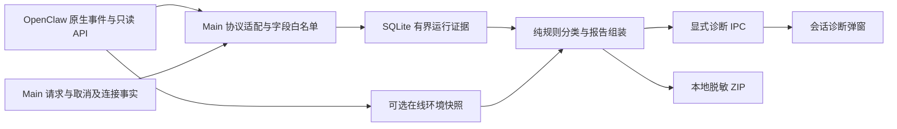

# 会话右键诊断：实施与验证计划

状态：首版实现及自动化验证完成；全库基线失败和未执行的实机验收见第 11 节。日期：2026-09-28。

后续多来源日志扩展已另行规划并实施，以下「首版范围」仅记录首版阶段；当前扩展范围、审查修正与验收矩阵以 [session-diagnostics-expansion-plan.md](session-diagnostics-expansion-plan.md) 为准。

## 审查后首版范围（优先于下文原始完整方案）

独立审查指出：通用 RPC 会启动 Gateway；单次 Read 无法保证本地先显示；任意字符串字段存在泄露风险；普通 lifecycle end/error 不保证外层终止；裁剪缺口需要持久化。以上均纳入实施：

1. Read 为本地读取，Refresh 为单独的已连接客户端在线环境查询；不调用 requestGateway/ensureReady。
2. 明确以 `executionSettled: true` 识别整轮终态，保留 attempt、chat 与工具观察的作用域。
3. 投影及导出对值采用有限枚举；导出身份别名化，缺失布尔值保持缺失。
4. 增加 coverage 表，裁剪后仍保存各轮丢失计数；无法关联的事件丢失独立显示为进程级计数。
5. 首版交付元数据报告 ZIP，不包含多源原始日志扫描，不依赖 CLI `/diagnostics`。

原始方案中多源日志扫描、原生当前运行/审批/子任务核对、断连后的原生证据回补及可切换采集开关延期。本版未采集实际运行时版本时 manifest 明确写 `not_collected`；UI 不把历史 start 当实时运行证明。存储无法读取时报告不可用，不承诺内存回退。普通事件 250 ms 批次尝试关联，已关联关键终态立即保存；未关联最多 30 秒后丢弃。现有 store 每次 append 执行有界清理，性能以测试结果为准。

下文 V01–V18 为完整验证设计，不代表全部实机验证已经通过。首版的自动化、真实运行时协议核查、尚未执行的实机/故障注入在末尾分别记录，不互相替代。当前产品行为详见 [session-diagnostics.md](session-diagnostics.md)。

## 1. 基线与目标

- 工作分支：`feat/session-diagnostics`。
- 独立 worktree：`E:/workspace/JustDo-session-diagnostics`。
- 应用基线：`4fb498dc2`，从 `dev` 的已提交 HEAD 创建，不包含原工作区的未提交修改。
- 参考源码：`E:/workspace/openclaw`，HEAD `eb377ac59e6c9fd6c7705028034812becf00271b`，package 版本 `2026.9.6`。
- 同版本号不保证参考源码与锁定 npm 包内容相同。开始实现前必须验证打包运行时的真实协议，不能仅凭参考源码宣称能力可用。

目标：会话右键菜单增加「诊断」，帮助用户回答：这一轮是否仍在运行、最后确认停在哪里、结束原因有何证据，以及如何导出可复核的本地报告。

验收的核心是正确归因和诚实展示证据缺口，而不是保证所有历史故障都有确定答案。

## 2. 已核查事实与影响

| 已核查位置                                                               | 事实                                                                                        | 设计影响                                                           |
| ------------------------------------------------------------------------ | ------------------------------------------------------------------------------------------- | ------------------------------------------------------------------ |
| `src/renderer/features/cowork/components/sessions/CoworkSessionItem.tsx` | 菜单集中在 `menuItems`，已有详情弹窗、键盘导航和焦点恢复                                    | 增加独立诊断入口，复用交互规范                                     |
| `src/main/engine/openclaw/runtimeGatewayEvents.ts`                       | `chat.final` 和 `chat.aborted` 均结束为 `idle`；已结束 run 有提前过滤                       | 不能从 idle 推断原因；诊断接收迟到终态不能依赖仍存在的 active turn |
| `src/shared/cowork/sessionRun.ts`、`src/main/data/coworkStore.ts`        | 已有 clientTurnId/rootRunId 和运行计时，无详细原因契约                                      | 复用身份映射，单独保存有界的运行证据                               |
| `src/main/ipc/cowork/sessions.ts`                                        | 运行状态会被查询协调、重开、复制及 fork                                                     | 诊断查询必须只读，不直接复用可能改变运行记录的查询协调逻辑         |
| `src/main/ipc/app/log.ts`、`logExport.ts`                                | 现有 ZIP 收集 main/cowork 文件，直接读取文件字节                                            | 不能把旧导出当成已脱敏、按会话筛选的诊断包                         |
| OpenClaw `src/agents/command/lifecycle.ts`                               | 有 `finishing`、`executionSettled`、`stopReason`、超时阶段等；finishing 是 attempt fence    | 必须区分模型请求、尝试、整轮运行                                   |
| OpenClaw `src/agents/embedded-agent-subscribe.handlers.lifecycle.ts`     | 终态可带 aborted、yielded、livenessState、errorObservation                                  | 采用字段白名单，不复制整段生命周期 payload                         |
| OpenClaw `src/gateway/server-methods/diagnostics.ts`                     | 有 `diagnostics.lanes`、`diagnostics.stability`                                             | 作为可选环境证据，不是会话原因的权威来源                           |
| OpenClaw `src/logging/diagnostic-stability.ts`                           | stability 为有界全局环形记录，查询支持 limit/type/sinceSeq；记录不提供完整 run/session 关联 | 不按时间相近就将全局错误归因给当前会话，不承诺跨重启完整历史       |
| OpenClaw `docs/gateway/diagnostics.md`                                   | `/diagnostics` 可能联动特定 harness 的反馈上传                                              | 右键功能不发送 slash command，不启动模型、不上传反馈               |

实际 engine 入口位于 `engine/cowork/` 和 `engine/openclaw/`，实施按实际目录落点，不能照搬旧文档的根目录路径。

## 3. 首期范围与用户流程

### 3.1 入口

在「会话详情」之后增加「诊断 / Diagnostics」。运行中、失败、正常结束和离线状态均可打开，不沿用会话导出的“运行时禁用”条件。

右键非当前会话时，诊断目标始终是被点击的 session，不切换聊天、不发送消息、不启动 Gateway。鼠标和 Shift+F10/ContextMenu 键均可访问；关闭后焦点回到原会话项（若其已卸载则回到列表容器）。

批量选择模式沿用现有菜单规则，本期不增加批量诊断。外部只读会话仍可查看诊断，但只能展示已存在且可关联的证据，不冒充完整采集。协作房间入口默认明确标注“主会话”；只显示能验证父子关系的子任务摘要，本期不做全房间诊断聚合。

### 3.2 弹窗

使用 `CoworkSessionDiagnosticsModal`，放在现有 `components/sessions/` 下：

1. 会话标题、选择的运行时间、采集时间与证据完整性。
2. 默认选择最新一轮；运行列表按开始时间倒序分页，每页 20 条，可切换历史运行。
3. 一句主结论，标记“已确认 / 推测 / 无法确认”，以及当前仍在运行、等待或终止状态。
4. 依据列表和关键事件时间线；显示事件发生时间、接收时间，时钟不一致时不做跨进程精确耗时推断。
5. 可展开的技术字段：原因码、错误类别、运行身份、连接代次、证据来源；任意错误字符串作为纯文本。
6. 「刷新」「复制摘要」「导出诊断包」；重试、停止、修复、自动恢复不属于诊断按钮行为。

首次打开立即显示本地证据，在线补充独立加载、独立失败。首期不设常驻轮询；用户手动刷新。Gateway 不可用时提示在线证据不可用，仍允许复制和导出本地报告。

旧会话或没有运行记录时显示“未采集到本轮诊断记录”，仍提供当前连接快照；不从最后一条聊天文本猜测停止原因。会话被删除后停止刷新并显示已删除，不保留可再次导出的过期 UI 快照。

### 3.3 不纳入首期

不加入 AI 自动诊断、自动修复、远程上传、全局健康中心、CPU/heap profile、原始对话导出、逐 token 日志或长期后台 tracing。模型正常收尾只意味着本轮结束，不判断任务目标完成。

## 4. 数据来源、关联与架构



OpenClaw 继续拥有执行语义与消息正文；Main 仅保存产品运行身份、生命周期、取消和连接证据，不建立 transcript/tool-output 缓存。Renderer 只持有当前弹窗结果，不增加 Redux slice。

### 4.1 身份规则

- 产品运行以既有 `cowork_session_runs.id` 为身份，保留 `clientTurnId` 和原生 `rootRunId` 的可验证映射。
- 原生事件关联至少核对 sessionKey/sessionId、runId；可用时加 lifecycleGeneration。单纯同一 sessionKey 或时间接近不能把前一轮终态绑定到后一轮。
- 临时 runId 在 Gateway 接收后绑定真实 ID，旧 ID 仅保留为该轮别名。未知/无法关联事件不得附着到“最新一轮”。
- spawnedBy、announce 和子 run 独立标注，只能通过确定的父子关系影响“正在等待子任务”的展示，子任务失败不直接判主会话失败。
- 复制/fork 的历史计时不代表新会话执行过该运行：首期不复制诊断证据；显示无独立采集记录，不沿 copied rootRunId 自动拉取原会话证据。
- Main 自己的取消请求记录调用来源与目标 run，在发送前记 `requested`，响应或终态补记 `acknowledged/confirmed/failed`。系统关闭、删除、重启的 stop 不能标为用户点击停止。

### 4.2 采集时序

在 Gateway 数据通过基础协议/身份验证后，独立接收诊断元数据，再执行现有 active-turn/recent-terminal 过滤。诊断采集不得重新激活运行、emit complete 或改变现有 UI 生命周期。

使用源事件序号、连接代次、run/generation 和事件种类做幂等；禁止只用 timestamp 去重。缺少序号时只对完全相同的安全投影去重，不声称可重建精确顺序。

先到 `chat.final` 后到权威 lifecycle 终态：保留两条证据并更新解释；先到终态后到旧 delta/start：不反转状态。`finishing`、模型请求完成、工具结束均不能单独宣布整轮成功。分类冲突必须显示冲突，不靠“最后到达者获胜”。

重连/重启后只读核对原生可用状态；没有终态时标 unknown/interrupted-unconfirmed。连接断开及进程退出是观测事实，不等于已证实该 run 被终止。采集失败不得使原聊天或停止流程失败。

### 4.3 存储方案（拟新增，须按仓库迁移规范实施）

新增 `cowork_run_diagnostic_events`，只存安全投影：

- 主键 id、session_id、可空 session_run_id、client_turn_id、native_run_id、lifecycle_generation。
- source、kind、source_seq、connection_epoch、occurred_at、observed_at、dedupe_key。
- schema_version、白名单 JSON 字段：phase/stopReason/executionSettled/aborted/yielded/timeoutPhase/providerStarted/errorCategory/errorCode 等；未知字符串有长度限制。
- 不保存原始 errorObservation、terminalReply、terminalReceipt、toolErrorSummary 对象；逐字段评审所需标量，禁止任意 JSON 透传。
- 入站来源没有 session 映射时暂存在有界内存待关联队列，最多 100 条、保留 30 秒；超时丢弃并记录计数，不能创建假产品运行。

索引覆盖 `(session_id, observed_at, id)`、`(session_run_id, observed_at, id)`、原生 run/generation 查找和唯一去重键。删除会话事务内清除对应诊断；诊断 TTL 不删除既有运行计时。

初始预算：每轮最多 200 条普通事件，另保留最多 32 条取消/终态关键证据；单条安全投影最多 2 KiB。全局保留 14 天且最多 20,000 条，以先达到者裁剪，启动及批量写入后分批清理。报告始终带 dropped/truncated/coverageSince；被裁剪不能显示“没有发生错误”。

只记录工具开始/结束元信息（安全名称、关联标识、状态、耗时），不记录参数/输出。普通事件短批次写入，关键终态立即提交；失败进行有界退避并统计丢失，不能无限队列或逐 delta 写库。预算与批次延迟需通过压力测试确认。

## 5. 诊断分类规则

分类结果和运行状态分离：`runtimeState`、`reasonCode`、`confidence`、`evidenceIds`、`limitations`。confidence 是证据级别，不显示伪精确概率。

| 原始证据                                            | 可给出的结论                                   | 禁止的推断                         |
| --------------------------------------------------- | ---------------------------------------------- | ---------------------------------- |
| 已确认外层运行结束，且原生 stop/end_turn 等正常终态 | 本轮正常结束；有明确模型证据时说明模型正常收尾 | 用户目标已完成                     |
| 只有 chat.final                                     | 收到回复结束通知，详细原因未知                 | 模型主动停止、整个任务成功         |
| length/max-output 等已验证长度终态                  | 输出达到长度限制（注明模型请求或整轮的作用域） | 上下文溢出                         |
| 用户取消请求 + 匹配目标 run 的终止确认              | 用户停止已确认                                 | stop RPC 仅被接收就认定停止成功    |
| aborted，无可验证发起来源                           | 运行被中止，来源未知                           | 用户取消                           |
| timeout + 原生阶段证据                              | 执行超时，显示可用阶段                         | HTTP 5xx、长时间无文本等同超时     |
| restart/superseded 原生终态                         | 因重启/被后续运行替代而结束                    | 仅 Gateway 退出就归因为 restart    |
| provider/auth/rate-limit 等结构化错误，最终重试耗尽 | 模型服务请求失败，显示已确认类别               | 从一条失败 attempt 判整个 run 失败 |
| 工具失败后运行正常结束                              | 本轮已结束，期间存在工具失败                   | 把工具失败提升为整轮失败           |
| 匹配当前 run 的待审批/问题/子任务证据               | 当前正在等待相应事项                           | 将旧审批或已解决问题当作当前阻塞   |
| yielded + paused 等已验证组合                       | 本轮让出控制/等待后续                          | 无条件解释为正常完成               |
| 断连、终态缺失、序列缺口                            | 状态/原因无法确认，展示最后确认阶段            | 因未见错误而判成功                 |
| 全局 stability 内存/队列异常                        | 同时间段环境异常，关联未确认                   | 直接断言它导致当前会话失败         |

实现分类器为纯函数，以安全证据数组为输入。保留原生原因码，不把任意自由文本 substring 当确定性根因。未知协议值保留为安全的技术信息，并回退 unknown。

## 6. API、安全与导出

### 6.1 显式 IPC

拟在 `src/shared/cowork/diagnostics/sessionDiagnostics.ts` 定义常量、版本化契约和上限：

- `ListRuns({ sessionId, cursor? })`：20 条分页，包含证据可用性；游标必须服务端校验。
- `Read({ sessionId, sessionRunId? })`：不指定时选择最新；返回 reportVersion、snapshotId、collectedAt、结论、证据、完整性及各数据源状态。
- `Export({ sessionId, sessionRunId?, snapshotId })`：Main 校验短期快照归属/版本并使用原生保存对话框。快照已过期返回明确错误，刷新后再导出，不能悄悄换成另一轮。

Renderer 不能传入任意文件路径、RPC method、SQL、命令、日志路径或完整 report 对象作为可信导出输入。校验 sender/窗口、session 存在性、run 归属与已删除状态；返回固定错误码，文案由 i18n 负责。

Main 内部报告快照最多保留 8 份、每份 512 KiB、5 分钟，按最旧裁剪；删除会话立即失效。它是有界诊断 DTO，不是会话正文缓存。在线采集每来源超时 3 秒、整体在线阶段最多 5 秒；超时/不支持/拒绝访问均返回局部结果，不启动或重启 Gateway。

### 6.2 导出内容

ZIP 包含 `summary.md`、`report.json`、`manifest.json`；可包含通过白名单规范化的日志记录和可用环境快照。manifest 写明来源、采集窗口、截断/丢失、不可用原因、应用与实际运行时版本、脱敏规则版本。

本地弹窗可显示实际运行 ID；共享包默认把 session/run/tool-call 等标识映射为包内一致别名，不导出会话标题、用户路径、账号标识。默认不含正文、思考、prompt、工具输入输出、请求响应 body、配置全文、认证头或 token。

首期仅导出能结构化白名单提取的日志元信息。只有明确匹配 run/session 的日志才进入会话证据；无关联记录只能作为标注清楚的全局上下文。多行堆栈或未知格式不原样放入包，保留省略计数。禁止使用旧 ZIP helper 直接加入原始 main/cowork/gateway/native 日志。

日志按该轮起止时间前后各 2 分钟取样（运行中截至采集时）；每来源扫描上限 8 MiB、总扫描上限 24 MiB、解压后导出内容上限 10 MiB。跨日读取由 Main 的受控日志目录解析，无法覆盖窗口时标缺口。实际 native log 位置从运行时受控记录获得，不假设永远在 TEMP，不接受 Renderer 路径。

导出超时 30 秒，重入受限；先写同目录唯一临时文件，完成后再交付，失败清除临时文件。覆盖已有目标必须通过原生保存流程；失败不得删除原目标。中文/空格路径、取消、磁盘满、不可写和应用退出均有用例。

不调用 `/diagnostics`、模型、反馈上传、shell 拼接命令或破坏性 doctor。若未来复用原生 CLI 导出，必须单独验证本地性、脱敏和裁剪行为，作为另一项变更；首期不依赖它。

## 7. 实施顺序和文件落点

| 阶段          | 工作                                                                                                                             | 完成门槛                                                               |
| ------------- | -------------------------------------------------------------------------------------------------------------------------------- | ---------------------------------------------------------------------- |
| P0 协议核实   | 从锁定 pristine 包和实际构建运行时验证生命周期、generation、executionSettled、错误码、可用只读 RPC；保存无敏感内容的契约 fixture | 有原始字段到安全契约的对照；缺失能力的降级被测试，不默认参考源码已打包 |
| P1 契约与存储 | shared 类型、SQLite migration、事件仓储、预算清理、纯分类器                                                                      | 新旧数据库、删除、裁剪、去重、分类矩阵通过                             |
| P2 采集与关联 | Adapter 事件观察、取消来源、连接代次、迟到终态、重启恢复只读核对                                                                 | 不改变既有运行生命周期；乱序、重放、并行会话隔离测试通过               |
| P3 查询与 UI  | IPC/preload/类型声明、菜单、弹窗、分页、刷新、摘要、中英双语                                                                     | 非当前会话定位正确；离线/无记录可用；取消请求和卸载不串数据            |
| P4 导出       | 安全投影、受控日志读取、快照版本、ZIP/manifest、清理与大小限制                                                                   | 包内容可重复验证，敏感 canary 零泄露，失败不留下残包                   |
| P5 集成验收   | 真运行时故障注入、回归、性能与文档                                                                                               | 第 8 节强制场景完成，有证据而非仅截图                                  |

拟新增文件（名称可在实现中微调，职责不变）：

- `src/shared/cowork/diagnostics/sessionDiagnostics.ts`：IPC/DTO/原因码常量。
- `src/main/cowork/diagnostics/`：classifier、service、sanitizer、exporter，测试与模块同目录。
- `src/main/data/sessionDiagnosticsStore.ts`：事件仓储；schema 仍由 `sqliteStore.ts` 管理。
- `src/main/engine/openclaw/runtimeDiagnostics.ts`：原生协议到安全证据的转换，通过显式 typed context 接入。
- `src/main/ipc/cowork/sessionDiagnostics.ts`：小型 handler，在现有 cowork 注册入口挂载。
- `src/renderer/features/cowork/components/sessions/CoworkSessionDiagnosticsModal.tsx` 及测试。
- `src/renderer/services/i18n/sessionDiagnosticsTranslations.ts`：zh/en 同文件，在 translations 组合。

修改既有 `runtimeGatewayEvents.ts`、`runtimeGatewayConnection.ts`、`openclawRuntimeAdapter.ts`、必要的 engine/cowork 转发层、`CoworkSessionItem.tsx`、`coworkService.ts`、`preload.ts`、`electron.d.ts`，保持顶层入口薄、显式小 API；不传整个 controller 到诊断模块。

只有 P0 证明所需关键能力缺失时才评估 OpenClaw 原生扩展/能力补丁，不能直接 import `../openclaw` 私有源码。若加补丁，遵守 `scripts/patches/v2026.9.6/README` 能力清单和 pristine 重建要求；历史/半应用补丁明确失败，不加旧补丁迁移逻辑。

同步更新 `docs/architecture/04-cowork-system.md`、`05-agent-engine.md`、`10-data-storage.md`；实现后更新本功能文档与 AGENTS.md 表清单。若修改运行时扩展另更新 `07-plugin-system.md`，本期不改 chat transcript 架构。

## 8. 验证矩阵与证据要求

测试输入必须代表实际协议作用域，不仅构造符合自身实现的理想对象。所有故障注入使用隔离配置、测试会话和模拟服务，不操作用户真实会话或真实凭据。

| 编号 | 场景/注入                                                                    | 必须断言                                                                |
| ---- | ---------------------------------------------------------------------------- | ----------------------------------------------------------------------- |
| V01  | 正常模型回复；普通工具调用后正常回复                                         | 本轮结束，不能宣称目标完成；工具不被识别为终态                          |
| V02  | attempt 错误后重试成功；finishing 后继续                                     | 期间错误保留，最终不误判失败/结束                                       |
| V03  | 用户停止成功、停止失败、停止与正常结束竞态                                   | 请求和确认分离，目标 run 正确，竞态证据可解释                           |
| V04  | aborted 缺来源；系统 stop；restart/superseded                                | 不冒充用户取消；显式原生原因被保留                                      |
| V05  | 模拟服务返回 401/429/5xx、连接失败、无响应、长度结束                         | 类别来自已验证字段，重试耗尽才判失败；区分连接错误/超时/长度/上下文限制 |
| V06  | 工具失败后模型恢复；审批等待与解决；子任务执行                               | 工具错误不升级主 run 失败，已解决等待不残留                             |
| V07  | final→lifecycle、lifecycle→final、重放、旧 start/delta、冲突终态             | 结果对等价顺序稳定；迟到原因可补充，不重新激活；冲突显式显示            |
| V08  | 两会话并发、同会话连续两轮、临时 runId、generation 切换                      | 零跨会话/跨轮污染，不把时间相近当关联                                   |
| V09  | UI 断连但后台继续，重连后成功；Gateway 异常退出                              | 断连不判停止；离线诊断/导出仍可用，无法确认就显示缺口                   |
| V10  | Main 重启、旧数据库、证据 TTL/容量耗尽、无记录                               | 不伪造历史原因；迁移幂等，截断可见，计时不被裁剪                        |
| V11  | session 删除、复制、fork、外部会话、协作主会话                               | 删除清理与快照失效，复制不伪造执行证据，范围提示准确                    |
| V12  | 恶意 IPC：别人的 run、未知 ID、超长参数、路径/命令注入                       | Main 拒绝越界，错误码稳定，不读取任意路径                               |
| V13  | 右键非活动项、键盘菜单、Escape、换轮慢响应、关窗再打开                       | 定位正确，焦点恢复，旧请求不覆盖新结果，无泄漏订阅                      |
| V14  | zh/en、长错误、中文路径、小窗口、浅/深色                                     | 无硬编码文案、布局可滚动、技术信息纯文本无注入                          |
| V15  | 在任意嵌套字段/多行日志埋入 token、cookie、用户名、prompt/tool-output canary | 解压后逐文件扫描零敏感 canary；未知 payload 被省略                      |
| V16  | ZIP 保存取消、写入失败、磁盘满、超时、已有目标、连续导出                     | 取消不是故障，无残留临时文件，不损伤原文件；快照与界面一致              |
| V17  | 不支持诊断 RPC、诊断关闭、环形覆盖、RPC 拒绝/超时                            | 局部结果可用，完整性准确，不开启服务或修改配置                          |
| V18  | 20,000 条记录、200+ 工具事件/轮、大日志、10 会话并发                         | 预算有效、关键终态仍可读，诊断不阻塞流式响应，资源无持续增长            |

### 8.1 测试层次

- Vitest 纯函数：分类、规则优先级、作用域、白名单、格式与边界。
- SQLite 集成：旧库升级、事务删除、查询索引、分页/裁剪、重开、copy/fork 不复制诊断；不能仅 mock SQL。
- Adapter 行为：在现有 `openclawRuntimeAdapter.turn-lifecycle.test.ts`、`.connection.test.ts` 测试体系扩展，重放真实协议 fixture，不只单测新 helper。
- IPC/UI：handler 合法性、窗口生命周期、只读性；Testing Library 验证菜单和可访问交互、请求竞态。
- 打包契约：使用锁定运行时验证能力和字段；若有补丁必须同时运行 patch/pristine 契约测试。
- 故障注入集成：模拟 provider 和工具，真实 Gateway 跑 V01–V09 的关键路径，脱敏保存输入事件顺序、report 和预期结论，不提交用户原生日志。
- 实机：Windows 执行 V09、V13、V14、V16；macOS/Linux 的打包冒烟不能用 Windows 单测代替，未验证平台在交付说明中明确列出。

性能验收在记录 OS/CPU/Node/运行时版本的固定测试环境执行：20,000 条事件本地报告查询 p95 ≤ 200 ms；在线失败不拖延本地结果且 5 秒内结束在线阶段；诊断采集开启相较关闭的同一模拟负载，主进程事件处理 p95 额外开销 ≤ 5 ms。记录重复次数与分位数；未达标先优化/裁剪，不默改验收阈值。

### 8.2 执行命令与通过门槛

在此 worktree 独立安装依赖，使用 `.nvmrc` 指定的 Node 24；不能共享另一 worktree 的可变 node_modules，避免 better-sqlite3 ABI 相互覆盖。

```powershell
npm install
npm run lint
npm run build
npm run compile:electron
npm test
git diff --check
```

开发中先以 `npm test -- <实际测试路径>` 运行相关测试；该脚本会切换并恢复 native ABI。修改文件逐个执行 Prettier 检查，避免为本任务全仓重格式化。若有运行时变更，再执行 `npm run openclaw:patches:verify` 和相应真实构建/打包契约验证。

只有以上静态/自动测试通过且故障注入证据齐备，才声明功能可交付。每项验收记录 commit、运行时版本、步骤、预期、实际、证据路径与通过/失败/未执行；未执行不得写成通过。既有测试失败也要明确区分基线与本改动。

## 9. 风险、降级与发布策略

- 最主要风险是把传输终态当执行终态、把尝试失败当整轮失败，以及跨轮错误归因；V02/V07/V08 是发布阻断项。
- 参考源码与实际包不一致时，先实现诚实的降级和能力标记；无法确认的字段不能从自由文本“补齐”。缺少核心执行终态时需补齐原生能力，或明确降低产品承诺。
- 默认仅提供安全元数据，历史完整原始日志不属于本期交付承诺；新的持续采集只能解释启用后的事件。
- 诊断读操作必须验证不会调用 start/stop/send/updateSession/恢复协调等写路径。允许的本地写仅为采集自身证据、短期快照和用户选择的导出文件。
- 采集异常时丢失部分诊断并标注缺口，聊天执行继续；SQLite 不可用时显示内存内有界摘要及存储失败，不重试风暴。
- 发布后可独立关闭诊断采集并保留只读已有记录，不能因关闭诊断改变执行策略。持久化新增表为加法迁移，回退应用不依赖删除数据。

## 10. 初始计划阶段记录（实施前）

- 已创建独立 worktree 与分支；原工作区未提交改动未带入。
- 已核查应用菜单、生命周期处理、运行记录、日志导出及 OpenClaw 对应源码和诊断文档。
- 本次仅新增计划文档，不运行应用/故障注入，不将第 8 节待实施测试标成已通过。
- 文档检查：`git diff --check` 与针对新增文件的 `git diff --no-index --check -- NUL docs/features/session-diagnostics-plan.md` 均无空白错误；Git 仅提示后续可能将 LF 转为 CRLF。已验证关键既有代码/架构文档路径存在，新 worktree 仅有本文一个新增文件。

## 11. 首版实施与验证记录

### 11.1 审查和实现

先由独立 Agent 审查计划，处理文首所列协议、只读性、隐私和覆盖元数据问题后实施。存储/分类、Renderer、运行时接线分别实现，再交叉审查生产 wire 关联、导出和事件顺序；审查期间发现并修正原生错误字段映射、未知布尔值被错误导出为 false、同毫秒事件排序和取消 generation 匹配问题。

实际部署参考包 `E:/workspace/JustDo/vendor/openclaw-runtime/current/build-info.json` 的 commit 为 `eb377ac59e6c9fd6c7705028034812becf00271b`；`runtime-build-info.json` 标明 npm 包 `2026.9.6`。只读核查实际 `gateway-bundle.mjs` 的 terminal publication 存在 executionSettled 标记，且 Gateway 会补 sessionKey/映射 clientRunId。没有修改该运行时，也没有把源码静态核查当成已完成真实故障注入。

### 11.2 自动化结果

- 功能相关联合测试：171/171 通过，包含真实 SQLite、真实 Adapter→采集服务→SQLite 的迟到终态/延迟绑定集成、Renderer 交互、IPC、真实 ZIP 解压及敏感 canary 校验、现有取消/连接回归。
- `npm run lint`、`npm run build`、`npm run compile:electron` 通过；新增文件 Prettier 检查与 `git diff --check` 通过。构建有既有 chunk 大小和 Vite 配置警告。
- 20,000 条事件、10 会话、100 轮的性能测量通过 200 ms/5 ms 阈值。一次独立测量的查询 p95 为 0.375 ms，追加 p95 为 0.450 ms；环境为 Windows x64、i9-14900K、Node v24.21.0、SQLite 3.53.2。使用内存 SQLite，仅证明元数据子系统预算，不代表真实磁盘或 Gateway 流式增量开销。
- 最后一轮全量测试：5964 项，5888 通过、11 失败、65 跳过。其中 4 个额外失败在降低并发的定向重跑中通过；其余 7 个是已独立复现的基线失败。未宣称全库绿灯。
- 基线验证使用 `4fb498dc2` 的独立 detached worktree 和独立依赖：相关 3 文件 90 项中 83 通过、7 失败，失败与本分支一致。问题分别为已有 reduced-motion 规则冲突、Windows 运行时归档 proof，以及 5 条退出登录插件配置断言。基线未改代码；验证后移除临时 worktree。
- 针对额外失败的复查：相关 3 文件 147 项中 142 通过、5 个已知插件配置基线失败；安装器、目录枚举和另外两条配置用例均通过。
- 验证时发现既有会话审阅翻译中另有 4 处技术术语违反现有翻译政策，已做最小文案修正；没有放宽测试。

本地机器可复核证据位于此 worktree `.tmp/diagnostics-full-tests.json`、`diagnostics-rechecks.json`、`diagnostics-performance.log`、`baseline-results.json`、`baseline-tests.log`，这些生成文件不提交。

### 11.3 尚未完成的发布级验收

没有启动用户真实应用/会话，没有操作用户凭据；没有执行真实 Gateway + 模型服务的故障注入、打包后手工交互、macOS/Linux 冒烟或真实磁盘/流式性能对照。本版仅以源码协议核查和自动化行为/集成测试验证。完整 V01–V18 中与上述实机条件或已延期能力有关的条目保持未执行，不算通过。

若用于发布，须先处理或接受已复现的基线失败，并完成目标平台实机验收；本次没有推送、合并或发布。
