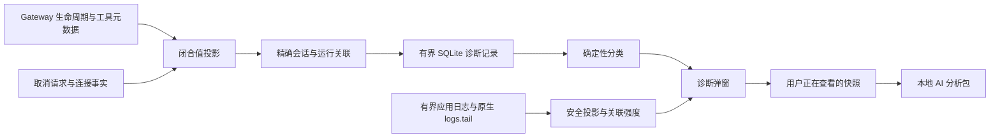

# 会话诊断

会话列表右键 →「诊断」查看最新或历史一轮的本地运行证据。该操作不切换聊天、不发送模型消息、不启动 Gateway、不运行修复命令，也不上传数据。

打开弹窗、切换运行或刷新时，先显示本地元数据，再自动采集有界日志；采集期间显示进度并禁止导出半成品。采集失败保留本地快照并显示错误，之后仍可重试或导出。应用记录中的运行状态、开始/结束时间单独展示，不将历史 `failed` 状态当成已经查明根因。

## 用户操作

- 「刷新本地记录」读取最新已采集证据。历史运行按 20 条分页。
- 「采集在线环境」仅使用已连接的 Gateway，3 秒超时；采集全局 stability 数量与丢失计数，不将它们当成当前会话根因。
- 「采集日志证据」读取本软件 Main/Cowork 日志、运行服务输出，并通过已连接的 OpenClaw `logs.tail` 读取原生日志。生成新的可预览快照，分别显示来源缺失、截断、丢弃、解析失败与关联级别。离线仍可采集本地来源。
- 「复制摘要」复制结论、采集时间与完整性，不复制会话标题或技术标识。
- 「导出诊断包」使用原生保存对话框，导出当前显示的确切快照。快照过期须刷新，不能静默导出另一轮。

键盘 ContextMenu/Shift+F10 可打开菜单；弹窗支持 Escape、Tab 焦点约束与关闭返回。正在运行、失败和离线会话都可以打开。

## 证据解释

只有带 `executionSettled: true` 的外层 lifecycle end/error 才确定整轮执行结果。attempt finishing/error、工具失败和 chat final 单独保留，不能推导任务完成。正常结束仅表示本轮结束；异常终态冲突显示无法确认。

用户取消必须存在匹配 run 的用户请求及原生中止终态；取消 RPC 返回仅表示请求处理结果。未知来源的 aborted 不标成用户停止。断连说明连接丢失，不证明后台执行已经停止。

`chat aborted` 是回复中止观察，可能先于后台执行释放，单独出现时显示「尚未确认整轮执行结束」。原生终态中的超时、失败或中止优先于同时携带的 `yielded` 标记，避免把中断误判为等待。

使用 `sessionKey`/活动 run 映射与 SQLite rootRunId/clientTurnId 精确关联，不能将未知事件附到最新运行。先到 chat final 后到带会话键的 lifecycle 可补充原因，且不会重新激活会话。复制/fork 的计时不复制诊断证据。

## 存储、隐私和边界

每轮最多 200 条普通记录加 32 条取消/终态记录，单条最多 2 KiB；全局最多 20,000 条事件、14 天。独立 coverage 表保存被裁剪计数，随产品运行删除级联清理，不删除原有计时记录。未关联元数据队列最多 100 条、30 秒；其丢失数量标为当前进程的全局采集缺口，不能归因到某个会话。

不保存正文、思考、工具名/参数/输出、任意错误文本、配置或凭据。原因和错误类别使用有限枚举；未知值回退 unknown。技术视图只包含这一安全投影与身份标识。导出时身份标识进一步替换为包内别名，并再次验证所有枚举值。

ZIP 包含 `summary.md`、`report.json`、`manifest.json`、`ai-analysis.md`；采集日志后另含 `logs.json`。日志文件包含有限字段的安全投影，不是原始日志备份；manifest 明确运行时版本未采集。Main 中快照最多 8 份，每份 512 KiB、5 分钟，绑定窗口、会话和运行。导出重入受限、30 秒超时；完整临时 ZIP 写完并重新校验快照后才发布目标文件，失败不会删除原目标。

日志采集不改变生命周期结论。结构化字段与目标运行完整匹配时标记 `run`，会话字段匹配标记 `session`，仅时间相关标记 `time_window`；会话级或全局异常不能证明本轮故障。任意文本只可推导有限类别提示，并标记 `inferred`，不能把错误原文、凭据、文件路径或聊天内容带入界面/导出。未知文本被省略，省略数量可见。

本地日志使用 256 KiB 缓冲区逐块读取所有发现文件的完整捕获大小，不按文件尾部、总字节数、文件数或总扫描耗时截断。Main 包括目录中仍保留的每日与轮转日志，Cowork 包括当前及 `.old`，运行服务输出扫描完整 `gateway.log`。每个文件打开时固定大小，新增内容留待刷新，避免持续写入导致扫描永不结束。每块读取后让出事件循环；单次 I/O 超时 30 秒，支持取消、进度和窗口关闭清理。大小变化/替换、缺失、权限、超时分别记录缺口，不能将部分扫描标为完成。OS 中已经发起的 I/O 无法保证立即取消；迟到结果不发布，句柄在操作返回后关闭。

原生 `logs.tail` 会将旧游标快进到最新尾部，不能作为历史分页接口。本软件只信任当前已连接本地运行服务 RPC 返回的结构化 `file` 来源，不读取日志正文中的路径或接受 Renderer 路径。通过常规文件、无符号链接/目录联接和句柄身份校验后，扫描该文件；默认 `openclaw-YYYY-MM-DD.log` 来源枚举同目录同命名族的所有保留日文件。自定义文件名仅扫描精确来源，不推测其他文件。原生路径不可用时保留 1000 行/512 KiB 有界 RPC 尾部并明确标记扫描未完成；离线不启动服务或猜测临时目录。

单记录解析上限 64 KiB，跨块 UTF-8 与多行记录在有界缓冲中拼接；超大/损坏记录显式计入解析缺口。每来源预览最多 100 条、合计最多 400 条，达到容量后仍继续扫描、匹配并累计闭合类别 `signalCounts` 和 `matched`，输出省略计入 `outputOmitted`；按错误级别、关联强度与类别优先保留线索。`scanComplete` 仅指所有发现文件的捕获内容已扫描，不保证已被删除的历史或未写入的事件存在，也不表示没有解析缺口。导出包含同一覆盖状态和统计，AI 不得把 Main/服务的重复记录相加当成独立重试。

缺少时区的 Main 时间按采集时本机时区解释，无法确认历史时区变化。并发最多两个扫描任务；扫描中的快照固定并免于过期/容量淘汰，完成后结果有新的五分钟导出有效期。切换运行会取消并等待上一扫描收尾，再启动新扫描，迟到进度和结果不会覆盖当前运行。

已知边界：

- 功能启用前的历史可收集仍被保留的日志提示，但不会自动从提示或消息重建权威运行结论；没有终态证据即说明无法确认。
- 无会话键且活动身份已清理的迟到事件可能无法关联；断连期间的漏收终态不自动从原生历史恢复。
- 本版不查询原生实时运行/审批/子任务状态。历史 start 不能证明当前仍运行，`yielded` 仅解释为让出控制的证据；外部会话/协作入口只能展示已关联的主会话证据。
- 存储完全不可读时返回诊断不可用，不用聊天状态伪造证据。进程级采集失败会在可读报告中提示完整性问题。
- 在线环境采集不刷新本轮证据和本地连接快照；需要最新本地事实时先点击刷新本地记录。UI 分开标明两个采集时间。
- 旧运行的日志可能已经被清理，默认族之外的原生自定义轮转文件不自动猜测；OpenClaw 原生日志离线不可读时明确缺失，不冒充完整采集。Main 日志能反映已有的进程退出/渲染进程崩溃记录，但尚未转发到 Main 的浏览器错误没有全量采集保证。
- 原生日志的写入与保留由 OpenClaw 负责；本软件确认来源后本地读取并立即进行有限字段投影，不保留原始内容。当前包不包含任意错误堆栈、模型回复或工具输出，未知问题可能仍需进一步采集。

首版计划与验收记录见 [session-diagnostics-plan.md](session-diagnostics-plan.md)，多来源扩展的具体场景矩阵和审查修订见 [session-diagnostics-expansion-plan.md](session-diagnostics-expansion-plan.md)。

## 历史会话空报告修复验证

2026-09-28：97 项相关测试、lint、Electron 类型检查通过。对用户指定的功能启用前会话，只读验证得到 Main 29 条、运行服务输出 23 条安全字段记录，均保持时间窗口关联，不提升为已确认根因。回归覆盖自动采集后导出新快照、采集失败保留本地结果、切换运行忽略迟到结果，以及历史故障位于普通 512 KiB 尾部之外的读取场景。此记录不包含真实会话标识或原始日志。

## 重度使用日志扫描验证

2026-09-28：完整扫描回归覆盖 96 MiB 文件开头故障、20 个轮转文件、预览满后继续计数并保留迟到错误、默认原生日文件族、跨块 UTF-8、超大记录、取消、文件并发追加和截断。对本机保留文件只读扫描约 67 MB（8 个 Main、1 个 Cowork、1 个运行服务输出），耗时约 0.56 秒；该时间仅是本机样本，不代表所有设备性能。文件读取完成与解析失败数量分开报告，原生来源未通过真实在线服务验证时不声称已经完整采集。

本次最终验证：108 项相关测试、lint、Electron 类型检查通过；覆盖扫描取消的窗口/快照隔离、过期快照固定及原生来源失败降级。

## 诊断面板展示

诊断面板采用可滚动内容区与固定操作栏，分别展示结论、证据统计、四类日志来源、事件时间线和在线环境。结论颜色同时配有图标与文字，未知结果不呈现为成功；扫描完成比例仅说明文件读取覆盖，解析缺口仍单独展示。扫描进度条表示当前文件的读取进度。

日志预览支持“全部”和“错误与警告”筛选，只改变当前展示，不影响采集结果与导出内容。来源覆盖详情和技术字段可折叠，保留全部证据限制说明。布局适配深浅主题和窄窗口，支持键盘焦点循环，并遵循系统减少动态效果设置。
