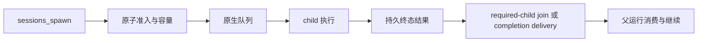

# 子任务完成通知与模型重试边界

当前 v2026.9.2 的 admission、queue、required-child join 和 completion delivery 由 OpenClaw 原生负责。旧文档引用 013–021、036 等历史版本补丁实现这些行为，已不适用于当前补丁编号；本页按现行 owner 重写。

## 1. 两个问题必须分开

完成通知一致性关心：child 结果是否持久提交、父会话是否从正确 canonical 分支继续、同一结果是否只消费一次。模型请求重试关心：某一次 provider attempt 失败后是否可以安全重试。

一个 child run 可能已经产生文件、网络或 spawn 副作用。即使最后一次模型响应不完整，也不能据此重跑整个任务。

## 2. 原生执行链

产品使用 tasks.list/get 和 task event 展示这条链路。taskName 是机器标识，不是所有上下文通用的去重键；同名任务可以合法存在。session/run/task 身份及原生 receipt 才能确认对应关系。

## 3. 产品必须保留的结果语义

accepted/queued/running 不混为一态；timeout 从原生实际运行生命周期判断。completed 的 terminalOutcome=blocked 显示 blocked。父模型结束不表示 required child 已被消费，UI busy 聚合也不能替代原生 join。

子任务重新激活时清理上一代终态显示，session revision 新于 task 时才用于覆盖。详情用 taskId 确认 session，再读原生累计 usage/runtime；不可降级到未验证的调用者 sessionKey。

## 4. 完成通知的不变量

原生持久提交、canonical branch 和后续父模型上下文必须一致；同一结果不能被 join 与 announce 双重消费。停止后的迟到通知不能重启已取消轮次，也不能写进下一用户 turn。

升级时在锁定最终 bundle 验证这些行为，而非保留历史 patch 以“保险”。应用只做身份校验和展示，不能把没收到通知解释成自动再发一次结果。

## 5. 当前未承诺的通用自动重试

当前不能宣称产品已实现“任意无副作用模型失败的同模型自动恢复”。若将来增加，必须以当前 request attempt 为单位记录可见文本、tool call、accepted spawn、审批、delivery 和中止，而非查看整个 run 的工具总数。

候选重试至少要求：可恢复的传输类错误、该 attempt 无可观察副作用、无 accepted 异步工作、非用户 stop、预算有界，且原生 transcript/context 不变。认证、缺模型、用户取消及已经提交工具或消息的 attempt 不可原样重试。

## 6. 测试与诊断

分别验证并发 spawn 容量、queued timeout、多个 sibling completion、父分支接续、join/announce 单 owner、停止、Gateway 重启和 provider stream 中断。记录原生 task/run 身份及提交顺序，不以模型文本“完成了”作为证据。

产品测试入口在 subagentGateway、Adapter subagents 与 Renderer 子任务显示；原生契约在 runtime tests。重试方案若仅存在设计，不应写进用户能力清单。
