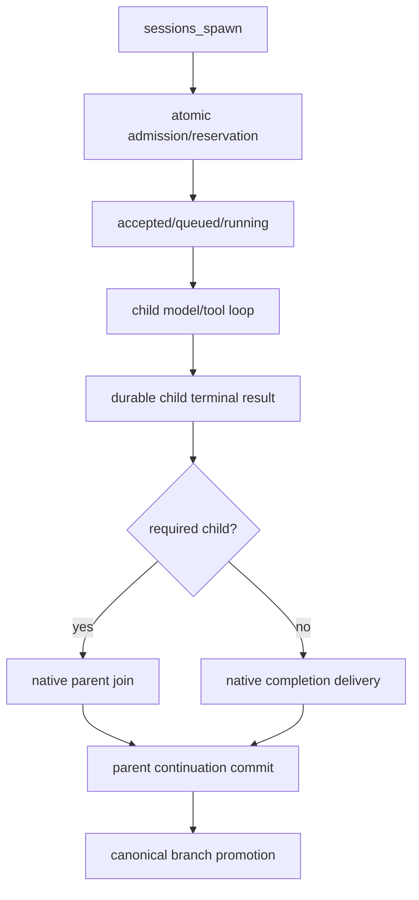

# Subagent 模型恢复与 Completion 一致性

> 本文按 JustDo `v2026.8.27`、OpenClaw `v2026.8.1` 重新核对。Task admission、queue、required-child join 与 completion delivery 已由上游原生实现；“当前模型请求无副作用时的同模型 retry”仍不是一项可宣称完整落地的通用能力。

## 1. 问题拆分

历史故障包含两个独立问题：

1. Child completion 已写入父 transcript，但下一次 completion prompt 仍从旧 canonical leaf 启动，导致看不到刚提交的 sibling spawn/result；
2. Child 的某次模型流发生 timeout/terminated/不完整响应时，即便该次 request 没有产生工具副作用，也可能直接把整个 child 标为 failed。

第一项属于 durable delivery/canonical ordering；第二项属于 provider request recovery。不能用 taskName 去重掩盖任一问题：同名 task 在不同上下文中可以合法创建。

## 2. Subagent 执行事实

OpenClaw v2026.8.1 原生负责 `sessions_spawn`、task ledger/event、原子 admission、排队、run timeout、required-child join 和 completion delivery。JustDo 通过 `tasks.list/get` 的版本化 wire validator 与稳定 DTO 展示父子关系，不再维护 managed join/FIFO/canonical patch 状态机。

## 3. 已实现的 Completion 一致性

### 3.1 原子 admission

补丁 `013` 在 native preflight 后、registry 注册前做 requester reservation，避免多个并行 spawn 都看到相同空余容量。canonical requester 的容量被原子占用，成功或失败均释放。`014` 将 accepted/queued/running 分开，真正 running 后才开始 run timeout。

### 3.2 Managed join

`017`–`021` 识别可信 JustDo ancestry、批次 join、两阶段消费、消失 run 终止等待、失败回退和 announce fence。Join 一旦取得 ownership，原生 announce 不能同时发送；join 失败且结果尚未消费时恢复一条 native delivery。

### 3.3 Per-requester FIFO

`016` 为 required completion 建立 durable sequence，同一 requester 串行投递，不同 requester 可并行。failed head 保留在队首，busy requester 等待，避免 completion steer 正在进行的父 run 或乱序进入 transcript。

### 3.4 Commit 后提升 canonical leaf

`015` 只在 required `subagent_announce` 的外层 delivery 完整 durable commit 后，在 requester transcript write lock 内提升 side branch。顺序是 `016 → 015`：先获得 FIFO delivery 权，再提交消息，最后 promotion，之后才释放队列。

普通 announce、accepted-only 和失败 delivery 不提升。不能在 embedded child finalizer 提前 promotion，因为外层 delivery mirror/leaf control 尚未提交，后续写入可能把 canonical target 恢复到旧锚点。

### 3.5 身份固定

`036` 对持久 `agent:*:justdo:*` 会话固定 session id，覆盖 command resolver、chat.send 初始化、Gateway admission 和持久化复核；显式 `/new`、`/reset`、delete 仍按上游语义换号。这样恢复/announce 不会因为 freshness 或 transcript 短暂缺失进入新身份。

## 4. Completion 不变量

- 同一 requester 的 required completion 不重叠；
- FIFO 序号与 durable transcript 顺序一致；
- delivery 未提交不得 promotion；
- promotion 未完成不得释放下一条 completion；
- join 与 native announce 对同一结果最多一个 owner；
- 失败恢复只投递未消费结果；
- 同名 task 不作为去重键；
- canonical branch 必须包含前一条已经 committed 的 Tool Call/Result 和 completion。

## 5. 模型请求恢复的正确边界

整个 child run 可能已经执行过工具，但当前失败的 provider request 可能尚无任何副作用。安全 retry 应以“当前 request attempt”而不是整个 run 的累计 `toolMetas` 判断。

每个 attempt 至少需要记录：

- request/attempt id 与开始时间；
- 本 attempt 新增的 visible assistant text；
- 本 attempt 发出的 tool call、spawn、delivery 或 approval；
- 是否已有异步工作接受/启动；
- 原始错误分类：timeout、terminated、network、auth、context overflow、abort；
- retry 次数与下一步决策。

只有明确可证明本 attempt 尚未提交任何可观察副作用时，才可能用相同 transcript 和同一模型重试。

## 6. 允许与禁止 retry

候选安全路径：

- timeout、terminated 或流不完整；
- 本 attempt 没有 tool call；
- 没有 accepted spawn/async start；
- 没有 approval request、delivery commit 或可见 assistant 内容；
- 不是用户 abort；
- 仍在有界 retry budget 内。

必须禁止：

- 本 attempt 已经调用文件、shell、网络或其他可能有副作用工具；
- 已接受 child spawn，即使结果未返回；
- 已向外部 channel 或父 transcript 提交 delivery；
- approval 已展示或消费；
- 用户明确 stop/abort；
- auth/missing-model 等重试不会自愈的配置错误；
- 上下文 overflow 应走专用 compaction convergence，而不是盲目同请求 retry。

若证据不完整，默认 surface error，而不是冒险重复执行。

## 7. 当前已有的相关恢复能力

这些能力与通用 provider retry 相邻，但不能混为一谈：

- `033`：工具报错后模型只输出 reasoning、无可见回答时，最多两次 request-only recovery instruction，并有 delivery/spawn/async/approval 围栏；
- `035`/`037`：Codex-local compaction 与最多三次逐级收敛的 context-overflow 恢复；
- `039`：timeout/overflow recovery compaction 的进度事件；
- `040`：把最终失败正确归因为 timeout/auth/network/no-op/local safety，而非统一伪装成 overflow；
- OpenClaw 原生 fallback/retry：继续按其现有错误分类与模型配置执行。

上述补丁没有证明所有“普通模型流 timeout 且当前 attempt 无工具”都会自动同模型 retry。文档、UI 和测试报告不得扩大能力声明。

## 8. 产物已完成但总结流失败

Child 可能已经创建并验证产物，最后总结 request 才 terminated。此时重放整个 run 非常危险。合理策略优先级是：

1. 若 transcript 中已有结构化产物/工具结果，以只读方式构造可见 completion；
2. 若可安全发起一个明确禁止工具的总结 request，可使用 request-only recovery；
3. 无法证明安全时标记 failed，但保留产物与工具证据；
4. 不自动 spawn 一个同 taskName child 作为“去重式重试”。

Runtime 终态与产物存在是两件事，UI 应允许用户查看已生成 artifact，而不把 failed 强行改成 success。

## 9. 诊断元数据

恢复日志应包含 session/run、attempt、error class、side-effect flags、retry ordinal 和 decision，不能包含 prompt、secret 或完整 provider payload。推荐 decision：

- `retry_same_model_no_side_effect`；
- `use_configured_fallback`；
- `recover_visible_response`；
- `surface_error_side_effect_fence`；
- `surface_error_budget_exhausted`；
- `abort_user_requested`。

错误文本必须保留真实 reason。`040` 已修复 compaction 路径中 timeout/no-op 被错误归成 provider overflow 的问题。

## 10. 测试矩阵

### Completion/canonical

- 多个 sibling 同时完成，同 requester 严格 FIFO；
- 不同 requester 可以并行；
- outer commit 之前不 promotion；
- promotion 后下一 prompt 看见刚提交 spawn/result；
- failed head、busy requester、重启恢复；
- managed join 与 in-flight announce 竞争只交付一次；
- session identity 在隐式恢复中不换号，显式 reset 仍换号。

### Request recovery

- timeout/terminated 且当前 attempt 零副作用时有界 retry；
- 过去 attempt 用过工具但当前 attempt 没有，按当前 attempt 判断；
- 当前 attempt 已 tool/spawn/delivery/approval 时禁止；
- user abort 永不 retry；
- auth/missing model 不做无意义同模型 retry；
- context overflow 进入 035/037 而非普通 retry；
- 最终总结失败时保留产物、不重放副作用；
- budget 耗尽只产生一个 child terminal failure。

### 并发

- 同父 9 次 spawn 在默认限制下 admission 数与配置一致；
- native running 峰值不超过 `maxConcurrent`；
- queued child 的 run timeout 从 running 开始；
- completion delivery 不新增意外 Tool Call。

## 11. 验收状态

| 能力                                    | 状态                          |
| --------------------------------------- | ----------------------------- |
| 原子 spawn admission                    | v2026.8.1 原生                |
| queued/running timeout 语义             | v2026.8.1 原生                |
| required child join/completion delivery | v2026.8.1 原生                |
| task ledger/event 与重启恢复            | v2026.8.1 原生 + app epoch 008 |
| task status/label 产品投影              | `tasks.list/get` Adapter DTO  |
| context overflow 收敛/归因              | v2026.8.1 原生                |
| 通用“当前 request 零副作用”同模型 retry | 尚不能声明完整实现            |

## 12. 实施约束

若继续实现通用 request retry，应优先在 OpenClaw attempt 边界做最小版本 patch，并满足：

1. 复用原生 outer model/fallback loop，而不是在 JustDo Adapter 重发整个 turn；
2. side-effect evidence 属于当前 attempt；
3. retry 次数有界且可诊断；
4. 不叠加 033 reasoning recovery 或 037 overflow convergence；
5. terminal lifecycle 只在所有安全恢复完成后发布一次；
6. 为 patch 写 source/bundle 原子幂等测试和删除条件。

## 13. 非目标

- 按 taskName 自动去重；
- 对有副作用工具进行透明 replay；
- 把所有 Provider 错误无限重试；
- 在 Renderer/Main Adapter 重建 OpenClaw model loop；
- 将产物存在自动等同于 run success；
- 为修复 completion 顺序而牺牲不同 requester 的并行性。

当前架构已经解决 completion 上下文陈旧的根因。剩余恢复工作必须继续以 request 级副作用证据为安全边界，不能用“通常没问题”的整体 run 重试替代。

## 14. Failure Stage 分类

| 阶段                     | 是否可自动重试           | 原因                               |
| ------------------------ | ------------------------ | ---------------------------------- |
| Provider请求发送前       | 通常可                   | 尚无远端/工具副作用                |
| 请求建立但无任何可见输出 | 仅在错误分类明确时       | 服务端可能已接收，需幂等/证据      |
| 已有assistant delta      | 默认不可透明重放整个turn | 会重复内容并改变上下文             |
| 已执行tool               | 不可整体重放             | 文件/网络/命令副作用可能重复       |
| Child产物已commit        | 不重跑child              | 应恢复completion announce/总结路径 |
| Completion delivery失败  | 重试delivery/join        | canonical child事实已存在          |

## 15. 身份链

Requester、child session、child run、spawn request、canonical leaf和completion announce必须保持可关联。Task name/label只用于展示，不能去重；重试delivery复用同一child结果identity，不能创建看似相同的新child再竞争canonical结果。

## 16. FIFO 与并行边界

Per-requester completion按提交/commit规则串行，保证同一父上下文不被后完成的旧child覆盖；不同requester仍可并行。原子admission在并发preflight时预留容量，queued timeout从真正running起算。改变其中一个队列必须验证不会破坏另一个层级的公平性。

## 17. 诊断与测试证据

诊断记录 parent/child/task/run/request id、model/provider 错误分类、是否已有 delta/tool/commit 和 native delivery 状态；不记录 prompt/tool secret。Pristine tests 证明 queue/join 来自上游，`v2026_8_1` wire、`subagentGateway.test.ts` 和 adapter/goal tests 验证 consumer 映射。

## 18. 完成定义

任何新增retry必须有明确安全阶段、次数/backoff、取消、幂等和副作用测试；completion恢复必须证明只交付一次canonical结果、父上下文顺序正确、重连可恢复。文件名中的 `plan` 不代表可以实现“整体run无限重试”；该行为仍明确非目标。
