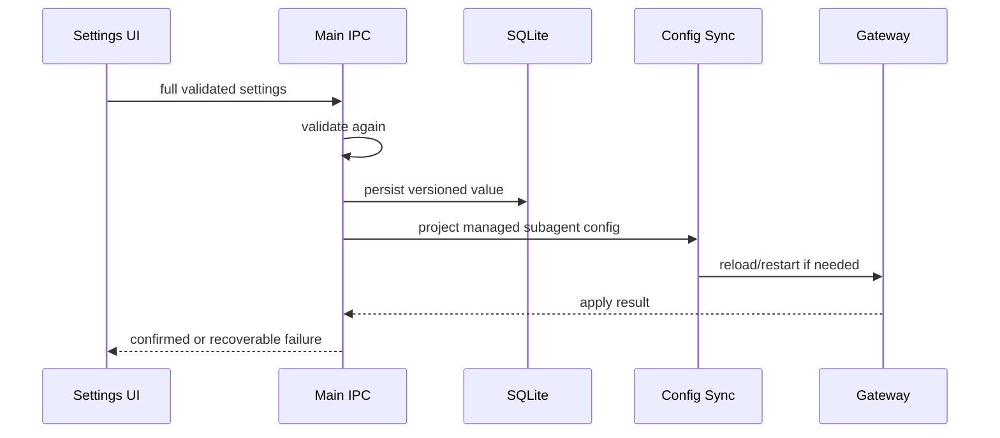

# Subagent Runtime 设置审计

> 审计基线：JustDo `v2026.8.12`、OpenClaw `v2026.7.1-2`。本文按当前共享契约、Config Sync 与设置页重新核对；上游字段需要在升级 OpenClaw 时再次验证。

## 1. 结论

JustDo 设置页当前管理七个产品字段：默认模型、默认 thinking、委派倾向、全局并发、单父 child 上限、run timeout 和嵌套深度。它们持久化为版本化 `AgentRuntimeSettings`，再投影到 `agents.defaults.subagents`。

JustDo 另外固定写入 `archiveAfterMinutes: 0` 以保留完成的 Subagent 历史，但不把该字段暴露给用户。上游仍有 `allowAgents`、`announceTimeoutMs`、`requireAgentId` 等公开字段，当前使用 OpenClaw 默认或由托管 Agent 配置决定。

## 2. 四个参数层级

1. `agents.defaults.subagents`：Gateway 全局默认；
2. `agents.list[].subagents`：特定 Agent 覆盖；
3. `sessions_spawn`：单次 tool call 参数；
4. JustDo/OpenClaw 内部常量与 patch 状态：不属于用户配置。

通常单次 spawn > per-agent > defaults > OpenClaw 内置默认，但并非每字段支持全部层级。设置页只能承诺它实际写入的 defaults，不能声称禁止 Agent 在允许的 tool schema 中选择单次 model/thinking。

## 3. JustDo 共享契约

`src/shared/openclaw/agentRuntimeSettings.ts`：

| 字段                  | 类型/范围                   | JustDo 默认      | UI       |
| --------------------- | --------------------------- | ---------------- | -------- |
| `delegationMode`      | `suggest \| prefer`         | `suggest`        | 基础设置 |
| `model`               | model ref 或 null，最长 256 | null，跟随调用者 | 基础设置 |
| `thinking`            | level 或 null               | null，跟随调用者 | 基础设置 |
| `maxConcurrent`       | 1–16                        | 3                | 基础设置 |
| `maxChildrenPerAgent` | 1–20                        | 5                | 基础设置 |
| `runTimeoutSeconds`   | 0 或 60–86400               | 7200             | 基础设置 |
| `maxSpawnDepth`       | 1–2                         | 1                | 高级调度 |

`version` 当前为 1。Parser 对整个对象严格验证，失败时回到完整 JustDo 默认，不接受半个损坏设置。model 会 trim；thinking 的可选值为 off、minimal、low、medium、high、xhigh、adaptive、max、ultra。

`0` run timeout 表示无限，但 UI 必须明确区分“无限”与 0 秒。模型是否真正支持某 thinking level 由模型能力决定，保存 schema 合法并不保证 Provider 接受。

## 4. OpenClaw 字段全表

| 上游字段              | OpenClaw 典型默认 | JustDo 行为           | 是否开放 |
| --------------------- | ----------------- | --------------------- | -------- |
| `delegationMode`      | `suggest`         | 显式写入设置          | 是       |
| `allowAgents`         | 当前 Agent        | 未作为全局用户设置    | 否       |
| `maxConcurrent`       | 8                 | 显式写入，默认 3      | 是       |
| `maxSpawnDepth`       | 1                 | 显式写入，限制 UI 1–2 | 高级     |
| `maxChildrenPerAgent` | 5                 | 显式写入              | 是       |
| `archiveAfterMinutes` | 60                | 固定 0，关闭自动归档  | 否       |
| `model`               | 跟随 caller       | 非 null 时写入        | 是       |
| `thinking`            | 跟随 caller       | 非 null 时写入        | 是       |
| `runTimeoutSeconds`   | 0/无限            | 显式写入，默认 7200   | 是       |
| `announceTimeoutMs`   | 120000            | 未显式写入            | 否       |
| `requireAgentId`      | false             | 未作为全局用户设置    | 否       |

上游默认来自目标版本，升级时必须重新查 schema/源码。JustDo 的“恢复默认”恢复产品默认 3 并发、2 小时和不归档，而不是 OpenClaw 的 8 并发、无限和 60 分钟归档。

## 5. Config Sync 投影

`buildManagedOpenClawSubagentConfig` 写入：

- `delegationMode`；
- `maxSpawnDepth`；
- `maxChildrenPerAgent`；
- `maxConcurrent`；
- `runTimeoutSeconds`；
- `archiveAfterMinutes: 0`；
- model/thinking 仅在非 null 时写入。

配置会进入普通托管 Agent 的 OpenClaw config。设置保存需要版本/范围验证、持久化、配置同步和必要的运行时应用；UI 成功提示不能早于 Main 返回成功。

## 6. 字段语义

### 6.1 delegationMode

`suggest` 表示提示模型在合适时考虑 Subagent；`prefer` 提高委派倾向。它是提示/策略倾向，不是“每个任务强制 spawn”。模型仍可根据任务、工具可用性和限制决定。

### 6.2 model

null 表示跟随调用者。非 null 是 provider/model ref，设置页只允许当前可用 runtime model。Provider 被删除或 model 不再可用时，Renderer 会避免继续展示无效选择，Parser 仍只验证字符串形态；实际可用性由 Main/Gateway 校验。

### 6.3 thinking

null 跟随 caller。固定 level 会传给 child 默认；completion announce 的 reasoning 继承还依赖 patch 002 的 direct agent 修复。某些 Provider 不流式发布 reasoning，设置成功不等于 UI 一定看到 thinking token。

### 6.4 maxConcurrent

限制全局原生 Subagent 同时 running 数，JustDo 默认 3。它不等于 accepted spawn 数；超过 running 容量的 accepted child 可以 queued。补丁 014 从真正 running 才开始 timeout。

### 6.5 maxChildrenPerAgent

限制一个 requester 的活动 child admission，默认 5。补丁 013 使用原子 reservation，避免并行 preflight 超卖。该值不是历史 child 数，也不应因为 completed child 保留在 UI 就拒绝新 spawn。

### 6.6 runTimeoutSeconds

限制单个 child 真正运行时长，默认 7200。它与 provider request timeout、completion announce timeout、父 run timeout、managed join 等待都不同。UI 必须称为 Subagent 运行超时，不能含糊写成“请求超时”。

### 6.7 maxSpawnDepth

JustDo UI 只开放 1 或 2，尽管上游 schema 可能支持更深。深度 2 允许 child 再委派，显著增加并发、成本、权限继承和可解释性风险，因此放在高级调度。

### 6.8 archiveAfterMinutes

固定 0 是产品持久历史约束。Subagent UI 依赖 Gateway registry/session projection 在 child link 老化后仍可查看。若允许自动归档，必须先设计归档后的索引、恢复与用户说明。

## 7. 未开放字段

`allowAgents` 与 `requireAgentId` 涉及跨 Agent 委派安全边界，需要列出可用 Agent、处理删除/重命名和 per-agent 覆盖后再开放。不能用任意字符串输入框。

`announceTimeoutMs` 主要影响 native completion delivery 的等待/恢复，不是 child run timeout。JustDo managed join、FIFO 与 recovery patches 又改变了部分交付路径，因此把它作为普通用户滑块会非常误导。

内部 admission reservation、FIFO retry、join poll、UI cache TTL、context compaction 次数等也不是 OpenClaw 用户配置，不应混入设置页。

## 8. UI 与 IPC

设置组件位于 `AgentRuntimeSettingsTab.tsx`，通过版本化 IPC `cowork:agentRuntimeSettings:get/set` 访问 Main。Renderer 使用共享 limits 限制控件，但 Main 必须重新验证，不能信任 DOM min/max。

保存流程应：

1. 基于完整当前 settings 构建新对象；
2. 在 Renderer 给出即时范围提示；
3. Main 调用 `validateAgentRuntimeSettings`；
4. 持久化版本化值；
5. 同步 OpenClaw config/运行时；
6. 成功后更新 UI，失败保留旧有效设置。

新增字段必须有中英文文案、默认值解释和“是否需 Gateway restart”的明确行为。

## 9. 并发示例

默认 `maxConcurrent=3`、`maxChildrenPerAgent=5` 时，同一父会话并行请求 9 个 child：

- 原子 admission 最多接受 5 个，其他被 forbidden；
- accepted 中最多 3 个 running，其余 queued；
- running 完成/失败释放全局槽位后 queued 启动；
- run timeout 从 running 开始，不消耗 queued 等待时间。

这是两个限制的交集，不能只靠 UI 禁用按钮实现；真正 enforcement 在 OpenClaw runtime。

## 10. 权限与成本

更多并发/深度会增加模型费用、机器负载、工具冲突和外部 API 压力。Subagent 默认继承所属 Agent 的工具/权限语义；设置页改变调度不等于授予新权限。跨 Agent allowlist 若未来开放，还必须与 permission mode、workspace 和 scheduler Agent 隔离共同审查。

Full 模式下并发 child 可并行修改文件，用户应理解冲突风险。JustDo 不应因为提高 `maxConcurrent` 就绕过 command/file approvals。

## 11. 测试要求

- shared parser：版本、边界、null model/thinking、trim、非法对象回退；
- Config Sync：七个设置与 archiveAfterMinutes 0 的准确投影；
- IPC：get/set、Main 复验、持久化失败、同步失败；
- UI：默认恢复、custom timeout、无效模型、thinking 列表、深度警告；
- Runtime：原子 admission、queued/running、timeout 起点、深度限制；
- Upgrade：上游 11 字段、默认值、schema 和 patch 013/014 仍兼容。

## 12. 维护结论

当前设置面已经覆盖最有产品价值且能被清楚解释的七个字段，同时把归档、announce 和跨 Agent 安全策略留在内部。后续扩展应优先保证“UI 名称与真实 runtime 语义一致”，并在每次 OpenClaw 升级时重新审计字段默认和优先级，而不是机械地把全部 schema 暴露给用户。

## 13. 设置优先级与生效时点

产品默认 → SQLite版本化用户设置 → Config Sync受管agent投影 → Gateway active config → 具体spawn时caller/per-agent语义，构成完整优先链。Renderer保存成功不等于Gateway active；运行中的child通常保持创建时配置，新设置主要影响后续spawn，除非上游明确支持热更新现有队列。

## 14. 持久化与损坏恢复

Parser按`version: 1`验证完整对象；任一非法字段回到整套产品默认，避免“半旧半新”组合产生难以解释的runtime。未来增加字段应提升/兼容版本并为缺字段迁移，而不是直接让旧对象全量失效。日志只记录字段名/错误类别，不输出model credential或完整config。

## 15. 保存事务

若持久化成功但Gateway apply失败，UI要显示“已保存、待runtime应用”或返回明确失败并允许重试；不能静默显示已生效。具体回滚策略必须与Config Sync通用语义一致。

## 16. 运行时边界案例

- `maxConcurrent`降低到当前running以下：不杀死已运行child，限制后续启动。
- `maxChildrenPerAgent`降低：已有active reservation需按上游定义释放，不能出现负计数。
- `runTimeoutSeconds=0`：无限运行，不是立即超时；queued时间不计入run timeout。
- Model被删除：新spawn回退/拒绝需明确，既有child identity/history仍可读。
- Depth从2降到1：影响新委派，不应篡改已存在parent/child树。

## 17. 代码证据与完成条件

Shared parser/tests证明范围和默认，Config Sync tests证明字段投影，IPC/UI tests证明保存与失败，runtime patch/consumer tests证明admission、queue、timeout和depth。升级OpenClaw必须重新核对11个上游字段与默认，不以本文旧表作为权威schema。
