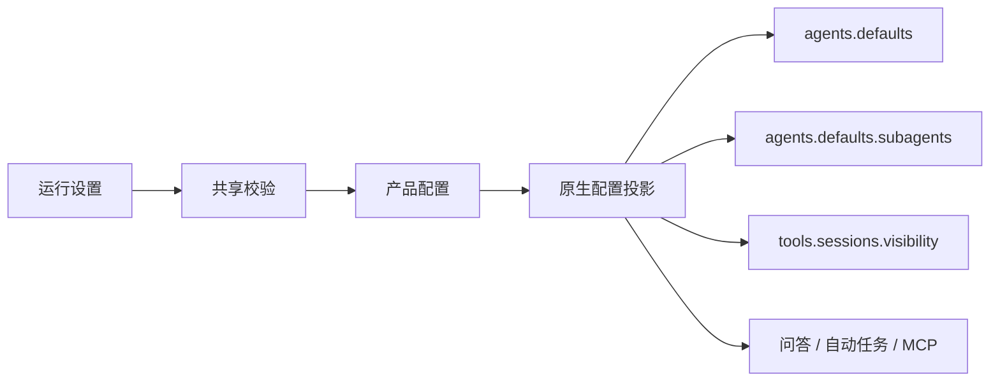

# Agent 运行参数：默认值、投影与限制

设置使用版本化 AgentRuntimeSettings，保存在产品配置中再投影到原生配置。本文按 shared/openclaw/agentRuntimeSettings.ts 说明当前默认值；UI 文案不能把 null、0 与固定值混为一谈。

## 1. 配置分组

| 分组                               | 默认    | 含义                             |
| ---------------------------------- | ------- | -------------------------------- |
| 主 Agent thinking                  | null    | 保留继承/未指定语义              |
| 主 Agent run timeout               | 0       | 未设置正向运行时限，不是立刻超时 |
| 主 Agent 并发                      | null    | 不强制产品覆盖                   |
| AskUserQuestion                    | 10 分钟 | 结构化问答等待                   |
| automation approval                | 2 分钟  | 允许 2/5/10 三档                 |
| MCP request timeout                | 60 秒   | 用户 server 的默认请求等待       |
| session visibility                 | tree    | 原生跨会话可见范围               |
| Subagent model/thinking/delegation | null    | 继承或未指定                     |
| Subagent 并发                      | 3       | 原生全局并发限制                 |
| 每 Agent children                  | 5       | 子任务容量                       |
| Subagent run timeout               | 7200 秒 | 原生运行时限                     |
| spawn depth                        | 1       | 嵌套深度                         |
| archiveAfterMinutes                | 0       | 不提供正向自动归档期限           |

## 2. 验证与旧值

版本必须匹配共享合约，枚举、整数、范围和模型引用长度由 Main/shared 校验。部分 v1 早期字段缺失时填充受管默认，尤其 visibility=tree，避免升级后默默扩大访问。

并发上限、children、depth 等各自有范围；正向 run timeout 为 60–86400 秒，0 的特殊意义按字段校验。不要在 Renderer 自己 clamp 后让 Main 接受任意数据。

## 3. 保存链路

配置 mutation 串行执行。需应用原生设置的失败不能仅显示本地保存成功；回滚或待恢复遵循对应配置服务契约。参数改变不代表已运行任务被追溯修改。

## 4. 容量、排队和超时

原生负责子任务 admission、队列、运行开始与 timeout。JustDo 不维护另一套 pending FIFO，也不通过循环调用 subagents list 消耗模型工具回合。查询使用 tasks.list/get/event。

排队等待与真正 running 的计时不同；queued 没有 startedAt 时不显示虚构运行时长。限制达到应呈现原生拒绝/排队状态，而不是 UI 暗中放宽容量。

## 5. 权限不要与调优混淆

visibility 的 self/tree/agent/all 是原生访问配置，不等于文件权限；sandbox 的有效 clamp 可能进一步收窄。增加并发、修改 delegation 或选择助手模型不会自动授予跨 Agent 发送或 spawn allowlist。

MCP request timeout 是已连接 server 的请求时限，不是连接建立超时，也不自动覆盖 Extension 托管 server。

## 6. 修改与验证

参数新增需同步共享默认/校验、产品持久化、ConfigSync、设置页面、双语文案及原生消费测试。重点检查缺字段升级、0/null、边界值、配置失败和运行中变更。不要仅根据 Gateway 能接受的字段就把所有选项暴露为已支持产品能力。
