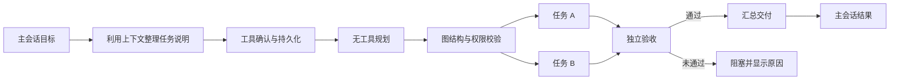

# Swarm 独立任务流插件实施计划

2026-10-04。本文替代 swarm-workflow-plan.md 中的 Workboard 依赖、人工启动和阶段映射方案。实现目标是输入框开启 Swarm 后，从主会话目标自动构建并保存任务 DAG，在右侧 Tab 展示并推进；流程直到完成或明确阻塞。不是保证任务必然成功。

## 设计决策

- 插件名 swarm-flow，独立 Gateway 服务及独立存储，不注册 Workboard 面板，不调用 Workboard 或 agent-team。
- 主会话和项目身份由 Main 解析，Renderer 不提供任意原生会话、工作目录或执行权限。
- 规划是无工具推理，输出受限的无环任务图；验收和汇总是服务创建的固定关卡，模型不能删除。
- 初版最多八个工作节点，最多三个并发任务；写入共享项目的节点串行，纯分析节点可并行。预算、尝试上限和未知运行均可阻止新派发。
- 先持久化启动意图，再提交原生 run；不确定的提交进入核对，不能自动重新启动。
- 依赖和结果由插件调度器驱动，关闭 Tab 不影响服务；Gateway 停止时不执行，重启后查询旧 run。
- 结果只保存结构化阶段交付和证据，不复制消息历史。原生会话继续归 OpenClaw。
- 验收 verdict 必须绑定本次执行结果；失败或格式不合法进入 blocked。初版不自动重试有副作用的节点。
- UI 保留图标、短标题、图形连线及按需详情。主聊天显示目标和最终结果，普通消息不暗中改写流程。
- Code Mode 可以保持现有用户配置；本插件不依靠开启 Code Mode 才能调度，也不静默修改全局设置。

## 关键节点验证与实施顺序

| 顺序 | 验证项目 | 通过标准 | 失败处理 |
| --- | --- | --- | --- |
| K1 | Gateway 插件 service start/stop 与状态目录 | 有正式 API，stop 后不会继续派发 | 不把调度放到 Renderer |
| K2 | 原生 subagent.run、waitForRun | 有 run receipt、稳定会话键、终态判定和工具策略 | 明确缺失接口，不解析日志假装成功 |
| K3 | 提交超时、原生幂等键、重启恢复 | 已保存意图与运行可核对，无重复提交 | 未确认则 blocked/reconciling |
| K4 | 权限、项目路径、模型继承 | 不因后台服务提升当前聊天的执行权限 | 无法继承的模式拒绝启动 |
| K5 | DAG 验证与独立验收 | 无环、无缺失依赖、节点限额、验收失败不推进 | 拒绝模型不合法结果 |
| K6 | 停止与暂停 | 暂停只停新派发，停止核对已登记运行 | 取消不明确不得显示全部已停止 |
| K7 | UI 到插件端到端 | 主会话发起、自动规划、执行、验收、汇总，Tab 可重开 | 样例预览不算真实执行通过 |

已完成源码核对：原生 api.registerService 提供 stateDir/start/stop；runtime.subagent.run 提供 idempotencyKey、sessionKey、cwd、disableTools、assertCurrent；waitForRun 返回 pending/timeout/error/ok 及 terminalReply。Gateway 请求支持按 scope 注册的插件 RPC。原生 run 的 sessionKey 不等于自动继承主聊天权限，需要单独验证 K4。

### 实施阶段

1. 核对并运行原生接口契约测试，建立有故障注入的插件内核测试。
2. 实现插件独立存储、严格 DAG 校验、调度器、结构化结果及恢复控制。
3. 接入 Gateway 服务/RPC、配置和打包；持久化禁用偏好，不接入其他插件。
4. 用 Main 的会话绑定接口接入输入框与图形 Tab，替换当前仅追加 Swarm 提示的路径。
5. 验证重复发起、验收失败、断连、暂停、停止、应用重启与普通聊天/Workboard 无干扰。
6. 运行 lint、Renderer/Main 类型检查、目标测试及构建，记录真实 Gateway 验收和未覆盖项。

## 执行关系

## 交付范围与诚实状态

首版提供自动规划和有限 DAG，不做通用拖拽流程编辑器。只完成源码/模拟契约验证时必须标注，不能声称真实模型端到端通过；无法确认权限继承或恢复语义时阻止发布执行入口。

## 2026-10-04 验证结果

- K1/K2：真实 v2026.9.8 Gateway 加载插件并启动服务；插件执行会话、run 回执、wait 终态和主会话 chat.inject 均已验证。
- K3：真实 Gateway 在阶段间暂停、退出并重启后保留相同流程、结果和修订，恢复后继续完成；固定响应模型共五次调用（主会话确认加四个阶段），没有重复执行。提交不确定及已接收运行恢复另外由故障注入测试覆盖。
- K4：原生禁止插件关联不属于自己的父会话，故采用插件自有执行会话和独立关联，不修改此权限规则。复制可表达的主会话工具策略和模型；sandbox 必选、远程执行、继承工具策略和其他 runtime 等不支持的条件拒绝启动。所有节点准入重新核对主会话身份与策略。
- K5/K6：DAG 环、缺失依赖、非法验收结果、失败阻断、暂停收集结果、停止等待终态、过期控制等测试通过。
- K7：真实 Gateway 经 chat.send 携带输入框生成的标记，自动创建流程，完成四阶段并在 chat.history 核实最终交付。窄/宽、明/暗组件浏览器预览无运行错误。完整 Electron 窗口操作与真实模型任务质量尚未验收。

源码验证发现嵌入式执行器未传递 currentUserMessage/currentUserMessageId，而另一种 harness 提供这些字段。插件在缺少字段时经原生 history API 精确匹配当前 runId 的已接收用户输入，不从旧文本推断请求，不建立消息缓存。

手动集成测试：设置 SWARM_TEST_RUNTIME 为已准备好的 OpenClaw 运行时目录，然后运行 `node tests/openclaw/extensions/swarm-flow.native-smoke.cjs`。测试监听本地 43131/43132，使用独立配置、状态目录和固定响应模型，不使用真实账号；测试产物位于忽略的 .work 目录。

首版暂不提供失败节点自动重试、动态改图、强制标记成功、完整工作会话历史浏览。运行中硬崩溃、真实外部工具副作用和实际模型可靠性不由上述测试证明。明确阻塞属于合法终态，不能描述为“保证一定完成”。

交付前检查：141 项定向测试通过，Renderer/Main/插件 SDK 类型检查、lint、产品元数据校验和构建通过，git diff --check 无错误。构建仍报告现有的大包与重复动态导入警告。浏览器组件预览覆盖明暗主题和窄宽布局，无页面运行错误。

后续交互补齐：Swarm 保持本次提交直接触发，不增加消息分类。自动展开改为确认服务端存在新流程后触发；当前视图生命周期内同一流程仅自动展开一次，用户收起后仍可用工具栏入口打开，运行中显示状态标记。当前聊天统一获取快照，Tab 不重复轮询，旧聊天异步响应不影响新聊天。新增发现/复用快照测试后，共 146 项定向测试通过。

## 节点 Agent 指派与连线风格

工作节点数及依赖由模型规划，服务保留节点上限、无环校验、写入互斥和必需验收关卡。所有节点默认 main，用户明确指定已有 Agent 时，可为工作节点及 verify/deliver 阶段设置 agentId。指定非 main 时保留用户原文指派片段，校验可用身份及匹配依据；无法解析、未知或派发前已不可用的 Agent 阻塞执行，不自动替换身份。

内置任务图拆解仍由 main 协调；用户要求的架构设计、详细规划等可以是被指派 Agent 执行的工作节点。每个节点持久保存助手身份，使用对应原生命名空间及角色配置。跨助手使用目标助手自身默认模型；同助手节点可沿用发起会话明确选择的模型，所有节点保留发起会话的项目和权限限制。

直角线保持不变；参考 Agent-Team 的 2px/3.5px 线宽、5/4 虚线和选中高亮。节点及详情显示执行助手。

真实 Gateway 固定响应模型验证通过：main 拆图 → reviewer 检查 → reviewer 验收 → main 汇总；实际请求模型序列包含 reviewer 两次，证明目标助手的模型被使用。阶段间暂停重启后身份及流程保留。设置 SWARM_TEST_AGENT=reviewer 可复现该测试；不设置则验证全 main。

## 2026-10-04 多 Agent 复审

三名审查 Agent 分别检查执行恢复、权限及助手准入、图形交互，并对确定问题补充修复和回归。

- 原生成功结果接受正常 provider 结束原因；yield/pending 不推进下游。未知回执取得明确成功证据后可继续，不重派成功节点。
- 最终投递与停止互斥；Windows 路径大小写、分隔符及真实路径归一后参与跨流程写锁。
- 助手候选与产品启用、未删除名单取交集；每次节点准备重新检查，删除同步失败回滚。
- 跨助手的工具或沙箱策略无法完整继承时明确拒绝，不扩大权限；同助手原生策略保留。
- 新流程打开时选中新图；跨层正交连线绕过中间节点。
- 主会话先把历史引用、附件路径和图片要点整理成完整说明，再调用流程工具。后台不复制历史或图片。工具从原生当前用户条目派生稳定请求键，用户指派依据与模型生成说明分别保存，避免模型自行扩大助手指派。

复审后的定向回归为 13 个测试文件、197 项通过；包含故障注入、图形布局、配置、删除回滚及原生工具接入。权限审查 Agent 再次只读核查上述任务说明和指派边界，未发现剩余确定问题。旧版五次模型调用记录对应直接入库路径；当前上下文接入的固定模型测试为六次调用（主会话工具调用和确认、四个后台阶段）。图片理解质量仍取决于实际主会话模型，不由固定响应测试证明。

最终验证：默认全 main 与指定 reviewer 两条真实 Gateway 路径均完成发起、阶段间暂停重启、恢复及主会话交付；均为六次固定模型调用。lint、Renderer/Main 构建、插件 SDK 类型检查通过，构建仅有既存的大包与动态导入警告。完整 Electron 手工操作和真实模型任务质量仍未验收。

## 2026-10-05 输入框复审

两名 Agent 复审功能标签及提交衔接，修复目标续跑误吞 Swarm、标签高度更新、无响应的点击激活、真实选区与 IME 组合边界、菜单键盘焦点及旧提交清除新选择问题。右键全选剪切/替换同步清除本次标签，异步剪贴不覆盖已切换或修改的草稿。统一回归 15 个文件、218 项通过，组件浏览器验证无页面错误。
