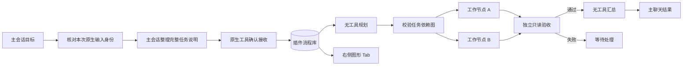
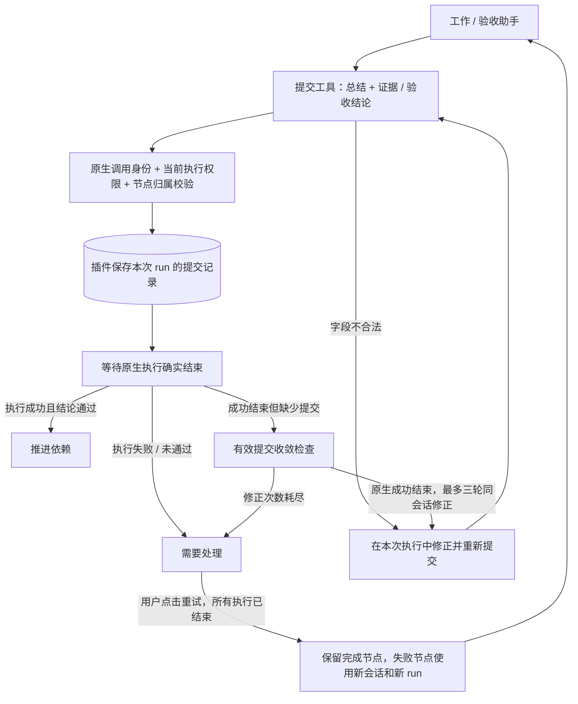
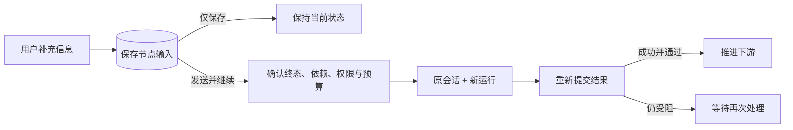

# Swarm 独立任务流与图形视图

Swarm Flow 是本产品的独立任务流插件，与 OpenClaw 原生 collector 分组、SubAgent 控制树、agent-team 长期协作和 Workboard 工作事项分别管理。具体实现计划和验证关卡见 [实施计划](swarm-plugin-implementation-plan.md)。

主会话可通过 `swarm_flow_status` 查询流程与节点，使用 `swarm_flow_control`
暂停/恢复/停止或重试全部失败节点，使用 `swarm_flow_intervene` 补充并继续或
重跑指定失败节点。已有流程无需重新选择输入框 Swarm 标签；聊天与 Tab 共用
同一状态和权限规则。遇到阻塞会在主会话提示，普通进度保留在图中；暂停仅阻止
后续派发，保存补充不向当前运行投递。详见 [主会话管理方案](swarm-main-session-management.md)。

## 用户路径

输入框功能菜单按 Swarm 插件的实际启用状态展示入口；未确认启用或已关闭时不显示。
关闭插件后即时移除 Swarm 菜单项并取消各草稿的 Swarm 标签，保留正文和附件。
插件开关事件使在途的旧状态读取失效，避免关闭后被过期响应重新显示；回到应用
时再次读取状态。重新启用后恢复入口，用户可重新选择；菜单没有可用功能时隐藏加号。
入口遵循[通用输入框功能菜单契约](composer-feature-menu.md)，Swarm 的定义和业务动作
由独立适配器提供，未来插件复用同一目录读取、启用过滤与菜单交互。

1. 在消息输入框下方点击附件按钮左侧的加号，在功能菜单选择 Swarm；输入框首行显示不可拆分的 Swarm 标签，正文紧随其后。点击标签（键盘 Enter/空格亦可）、光标在正文开头按退格，或选中标签按删除键，整块移除标签即取消本次选择。全选后删除或替换草稿也清除标签。菜单默认自动分工，选择只影响本次提交，不改变正在执行的工作流。已有未完成目标或处于目标结果反馈时，拒绝 Swarm 提交并保留草稿，避免消息被旧目标续跑路径消费。
2. 输入目标并发送。插件核验本次请求后，主会话利用已有上下文和附件整理完整任务说明，通过专用工具建立持久化流程，再由后台自动规划任务。
3. 右侧 Swarm Tab 自动打开，展示规划、任务依赖、独立验收和汇总交付。点击节点查看阶段结果或失败原因。
4. 暂停只停止新任务派发，已经执行的任务继续；继续从原状态推进。停止请求取消本流程已有运行，确认终态后才显示已停止。暂停/停止要求原生父会话身份仍一致，修改项目、权限或开启规划模式后仍能使用；恢复、重试和节点介入继续严格核验创建时的项目、权限与策略。
5. 明确失败且所有执行已结束后，底部显示重试图标。排除失败原因后点击，只重跑失败节点，保留已完成阶段；每节点最多三次执行。结果尚不确定时不会显示重试入口。
6. 最终结果经原生 chat.inject 回到主会话；完整流程仍可从 Tab 的历史选择器查看，默认列出最近二十次。

需要启用 Swarm Flow 扩展，无需开启 Workboard、agent-team 或 Code Mode。Workboard 对未设置过的用户默认关闭，保留用户明确开启的选择。Swarm Flow 默认可用，保留用户明确禁用的选择。现有运行时设置的 tools.swarm 控制原生批量委派，不控制本插件。

## 执行边界

后台 Gateway 服务驱动流程，Tab 仅显示状态。最多八个工作节点；同一项目最多三个活动节点，写节点与其他节点互斥。研究和审查模式只接受只读任务。所有流程强制包含规划、独立验收和交付关卡，模型不能删除这些关卡。

节点的 `access` 是任务语义与调度分类，不是原生权限模式。规划、工作、验收和交付均继承主会话明确选择的 `permissionMode`；不会仅因模型标记只读就自动降为原生 `read-only`（该模式会禁止全部命令，包括 `git status` 等检查）。只读节点的派发说明明确禁止修改源码、配置、仓库状态和用户数据；会产生文件的测试应归为写任务。真正的权限上限仍由原生会话策略执行，主会话明确只读时不会放宽。项目目录也继承主会话的原生 `sessionRoot`，自然语言中的目标路径不会自动改写执行根目录；请在目标项目下发起流程。

模型输出的任务 ID 仅作为非空、唯一的依赖引用标签，不限制命名格式。服务先校验重复引用、缺失依赖和循环，再按任务顺序生成 `task-1`、`task-2` 等内部 ID，同步转换全部依赖；标题、任务说明和助手指派保持原样。内部节点以工作流 UUID 和节点 ID 共同定位，执行会话键也包含工作流 UUID，不同工作流使用相同节点编号不会冲突。编号只在接收新规划时生成，不重写已持久化的流程。

任务图的工作节点数量、并行分支和依赖由模型规划，服务校验无环、节点上限和权限，并添加验收及交付关卡。所有节点默认使用 main，不随发起聊天的助手身份变化。用户明确指定已有助手时，规划器输出对应节点的 agentId 及用户原文依据；任务、验收和汇总均支持指派。指派依据单独保留本次用户请求原文，不能由模型生成的说明新增授权；需要指定助手时请在本次请求中明确写出。未知助手、未解决的指派或缺少明确指派依据会阻塞，不静默退回 main。

最初的任务图拆解由 main 协调。用户指定“让架构师做方案设计”时，规划器创建架构师执行的设计工作节点，再建立后续依赖，不把内置拆图操作当作用户要求的方案交付。

流程创建时通过原生 agents.list 获取可用助手快照，仅给规划阶段提供 ID 和名称；派发前重新检查可用性。节点独立保存 agentId/agentName，原生执行会话键使用被指派助手的命名空间。不同助手使用自己的角色配置及默认模型；只有与发起聊天助手相同的节点继承该聊天明确选择的模型。所有节点仍受发起聊天的项目、permissionMode 和会话工具限制约束，目标助手自身原生策略继续生效。

可用名单与产品配置中的启用、未删除助手取交集，并始终保留 main。产品禁用或删除后，后续 Swarm 节点不得再选该助手；原生保留的历史身份不会重新进入候选名单。这是 Swarm 新节点准入限制，不是撤销助手在其他原生入口的权限。删除操作先同步更新名单，再保存删除标记，更新失败会恢复原配置。

会话关联保存在插件流程库，不伪造原生父子关系，不赋予插件主会话所有权。无法安全表达的 sandbox 必选、远程 exec 绑定、继承工具策略及非 OpenClaw runtime 拒绝启动。跨助手执行若涉及助手级 tools/sandbox 或全局按 provider 的工具策略，当前公开 API 无法完整继承有效上限，因此明确阻塞；无特殊策略时可跨助手执行，同助手继续采用原生策略。父会话身份、项目和策略在节点准入时再次核对；已经准入的原生运行遵循其原生权限生命周期。

原生主会话的提示钩子优先读取 currentUserMessage/currentUserMessageId。嵌入式执行器未提供这些字段时，仅当当前 prompt 有标记提示，才经 chat.history 查找与当前 runId 精确对应的已接收用户消息；旧历史中的同类文本不构成发起依据。读取结果只在本次钩子内存在，不形成历史缓存。钩子将本轮工具面收窄至流程发起工具；主会话负责把引用的方案、约束、可访问附件路径和图片要点整理到任务说明，后台节点不继承聊天图片或历史。关键附件不可读取时应说明缺失，不虚构内容或宣称已启动。工具再次核对当前用户条目并从原生身份派生幂等键，模型遗漏参数也不会改用不稳定的工具调用 ID。

## 持久化与恢复

插件在 Gateway stateDir/swarm-flow/flows.sqlite 保存目标、原始指派依据、依赖、修订号、阶段结果、执行意图、原生 run ID 和最终投递状态。主程序不新增消息表、Redux 消息缓存或第二套执行记录。工作会话完整历史继续归 OpenClaw 所有。

先保存启动意图再调用原生 run；重启后查询原有 run，不自动再次派发未知结果的节点。原生 pending、pendingError 和 yielded/paused 不推进下游；end_turn 等正常结束由原生成功状态判定。未知运行后来取得明确成功证据时转为可继续的暂停状态，不重新派发已完成节点。验收失败、结果格式错误、权限变化和无法确认的投递均明确阻塞，不假报完成。

完成通知缺少原生幂等投递 API，因此投递前保存意图；投递结果未知时保留交付节点结果并停止自动重发。流程为 running 且投递请求已发出时不接受暂停/停止，避免显示已停止后又被交付完成覆盖；投递失败或未知、流程已 blocked 后仍可停止且不重发结果。主会话与 Tab 共用插件契约中的操作可用性判断。初版不自动重试失败节点、不动态改图、不提供人工把失败改成成功的按钮。Gateway 关闭期间不执行；恢复能力依赖原生运行证据仍然可查询。持久化不保证任务必然成功。

需要处理的阻塞会在主会话提示；超时后流程已 blocked、节点仍 running 且带错误时也会通知，不等待节点变成 failed。提醒只核验父身份，策略变化造成的执行拒绝仍会提示，但不准入新工作。提示保存有界投递意图并按同一原因去重，不唤醒主助手自动重试，也不保存原生聊天历史副本。

## 界面

- 主聊天保持现有消息布局；右侧复用现有 Tab 容器。
- 使用真实依赖线、状态图标和短任务标题；窄面板双列，宽面板三列。
- 保留直角依赖线；参考 Agent-Team 使用 2px 普通线、3.5px 悬停/键盘聚焦线及 5/4 虚线，箭头继承线色，未满足依赖使用虚线。节点显示执行助手，详情保留完整名称。
- 支持鼠标左键拖动平移、以鼠标位置为中心的滚轮缩放及工具栏缩放；适应画布按当前宽高缩放并居中整图。节点及连线上短点击打开详情，拖动超过阈值后抑制详情点击。返回详情保留视图位置，切换流程或会话重置视图。键盘仍可选择节点和连线。
- 当前聊天统一观察流程状态，只有后台确认出现新流程后才自动展开 Tab。关闭后同一流程不会因刷新反复弹出；当前会话确有流程时才显示工具栏手动入口，完成后的历史流程也保留入口；未创建流程时隐藏，选择输入框标签本身不显示。关闭 Tab 不移除入口，暂时查询失败也保留已确认的入口，切换到无流程会话时隐藏。运行中的流程显示状态标记。
- 新流程出现时切换到新图；普通状态刷新保留手动选择的历史流程。跨层依赖使用两侧直角绕行通道，避免线条穿过中间节点。
- 关闭 Tab 不停止服务；当前聊天的状态观察继续，面板复用同一快照，不重复轮询。切换聊天后丢弃旧请求响应；断连保留已显示的旧图并禁止基于旧状态控制。
- 控制操作携带流程修订号，由服务拒绝过期操作。主会话管理的幂等身份包含原生 toolCallId：同一调用重放不会重复执行，新的调用是新请求且须使用新的有效修订号。停止主聊天和停止任务流是独立操作。
- 点击节点查看原生会话详情，复用主聊天的消息、Thinking 和工具展示；详情底部提供独立的人工介入入口，返回按钮回到图。点击连线查看目标节点当次派发中携带的上游结果与任务说明，可展开完整请求。待发送、提交待确认、已提交分别标识；旧流程没有派发记录时提示无法还原，不用当前结果拼造历史。
- 详情 IPC 只接受产品会话、流程与节点 ID，Main 解析父会话权限，插件校验归属及真实依赖边；原生历史由 Renderer 直接通过 Gateway 读取。隐藏详情时释放连接。插件会话不冒充原生 spawnedBy 子任务。

## 验证范围

测试覆盖 DAG、阶段门禁、精确消息身份、权限策略、重启不重复派发、未知提交、暂停/停止、过期控制和图形界面。另提供手动隔离测试 tests/openclaw/extensions/swarm-flow.native-smoke.cjs：设置 SWARM_TEST_RUNTIME 指向准备好的 OpenClaw 运行时后执行。测试仅在独立状态目录加载本插件，使用本地固定响应模型，不使用真实账号。

真实 Gateway 的消息发起、四阶段执行与主聊天交付已通过。实际模型任务质量、完整 Electron 窗口里的操作体验及运行中硬崩溃的原生恢复仍需单独验收；模拟模型和组件预览不能证明这些项目通过。

开发环境需同步并预编译当前插件后使用：`npm run electron:dev:openclaw` 会先准备运行时，发布 `beforePack` 也自动同步并编译。普通 `npm run build` 和 `npm run electron:dev` 不会替换 vendor 中已有的编译插件；直接重启旧开发运行时可能仍没有新增管理工具。主会话管理及多 Agent 复核记录见 [主会话管理方案](swarm-main-session-management.md)。

并行层和单节点层共享居中轴，相邻阶段用直线表达依赖，每个目标节点保留一个箭头；跨层依赖仍从卡片外侧绕行，各连线保持独立点击详情。准备中与运行中的节点图标旋转，Tab 非活动时停止动画；运行指示不随系统“减少动态效果”设置停转。

结构化规划与既有旧验收节点接受纯 JSON 或说明文字中的唯一 JSON 代码块。新验收节点通过专用工具提交，最终回复不参与结构化解析。多个代码块、无有效 JSON、非布尔验收结论或缺少证据均不能从自然语言推断通过。验收提示要求原始目标达到才通过，前置条件缺失或找不到目标实现不能因工作报告诚实而通过。

流程图顶部仅保留一行：小状态图标、流程选择标题和刷新按钮。删除重复的协作说明、大图标底板、文字状态徽标、节点计数及进度线；状态通过图标与悬浮提示表达。运行状态使用旋转圆弧，与刷新箭头区分；Tab 非活动时停止动画；运行指示不随系统“减少动态效果”设置停转。长目标省略显示并支持悬浮查看，窄面板也保持单行；存在多个流程时显示下拉箭头以切换流程。

## 结构化提交与失败恢复

参考 Hermes Kanban 的工具提交方式，新增工作与验收节点通过 `swarm_flow_complete`、`swarm_flow_verify` 或 `swarm_flow_block` 提交有界的结论及证据，不从最终自然语言回复推断完成。规划仍返回 JSON，交付仍返回自然语言。工具只在插件拥有的工作/验收会话中出现；模型不能指定任务、流程、run 或会话身份。

提交入口支持 `evidence` 文字或字符串列表；摘要 `summary` 可以省略，省略时仅从本次显式提交的证据生成有界摘要，不读取最终回复补成成功。文字最多 12000 字符，转换为每项最多 2000 字符的证据列表；列表最多 16 项，摘要最多 4000 字符，序列化结果仍受总体交接上限约束。存储继续使用统一的摘要与证据列表结构。验收的 `passed` 仍是必填布尔值，不从文字、遗漏字段或字符串 `"true"` 推断通过。提示提供命名参数示例，提交被拒绝时须查看工具契约、修正后重交，只有 `accepted=true` 才允许正常结束。

提交错误首先作为原生工具结果返回模型，模型可在当前执行里直接修正。`before_agent_finalize` 尽可能提前准备有界修正指令；原生执行确实成功结束后，服务独立检查有效提交，在同一个节点会话里追加最多三轮提交修正。OpenClaw 的空回复补全/隔离结束说明会跳过结束前钩子，收敛检查仍须覆盖此路径：通过原生 `subagent.getSessionMessages` 按需读取该节点最后最多 64 条记录，只提取最多 2000 字符的提交错误，不保存消息副本；记录暂时无法读取时使用通用修正指令，证据仍由原生会话持有。每轮有独立的原生 run ID，任务执行次数不增加，原始派发内容保留。修正期间只开放该阶段的提交与阻塞工具，并在工具钩子处阻止再次执行命令、读写或派发任务。该机制不用原生的回退修正，因为原生执行器会拒绝回退可能已有副作用的执行。达到上限仍未提交则明确失败，不自动重跑任务；取消、失败、未知或权限变化的执行不借此续跑，暂停的流程等待用户恢复后追加修正。读取错误提示前后及写入修正状态前，均重新核对父会话权限与当前节点/run；异步读取期间停止流程不恢复执行。

身份取自原生 `before_tool_call` 的 sessionKey/runId/toolCallId，并由版本 2 工具工厂的 `assertInvocationCurrent` 在同步存储前复核。取消、过期、旧 run、其他节点及停止中的流程均拒绝提交；重复相同提交不重复写入，冲突提交不能覆盖。`swarm_flow_block` 和未通过的验收立即阻止新派发，已执行任务继续收集结果；即使提交通过，仍须原生成功终态才能放行。自然语言中说“已完成”不能代替提交，提交失败后也不能声称已被接受。

原生 Gateway 与各助手分别注册工具和钩子实例；同一进程内共享 Gateway 启动的流程服务和提交绑定，避免指定助手连接到未启动的局部服务。只有启动该服务的注册实例可以停止它，各助手工具仍须独立通过原生调用身份校验。进程重启后的恢复来源仍是插件流程库及原生执行证据。

右侧底部的重试图标仅在服务确认可以安全重新派发时出现。重试要求流程阻塞、失败节点明确、所有原生执行已经收敛、没有不确定交付；仅重跑失败节点，不重复规划和已完成工作。每节点最多三次执行，重新执行使用独立 sessionKey/runId，人工继续沿用 sessionKey 并创建新 runId，两者都保留历史执行身份、提交及失败原因。结果不确定时必须先核实或停止，不自动重放可能产生副作用的任务。再次运行仍会核验项目、权限和助手可用性；改变原始项目/权限不能靠重试绕过准入。

## 人工介入

参考 Hermes 的任务评论与解除阻塞，将用户补充的执行输入和节点续跑分开处理。点击节点详情底部的气泡入口后展开输入框与历史补充记录；按钮主要使用图标及悬浮提示，不扩展流程图顶部标题栏。

人工输入区共用主聊天输入框的外框、焦点样式和发送按钮，随文字增高并限制最大高度。节点可继续时自动展开；默认只显示一个带文字的主发送按钮，可继续时为「发送并继续」，否则为「发送补充」，输入框上方直接说明发送后的行为。「仅保存补充」和「重新执行此节点」收进更多菜单，并附简短说明，沿用主输入框功能菜单的键盘导航与关闭行为。底栏左侧为更多操作入口，快捷键通过主按钮悬浮提示提供；Ctrl/⌘ + Enter 提交，中文输入法组合阶段不触发发送。补充记录使用主聊天的用户消息气泡与 Markdown 渲染，支持引用、列表、代码复制等交互；动作和时间显示在气泡下方，记录区独立滚动。

- **保存补充信息**：持久保存到此节点，不改变流程状态，也不打断正在运行的助手。下一次执行将读取这些信息。
- **发送并继续**：仅在失败节点原生执行明确结束、所有其他执行均已收敛、依赖满足时开放。保留原生节点会话，用新的 run ID 追加一轮任务执行；保留已有历史、上游结果和原始约束，不要求从头重复工作。新的运行仍须提交有效结果，旧的失败/验收记录不能完成新运行。
- **重新执行此节点**：仅重新派发选中的失败节点，在新原生会话中读取任务、补充信息和有界的历史尝试摘要。其他已完成节点保留。

人工继续与重新执行共享每节点最多三次执行的上限；提交格式自动修正仍是每次执行最多三轮的独立预算。运行中、准备中、结果不确定或还有其他活动执行时只允许保存信息。已完成节点、停止中的流程、已停止/已交付流程和交付阶段不接受新介入；停止是结束流程，不等同于等待用户输入。界面不提供强制验收通过或绕过权限的操作。

介入请求只包含产品会话、流程/节点 ID、修订号、操作 ID 与用户文字；Main 解析父会话，插件确认归属及父策略并同步保存。操作 ID 绑定目标节点、动作和文字，回复丢失时重复同一请求不会重新排队，刷新可以按已保存 ID 确认接受。用户草稿在错误时保留。每节点最多 30 条补充记录，每条最多 4000 字符；这些记录是明确的任务执行输入，不镜像原生聊天消息，列表投影不包含它们，详情按需读取。节点详情在失败后继续更新状态，隐藏时停止轮询并释放原生连接。

隔离 Gateway 测试支持 `SWARM_TEST_INTERVENTION=1`：验收先提交未通过，用户保存信息并在原会话继续，重复同一介入请求不重复派发，新的验收通过后才交付，工作节点不重跑。组件和插件测试另覆盖过期修订、归属、权限变化、未知终态、重启及操作上限。

提交记录是任务流的结果协议与执行元数据，不复制原生逐条聊天记录。既有节点不改写其身份；没有工具提交协议的旧节点仍可按已有返回协议收敛，显式重试切换为工具提交。新节点不回退到最终回复 JSON。现有工作流无需新表或迁移。

参考：[Hermes Swarm](https://github.com/NousResearch/hermes-agent/blob/main/hermes_cli/kanban_swarm.py)、[Kanban 工具](https://github.com/NousResearch/hermes-agent/blob/main/tools/kanban_tools.py)。
