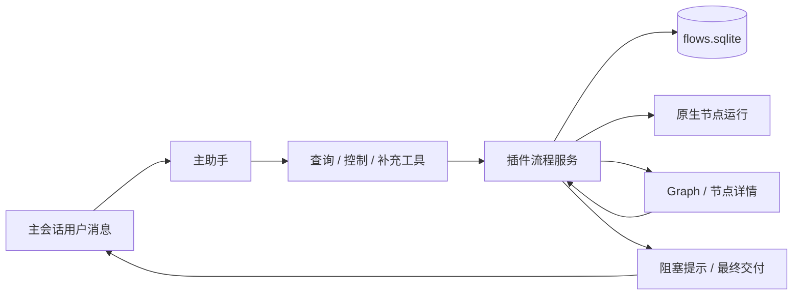

# Swarm Workflow 主会话管理：方案与实施记录

## 目标与本次范围

用户在发起 Swarm 的主会话里，通过普通消息查询状态、暂停/恢复/停止流程、
重试失败节点、补充输入并继续执行。右侧 Graph 与聊天工具使用同一个持久化
流程服务；关闭 Tab 不影响管理。独立插件不依赖 Workboard 或 agent-team。

本次完成查询与管理工具、阻塞反馈、操作回执、权限/并发/重启验证，以及运行中
传话的原生能力核验。动态修改 DAG、验收返工分支和运行中传话接入属于后续范围；
没有经过原生身份与投递验证，不能宣称当前 worker 已收到补充消息。

## Hermes 参考与差异

2026-10-05 查阅 Hermes main：Swarm 是 Kanban 上的任务图，聊天工具、CLI 与
Dashboard 共用任务内核。`kanban_list/show` 查询，`kanban_comment` 保存输入，
`kanban_unblock` 依据依赖恢复调度。聊天 profile 需显式启用工具集，worker 与
编排入口有不同的工具面。新评论可通过 `agent.steer()` 投递当前 worker；
解除阻塞仍不代表任务完成。

参考：[Swarm](https://github.com/NousResearch/hermes-agent/blob/main/hermes_cli/kanban_swarm.py)、
[工具](https://github.com/NousResearch/hermes-agent/blob/main/tools/kanban_tools.py)、
[Kanban 文档](https://github.com/NousResearch/hermes-agent/blob/main/website/docs/user-guide/features/kanban.md)。

我们复用现有 `swarmWorkflow.list/detail/control/intervene` 与 FlowEngine，不复制
原生消息历史，也不增加另一套调度器。工具管理范围严格限于当前发起会话。

## 工具契约

- `swarm_workflow_status`：默认查询当前未结束流程，若没有则查询最近流程；可显式
  指定当前会话历史 flowId 或 nodeId。返回状态、依赖、节点摘要、失败原因、
  可执行操作与不可执行原因。默认有界摘要，节点查询按需提供结果、提交证据、
  尝试及补充信息；不返回原生逐条聊天或派发信封。无流程给出明确空结果。
- `swarm_workflow_control`：`pause/resume/stop/retry`，指定 flowId 与查询所得 revision。
  暂停只停止后续派发；stop 进入停止中，收到原生终态才取消。retry 保持现有
  全部失败节点重试语义，工具提示应说明范围；单节点重试使用 intervene。
- `swarm_workflow_intervene`：指定 flowId、nodeId、revision、`note/continue/retry`
  与 text。note 保存到下次执行；continue 保留节点会话，新 run 继续；retry
  新会话重跑指定失败节点。continue 可使用明确的“继续已分配任务”输入，不能
  假造用户额外要求。模型转述补充注明主助手转交，不能伪造人工原文。

status 可在托管主会话使用；修改工具仅在该会话存在流程时提供。节点会话和普通
subagent 不获得管理工具。已有启动标记仍只开放 start，不混入后续操作。
普通主会话已有流程时，提示模型先查实时状态、明确指代、只按用户意图操作，
不接管节点工作、不自动重试。图已关闭不会因查询反复展开。

## 状态与一致性

“继续”先查询：paused 用 resume；明确失败且可继续，用对应节点 continue；
用户明确要求重做用 retry；运行中只能保存信息；uncertain 不能重放。多个
可能的目标必须明确选择，不能猜。completed/cancelled 只读，新目标另建流程。

调用绑定原生 sessionKey/runId/toolCallId 和活跃工具授权，在最终同步写入前
重新核验归属、父会话身份和 revision。pause/stop 仅要求当前原生父 sessionId
仍与创建流程时一致；修改项目、权限或开启规划模式后仍能暂停/停止原流程，
不能因此获得新的执行权限。resume/retry 与全部节点介入继续严格核验原始
项目、权限和策略。主会话与 Tab 共用 `contract.flowActions` 判断操作可用性：
正在运行且已发出最终投递时禁止 pause/stop；投递失败或未确认、流程已 blocked
时可以 stop，保留结果且不重发交付。

操作幂等键由原生 sessionKey/runId/toolCallId 与规范化动作派生，模型不能指定
会话或伪造操作来源；有界记录与状态在一次写入中保存。同一个原生工具调用
因回复丢失而重放，返回已接受及当前状态，不重复排队。新的 toolCallId 是新
请求，必须携带新的有效 revision；同一轮中的 pause/resume/pause 或同文补充
不会被误认成旧请求。过期 revision 返回结构化错误与重新查询提示，不自动
改变目标或扩大动作范围。

人工继续/重跑保持每节点最多三次执行；提交修正仍是每次执行最多三轮。
管理工具不能将节点强制标记完成、跳过验收或提升原始权限。查询不执行任务。

## 主会话反馈

工具结果返回 accepted、实际状态和下一步，主助手据此简洁答复，不能把“已请求”
说成“已完成”。后台仅推送需要处理的阻塞，包括流程已 blocked、节点仍为
running 且带错误的超时等待；一般节点变化显示于 Tab，最终交付沿用既有路径。
提醒只核验原生父会话身份，权限/项目/规划模式变化导致拒绝执行时仍可告知用户，
但不准入新的任务。阻塞按节点尝试
和原因生成稳定指纹，保存发送意图后再注入原生主会话；ACK 丢失或重启不盲目
重发，查询可显示提示投递尚未确认。通知保存有界的
身份/投递元数据，不保存一份聊天内容。异步发送后从最新流程合并确认，避免
覆盖同时发生的人工操作。通知失败不妨碍后续状态查询和人工处理。

通知循环与执行调度独立；慢请求不会拖住节点继续、派发和终态核对。通知循环
逐条重新读取当前流程，避免前一条发送期间流程已变化而写入过期快照。服务
停止时禁止新通知，等待已经发出的通知与调度请求结束后再关闭存储。

## 运行中传话核验

核对锁定 OpenClaw v2026.9.8 的公开接口，必须验证：能针对确切 run 投递、
不打断/替换插件拥有的 run、不自动启动另一个 run、能返回原生持久投递证据。
不满足条件则本次保留 note 的下次读取语义并记录结论，不以 `chat.inject`
伪造用户输入。未来接入后须区分保存、投递、未知，且继续沿用原生消息存储。

核验结论：公开 `runtime.subagent` 只有 run/complete/wait/history/delete；
`sessions.steer` 在 `sessions-messaging.ts` 将请求转换为 `queueMode: interrupt`
的 `chat.send`，参数没有期望目标 run。它可能中断旧运行、产生新运行或在旧运行
结束后启动后续任务，不能保持本插件当前 run 的提交与收敛身份。`chat.inject`
只追加助手消息，不等于 worker 收到用户输入。因此本次不接入这些方式作为实时
传话，继续准确使用“已保存，下一次执行读取”的语义。

## 实施与验收清单

- [x] 主会话工具、插件 manifest、按会话隔离与提示接通。
- [x] 状态摘要/节点详情/操作可用性，空结果与历史查询。
- [x] revision、原生调用授权、父权限变化、幂等与重启测试。
- [x] 节点 note/continue/retry 与 Tab 一致，完成节点和 uncertain 禁止重放。
- [x] 阻塞通知、同原因去重、发送失败/丢 ACK/并发更新验证。
- [x] 原生传话能力核验并记录可用或不可用的理由。
- [x] 隔离真实 Gateway 验证主会话工具查询与介入，不使用真实模型账号。
- [x] 相关测试、类型/构建/检查完成，更新功能与架构文档。

验收示例：“现在卡在哪？”能查到真实节点；“给验收节点补充路径并继续”
只续跑该失败节点；“暂停/恢复”不重复完成工作；同一原生调用重放不产生第二次执行；
其他会话看不到也无法控制本流程；重启后查询可恢复，通知不重复刷屏。

## 验收记录（2026-10-05）

相关 11 个测试文件、177 项测试通过，覆盖插件/流程引擎、管理工具、权限、
RPC/IPC 与节点人工输入界面。插件源码另用锁定运行时 SDK 声明做 strict
类型检查；应用 lint、构建和差异检查通过。

隔离真实 Gateway：`swarm-workflow.native-smoke.cjs` 设置
`SWARM_WORKFLOW_TEST_MANAGEMENT=1`，本地固定响应模型通过原生 Code Mode 调用 status，
在 Gateway 重启后通过主会话 control 恢复已暂停流程，再分别执行 note 和 continue。
验收第一次未通过后补充信息，同一验收会话继续，工作节点不重跑，第二次验收
通过后交付主会话；共 19 次模型调用，4 个节点，三个管理操作均获得接受回执。
同时验证暂停、重启恢复、阻塞提示与原生节点历史。测试使用
`SWARM_WORKFLOW_TEST_ENTRY=gateway-launcher.cjs`，直接加载已准备的 Gateway bundle；
原 CLI 包装入口当时缺少 root companion，首次启动未成功，本次未修改共享
运行时文件来掩盖该问题。隔离结果不能代替真实模型任务质量或发布包验收。

状态工具最多列出最近 20 个本会话流程，默认节点摘要最多 1200 字符；单节点
结果最多 8000 字符，提交证据最多 4 项，最近补充最多 5 条且各最多 1500 字符，
另给出总数/截断标记。完整原生消息仍在节点详情中读取。

此前人工介入与节点标题栏的界面优化另行验证：相关 4 个测试文件、28 项测试
通过，保存补充和重跑收进更多菜单，主操作简化为发送并继续/发送补充。

## Review 复核记录（2026-10-05）

多 Agent 复核发现并修正管理入口与 Tab 的边界差异：父项目/权限变化或开启
规划模式后仍允许原身份暂停/停止；最终交付未确认进入 blocked 后允许停止，
真正投递中的流程仍不可暂停/停止；两个入口共用操作可用性判断。幂等身份补入
原生 toolCallId，区分同一调用重放与同一轮中的新操作。通知覆盖流程已 blocked
但节点仍 running 的超时等待及父策略变化造成的执行拒绝，继续按稳定指纹去重。
工具、Gateway 与引擎控制入口拒绝非字符串或非法操作，防止停止请求误触发恢复。

复核回归覆盖父身份变化、权限/项目/规划模式变化、投递中与未确认投递、
同一调用重放、新调用及过期 revision、超时/策略阻塞通知、非法操作参数与 Tab
操作入口。运行中实时传话及动态 DAG 仍属于后续范围，
不借由本次修正扩大执行权限或复制原生历史。

最终复核：18 个相关测试文件、331 项测试通过，覆盖插件、共享契约、IPC/Gateway、
配置/扩展及 UI。插件 strict 类型检查、局部 ESLint、应用 lint/build、格式和差异
检查通过。修复后交叉审查未发现剩余阻塞问题。Review 期间再次通过隔离真实
Gateway 的 19 次固定模型调用：重启恢复、主会话查询/control/note/continue、
失败验收续跑和最终交付均通过；已完成工作不重跑。单行标题和人工输入的小屏
双主题组件预览无越界。这些结果仍不替代真实模型质量、完整 Electron 窗口和
发布包验收。

## 开发与发布运行时

开发环境使用前需将当前插件源码同步到运行时并预编译。
`npm run electron:dev:openclaw` 会准备运行时后启动应用；发布 `beforePack`
也会自动同步本地扩展并重新编译。普通 `npm run build` 或
`npm run electron:dev` 不会替换 vendor 中已经编译的插件，因此仅编译应用或
重启旧开发运行时，可能仍没有本次新增的主会话管理工具。验证应确认使用了
当前插件产物，不能用源码测试通过代替运行时同步。
