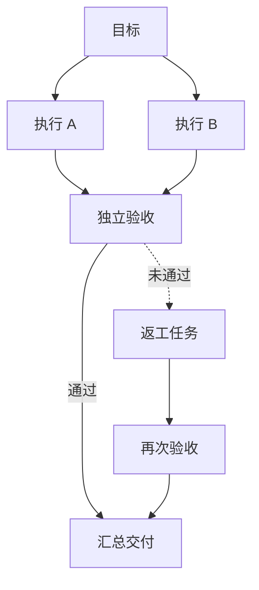
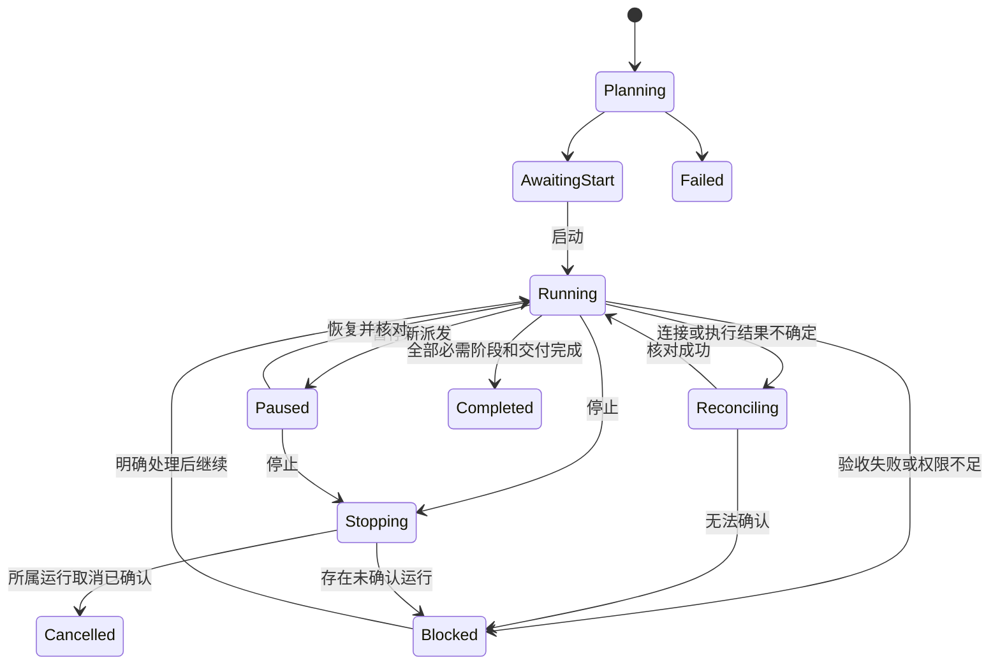
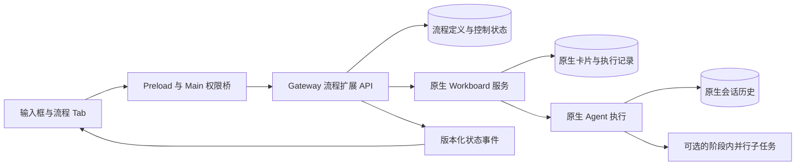

# Swarm Workflow 持久化协作流程规划

> 此方案已被后续的 [Swarm 独立任务流插件实施计划](swarm-workflow-implementation-plan.md) 替代。
> 不再依赖 Workboard，生成并校验任务流后自动推进；下文保留为早期设计参考。

状态：待实施设计。2026-10-04。本轮只编写规划，不改变现有代码行为。

## 目标与已确定的边界

在聊天输入框提供 Swarm 模式入口，由聊天提出目标，在右侧图形 Tab 查看和控制可恢复的协作流程。底层复用 OpenClaw Workboard 的任务、依赖和执行能力；不改变普通 Workboard 的入口、默认视图、卡片操作和既有任务语义。

本文中的“Swarm 模式”是产品层的持久化协作流程，内部可以使用原生 OpenClaw Swarm，但不等同于原生 collector 分组。界面首次使用时以一句话说明“按流程分工、验收并汇总，可稍后继续”。对外使用“Swarm 协作”，流程详情保留“工作流”概念；原生 collector 分组称“并行子任务”，避免同名混淆。

已有 [Swarm 并行协作实现](swarm-workflow.md) 是提示策略与原生任务组观察界面，还不是本文描述的流程系统。其代码继续保留在当前 worktree；本规划不宣称持久化调度已经完成。

## 原生能力与产品新增能力

| 能力 | 已核实的原生基础 | 本方案新增 |
| --- | --- | --- |
| 任务存储 | Workboard 卡片、依赖、尝试、结果证据和运行关联 | 流程身份、定义版本、阶段映射和控制命令 |
| 执行 | Gateway 原生子 Agent；Swarm collector 可供阶段内部使用 | 将批准的流程转换成真实任务 |
| 依赖推进 | 上游 done 后，下游才具备 ready 条件 | 验收条件、返工策略、流程整体完成判定 |
| 状态读取 | Workboard API 与变更通知 | 按流程读取的投影和右侧图形展示 |
| 恢复 | 原生卡片与运行记录可持久化 | 重连核对、派发去重、暂停和恢复语义 |
| Workboard 界面 | 独立看板及正常操作 | 不替换、不接管；仅提供原卡片跳转 |

Workboard 已列入当前运行时保留清单，但这不表示用户已经启用它或所有所需 API 都已集成。未启用时，入口展示原因及现有扩展设置入口，不静默启用插件，也不将普通执行伪装成持久化流程。

公开依据：
- [Workboard](https://docs.openclaw.ai/plugins/workboard)：持久化任务、依赖、调度和结果记录。
- [Swarm](https://docs.openclaw.ai/tools/swarm#limits)：原生 collector 与持久化工作流定义的边界。
- 本地基线：OpenClaw v2026.9.8 的 docs/plugins/workboard.md、docs/tools/swarm.md。
- 旧 TaskFlow API 已在本地基线移除，本方案不依赖它。

以下接口、存储和交互均为拟议设计；尚未核实的原生支持项集中列于实施阶段 P0。

## 与 Workboard 共存

### 数据隔离

每个项目首次启动流程时，创建或选择一个产品管理的专用 board。一个 board 可以容纳该项目的多个流程；用稳定 workflowId 区分，不用卡片标题、标签或聊天内容推断归属。

普通 board、普通卡片保持原样。禁止把用户原有卡片自动变成流程阶段，禁止用全局扫描认领“看起来相关”的任务。第一版不支持跨 board 依赖或把既有普通卡片导入流程。

专用 board 在原生 Workboard 中是正常可见的 board，流程节点是正常可见的卡片。原生“全部看板”可能因此出现新增卡片；这是数据新增，不修改其默认筛选来隐藏记录。用户可以正常打开、编辑和管理这些卡片。

不改默认 board，不抢占 Workboard 页面，不把打开聊天或右侧 Tab 变成切换 Workboard 筛选的动作。

### 写入与调度隔离

所有流程命令必须绑定 workflowId、预期版本及已登记的 cardId，服务端验证项目、会话与权限。调度只允许触及该流程被授权的阶段，不能借“启动 Swarm”对用户整个 Workboard 执行 dispatch。

专用 board 不是充分的并发隔离：同一 board 有多个流程时，必须使用精确卡片范围的派发/领取能力。若原生接口只有 board 级调度，P0 必须补足受限适配接口或调整隔离粒度，不能直接放宽成全 board 启动。

普通 Workboard 的人工操作继续有效。对于本流程已登记卡片：
- 标题、说明等非执行变更刷新到图中，不反复覆盖用户修改。
- 负责人、依赖或状态的外部修改触发一致性核对；影响计划时显示“流程已在看板中变更”，暂停自动推进，允许用户采纳新版本或修复。
- 人工将验收卡片移动到 done，不自动等同于验收通过；流程需具备匹配当前结果版本的验收证据。
- 卡片删除或 board 归档后，流程显示缺失/不可用并停止推进，不偷偷重建。
- 撤销依赖、重新打开上游阶段时，使相关验收失效，并阻止过期结果驱动后续阶段。
- 普通 Workboard 用户仍可直接启动卡片。若它与流程计划冲突，流程标记人工干预并停止自己的调度，不能声称可约束所有原生管理员操作。

隔离验收必须覆盖“普通看板与多个 Swarm 流程同时运行”，而不只是单流程成功。

## 用户操作路径

### 输入框入口

在现有输入框工具区增加一个分支/节点图标按钮，位置靠近执行选项。未开启仅显示图标及悬停提示“Swarm 协作”；开启后增加短标记“Swarm”和高亮，不能只用颜色表达状态。

点击弹出轻量配置：
- 一个“Swarm 协作”开关。
- 三个小图形模板：自动分工、并行研究、协作审查。短标题用于理解，图示用于区分。
- 进阶区域设置并发上限及角色分配，默认折叠。角色来自已配置且原生权限允许的助手，不虚构 Agent 身份。
- 第一版固定包含独立验收和汇总；移除当前可选“独立检查结果”复选框，避免把必要关卡做成提示偏好。
- 关闭弹层返回输入；打开开关不会立即执行。

这三个选项将成为版本化的真实流程模板，不再只是三段提示文字。自动分工允许规划 Agent 提议执行节点，但必须通过结构和权限校验后才保存。

选择按当前草稿保存，提交成功后清除；切换会话不串选项。发送失败保留文字和选项。正在执行时不能重复创建同一请求，发送按钮显示创建进度。

计划模式、斜杠命令、只读/远程受管会话、旁路聊天不提供混合启动。首次聊天应先取得规范会话身份，再创建流程，失败时不留下可执行的孤儿任务。

### 发送与启动

1. 用户输入目标并发送，主聊天记录正常用户消息。
2. 服务创建有稳定身份的流程草稿，右侧自动打开“Swarm” Tab。
3. 规划阶段生成有限规模的任务图、角色、交付物与验收条件。新增任务数量和并发受产品及原生上限共同约束。
4. 右侧展示规划预览。第一版统一由用户点击“启动”后才执行工作阶段；这是产品内确认流程范围，不是每个节点反复审批。
5. 服务保存并锁定该次执行的定义版本，创建/关联 Workboard 卡片，完整就绪后再调度。
6. 各阶段输出经校验后交给下游；独立验收通过才启动汇总。
7. 最终结果回到关联主会话；右侧保留流程与交付物入口。

配置开启、草稿创建、启动请求成功、工作执行成功必须使用不同状态，不能在仅保存草稿时显示“已启动”。

### 后续聊天

第一版每个主会话最多有一个未结束的流程，完成后可以创建新流程。历史流程通过 Tab 顶部选择器查看。

普通后续聊天继续与主 Agent 对话，不自动加入或修改流程。用户可以从输入框明确选择“补充到当前流程”，系统先展示变更影响；已开始执行的节点不原地改任务正文，而是暂停推进后形成新修订。

“继续”“重试”“补充要求”必须绑定明确流程和修订。自然语言有歧义时只生成操作建议，不能猜测后重新派发。跨聊天自动接管旧流程不在第一版范围内。

## 右侧 Tab 的视觉设计

保持主聊天宽度与消息语义。复用现有侧栏 Tab、展开、关闭和文件预览机制，工作流不作为大块聊天消息插入。

### 默认画面

```text
┌ 主聊天 ─────────────────┬ Swarm  ·  文件  ·  … ───────────┐
│ 用户目标                │  流程名称  ▾        ⤢   ×       │
│                         │  ● 运行中             3 / 6     │
│ 主 Agent 的必要回复     │                                 │
│                         │             ◇ 目标              │
│                         │          ┌──┴──┐                │
│                         │        ✓ 调研  ↻ 分析           │
│                         │          └──┬──┘                │
│                         │           ◇ 验收                │
│                         │             │                   │
│                         │           □ 交付                │
│                         │                                 │
│ 最终汇总与交付物        │  状态图例        −  ＋  ⊙  ⏸   │
│                         ├─────────────────────────────────┤
│ [附件] [Swarm] 输入…    │  选中节点的简要详情（按需展开） │
└─────────────────────────┴─────────────────────────────────┘
```

以上符号是线框示意，实施复用项目现有矢量图标库，不把字符/emoji当作正式图标资产。

### 图形语义



持久化流程图的实线表示真实依赖，虚线表示返工关系。一个运行版本内保持无环依赖图，返工生成新的尝试或修订节点，历史不删除，不通过绘制无限循环掩盖执行次数。

节点只显示角色图标、短标题、状态及必要的负责人头像。模型名称、时间、错误详情、验收规则移入点击详情；长标题省略并提供完整提示。不能省略区分任务所需的短名称。

状态采用图形与颜色双重编码：空心圆待执行、旋转弧执行中、勾号完成、暂停符暂停、感叹号阻塞、叉号失败。原生 run 成功与验收通过使用不同含义的节点状态，不把二者混为“完成”。

提供缩放、平移、适应画布、状态突出显示、节点选中、键盘导航。窄面板使用纵向布局和平行分支折叠，宽面板展开分支。布局随状态更新保持稳定；只有拓扑变化才重新排布。

### 详情与操作

- 单击节点：打开 Tab 内底部详情，显示负责人、简要状态、交付物与验收结果。
- “查看过程”图标：复用原生子任务详情，不复制 transcript。
- “在看板中打开”图标：通过既有 Workboard 能力打开对应卡片，保留当前聊天。
- 底部控制：暂停、恢复、停止；失败节点按条件提供重试；危险或有歧义的动作保留短文字。
- 图标有 tooltip、aria-label、可见焦点和禁用原因；不能为了少文字牺牲可发现性与无障碍。
- 默认只显示当前修订，历史尝试折叠在节点内；历史流程切换不会自动恢复执行。

### 页面状态

| 场景 | 显示与动作 |
| --- | --- |
| 未创建 | 小型流程示意与“在输入框开启 Swarm” |
| 规划中 | 规划节点加载态；允许取消 |
| 待启动 | 完整计划预览与明确“启动”按钮 |
| 执行中 | 实际节点状态，已完成/总数；不显示虚构百分比 |
| 验收未通过 | 标出问题节点，显示返工或需要用户处理 |
| 等待用户 | 对应节点高亮，显示简短问题与操作 |
| 断连 | 保留上次快照并标注更新时间，禁止误导性的可执行按钮 |
| 暂停 | 解释“停止派发新阶段，已运行任务继续” |
| 停止中 | 等待原生取消回执，不立即把所有节点标为已停止 |
| 完成 | 交付物入口、验收结论与仍存在的限制 |
| 外部冲突 | 标记被改动节点，提供查看看板与核对入口 |
| 插件禁用 | 显示不可用原因，不自动重启/开启扩展 |

关闭 Tab 只影响显示订阅，不停止流程。关掉整个应用后是否继续取决于 Gateway 是否仍运行；不能承诺电脑关机后继续执行。

## 流程语义与执行约束

### 状态机



暂停不取消正在执行的任务；停止取消已登记的所属运行并阻止新的派发，不影响同会话之外的任务或普通 board。继续必须先重新读取原生状态。修改计划与操作命令采用预期版本校验，防止多个窗口同时操作导致覆盖。

验收由独立阶段执行，输入为当前执行阶段的交付物及证据引用，输出为结构化 verdict、问题列表和所审查的输入版本。结构不合法、缺少证据、执行失败、输入已变化都不能视为通过。模型判断仍可能出错，因此界面提供验收证据，而不声称质量绝对正确。

第一版最多允许一次有证据驱动的自动返工；额度耗尽转 blocked。自动返工只适用于明确允许的可重复任务。支付、发送、部署等外部副作用不自动重试。人工接纳未通过的结果是明确记录的例外，不伪造为“验收通过”。

最终完成必须同时满足：必需节点已满足、当前版本验收通过或有显式人工例外、汇总交付阶段完成、没有未确认的所属运行。主聊天收到 final 不能单独决定整个流程完成。

## 技术架构与数据归属



优先实现独立的 Gateway 流程扩展，复用 Workboard 公开服务。流程调度放在 Gateway 生命周期内，不能由 Renderer 的定时器驱动。若缺少扩展间可调用的受限接口，先补明确的服务契约；禁止直接修改 Workboard SQLite 表或拷贝其内部实现。

数据只有各自唯一的权威来源：
- Workboard：卡片、依赖、claim、原生尝试和运行关联、成果引用。
- 流程扩展：workflowId、定义及版本、阶段映射、启动批准、验收绑定、控制状态、去重键和操作审计。
- JustDo Main：产品会话/项目与 workflowId 的映射及权限，不存消息正文。
- Renderer：当前图形投影、选中节点、布局偏好；不新增 transcript 缓存。
- OpenClaw：实际执行、工具权限与原生会话历史。

一个阶段映射一个 Workboard 卡片，原生多次尝试不创建多份虚假阶段。阶段内部原生 Swarm 子任务通过 run/session 引用展示，不把每个 collector 自动复制成看板卡片。

拟议最小流程 API：prepare、read、start、pause、resume、stop、retry、revise。每个写入包含 requestId 与 expectedRevision；返回规范 workflowId、revision 和真实操作状态。新增接口名称在实现时使用常量和严格类型，不能把本节名称当作上游已有接口。

模型通过受限的流程工具读取和提出变更，所有控制走同一服务端验证；不能用提示词要求代替写入权限与版本约束。

## 原子创建与恢复

流程定义与 Workboard 卡片跨存储时不能假定一个数据库事务覆盖全部。采用准备、映射、验证、激活四步：
1. 保存幂等创建请求和未激活的流程定义。
2. 以稳定阶段键创建不可派发的卡片并持久化映射。
3. 核对全部卡片与依赖完整，保存启动授权及定义版本。
4. 只向本流程允许执行的入口节点开放派发。

准备中断后按 requestId 恢复，不重复创建。半成品在原生看板中如实标明尚未激活；不得有一半流程已经执行、另一半不存在的情况。卡片在创建与映射之间遇到未知结果时，需要原生幂等标识或可查的稳定外部引用；缺少该能力属于 P0 阻塞项。

每次派发记录 intent 与对应原生 receipt。超时先查询 receipt/run，不能把请求超时当作未启动而再次执行。不承诺跨进程“恰好一次”，以幂等命令和未知状态核对防止重复副作用。

Gateway 启动、重连、收到原生变化事件后核对未终结流程。事件采用 revision/cursor，断线后重读规范快照；事件处理幂等。最终结果通知使用持久化去重记录，不能因重新打开 Tab 重发主聊天消息。

## 实施顺序

| 阶段 | 交付内容 | 进入下一阶段的条件 |
| --- | --- | --- |
| P0 能力验证 | 隔离环境验证 Workboard 的卡片创建、依赖、精确派发、结果读取和重启核对 | 明确最小扩展接口与缺口，真实执行成功；不改普通 board |
| P1 流程内核 | 固定并行执行→验收→汇总模板；存储、版本、启动、暂停、停止和去重 | 无 UI 也能重启恢复；重复命令不重复执行 |
| P2 产品界面 | 输入框按钮、计划预览、右侧真实 DAG、详情与状态操作 | 生命周期来自服务端，视觉及键盘交互完成 |
| P3 共存与恢复 | 外部编辑冲突、多流程并行、插件禁用、未知派发结果与停止核对 | 故障注入和普通 Workboard 回归通过 |
| P4 模板扩展 | 研究/审查模板、角色配置、受限返工和计划修订 | 每个模板有独立验收条件与预算 |

P0 尤其要确认：精确阶段派发、稳定创建去重标识、原生暂停/停止粒度、外部变更事件覆盖、独立验收证据存储、原生 UI 深链能力，以及角色工作目录与项目权限的匹配。接口不足时写出差距及最小扩展方案，不能用轮询聊天文字补足。

第一版不做任意流程拖拽编辑器、跨机器调度、跨项目工作流、无限自主循环、动态组织管理或全局任务中心。先把一个可恢复的端到端流程做实。

## 对现有 worktree 的调整计划

- 复用现有右侧 Tab、画布交互、状态图标、详情入口、明暗主题和无障碍实现。
- 将现有原生分组图保留为“并行子任务”视图；不能直接把归属连线改名为流程依赖。
- 输入框从“追加协作提示”升级为“创建流程草稿”；工作流执行不再依赖隐藏的提示后缀。
- 三种提示模式替换为真实模板，旧实现说明保留并标注适用范围。
- 已有历史消息的准确后缀剥离逻辑是否保留，按已产生数据评估；不能新增广泛清洗逻辑。
- 不自动把已有 collector 组转为工作流，不为旧运行补造验收与流程历史。
- 本轮不迁移、不合并代码；实施时同步更新引擎、插件、聊天渲染及数据归属文档。

## 验收清单

### 用户体验

- 新聊天、已有聊天均可从按钮完成规划、预览、启动。
- 主聊天只显示目标、必要交互和最终成果，详细流程留在 Tab。
- 窄宽布局、明暗主题、大分支、长标题、键盘操作和减少动画设置正常。
- 关闭/重开 Tab 恢复同一个流程；应用重启后能从主会话重新定位。
- 等待验收、等待用户、断连、停止中和外部冲突都有明确显示。
- 图标可理解，重要状态与危险操作不依赖单一颜色或无标签图标。

### 执行可靠性

- 完整跑通至少两个真实模型工作阶段、独立验收和汇总。
- 验收失败、无结构化结果、过期证据均阻止推进。
- 创建中断、派发未知、重复点击、并发操作、进程重启不会重复执行已确认任务。
- 暂停不派新阶段，停止不影响无关任务；不确定的取消结果如实显示。
- 权限不足、插件禁用、工作目录不匹配时明确阻塞。
- 达到预算/返工上限后停止自主循环。

### Workboard 无干扰

- 普通 board 的创建、编辑、拖动、派发、完成和删除保持原行为。
- 开启 Swarm 不修改普通 board 的默认值、自动化设置或卡片。
- 多个流程之间不误派发、不串证据、不共享错误的阶段身份。
- Workboard 外部编辑能够反映到流程且不会被静默覆盖。
- 删除流程与删除原生卡片分开定义；第一版默认归档流程记录，不级联删除用户资产。
- 不建立第二套消息历史或复制原生卡片状态作为另一个权威来源。

发布门槛是以上真实运行、恢复和共存验证完成；组件测试和图形预览不能代替执行验收。
