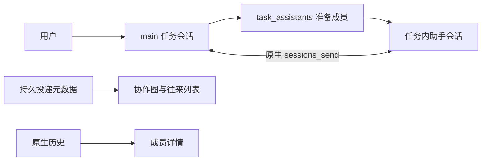

# 一条用户会话下的多助手协作

状态：原生通信替换已经接入。本文保留原链接，记录现行设计与早期方案的差异；详细生命周期和代码依据集中在[任务内多助手协作](multi-agent-collaboration.md)。

## 已落地的设计

用户输入固定交给 main；模型通过 `task_assistants` 准备当前任务的助手会话，然后使用原生 `sessions_send`。Main 管理任务归属、发送准入、停止与投递元数据，OpenClaw 执行并保存消息。协作与 Subagent 树分别展示。

## 与早期提案不同的约束

| 主题       | 当前行为                                                  |
| ---------- | --------------------------------------------------------- |
| 开关       | 可选 agent-team Extension 默认关闭，用户明确启用          |
| 邀请       | 锚点会话按需增加成员；普通成员不能任意扩大 roster         |
| 容量       | 最多 12 名成员；每用户轮次最多 16 次投递                  |
| 入口       | 聊天工具栏有协作入口，可重开图与历史                      |
| 正文       | 由 Runtime Services 按原生 receipt 读取；产品数据库不保存 |
| 停止与删除 | 停止冻结轮次；删除有持久进度和部分失败重试                |
| 助手删除   | 保留历史身份和角色文件，产品入口拒绝再次调度              |

## 仍然不能承诺的能力

共享项目文件没有自动 worktree、合并或写冲突隔离；未知接收结果不自动重放；角色文件编辑检查不等于原生原子锁；模拟模型测试不能证明真实模型会正确分工。

[早期完整提案](../archive/task-scoped-collaboration-proposal.md)保留了当时的范围、候选交互和验收目标，其中的“尚未实施”及迁移步骤仅描述历史阶段。
