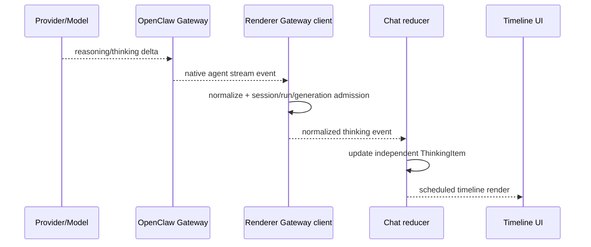

# Thinking Stream 实现与维护说明

> 本文已按 `v2026.8.12` 重写。Thinking 流已经实现；本文描述当前协议链路、历史恢复、显示边界和 OpenClaw 升级要求。

## 1. 目标与边界

Thinking Stream 让用户在支持 reasoning 的模型执行期间看到独立的思考过程，并在历史重载后保留可显示的 reasoning 内容。它必须与最终 Assistant 回答分离，也不能暴露 Provider 未授权返回的内部数据。

JustDo 不自行生成 reasoning，也不从普通回答里的自然语言推断 thinking。只有 OpenClaw/Provider 明确提供的 thinking、reasoning 或 redacted-thinking 内容，经过 Gateway 的显示投影后才进入该通道。

## 2. OpenClaw v2026.8.2 原生能力

OpenClaw v2026.8.2 已原生提供实时 thinking、think-tag 归一和历史 display projection，因此旧的 002–004 补丁已删除。JustDo 通过版本化 wire 校验、Renderer Gateway client 和 reducer 直接消费这些能力；不得为兼容旧 bundle 再恢复历史 patch。

升级 OpenClaw 时仍需逐项验证实时 delta/snapshot、终态顺序、历史 reasoning/redacted-thinking 和 consumer 行为。Pristine contract test 负责证明能力来自锁定上游产物，而不是被开发 runtime 中的残留补丁掩盖。

## 3. 实时链路



`gateway/client.ts` 直接接收 OpenClaw 事件，`ChatController` 绑定 session/run/lifecycle 身份并交给 `agent-event-reducer.ts`。Main adapter 只保留产品会话生命周期、Goal 和审批协调，不建立 Thinking/Tool/Content 消息身份，也不通过 Electron IPC 复制正文。

Renderer 只接受属于当前 transcript session/run/lifecycle 的事件，并遵守 agent sequence。重复、倒序或已终态 run 的迟到 thinking 不会再次应用。

## 4. Transcript 表示

Thinking 使用独立 `ThinkingItem`：

```ts
interface ThinkingItem {
  type: 'thinking';
  status: 'running' | 'completed' | 'failed' | 'cancelled' | 'interrupted';
  text: string;
  runId: string;
  firstSeq: number;
  lastSeq: number;
  startedAt: number;
  updatedAt: number;
}
```

它与 `ContentItem` 分开，因此：

- reasoning 不会被复制进最终 Markdown；
- thinking 与工具调用的相对顺序可以保留；
- abort/error 能单独收敛 thinking 状态；
- 历史投影可显示 reasoning，而不改变 Assistant 答案文本。

Reducer 负责合并 delta 和状态，组件不维护额外 thinking buffer。

## 5. UI 行为

活动 timeline 将 thinking 作为独立过程块。运行时可以显示动画状态；完成后进入过程摘要/详情体系。它不应抢占最终回答的视觉层级，也不应逐 token 触发辅助技术播报。

显示规则：

- waiting 与 thinking 是不同状态；尚无 reasoning 时不要伪造空 thinking 卡；
- thinking 完成后仍可在过程详情查看；
- 用户 abort 时标为 cancelled/interrupted，而不是 completed；
- run 错误时保留已有 thinking，并显示明确终态；
- 组件文案使用中英文 i18n，不硬编码模型专用术语。

## 6. 渲染调度

Thinking delta 与回答 token 共用 transcript revision 和 `StreamRenderScheduler`。普通更新合并到 animation frame，非浏览器环境退回 microtask；终态通过 flush 立即发布。工具 partial 另有 80ms 节流，但这不意味着 thinking 事件必须等待工具计时器。

组件应渲染已归约的文本，不为每个 token 新建 DOM 节点。长 reasoning 同样受聊天 Markdown/文本安全边界保护，不能绕过现有转义、链接和代码块处理。

## 7. 历史恢复

实时事件只负责当前过程；重启应用、切换会话或重连后的显示必须以 Gateway 历史为准。OpenClaw v2026.8.2 原生 `chat.history` display projection 保留可显示的 reasoning 和 redacted-thinking，Renderer `project-history-timeline.ts` 将其恢复为独立时间线项。

历史请求带 session 身份与 `historyGeneration`。响应过期时被丢弃，防止旧会话 thinking 覆盖当前会话。不存在 Main/SQLite transcript fallback；Gateway 暂时不可用时保留现有有界显示状态并走连接恢复，不能从最终回答反向伪造 thinking。

## 8. Provider 和模型差异

并非所有模型都发送 reasoning，也不是所有 Provider 采用相同事件形状。OpenClaw Gateway 负责上游归一，Renderer 不按模型名称分支。对没有 thinking 的执行，UI 只显示 waiting、工具和回答等真实项目。

redacted-thinking 表示 Provider 允许传递的受保护投影。JustDo 应按 OpenClaw 提供的显示内容处理，不尝试解密、还原或拼接隐藏 reasoning。

## 9. 终态、重连与幂等

- final：关闭 running thinking，并与回答一起结束 turn；
- abort：将未结束 thinking 投影为 cancelled/interrupted；
- error：保留已有文本，标记失败并显示 run 终端错误；
- 重复终态：按 run 与 sequence 幂等忽略；
- 迟到 delta：由终态近期 run guard 拒绝；
- Gateway 重启：lifecycle generation 隔离旧连接事件，随后以历史恢复。

这些规则与普通聊天事件共用同一 reducer 状态机，不能在 thinking 组件中另建“是否完成”布尔值。

## 10. 日志与诊断

主进程的 `gatewayLogFilter.ts` 会压缩 thinking、assistant 和 item 流，每个 run/流段通常只保留首尾事件，文本预览也有限长。主日志中看不到每个 reasoning delta 是预期行为。

诊断缺失或乱序时：

1. 先记录 session id、run id、lifecycle generation 和时间范围；
2. 查看当日 Main 日志与 Gateway 日志；
3. 根据 `[gateway] log file:` 指向的 OpenClaw 原生 JSON 日志核对完整事件；
4. 检查 Renderer Gateway client 是否收到并规范化 agent event；
5. 最后检查 controller 的会话/generation/sequence 过滤和 reducer 状态。

原生日志可能含用户内容或敏感信息，不应原样提交到仓库。

## 11. 安全和隐私

Thinking 可能包含比最终回答更敏感的上下文。维护时必须遵守：

- 不在新增日志中打印完整 thinking、凭证、header 或 Provider payload；
- 不绕过 Gateway 的 display projection；
- 不把 reasoning 自动复制到剪贴板、通知或计划标题；
- 导出/分享功能若包含 thinking，必须有明确的产品约定；
- Markdown 按普通不可信模型输出进行净化和链接限制。

## 12. 测试要求

至少覆盖：

- 单个和多段 thinking delta 的顺序合并；
- thinking、tool、content 交错时的稳定次序；
- 重复/倒序 sequence、错误 session/run/lifecycle；
- final、abort、error 对运行中 thinking 的收敛；
- 终态后的迟到 delta；
- Gateway 历史恢复 reasoning/redacted-thinking；
- history generation 过期结果被拒绝；
- 无 thinking 模型不显示空过程块；
- 高频 delta 经调度器合并但终态立即出现；
- 中英文状态和 disclosure 无障碍行为。

测试分布在 Renderer controller/reducer/history projection/component 测试、Main OpenClaw lifecycle adapter 测试，以及补丁安装/能力验证脚本中。

## 13. 升级检查清单

升级 OpenClaw 或模型 SDK 时逐项确认：

1. 实时 thinking、think-tag 归一和历史 projection 仍由 pristine 上游提供；
2. Gateway 实时事件名称、delta/snapshot 语义和终态顺序；
3. 历史 API 是否仍返回 display projection；
4. reasoning 与 redacted-thinking 的字段结构；
5. Adapter 的 message id、run id 和 lifecycle 绑定；
6. 主日志过滤是否仍能保留足够首尾诊断；
7. 实时与历史测试是否得到同样的独立 thinking item。

只有实时、终态和历史三条路径都通过，Thinking Stream 才算兼容新版本。

## 14. Event 与 Item 对照

| 输入                   | Transcript动作                          |
| ---------------------- | --------------------------------------- |
| 首个thinking delta     | 为当前run建立running ThinkingItem       |
| 后续合法sequence delta | 追加同一item并更新lastSeq/updatedAt     |
| metadata/model更新     | 更新关联信息，不复制正文                |
| final                  | flush调度并收敛completed                |
| abort                  | 收敛cancelled/interrupted，保留已有文本 |
| run error              | 收敛failed并保留诊断上下文              |
| 重复/倒序/foreign run  | 拒绝，不改变当前item                    |
| history reasoning      | 投影持久item并takeover对应live项        |

## 15. Snapshot 与 Delta 兼容

Provider/Gateway可能提供增量或累计snapshot。归一层必须明确语义，避免把snapshot反复append造成指数重复，也避免把delta当snapshot覆盖已有内容。Renderer只消费统一事件；兼容分支应在patch/adapter并配fixture测试，不能按模型名写在组件中。

## 16. 隐私与导出

Thinking可能包含系统上下文、工具规划和敏感推断，其风险高于最终答复。当前显示不等于默认允许通知、剪贴板、日志或导出。若导出包含thinking，必须明确用户选择、格式标识和清洗；redacted-thinking只能显示Gateway提供的投影，禁止尝试还原隐藏内容。

## 17. 代码证据地图

实时来源是 OpenClaw 原生 event，Renderer `GatewayClient` 直接接收，由 `agent-event-reducer.ts` 归约，`project-history-timeline.ts` 恢复历史，stream scheduler 控制发布。Pristine、client、controller、reducer、projection 和 scheduler tests 共同构成证据，任一层缺失都不能宣称端到端支持。

## 18. 故障定位决策

原生日志有 reasoning 但 Renderer client 无事件：检查 v2026.8.2 wire 与 WebSocket generation；client 有事件但 UI 无 item：检查 session/run/generation/sequence admission；实时有而重载消失：检查 history display projection；文本重复：检查 delta/snapshot 语义；final 后仍动画：检查 terminal flush 和 item 收敛。

## 19. 完成定义

新增Provider或升级runtime后，要用同一场景验证实时文本、tool交错、terminal、abort/error、重连/history和无thinking模型。高频流不得逐token重建整个DOM，日志/导出不得意外扩大reasoning暴露。
