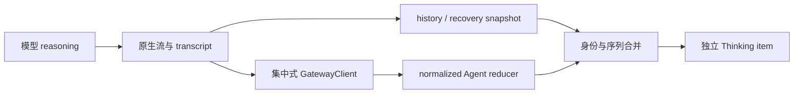

# Thinking 流：显示、恢复与诊断

Thinking 显示来自模型经 OpenClaw 输出的 reasoning 内容。应用不推测或生成模型未返回的内部过程；当前原生协议已承担实时与历史 reasoning，本页不再列旧版本实现补丁。

## 1. 用户能看到什么

支持 reasoning 输出的模型在运行中产生 Thinking item，与正文和工具卡分开展示。没有 reasoning 可能是模型能力、provider 配置或原生返回决定，不能仅因 UI 没显示就补造一段“思考”。

历史恢复读取原生 reasoning/redacted-thinking 投影；受保护或缺失部分按原生语义显示，不尝试从工具结果反推。

## 2. 数据流

Main 不复制文本流；摘要日志不是完整流证据。Renderer 统一归一化，再交 model/reducer，不能在每个组件解析 provider 特定字段。

## 3. 段与序列规则

delta 表示追加，snapshot 表示累计内容，replaceable 表示可替换片段。错误混用会产生重复或丢字。Thinking 与工具前正文各有 owner，工具介入后不能把所有 reasoning 拼成一段移动到 turn 开头。

历史恢复可能先于延迟 snapshot 到达。recoveredSnapshotText 和 owner sequence 用于接管，不应推进整个 run 的 live fence。旧连接、旧 session、旧 run 和已终态事件分别拒绝。

## 4. 终态与恢复

完成、失败、取消、中断是不同 process status。用户停止成功后该 run 受 terminal fence 保护，即使没收到最后一条 thinking event，也不能一直显示运行中。断线不立刻伪造完成；重新读取原生状态与历史后收敛。

刷新后保留哪些内容由原生 transcript 决定。应用只恢复可见投影，不把内存 reasoning 作为永久副本写入 SQLite。

## 5. 性能和交互

按 frame 合批与平滑揭示减少高频重排，但保留真实段边界。展开/折叠属于本地显示状态，不改变持久内容或原生状态。用户向上阅读时 Thinking 更新不能持续抢滚动位置。

## 6. 排障和测试

| 症状                                | 检查点                              |
| ----------------------------------- | ----------------------------------- |
| 原生日志有 reasoning，client 无事件 | 连接 generation、订阅与 wire        |
| client 有事件，UI 无 item           | session/run admission 与 reducer    |
| 文本重复                            | delta/snapshot 归一与历史接管       |
| 实时可见，刷新消失                  | 原生历史 display projection         |
| 停止后仍动画                        | 停止回执、terminal fence 和状态样式 |

回归入口包括 agent-event-reducer、segment-history、controller segment-recovery 和 history-reconciler tests。升级时验证最终锁定 runtime 的实时、终态与重载结果，不以残留开发补丁掩盖原生契约缺失。
