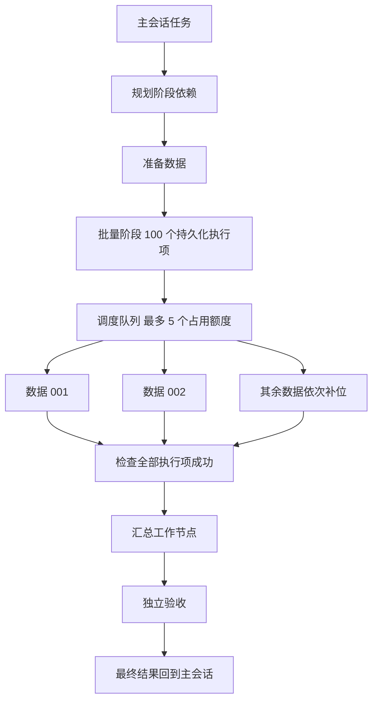

# Swarm Workflow 批量执行契约

本文维护已接入的批量清单、全局调度、长任务、产物和单项重试契约。普通阶段与主会话管理见[Swarm Workflow](swarm-workflow.md)。这里的支持范围不等于真实业务模型质量或所有平台安装包已验收。

## 用户流程

用户先在插件设置中调整 Swarm 全局并发；若希望 5 项同时执行，设为 5，且原生 main 容量至少为 6。任务中的并发要求只能进一步收窄，不能把默认全局 3 自动提高到 5。然后在目标项目的输入框加号菜单选择 Swarm，发送任务，例如：

> 处理项目 data 目录中的全部 100 份数据，每份单独分析并生成结果，全部处理完成后做汇总。使用最多 5 个并发，每份任务预计需要两小时。

1. 主会话整理完整目标、输入位置、处理规则、验收条件及用户指定的助手。
2. 规划器输出前置阶段、批量处理阶段和汇总阶段；插件读取并冻结实际数据清单，生成执行项。
3. 自动打开右侧 Tab，默认显示阶段图。批量阶段显示完成数量、运行数量和失败提示。
4. 调度器持续补充空闲执行额度。用户点开批量阶段，查看、搜索或筛选每份数据的状态，点执行项进入原生会话详情。
5. 失败项可补充说明并重新执行，单项或批量重试均创建新的原生会话和尝试目录，沿用冻结输入。首版批次项不提供原会话继续，普通阶段保留已有继续入口。其他独立执行项继续处理；全部必要执行项成功后，才释放汇总及最终验收。

输入目录不存在、清单有重复或越界、指定助手不可用时，显示明确原因并阻塞。不能以模型声明“100 份”代替实际枚举，也不能在读取失败后凭空补齐执行项。



## 阶段与执行项模型

批量阶段区分三个对象：

| 对象       | 责任                                                     |
| ---------- | -------------------------------------------------------- |
| 工作流阶段 | 记录依赖、任务模板、助手指派、批次入口和汇总条件         |
| 批次清单   | 固定输入集合、顺序、版本、输入身份和输出位置             |
| 执行项     | 记录某份数据的状态、尝试、启动意图、原生会话、结果及证据 |

批量阶段本身是容器，不运行一个额外助手。每份数据生成独立的工作执行项和原生会话，内部身份由服务生成，并绑定工作流、批次及清单版本。相同文件名、不同目录、不同工作流不能混淆；相同发起身份重放不得重复展开。

模型负责选择批量阶段、依赖关系、处理模板及用户明确指定的已有助手。服务负责枚举真实输入、校验清单和生成执行项，模型不逐条生成 100 个内部 ID。默认执行助手继续为 main；指定其他助手时保留现有用户原文依据和准入检查，不要求创建 100 个助手配置。

具备批量输入权限时，规划结果的每个任务都必须明确声明顶层 `batch` 字段：普通准备/汇总任务为 `null`，批量任务为 `{"source":{"kind":"jsonl","path":"项目内清单路径"}}` 或文件集合描述。写在 `task` 文本里的描述不构成批量阶段。批量任务说明是单个执行项的处理模板；展开、派发及并发限制由服务负责，执行项不能再要求创建整个批次。准备节点可以生成清单，但必须使用规划时确定的固定路径，批量阶段依赖准备完成后才冻结该路径。

JSON、任务结构、批量字段、阶段配置或依赖校验失败时，在没有派发任何工作节点的前提下，将具体错误反馈给规划模型，最多追加三轮纠正。纠正仍是同一规划节点/尝试中的新原生运行，复用原生会话，保留权限和并发约束；必须先确认上一运行及工具清理收敛，不重放未知启动。错误摘要及轮数作为业务状态持久化，暂停/重启保留预算，人工重试新尝试时清空。助手不可用、授权能力缺失等准入问题不归为格式纠错，不能通过纠错放宽权限。已完成工作后的结果提交纠错仍只允许修正提交，不能补做数据处理。

首版支持两种输入：项目内的文件集合，以及项目内的 JSONL 清单。文件集合允许目录和受限文件匹配模式；JSONL 的每条记录必须有唯一引用键和有界输入字段。清单可由用户预先提供，也可由已完成的上游准备节点生成。远程队列、无限数据流和运行中持续追加数据不纳入首版。

后台服务上下文不自动获得父会话 fsPolicy，不能使用 Node 文件访问绕过会话权限。首版只读取已核验的父项目根内材料；核对父身份、有效权限、真实路径、符号链接、重复键、数量和大小，不接受 Renderer 或模型提供任意授权根。异步枚举前后、输入复制前后及冻结事务提交前再次核对当前准入；撤权后不得继续冻结或派发。项目外材料需要已有明确授权的原生材料能力，首版不开放任意外部路径。

冻结包含真实输入内容身份。服务使用独立 UUID 快照目录，以清单内容 hash 绑定版本；JSONL 记录引用的文件也纳入快照。记录字节数及内容 hash，复制前后核验变化，变化则拒绝该次冻结。原始路径仅为来源，执行项读取本次输入副本，重试使用相同冻结输入。大文件按块校验，检查可用磁盘并设配置化快照字节预算；超预算明确拒绝，不静默遗漏。预算预留原始快照和全部允许尝试的输入副本。冻结失败的目录保留并计入后续预算，错误给出相对位置；没有可靠创建所有权时不自动递归删除，需要用户核对后清理。不同记录可以共享参考文件，同一记录不能重复引用同一个文件。快照不是 OS 只读保护。

批量阶段只在全部必要执行项成功且各原生运行明确结束后完成。下游依赖批量阶段 ID，不需要让模型列出 100 条依赖。首版采用全部成功策略，不提供自动跳过失败项；如果确实允许部分结果，必须另行设计显式授权、覆盖率和验收规则。

## 全局预算与公平派发

“全局”指同一个 Gateway 实例中所有 Swarm Workflow 工作流的执行项预算，不宣称控制系统全部助手。原生执行容量与工具权限继续生效。首版使用已有 before_tool_call hook，按插件拥有的叶子会话及当前 run/attempt 阻止 sessions_spawn、sessions_send、openclaw、automations 和其他流程/协作控制入口。已核对 Code Mode agents.run/tool_call 最终经过相同执行 hook；拒绝发生在真实工具执行前，不只写提示词，不必另加 toolsDeny patch。

这限制原生受管理的跨会话派发，不将主机脚本、外部服务及第三方插件私自调用的模型算入或保证控制。预算精确定义为数据项/阶段执行槽位；不能称全系统所有 Agent 总数上限。新派发入口接入时更新准入测试。纠错叶子已有无执行工具限制继续保留。

首版继续使用原生 main lane，不切到每会话各自的 subagent lane，不创建私有无限队列。有效额度为 min(用户 Swarm 额度, 原生 main 容量 − 1)，读取 api.runtime.config.current 提供的已规范化 agents.defaults.maxConcurrent，保留一个普通聊天槽位。插件不另外调用 resolveAgentMaxConcurrent；缺少该字段时保守按容量 4 计算，非法值则停止新准入。插件设置说明容量约束，状态/health 返回设置和实际额度；需要 5 个执行项并行时，原生 main 容量至少为 6。原生容量为 1 时不准入。降限后不杀已有执行，暂时超额期间停止新派发；保留槽位不等于普通聊天有固定延迟保证。

同一预算计入规划、工作执行项、汇总、验收、交付及提交纠错运行。处于 preparing、running 或 uncertain 的启动占用额度；已提交结果但原生运行未结束也占用额度。明确终态才释放。不把等待依赖和普通排队项算作运行。

每轮先核对现有运行与终态，再确定可派发集合。调度器在具有就绪执行项的流程之间轮转，每个流程每轮获得一个派发机会，再检查剩余额度；同一流程内部按清单顺序推进。100 份批次不能饿死其他会话的小任务。

准备状态、资源占用与启动意图必须在调用原生 run 前以事务持久保存。原生启动失败且权威确认没有执行时释放额度；回执丢失或结果未知时保留额度并核对原 run，禁止自动重复提交。重启后先重建占用账本，再派发。取消回执、endedAt、hasActiveRun=false 均不单独证明实际执行已结束；只有对应原生 run 的 executionSettled 和受管理工具清理证据才释放额度与写锁。

SDK 调用边界之前的本地 preflight 异常，由可信插件代码标记“未调用”，只在持久化启动意图仍精确匹配时释放名额。暂停或控制版本改变后回到原尝试的排队状态；停止时取消；真正的权限或输入校验错误记为已收敛失败。SDK 调用及之后的异常，包括同步抛错和丢失回执，不使用这个证明。未调用的提交纠错不会消耗纠错轮次。

用户降低并发时不强行终止已启动的任务；占用下降到新上限以下后才继续派发。每流程并发请求只能收窄全局预算，不能提高全局设置。界面的运行数量包含已准入且仍在原生队列中的项；实际开始时间、历时与截止时间仅依据 executionStartedAt，接受回执不证明已经开始计算。首版没有单独展示原生队列数量。

## 写入任务与工作区

数据处理通常需要写结果，不能简单取消目前的项目写入互斥。

普通代码修改、配置变更及写共享文件继续使用项目排他锁。批量数据处理使用服务分配的每项、每次尝试唯一工作区和输出位置，包含输入副本，禁止任务要求修改原始数据、其他项结果或共享汇总文件。实际路径与产物发布由服务核验，模型不能通过声明独立路径获得准入。汇总节点在全部结果发布后读取产物，并在必要时独占写最终结果。

首版是协作并行：目录、调度锁、输入快照和产物发布分离，保持父会话与目标助手有效权限的交集。workspace 的命令自动审批和 full 的主机 shell 都不是进程文件 ACL；没有 sandbox 时，任意脚本仍可能用绝对路径修改其他目录。界面和验收不能称其为“只可写本项”或保证原始输入绝不被修改。禁止未受管理的脱离进程写任务；普通共享项目修改保持排他。输入副本损坏或非本项产物拒绝发布。

stateDir 内的工作流业务状态写入，不授予向用户项目写报告的权限。输入快照统一位于父已授权项目的 `.agent-tasks/swarm-workflow/<flow>/<batch>/snapshot-<uuid>`，工作项目录位于同批次的 `<item>/attempt-<n>`；两者都在创建前核验当前写权限和真实根。重试沿用该批次目录，不提供旧 Swarm 目录的兼容或迁移。扫描输入时排除整个 `.agent-tasks` 根目录，不能将 Swarm 或浏览器等功能的内部产物纳入批次。授权外路径不作为提升权限的替代位置。快照经授权输入读取建立，再复制至本项授权目录。父会话只读、输出位置不可写或目标助手限制无法满足时，启动前拒绝要求文件产物的批次；不能跑一小时后再发现无法交付，也不能用服务 Node fs 绕过限制。

审查、研究类批次的 read 表示业务材料只读；在父会话和助手的原生权限均允许时，只例外允许生成本项 output 目录内的报告，不允许修改源文件、共享文件或其他执行项。用户明确禁止任何文件写入时应提交 blocked，而不是写入报告或声明已完成。普通只读阶段不获得这个批次报告例外。

强隔离单独设计：若要求每项脚本在 OS 层只能写本项，则必须使用支持的 sandbox 或仅开放服务控制的输入/结果工具。当前 MXC 额外路径权限来自插件级配置，没有 per-run 文件权限封套，Windows 后端还拒绝只读/可写根重叠。实现涉及通用运行权限、文件工具多根、exec 后端和 MXC bridge；不是 cwd 小 patch，不是首版默认前置，不暗中开启沙盒。只读输入根与可写输出根应互不重叠。

独立 cwd 会改变原生项目 AGENTS.md 的加载位置。工作项保留选定助手的角色规则，通过已核验的 extraSystemPrompt 提供父项目规则及来源；不复制、改写用户角色文件或 AGENTS。规则最多 64 KiB，来源和版本 hash 绑定清单，重试再次核对。规则改变时拒绝复用旧批次，需要重新创建流程；不自动换成新规则。权限根、任务目录和规则来源分别管理。

## 长任务与恢复

分开管理四类时间：排队等待、已准入等待原生执行、实际执行、最后可确认活动。每次实际尝试记录自己的时间；排队超过一小时不失败。流程总历时可以超过一天，不增加隐含的一小时或一天总时限。

已经核实：当前 JustDo agents.defaults.timeoutSeconds 默认 0，原生正式执行将其解释为不限总时长；OpenClaw 未设置该值时默认 48 小时。实施前的一小时阻塞来自插件且混入排队时间。本次以持久化启动意图、原生 registry 的接受/开始时间及精确终态分别管理准入、执行和收敛；插件保存 executionStartedAt、deadlineAt 和 endedAt。必须核对当前 run，不能把跨 yield 的会话累计起点当新尝试起点。晚收到的、截止前已经明确完成的终态不会因当前时钟较晚被误报超时。

已增加通用 SDK 增强：runtime.subagent.run 的 timeoutSeconds 透传原生 agent RPC 已有字段，保留插件所有权、registry 登记、assertCurrent、模型准入及幂等逻辑，不改成裸 agent RPC。waitForRun.timeoutMs 仅为查询等待。有效执行时限取流程创建时保存的插件默认值与非零原生上限的较小值；原生 0 表示不增加此层限制。首版没有另一个可由模型提高的每流程时限请求参数。

四小时定义为插件某次执行项尝试的预算，从精确 executionStartedAt 起计，队列等待不消耗，内部 model fallback/retry 和审批等待计入；持久保存开始时间，插件重载不重置。到期发起 owned-run 取消及工具清理，不保证四小时瞬间物理终止，清理期间继续占位。原生 timeoutSeconds 则遵循原生 attempt 预算、审批暂停和 compaction grace，内部重试可能重新装配计时器；不能仅透传该字段就宣称实现整项墙钟截止。插件独立核对累计时间，并在续跑前检查剩余预算。一次用户明确重试创建新尝试、重新取得预算，不能借提交纠错或内部 fallback 无限重置。

原生明确设置的上限不得被插件静默放宽。需要更长运行时限时，通过用户设置或受支持的原生准入参数应用，并在启动前显示实际生效的限制。如果配置的四小时时限最终仍被底层短时限截断，该功能不能通过长任务验收。

长任务还受工具和模型请求时限约束：exec 默认 1800 秒，单条一小时命令必须显式使用受支持的 timeout/background+process 查询并由本次 run 管理清理；不能只延长 agent 时限。模型请求首事件/空闲期限独立，不因为流程预计一小时就取消网络故障检测。真实长任务验收必须覆盖这些层。

原生为 plugin_subagent run 保存 registry，重启后标记中断且不自动重放；agent.wait 只读进程内缓存。新增 runtime.subagent.describeRun({runId}) 按可信插件和原生所有者返回精确状态、时间、Gateway epoch、terminal outcome、executionSettled 与 cleanupSettled，并核对原生会话身份。它不返回持久化终态文本。工作/验收依靠已保存的工具提交恢复；规划/交付仍需要原生等待接口的可见终态回复，缓存丢失且没有已保存结果时明确失败并要求人工重试，不能读取“最新回复”冒充该 run。复用原生 registry 元数据，不建立第二份原生运行或聊天数据库。取消的 sticky outcome 与真正收敛时间分开。

历史行缺少 executionSettled 或受管理工具清理元数据时返回 unknown，不默认 true。原生 registry terminal 或旧 epoch 退役不自动证明主机工具子进程已经结束；精确状态接口须分别表示执行收敛与工具清理，缺证明继续保留 uncertain 和占用。P0b 验证原生 exec/background/process 的清理路径及延迟，不支持脱离管理的后台写进程。

工具清理需要实际 SDK 落点：run 增加可选 managedToolsLifetime='run'，复用原生 one-shot 的 scope cleanup 模式，只收窄本插件叶子任务的工具生命周期，不直接开启会同时改变其他语义的 oneShotCliRun。describeRun 增加 owned session 的 managedTool 状态与 cleanupSettled，通用 cancelRun({runId, sessionKey}) 由原生授权当前 owner 发起取消并收敛本项 scope。复用 process supervisor 的 cancelScope/acquireScopeCleanup 与 waitForExecScope，不让插件用 Node 猜 PID 杀进程。原生已有内部原语，但未公开此插件契约；普通 run 不自动清理全部 exec，默认 yield 也会生成背景执行。后台计算必须 poll 至结束后提交，活动工具未收敛时拒绝完成发布，正常退出和取消都等待 scope 清理。其他插件默认 session 生命周期不变。实时 executionSettled 使用已有 runtime.events.onAgentEvent，丢事件/重启后以精确查询为准。

本项运行与会话 scope 必须精确绑定，拒绝取消其他会话；同一项的继续/纠错不能在旧 scope 未清理时启动新的写执行。重启后无法证明旧背景命令已清理时保留 unknown；P0b 必须验证当前 native supervisor/后端在 Gateway 死亡、正常停止和恢复中的所有权及清理证据，缺可靠证据就不能发布长命令停止后安全重试能力。

首版仅支持经核验的本地 Gateway host 工具执行。exec host=node 和 nodes 派发是另一个远端所有者，不属于本机 scope；按有效执行后端和工具准入拒绝未验证远端路径，不能只检查用户有没有显式传 host。需要远端批处理时，由该 adapter 提供等价执行/清理证据后再开放，不引入节点管理改造。

“没有消息”、wait timeout、缓存过期、registry 缺行和 sessions.describe 的活动列表为空均不能证明未执行。缺少权威证据时保留 uncertain 和占用；只有原生确认旧 Gateway epoch 退役、registry 恢复完成、旧准入已被阻断，才能证明从未启动的意图可安全重排。插件热重载代际不等于 Gateway 执行 epoch。结果已提交但原生尚未收敛的项仍占用额度。

关闭 Tab 不暂停任务。Gateway 停止期间不能执行；重启后保留完成项，逐项核对启动意图和原生 registry，确证中断并清理后允许人工重试；普通阶段仍可原会话继续。准备但尚未调用 run 的项经权限/资源核验可重新排队，调用后未知的项不得套用这条规则。不承诺模型内部断点继续或外部副作用 exactly-once。任务失败、撤权或需要人工确认时仍可停止。

## 失败处理与汇总交付

批量执行项的明确失败保留原因及尝试历史，停止该项后续执行；其他没有依赖且协作并行准入成立的项继续。服务端增加单项 failureScope；有运行或可派发兄弟时流程保持 running 并带 attention 计数，兄弟收敛而失败未解决时才 blocked。不能仅放宽 UI 按钮。父项目身份、执行权限失效及无法确认的共享资源安全属于整个流程阻塞，停止新派发。

单项补充和重试复用人工介入方式。批次项重试创建新会话和尝试目录，只有旧运行与工具清理确证、依赖满足、资源重新取得、尝试及补充记录额度充足时才准入。允许其他兄弟项仍在运行；普通项目修改继续遵守所有运行收敛要求。旧 run 的迟到提交不能覆盖新的尝试。

执行次数默认且最多三次，包含首次；提交纠错仍最多三轮，仅用于修正提交，不执行数据处理，不借纠错绕过执行次数。单项失败后不自动重跑可能产生副作用的工作，提供“重试失败项”批量动作，携带快照修订号，并逐项返回接受、拒绝和拒绝原因。

每项结果保存有界摘要、输入身份、产物引用、验收证据和当前提交身份。现有 evidence 是字符串，不能直接当作已验证的文件。新增服务核验的产物 manifest，绑定 flow/batch/item/清单版本/attempt/run、路径、字节数和内容 hash，拒绝越界、不存在、归属不符及发布期间变化的产物。发布前取得本次执行收敛证据，旧尝试迟到提交不能修改当前已发布产物。

100 份报告全文和 100 个完整摘要不注入一次提示。单项摘要最多 512 字符，索引每页最多 20 项、原始投影最多 32 KiB；进一步按原生 tool_call 的 details/content 重复包装和缩进计算，取 UTF-8 字节数与保守原生字符权重的较大值。传输上限为 12,000，还按当前 run 的原生有效 contextTokenBudget 的一半收窄；合法正预算即使小于 4000 也不提高，只有缺失或非法值使用 4000 token 的保守回退。超出时减少条目并返回游标，避免原生截断导致游标丢失。单项提交受最大传输预算约束；较小模型连单条完整索引都装不下时明确拒绝读取，提示更大上下文模型或紧凑产物清单，不返回截断 JSON。阶段任务封套最多 24 KiB；普通阶段长结果通过 nodeId 动态分页，每段最多 2048 个 UTF-16 单位且不拆代理对。批次查询重查实际输入与产物 hash，损坏则拒绝，不能以模型填写的 hash 当服务核验。

汇总是可读取索引及产物的工作节点，复用正常工作提交工具。派发说明要求逐页消费，写任务及时保存紧凑中间索引或部分汇总，不依赖早期工具结果一直留在模型上下文；验收保持只读并逐页核对。最终无工具交付节点只接收普通阶段摘要/结果引用、批次覆盖数及最多 4 KiB 的验收回执；不能期望它自行读取 100 份文件。超出单次汇总能力时，规划分组汇总再总汇总，每一级均有实际结果和依赖。超限输入明确拒绝，不静默截断任务要求。

验收检查清单完整性、输入到结果一一对应、实际产物可读，以及目标约定的内容条件。100/100 只表示执行项全部通过，不自动证明最终内容正确。强制独立验收仍保留。最后交付沿用当前保存投递意图、不重发未知结果的规则。

## 配置入口

插件管理已提供紧凑设置入口。通用配置 schema 投影增加带 configurable 提示的 integer/number、范围、默认/当前值及数值输入，其他插件可复用。availableAgentIds 仍由产品管理，不开放用户编辑。不混入原生“Swarm 批量子任务”设置；输入框继续只显示功能标签。

| 参数           | 首版默认值 | 可选范围及语义                                                                        |
| -------------- | ---------- | ------------------------------------------------------------------------------------- |
| Swarm 全局并发 | 3          | 1 至 16；全部 Swarm Workflow 共用，实际值还受原生 main 容量及聊天预留影响             |
| 最大批次执行项 | 1000       | 1 至 1000；限制新清单展开，不缩减已有批次                                             |
| 默认执行预算   | 4 小时     | 10 分钟至 24 小时；本次尝试从实际开始累计，到期请求停止并等待清理，原生更短限制仍生效 |
| 最大执行次数   | 3          | 高级设置 1 至 3，包含首次                                                             |
| 快照预算       | 1024 MiB   | 16 至 16384 MiB，包含保留快照及全部允许尝试的输入副本预留                             |

任务请求的 concurrency 可以指定更低的每流程并发，不能提高全局设置、原生容量或重试次数。执行预算通过插件设置调节，没有每流程时限覆盖参数。全局并发修改影响后续准入，其他默认值在创建时保存到流程，运行中不改变旧流程的处理规则。

保留用户显式关闭和参数设置，配置同步按字段归属合并，不能用助手名单覆盖用户参数。并发、最大项数、默认时限、最大尝试次数及快照字节预算等可运行中编辑的非秘密参数，全部通过现有插件 reload.hotPrefixes 逐个精确声明无中断热应用；不只声明并发一个字段。调度器读取 api.runtime.config.current，创建默认值仅影响新流程快照；不使用会 stop/start 服务的 service.reload.configPrefixes，不将 enabled 或产品名单纳入普通参数热应用规则。

通用配置保存区分已保存已生效、待生效、需重启、失败；核对原生配置 hash 和插件实际预算。当前日志 ack 超时即强制重启的兜底不能用于这些长任务参数；reload.mode=off 时不盲调会安排重启的 config.patch/apply，显示待应用，不暗中重启。保存并发期间不得替换插件代际或服务。关闭插件仍走原生生命周期，移除加号入口、阻止新派发，保留产物，并准确显示既有运行是否仍在进行。

## Tab 可视化

保留单行标题、任务历史下拉框、状态图标和刷新按钮。默认图按阶段展示，批量阶段是一张带计数和进度条的卡片；100 个执行项真实持久化，不在默认画布上绘制 100 个长标题和交叉连线。

```text
        准备数据
           │
  ┌─────────────────────┐
  │ ⧉ 逐份处理    @main │
  │ ███████░░░░   42/100 │
  │ ✓42    ↻5    ◷53    │
  └─────────────────────┘
           │
         汇总
           │
        独立验收
```

点击批次卡片进入批次详情：单行标题、返回和刷新；搜索输入；全部、运行、失败状态筛选；紧凑执行项列表。默认每页 50 项，列表按需渲染，保留全部数量和当前筛选数量。每行显示状态图标、数据名称、@助手及执行时长，失败原因通过详情展示。

点击单项复用原生消息、Thinking、工具和人工介入界面；从单项返回保留批次筛选、滚动和页码，再返回保留画布位置。状态、失败原因和重试拒绝原因按实际服务结果显示；没有把所有内部排队原因做成单独的 UI 标签。运行图标继续旋转，即使 Windows 关闭动画效果。

批次至汇总的连线保持依赖门禁和状态样式，点连线查看真实当次派发及结果索引引用；不能用后来完成的结果拼造旧派发。不为 100 条重复边占满画布。

“重试失败项”仅在服务返回可以接受该动作时显示；部分拒绝有明确逐项反馈。停止整个流程仍等待全部原生运行确证结束后才显示已停止；主会话停止与流程停止保持独立。

## 存储与接口

主会话批次工具与普通阶段管理分别提供入口：

| 工具                         | 作用                                                        |
| ---------------------------- | ----------------------------------------------------------- |
| `swarm_workflow_batch`       | 查询当前会话所属批次及有界执行项状态                        |
| `swarm_workflow_retry_batch` | 重试已确认可安全重跑的失败项，返回逐项接受或拒绝结果        |
| `swarm_workflow_results`     | 以 `stageId` 或 `nodeId` 和 `cursor` 分页读取完整结果与索引 |

批次失败使用单项或批量重试入口，不使用流程底部的全部普通阶段重试。查询与修改仍须核验父会话、原生调用身份、归属及修订号，不因工具由主助手调用而省略权限检查。

存储位于插件 flows.sqlite。flows 保留阶段 DAG、设置快照、控制版本和投递意图；batch_items 单独保存执行项、尝试和产物引用，execution_runs 保存精确 run 归属，execution_leases 保存占用，scheduler_state 保存公平轮转游标，interventions 保存操作身份和补充记录。按流程、阶段、状态、清单顺序及 sessionKey 建索引。runId 精确唯一，历史 attempt 不对 sessionKey 建全表 UNIQUE。批次控制幂等指纹保存于有界流程操作记录。逐项 CAS 更新不反复改写含 100 份结果的流程对象；没有另建聊天或原生终态文本缓存。

展开清单及设置批次门禁在同一 SQLite 事务提交，读者不会看到一半的批次。启动预约、操作幂等和资源占用同样有持久记录；revision 和事务校验覆盖同时到达的用户控制、提交、取消与调度。

流程列表只返回阶段摘要与批次计数；执行项通过带上限的分页接口读取，单项详情再读结果与原生会话键。分页携带批次清单版本和稳定游标；状态筛选更新后重新读取，不能把不同批次或旧会话的响应拼接。

Main 解析产品会话身份，所有 RPC/IPC 校验父会话、流程、批次及执行项归属。Renderer 不提供任意工作目录、原生身份或权限。主会话的现有 status 工具增加批次计数、等待原因和按需单项查询；control/intervene 增加有界的批次失败项操作，沿用原生调用身份和修订号。

不新增应用消息表、不缓存原生对话，也不修改 spawnedBy 来伪装 SubAgent 关系。状态查询、提交、人工介入和最终交付仍遵循普通阶段契约。新表属于插件业务数据初始化，不引入旧 OpenClaw 运行时或 9.6 到 9.8 的迁移逻辑。

## 原生能力与验证边界

精确运行状态、受管理工具清理及取消由通用插件执行能力提供；上下文预算来自原生 attempt。补丁目标、编号与移除条件统一见[当前补丁总账](../../../scripts/patches/v2026.9.8/README.md)，不在此复制逐补丁清单。

历史隔离实验覆盖 100 项交付、真实 Gateway 长时间运行及故障恢复；固定响应模型证明执行协议，隐藏 Electron 窗口的 mock bridge 证明组件行为。它们不能替代真实内网业务模型、完整 Electron/Gateway 联调和跨平台发布验收。未知运行与旧 Gateway 清理缺少证明时继续保留占用并阻止重试。
