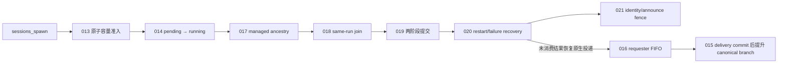

# OpenClaw v2026.7.1-2 补丁能力总账

本目录只接受未经修改的 npm 产物 `openclaw@2026.7.1-2`。`v2026.6.11`
目录仅作为历史资料；这里没有复制旧 anchor/replacement，没有 V2/V3/V13
升级分支，也不兼容旧补丁、部分补丁或来源未知的 bundle。

锁定产物：

- npm integrity：`sha512-ycF3yPcbjN6bUPeaUx6Mh6vze1hQWoD3CT/wWcmD7a8xaHHHRUaAlaq+lFxMHf1ssEgODVAwjlzYqp2twkYZ7g==`
- tarball SHA-256：`5bb525f36f471a41239615d321c441778c7e1c007018ed6d84b795be77803276`
- Node：`24.15.0`，支持范围 `>=24.15.0 <25`

## 审计与实现规则

1. `verify-openclaw-pristine-contracts.cjs` 必须在 npm 解包后、任何写入前运行。
   它既验证已删除能力的上游控制流，也要求下面每个保留补丁的
   `verifyPatch` 在原始产物上失败。
2. 每个补丁只描述一个可独立删除的能力，文件头必须在前 16 行写明
   `Capability`、`Target`、`Scope`、`Safety`、`Remove when`。
3. 每个目标文件和 anchor 必须唯一。多文件补丁先完成全部内存变换和验证，
   再统一写入；整个 patch pass 失败时恢复所有 JS 文件。完整 patch pass 复用原子
   快照建立的文件/内容索引，并增量更新查询结果；补丁必须通过 `_patch-utils.js`
   的 `writeIfChanged` 写入，禁止绕过索引直接修改 runtime JavaScript。
4. 首次应用必须成功，第二次应用不得改变任何字节；source pass 和 bundle
   pass 分别验证，不能用一个总 marker 代替多个子修改。
5. manifest format 2 绑定 source lock、目标平台、补丁顺序与哈希、patch helper、
   build recipe、package lock、asar/package/companion 文件及最终 bundle 哈希。
   任一项变化都必须从原始 npm 包重建，旧 runtime 不能重新贴 manifest 复用。

## 保留能力清单

“原始版本”均指锁定的 pristine npm 产物。这里的“当前保留原因”不是说补丁永远
不能删除，而是说明在当前产品契约下直接删除会失去什么。删除补丁必须同时满足对应
“可删除条件”，并用原始目标包行为测试证明上游或 App 已经承担该能力。

每个补丁还必须通过 `openclawPristineContracts.test.ts` 的原始缺口断言、首次应用、
二次字节稳定、source/bundle verify 和 anchor 歧义失败测试。文件名使用连续三位
编号；loader 按文件名字典序执行，因此编号也是实际应用顺序，不沿用旧版本 patch ID，
也不为已删除能力保留空位。

### 关系总览

Thinking 的三个阶段彼此互补，不是重复实现：

```text
003 将 <think> 转成 reasoning delta ─┐
002 解除实时 reasoning 事件 callback gate ─┴─> 当前 turn 的实时 Thinking
004 history projection ───────────────────> 刷新、重连后的 Thinking/tool 历史
```

Subagent 的创建、同 run join 和原生 fallback 是两条不同链路。下图箭头表示
运行阶段和结果去向；只有正文明确写出“依赖”的地方才是补丁代码依赖：



其中 `015` 必须先于 `016` 应用，因为 `016` 在 `015` 建立的 post-delivery wrapper
上增加 FIFO 和终态确认；运行时则是 `016` 先确认投递成功，随后才允许 `015`
推进会话 leaf。managed join 成功时不走 `015`/`016`，但 join 失败或恢复时仍需要
这条原生 fallback。

其他显式关系：

- 审批：`022` 管生命周期；`023` 管 run suspension，并向 `024`/`025` 提供可信
  ancestry helper；`024` 管 allow/deny 后恢复，`025` 管 stop 和 transport failure。
- 请求元数据：`026` 在 spawn 时持久化直接父 UUID，`027` 消费它；`028` 独立处理
  compaction/reviewer purpose。
- Compaction：`029` 管原始用户消息的结构化保存与 replay；`030` 管 continuation
  wording；`031` 管模型压缩失败后的本地 handoff。`030` 与 `029` 没有隐含顺序，
  `031` 只读取 `029` 的公开 details 字段，并兼容字段缺失的 legacy transcript。

### 001–004：环境、Thinking 与历史

#### `001-managed-pip-config-environment.cjs`

- **做什么**：让 child tool 收到 JustDo 实际安装并指定的 `PIP_CONFIG_FILE`，从而使用
  App 管理的 pip index、证书或代理配置。
- **关系与边界**：App 侧通过 `JUSTDO_MANAGED_PIP_CONFIG_FILE` 提供路径 provenance；
  本补丁不依赖其他 runtime patch，也不从 OpenClaw deny-list 中全局放开该变量。
- **当前保留原因**：原始版本会无条件过滤 `PIP_CONFIG_FILE`；直接删除会让受管 Python
  环境与 child tool 的 pip 配置不一致。普通值、override、大小写伪造或 provenance
  不匹配仍必须被拦截，这是安全补丁而不是通用环境变量放行。
- **可删除条件**：OpenClaw 原生提供 path-bound、来源可信的 managed pip 配置机制，
  并继续阻止任意宿主 `PIP_CONFIG_FILE` 注入。

#### `002-live-thinking-stream.cjs`

- **做什么**：模型产生 reasoning 时，即使运行路径没有安装可选 callback，也继续向
  Gateway/JustDo 发布实时 Thinking 流。
- **关系与边界**：`003` 负责产生某类 reasoning delta，`002` 负责让实时事件不被
  callback eligibility 错误拦截；`004` 负责历史重放。`002` 不强制开启 reasoning，
  原生 mode/thinking gate 和 callback 调用保护均保留。
- **当前保留原因**：JustDo 使用的事件路径可能没有该可选 callback。原始版本会因此
  把 `streamReasoning` 判为 false，模型明明在输出 Thinking，UI 却收不到实时流。
- **可删除条件**：上游 reasoning 事件发布不再依赖 callback 是否存在，并通过无 callback
  的流式行为测试。

#### `003-openai-think-tag-reasoning.cjs`

- **做什么**：把 OpenAI-compatible `content` 中已解析出的 `<think>...</think>` 分支
  转成 reasoning delta，同时保持普通 answer 内容不变。
- **关系与边界**：它是 reasoning 的“生成/转换”层；`002` 是实时事件资格层，`004`
  是历史显示层。三者没有可互相替代的功能。
- **当前保留原因**：目标版两条 transport 都能识别 thinking 分支，却在输出阶段丢弃；
  使用 think-tag 的模型因此只有答案、没有 Thinking。
- **可删除条件**：两条受影响 transport 都原生保留 thinking 分支并发出 reasoning delta。

#### `004-history-display-projection.cjs`

- **做什么**：在 `sessions.history`/历史刷新中保留 reasoning、redacted-thinking，
  以及同时包含文本、tool call、tool result 的 assistant block。
- **关系与边界**：`002`/`003` 解决当前 turn 的实时流，`004` 解决刷新和重连后的投影；
  它复用上游清洗、block 分类及 `text/input_text/output_text` 判断，不改变原始 transcript。
- **当前保留原因**：数据可能仍在 transcript 中，但原始 history projection 会过滤掉这些
  block，所以刷新或重连后看起来像“Thinking/tool 历史丢失”，审计上下文也不完整。
- **可删除条件**：上游 history API 对全部支持的 assistant block 做无损且安全的显示投影。

### 005–012：调度、MCP、工具与会话接口

#### `005-default-cron-delivery-none.cjs`

- **做什么**：没有显式 `delivery` 的 detached cron agent/command job 默认使用 `none`，
  不自动尝试向外部 channel announce。
- **关系与边界**：只改 omitted value；用户显式设置 `announce` 或其他 delivery 时完全走
  上游。它与 subagent completion delivery 无关。
- **当前保留原因**：JustDo 的 scheduled task 结果由 App 内部流程处理；上游默认
  `announce` 会产生无目标投递、错误提示或意外外发语义。
- **可删除条件**：上游对 targetless detached cron 原生默认 `none`，或 JustDo 明确改用
  上游 announce 产品语义。

#### `006-windows-mcp-package-runner.cjs`

- **做什么**：在 Windows 上把精确匹配的 npm/npx MCP package runner 转成
  `Electron + ELECTRON_RUN_AS_NODE + npm-cli.js/npx-cli.js` 启动；同时在 OpenClaw
  完成 MCP 环境过滤后，仅为该受管 runner 重新注入 App 生成的 child-process preload，
  隐藏 npm 随后创建的 `cmd.exe /c <package-bin>` 控制台窗口。
- **关系与边界**：处理通用 MCP stdio package runner；`007` 处理 Chrome MCP 自己的
  启动代码和早期 stderr。App 侧生成的 Electron Node/npm/npx shim 嵌入已解析的可执行
  路径，不依赖会被 MCP 子进程环境过滤掉的 `JUSTDO_*` 变量；非 Windows、非 npm/npx
  命令保持原生。
- **当前保留原因**：Electron 内直接 spawn Windows npm/npx command shim 不可靠，
  会造成 MCP server 无法启动；并且 OpenClaw 会按安全策略移除 `NODE_OPTIONS`，导致
  npm/npx 的下一层 package bin 启动失去 `windowsHide`，出现命令行窗口。这属于 Windows
  运行兼容性。
- **可删除条件**：OpenClaw 原生使用 Electron-safe 的 Windows package runner，且 npm
  与 npx 参数均正确。

#### `007-chrome-mcp-launch-diagnostics.cjs`

- **做什么**：修正 Chrome MCP 的 Windows npm/npx CLI 启动，并在连接握手前就开始
  drain stderr，让早期退出原因可见。
- **关系与边界**：与 `006` 覆盖不同代码路径；`008` 是连接成功后的页面恢复。只有
  platform、runner、npm bin 和 Electron path 全部可信匹配时才切换启动器。
- **当前保留原因**：原始版本在握手成功后才读取 stderr；最需要诊断的启动/握手失败
  反而没有有效错误，同时 Windows shim 仍可能启动失败。
- **可删除条件**：上游同时提供正确的 Electron-safe Chrome MCP runner 和连接前 stderr
  捕获；若产品移除 Chrome MCP 集成，也可连同 `008` 删除。

#### `008-chrome-mcp-empty-page-recovery.cjs`

- **做什么**：Chrome MCP `list_pages` 返回空数组时，最多创建一个 `about:blank` 页面
  并重试一次。
- **关系与边界**：`007` 负责进程启动，`008` 只处理已连接 browser session 的空页面
  状态；非空结果和错误继续走上游。
- **当前保留原因**：空 session 在原始版本中会一直保持无页面，使后续页面工具无法工作。
  这是浏览器可用性补丁，不是核心 agent 状态补丁。
- **可删除条件**：上游原生恢复空 browser session，或 JustDo 不再提供 Chrome MCP。

#### `009-selective-tool-schema-catalog.cjs`

- **做什么**：把 `browser`、goal、cron、memory 等明确列出的重型 schema 放入 Tool
  Search catalog，按需再 hydrate，而不是全部塞进每次初始 prompt。
- **关系与边界**：只改变 schema 暴露时机；工具授权、参数验证、调用和实现仍由上游
  负责，与 `011` goal RPC 或其他具体工具行为无依赖。
- **当前保留原因**：上游没有 per-tool defer 配置；删除会恢复大 schema 常驻上下文，
  增加 token 占用并挤压实际会话内容。这是上下文效率能力，不是执行正确性修复。
- **可删除条件**：上游支持等价 per-tool catalog/defer 配置，或确认当前模型上下文预算
  不再需要这项优化并同步调整产品策略。

#### `010-final-system-prompt-replacements.cjs`

- **做什么**：读取 JustDo 管理的 replacement 规则，在 prompt hooks、模型身份和
  model-aware additions 完成后、provider dispatch 前，变换最终 system prompt。
- **关系与边界**：独立于 compaction template；只处理 system prompt 的最终边界，不覆盖
  hook 结果，也不绕过 cache observation。
- **当前保留原因**：更早替换会被后续 hook/addition 覆盖，更晚已经进入 provider；目标版
  没有等价 final-system-only hook，删除会使 App 配置的 replacement 不生效或只部分生效。
- **可删除条件**：上游提供时序等价、可配置且 cache-safe 的最终 system prompt hook。

#### `011-silent-session-goal-clear.cjs`

- **做什么**：增加 authenticated `sessions.goal.clear` Gateway RPC，只清除持久化 goal
  字段，不生成聊天消息或启动 agent turn。
- **关系与边界**：`009` 可能延迟 goal tool schema，但不实现这个 RPC；两者独立。App/UI
  调用 `011` 完成纯状态操作。
- **当前保留原因**：原始 Gateway 没有无消息清理入口；删除后只能伪造用户消息或直接改
  store，都会破坏聊天语义或越过 Gateway 权限边界。
- **可删除条件**：上游提供等价 authenticated RPC，或产品彻底移除 silent goal clear。

#### `012-subagent-task-title-projection.cjs`

- **做什么**：把上游已经持久化的 `taskName` 作为只读 `taskTitle` 投影到
  `sessions.list`。
- **关系与边界**：不新增存储、不修改 spawn；`014` 负责 pending/running 状态，`012`
  只负责标题，两者可独立删除。
- **当前保留原因**：删除不会丢失底层 `taskName`，但刷新/重连后的 session list 无法展示
  可读任务标题。这是 UI 可观测性契约，不是运行正确性硬依赖。
- **可删除条件**：上游 list API 原生暴露 `taskName/taskTitle`，或 UI 不再展示 subagent 标题。

### 013–021：Subagent admission、投递与 managed join

#### `013-atomic-sessions-spawn-admission.cjs`

- **做什么**：native `sessions_spawn` 在同步 preflight 通过后、第一次异步初始化前，按
  canonical requester 预留一个 child 容量；成功或失败后都释放预留。
- **关系与边界**：发生在 `014` lifecycle 和 `017`–`021` managed join 之前。它只影响
  `runtime=subagent`；ACP Agent 保持原始并发和准入行为，不共享该 reservation。
- **当前保留原因**：原始版本先检查 active count，再跨越异步 session 写入，最后才注册。
  两个并发 spawn 可同时通过检查并突破 `maxChildrenPerAgent`；后续 managed join 无法补救
  已超额创建的 child。
- **可删除条件**：上游将 initializing child 纳入同 requester 的原子 check→registration，
  或提供等价 admission primitive；不能仅靠串行测试判断已修复。

#### `014-subagent-pending-lifecycle.cjs`

- **做什么**：spawn accepted/queued 后先显示 `pending`，只在真实 lifecycle start 时切换
  `running` 并开始运行时长/timeout 计时。
- **关系与边界**：`013` 控制能否创建，`014` 描述创建后的排队状态；managed join 使用同一
  durable registry，但不替代 pending/running 投影。
- **当前保留原因**：原始版本在 accepted 时就标成 running，用户看到的状态错误，而且排队
  时间会消耗真正的 run timeout，可能尚未启动就超时。
- **可删除条件**：上游持久化并投影 accepted/queued/running 三态，且 timeout 从真实启动
  时刻开始。

#### `015-completion-branch-promotion.cjs`

- **做什么**：required `subagent_announce` 的外层 agent delivery 已经 durable committed 后，
  在 requester transcript write lock 内把 completion side branch 提升为 canonical leaf。
- **关系与边界**：应用顺序上是 `015 → 016`；`016` 使用其 delivery wrapper 做 FIFO/终态
  确认。managed join 成功不走这里，`020` 恢复的 fallback/native completion 才走
  `016 → 015`。普通 announce、accepted-only 和失败投递绝不提升。
- **当前保留原因**：上游会把 prompt lock 释放期间到达的外部 completion 安全地写入 side
  branch，却没有在交付成功后推进 canonical leaf。删除后结果可能已经显示、也存在于
  JSONL，但后续模型沿旧 branch 构建上下文而“忘记”已交付的 child 结果。
- **可删除条件**：上游提供并调用 post-durable-delivery branch commit；或者产品取消所有
  native/fallback completion 路径。仅有 managed join 成功路径不足以删除它。

#### `016-completion-delivery-queue.cjs`

- **做什么**：required completion 对同一 requester 按 durable sequence FIFO 投递；不同
  requester 仍可并行。failed head 留在队首，busy requester 等待，pending agent call 必须
  等到 terminal 才算完成，并支持 restart 后重调度。恢复时只重试仍在上游 30 分钟硬期限
  内的 completion；超过期限的持久化项直接走原生 discard/cleanup，不再启动 completion
  agent 或 provider 请求。`sessions_yield`/managed join generation 明确位于该期限判断之前，
  不会被这个 fallback 清理规则误删。
- **关系与边界**：构建时要求 `015` 已建立 promotion contract；运行时向 `015` 提供可信的
  committed delivery 结果。managed join 成功绕过它，`020` 的未消费 fallback 和所有
  非 managed completion 使用它。
- **当前保留原因**：原始 announce 可以并发乱序、steer 正忙的 requester，并把 pending/
  accepted 过早当成成功；删除会使 sibling 结果次序不稳定，失败的早期结果还可能被后来
  结果越过。若恢复阶段不加硬期限围栏，旧失败项还会在每次 Gateway 启动时重新发起 LLM
  请求，制造与当前会话无关的报错。它不是旧 `008` 的 transcript 文本启发式去重。
- **可删除条件**：上游提供 restart-safe、per-requester durable FIFO，包含 failed-head、busy
  wait、terminal confirmation、managed-yield fence 和 hard-expiry pre-dispatch discard；若删除
  `015`，也必须先重构本补丁的明确依赖。

#### `017-managed-session-classification.cjs`

- **做什么**：沿持久化 `spawnedBy` ancestry 判定会话树是否精确根于
  `agent:*:justdo:*`，并对缺父、cycle、超过 32 层、cron 和冲突 fail closed。
- **关系与边界**：本身只提供分类器，不改变 `sessions_yield`；`018` 是它的直接消费者。
  `032` 使用等价持久化 ancestry 规则，但因运行位置不同不复用该 registry helper。
- **当前保留原因**：没有可信 classifier 就无法只给 JustDo managed tree 开启 same-run join；
  用 session key 子串判断会漏掉 nested child，也可能误把 native/cron 会话纳入新语义。
- **可删除条件**：上游提供 durable root-ancestry classifier，或完整删除 `018`–`021`
  managed join 能力。

#### `018-managed-same-run-join.cjs`

- **做什么**：JustDo managed 父会话调用 `sessions_yield` 时不结束当前 turn，而是在原 tool
  call 中等待并增量返回 child 结果批次，持久化 `waiting/presented` 状态。
- **关系与边界**：依赖 `017` 的 classifier；`019` 接管结果提交，`020` 接管失败恢复，
  `021` 接管 identity/announce race。非 JustDo、cron 和 native channel 保持上游 push
  announce 行为。
- **当前保留原因**：这是 managed subagent join 的核心产品能力。原生 `sessions_yield`
  会结束/暂停父 turn，child 结果只能通过另一个 completion turn 推送，无法在当前 tool call
  中按批次继续。
- **可删除条件**：上游 `sessions_yield` 原生支持持久化 same-call join，或产品明确回退到
  全部 push announce 模式。

#### `019-managed-join-commits.cjs`

- **做什么**：分别记录“匹配 tool result 已写入 transcript”和“随后 assistant continuation
  已 durable commit”两个阶段；只有第二阶段完成后才能 consume child 和执行 cleanup。
- **关系与边界**：依赖 `018` 的 waiting/presented 状态，同时覆盖 Pi transcript 和 Codex
  transcript mirror；`020` 根据这些阶段恢复，`021` 保留 delivery ownership。
- **当前保留原因**：只用一个 delivered marker 无法区分两个 crash window。过早 cleanup 会
  丢结果，过晚或重复恢复会重复展示 child 结果。
- **可删除条件**：上游提供持久化 presentation/continuation 两阶段 commit 和 cleanup fence，
  或删除整个 managed join 链。

#### `020-managed-join-recovery.cjs`

- **做什么**：处理 parent abort、continuation failure、Gateway restart 和未消费 join；未消费
  结果恢复原生 completion delivery，已经 consume 的结果只恢复尚未完成的 delete cleanup。
- **关系与边界**：依赖 `018`/`019` 的 durable 状态；fallback 交给 `016` 排队，成功后由
  `015` promotion；`021` 在 join ownership 存在时阻止竞态 announce。
- **当前保留原因**：没有恢复层，崩溃窗口可能永久卡在 waiting/presented、丢失 child 结果，
  或在 restart 后重复 cleanup/重复投递。same-run join 只有 happy path 不能发布。
- **可删除条件**：上游能从每个 managed join 阶段恢复或安全 fallback，并覆盖 abort、restart、
  未消费和已消费 cleanup。

#### `021-managed-join-identity-delivery.cjs`

- **做什么**：在 join 状态中保存 immutable Gateway session identity evidence，保留 delivery
  ownership，并在原生 announce 真正发送前再次检查 join 状态，阻断在途竞态重复投递。
- **关系与边界**：建立在 `017`–`020` 状态机上；join 失败时不永久吞掉结果，而由 `020`
  恢复一条原生 push。它是替代旧 `008` 启发式去重的精确状态围栏。
- **当前保留原因**：仅在 join 开始时取消 announce 不足以阻止已经在途的发送；delivery state
  清理也可能抹掉 join ownership。删除会重新引入 managed result 与 native announce 同时出现
  的竞态，同时丢失 join 状态中固定的 Gateway identity evidence。
- **可删除条件**：上游 same-run join 原生保存稳定 identity、保持 delivery ownership，并在
  最终发送点提供原子 announce fence。

### 022–025：交互审批生命周期

#### `022-persistent-interactive-approval-lifetime.cjs`

- **做什么**：对可信 JustDo ancestry 的交互审批不创建 expiry/timer，使审批可以一直等待
  用户决定。
- **关系与边界**：是审批栈的 lifetime 层；`023`–`025` 处理等待期间和决议后的 run 行为。
  explicit `null`、cron 和其他 native channel 保留上游 timeout 语义。
- **当前保留原因**：原始 manager 给所有请求固定超时；桌面用户离开一段时间后再回来，
  审批已自动失效，不能满足持久交互审批产品契约。
- **可删除条件**：上游支持 session/channel-aware infinite lifetime，或产品决定接受固定审批
  超时并同步移除后续暂停/恢复语义。

#### `023-approval-run-suspension.cjs`

- **做什么**：审批等待期间暂停对应 JustDo run 的 tool result/assistant 输出，并只忽略精确的
  自动 `chat run timed out`；用户 stop 和其他显式 abort 仍生效。
- **关系与边界**：与 `022` 共同形成“审批和 run 都不自动过期”；还提供可信 ancestry helper
  给 `024`/`025`。它不改变 cron/native channel。
- **当前保留原因**：只让 approval record 永不过期仍不够；provider/run timeout 会撤销 waiter，
  assistant 还可能越过审批继续落盘，产生“审批仍在但任务已结束/继续执行”的分裂状态。
- **可删除条件**：上游提供 durable、run-scoped approval suspension，并保证等待期间不提交
  对应输出。

#### `024-approval-resolution-resume.cjs`

- **做什么**：JustDo webchat 收到真实 allow/deny 后，用隐藏 follow-up agent turn 恢复工作，
  synthetic resume prompt 不写入用户可见历史。
- **关系与边界**：代码上依赖 `023` 的可信 ancestry helper 和上游 prompt-persistence guard；
  非 JustDo 或非 webchat channel 继续使用原生 inline resolution。
- **当前保留原因**：原生 webchat inline 流程不能可靠恢复已经异步暂停的 turn；直接 follow-up
  又会把内部控制提示伪装成用户消息，污染 transcript 和后续上下文。
- **可删除条件**：上游能对 webchat 做隐藏、持久且可恢复的 approval continuation。

#### `025-approval-stop-and-failure.cjs`

- **做什么**：接受 typed `deny-justdo-stop`，使用户 stop 立即成为 terminal silent denial，
  不落入工具执行，也不生成额外回复；同时避免 transport/node failure 被伪造成用户 denial
  完成消息。
- **关系与边界**：exec 路径使用 `023` 的可信 ancestry；普通 deny、native channel 和真实用户
  决议保持上游语义。
- **当前保留原因**：原始 validator 拒绝 stop decision，某些 waiter 可能继续走 timeout/default
  分支；transport failure 还会制造错误的“审批已拒绝/完成”消息，既有安全风险也不真实。
- **可删除条件**：上游有 typed silent-stop、保证 stop 不执行工具，并对 transport failure 保持
  truthful unresolved/failed 状态。

### 026–028：请求与父会话元数据

#### `026-parent-session-identity.cjs`

- **做什么**：在 child spawn admission 时快照直接父会话当前 Gateway UUID generation，并在
  两次 child session commit 中持久化 `parentSessionId`。
- **关系与边界**：`027` 消费该字段发送 `parent_session_id`。本补丁不修改任何现有 parent/
  child `sessionId`，也不把 ancestry root 当直接父。
- **当前保留原因**：仅保存 `spawnedBy` key 后再实时查询，若父会话在 child 首次 provider 请求
  前 reset/轮换，就会得到新的 UUID，导致 LiteLLM lineage 关联到错误 generation。
- **可删除条件**：上游在 spawn 时原生持久化稳定的直接父 UUID，并在 restart/parent reset 后
  保持不变。

#### `027-agent-request-metadata.cjs`

- **做什么**：对 `builtin_models`/`justdo` LiteLLM agent 请求发送 `session_id`、来自 `026`
  的 `parent_session_id`、`request_purpose=agent`，并只在用户发起 run 的首个 provider 请求
  发送一次 `user_initiated=true`。legacy child 没有 `parentSessionId` 时，才沿 `spawnedBy`
  查询一次直接父 UUID，并在 session generation guard 下回填 child entry。
- **关系与边界**：优先消费 `026` 的持久 parent identity，legacy live lookup 不能覆盖已有快照；
  `028` 负责非 agent purpose。strict-compatible/custom provider 不接收 JustDo 私有 metadata，
  一次性标记也会被清理。
- **当前保留原因**：没有这些字段，LiteLLM 无法可靠区分会话、nested parent、后台 continuation
  与真实用户触发，影响归因、观测和按请求用途处理。
- **可删除条件**：上游为目标 provider 原生提供同语义 metadata，或 JustDo/LiteLLM 完全不再
  消费这些字段。

#### `028-request-purpose-metadata.cjs`

- **做什么**：native compact 和 safeguard 的 staged/chunk/retry 请求发送
  `request_purpose=context_compaction`；exec reviewer simple completion 发送
  `request_purpose=exec_review`，并携带正确 session identity。
- **关系与边界**：与 `027` 共用 provider gating，但不依赖其 agent wrapper；确保后台请求不会
  错误继承 `request_purpose=agent`。custom/strict-compatible provider 不注入。
- **当前保留原因**：原始版本无法区分正常 agent、压缩和执行审查请求；后台调用会被错误归因
  或无法按用途观测/路由。
- **可删除条件**：上游覆盖 native compact、全部 safeguard retry 和 exec-review 三条真实调用链
  的 session-scoped purpose metadata，或下游不再依赖 purpose。

### 029–031：Compaction continuation 与失败恢复

#### `029-retained-user-compaction-context.cjs`

- **做什么**：在 `CompactionEntry.details.justdoRetainedUserMessages` 中保存滚动 20k-token
  原始用户消息，按 transcript entry identity 去重、UTF-16-safe 裁剪，并在 summary 后作为
  hidden readable user context 重放。
- **关系与边界**：`030` 只改 continuation wording，不保存原文；`031` 可读取该公开 details
  字段构造 emergency handoff，但字段缺失时仍能工作。metadata 不写入 16k summary suffix。
- **当前保留原因**：原始 replay 只有 summary 和有限 native tail；重复压缩会让用户的原始约束
  只剩模型转述，逐次漂移或消失。这是“与 Codex continuation 行为一致”的原文保真层。
- **可删除条件**：上游持久化、合并、裁剪并重放等价的 bounded retained-user metadata，覆盖
  first/repeated/split/legacy compaction。

#### `030-codex-continuation-compaction.cjs`

- **做什么**：把首次、重复和 split-turn compaction 的默认指令，以及 replay wrapper，改成
  面向下一模型继续当前任务的 Codex-style handoff 语义。
- **关系与边界**：复用上游 `customInstructions`、质量检查、identifier preservation、suffix
  限制和 workspace context；与 `029` 没有 helper/marker 顺序依赖，也不负责保存原始用户消息。
- **当前保留原因**：目标版虽然支持追加 `customInstructions`，但固定默认模板和 replay wrapper
  仍以 OpenClaw 原生摘要语义组织，不能完整替换成 JustDo 需要的 continuation handoff。
- **可删除条件**：上游允许通过配置替换默认模板和 replay wrapper，或产品不再要求 Codex-style
  continuation。这里不声称逐字复制 Codex 未公开模板。

#### `031-compaction-emergency-handoff.cjs`

- **做什么**：missing model/auth、provider error/timeout、staged summary 和 native compact
  失败时，构造确定性的 `<=16k` 本地 handoff，包含 previous summary、可用 retained-user
  archive 和有界 recent tail，提交后继续当前任务。
- **关系与边界**：可消费 `029` 的公开 details，但兼容 absent/legacy，不依赖其私有 helper 或
  应用顺序；`030` 的 wording 也不是 emergency builder 前提。显式用户 abort 保持取消语义。
- **当前保留原因**：原始两条 compaction 路径遇到非用户失败会 cancel 或留下 stale
  `cancelReason`，上下文逼近上限时任务可能永久卡住，不能仅因压缩模型不可用而中止。
- **可删除条件**：上游 safeguard/native compact 都能在非用户失败时提交等价 bounded fallback，
  清理状态并继续；用户 abort 仍必须取消。

### 032–034：运行进度、恢复与上下文状态

#### `032-sanitized-run-progress-events.cjs`

- **做什么**：只向 JustDo managed session 发布 `queued`、`preparing`、`waiting_model`、
  `retrying` 四种有界、allow-listed progress stage，供长任务 UI 使用。
- **关系与边界**：使用持久化 ancestry 判断 scope，语义与 `017` 一致但不复用其 run-registry
  helper；普通 Gateway、cron、缺父、冲突、cycle、超深 ancestry 全部不发事件。
- **当前保留原因**：上游有内部 callback，却没有稳定安全的 UI contract。删除不会改变 agent
  最终结果，但长任务期间 UI 会失去可靠的排队/准备/等模型/重试反馈。
- **可删除条件**：上游发布等价 sanitized progress contract，或 JustDo UI 明确不再消费这些
  stage。这是 UX 能力，不应被描述成核心执行硬依赖。

#### `033-tool-error-reasoning-recovery.cjs`

- **做什么**：工具报错后，若模型只输出 reasoning 而没有可见回答，最多追加两次仅本 request
  可见、不写入 transcript 的 recovery instruction，要求模型给出用户可见结果。
- **关系与边界**：复用目标版 delivery evidence、spawn 和 async-start 状态判断；abort、timeout、
  client tool、yield、approval、已提交 delivery、已接受 spawn 或异步工作开始后都禁止 replay，
  且一旦进入本策略不会再叠加上游 reasoning retry。
- **当前保留原因**：原始 generic retry 不覆盖该 failure shape，用户可能只看到工具错误后任务
  静默结束。无安全 guard 的简单重试又可能重复副作用，所以必须保留有界且受证据约束的实现。
- **可删除条件**：上游提供等价 request-only、最多两次且具备相同副作用围栏的 recovery policy。

#### `034-live-context-budget-publication.cjs`

- **做什么**：在 active run 的 pre-prompt 和 mid-turn tool-result 边界，把权威
  `contextBudgetStatus` best-effort 写入原生 session store，供 `sessions.list` 实时展示。
- **关系与边界**：字段定义、list projection 和 turn 结束后的最终持久化全部由上游负责；本补丁
  只补实时窗口，并用 session generation、status timestamp 防止旧 run 覆盖新状态。
- **当前保留原因**：删除不会丢最终 budget 数据，但运行中的长 turn 一直显示旧值，UI 无法及时
  判断接近 compaction/overflow。这是实时可观测性能力，不是字段存储补丁。
- **可删除条件**：上游 active-run API 或 `sessions.list` 原生发布实时 context budget，或 UI
  不再需要运行中状态。

## 已删除或由上游/App 承担的能力

| 能力                                            | v2026.7.1-2 证据与决定                                                                                                                                                                                                                                                 |
| ----------------------------------------------- | ---------------------------------------------------------------------------------------------------------------------------------------------------------------------------------------------------------------------------------------------------------------------- |
| 80 字符 thinking preview                        | 不属于 OpenClaw runtime patch；`src/main/openclaw/runtime/gatewayLogFilter.ts` 已由 JustDo App 实现。                                                                                                                                                                  |
| announce reasoning default                      | 原生 `resolvedReasoningLevel` 已传入 announce execution，删除旧 `002`。                                                                                                                                                                                                |
| 可见 stop 不因 usage=0 重试                     | 原生 empty-response classifier 先按 assistant payload/text 排除，不读取 usage；pristine H04 contract 覆盖，删除旧覆盖逻辑。                                                                                                                                            |
| subagent completion 的 `NO_REPLY` 静默成功      | 已删除目标版实验补丁 `subagent-completion-response-policy`。managed join 成功路径不创建 completion announce；join 失败恢复原生投递时必须产生可见结果，不能用 `NO_REPLY` 把未展示的 child 结果标成 delivered。普通非 subagent 的 intentional silence 继续使用上游语义。 |
| `sessions_yield` delivery evidence/CLI gap-fill | 已删除目标版实验补丁 `yielded-transcript-handling`。managed `sessions_yield` 返回当前 tool call 的内部 child result，不是 committed outbound delivery；原生 CLI transcript 保持上游行为。                                                                              |
| sibling completion transcript 启发式去重        | 删除旧 `008`。managed join 由 `018`–`021` 唯一消费并阻断重复 announce；join 失败由 `020` 恢复一条 native delivery，再由 `016` 按 requester FIFO 投递。未进入 join 的路径直接使用 `016`。                                                                               |
| active/pending delivery 时允许 `sessions_yield` | 原生工具没有 active/ended delivery guard，任何合法 session 都调用 `onYield`；pause generation 会由 completion run reactivation 替换。pristine H07 与 completion tests 覆盖，删除旧 `006`。                                                                             |
| reply init/revision conflict retry              | 原生已有 revision/init conflict normalization 和 retry，删除旧 `009`。                                                                                                                                                                                                 |
| compaction summary input 排序/裁剪              | 上游已处理 previous summary 的单次 redistill、recent assistant/tool result、split-turn prefix、tool-detail stripping、chunk budget、oversize omission 和 recent suffix 上限；pristine C02 contract 覆盖，不再重写。                                                    |
| context budget 字段/投影/最终持久化             | 上游保留，只由 `034` 补 active-run 实时更新。                                                                                                                                                                                                                          |
| active-run 字段改造                             | 完全删除；`032` 只提供 JustDo 使用的安全 progress event。                                                                                                                                                                                                              |
| subagent task title 存储                        | 上游注册前已将 `taskName` 写入 registry/SQLite 并能恢复；pristine S05 contract 覆盖，`012` 只补列表投影。                                                                                                                                                              |

## 旧 v2026.6.11 的 25 个文件处置清单

“删除”表示目标版本不再需要 runtime patch，不表示产品行为被删除。

| 旧文件                                       | 决定                 | v2026.7.1-2 结果                                                                                                                                                                      |
| -------------------------------------------- | -------------------- | ------------------------------------------------------------------------------------------------------------------------------------------------------------------------------------- |
| `001-thinking-stream`                        | 拆分                 | “让 JustDo 实时接收 Thinking 流”的核心能力从新控制流重写为 `002`；80 字符日志 preview 由 App 维护。                                                                                   |
| `002-agent-announce-reasoning-stream`        | 删除                 | 上游已有 resolved reasoning 传递。                                                                                                                                                    |
| `003-openai-content-reasoning-tags`          | 保留并重写           | `003`。                                                                                                                                                                               |
| `004-windows-mcp-package-runner`             | 拆分并重写           | `006` 通用 runner、`007` Chrome 启动诊断、`008` 空页面恢复。                                                                                                                          |
| `005-history-thinking-and-subagent-yield`    | 审计后部分保留       | 保留 `004` history、`015` branch promotion、`016` FIFO/recovery；删除与 managed join 新语义冲突的 silent completion 和 yield evidence/CLI gap-fill；usage=0 visible-stop 由上游承担。 |
| `006-sessions-yield-active-guard`            | 删除                 | 上游 H07 已满足更宽松、可恢复的 yield 语义。                                                                                                                                          |
| `007-allow-managed-pip-config-env`           | 保留并安全重写       | `001`，不再全局删除 deny-list。                                                                                                                                                       |
| `008-dedupe-visible-subagent-announces`      | 删除                 | managed 路径由 `018`–`021` 消费和防重，fallback/native 路径由 `016` 串行投递。                                                                                                        |
| `009-reply-session-init-conflict-retry`      | 删除                 | 上游已实现。                                                                                                                                                                          |
| `010-defer-selected-tool-schemas`            | 保留并重写           | `009`。                                                                                                                                                                               |
| `011-retain-user-messages-across-compaction` | 部分保留、结构化重写 | `029` 只负责 retained-user metadata 与 replay；summary input 由上游 C02 承担。                                                                                                        |
| `012-codex-compaction-template`              | 最小保留             | `030` 复用 `customInstructions`，只补默认模板与 replay wrapper。                                                                                                                      |
| `013-default-cron-delivery-none`             | 保留并重写           | `005`。                                                                                                                                                                               |
| `014-live-context-budget-status`             | 部分保留             | `034` 只补 active-run publication。                                                                                                                                                   |
| `015-final-system-prompt-replacements`       | 保留并重写           | `010`。                                                                                                                                                                               |
| `016-litellm-session-id`                     | 拆分并重写           | `026` parent identity、`027` agent/initiation、`028` compaction/review purpose。                                                                                                      |
| `017-tool-error-reasoning-recovery`          | 保留并重写           | `033`。                                                                                                                                                                               |
| `018-persistent-interactive-approvals`       | 拆分并重写           | `022` lifetime、`023` suspension、`024` resume、`025` stop/failure。                                                                                                                  |
| `019-compaction-emergency-fallback`          | 保留并重写           | `031`。                                                                                                                                                                               |
| `020-run-progress-events`                    | 部分保留             | 删除 active-run 改造，`032` 只发布四个安全 stage。                                                                                                                                    |
| `021-atomic-sessions-spawn-admission`        | 保留并重写           | `013`。                                                                                                                                                                               |
| `022-subagent-pending-status`                | 保留并重写           | `014`。                                                                                                                                                                               |
| `023-managed-subagent-join`                  | 拆成五项重写         | `017` classification、`018` same-run join、`019` commits、`020` recovery、`021` identity/delivery。                                                                                   |
| `024-silent-goal-clear`                      | 保留并重写           | `011`。                                                                                                                                                                               |
| `025-subagent-session-title-metadata`        | 部分保留             | 上游持久化 `taskName`；`012` 只补 list projection。                                                                                                                                   |

## 测试索引

| 测试                                                  | 主要覆盖                                                                                                                                  |
| ----------------------------------------------------- | ----------------------------------------------------------------------------------------------------------------------------------------- |
| `openclawPristineContracts.test.ts`                   | 锁定原始 npm 包、8 项上游能力证据、34 项保留缺口、头注释和大小约束。                                                                      |
| `openclawV202671ReasoningStream.test.ts`              | `002` callback gate 的原始失败与改写后事件/回调行为。                                                                                     |
| `openclawV202671PatchSafety.test.ts`                  | `001`、`004`、`007`、`034` 的安全边界和真实 fixture 幂等。                                                                                |
| `openclawV202671CompletionDelivery.test.ts`           | H07 上游语义、managed yield 非对外交付、subagent `NO_REPLY` 非成功，以及 `015`、`016` 的 FIFO、硬期限和恢复边界。                         |
| `openclawV202671AtomicSessionsSpawnAdmission.test.ts` | `013` native pristine 并发失败、post-preflight reservation、canonical requester、跨 requester 并行、ACP 不变及 source/bundle 原子幂等。   |
| `openclawV202671SubagentCapabilityPatches.test.ts`    | `014`。                                                                                                                                   |
| `openclawV202671ManagedSubagentJoin.test.ts`          | `017`–`021` 的分类、批次、两阶段提交、恢复、identity 与 announce fence。                                                                  |
| `openclawV202671ApprovalLifecycle.test.ts`            | `022`–`025` 的 lifetime、hidden resume、stop/failure 与文件头。                                                                           |
| `openclawV202671RequestMetadata.test.ts`              | `026`–`028`，含 strict-compatible negative 与 nested parent。                                                                             |
| `openclawV202671CompactionMetadata.test.ts`           | `029` identity dedupe、可读 replay、20k token、CJK/emoji 边界。                                                                           |
| `openclawV202671EmergencyCompaction.test.ts`          | `031` 首次/重复/legacy、全部失败入口、abort、details、source/bundle 原子性。                                                              |
| `openclawRunProgressEventsPatch.test.ts`              | `032` pristine callback gap、JustDo root/nested ancestry、native/cron/missing/conflict/cycle fail-closed、CLI/embedded allow-list event。 |
| `openclawV202671CapabilityPatches.test.ts`            | `010`、`022`、`027`、`031`、`033` 及歧义 anchor 原子失败。                                                                                |
| `openclawRuntimePatchManifest.test.ts`                | source lock、patch/build recipe fingerprint、cache、manifest/tamper fence。                                                               |
| `openclawRuntimeStaging.test.ts`                      | runtime 目录原子替换、Windows `current` link 恢复和失败 rollback。                                                                        |

历史 `v2026.6.11` 测试只能作为审计资料，不能作为本目录的目标版本证据。
